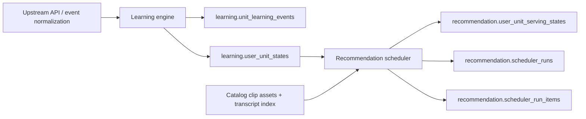

# Learning Video Recommendation System

This repository contains an MVP backend for a learning-oriented recommendation system built around video content and structured learning units.

The core product goal is not "recommend videos a user may like." The system is designed to answer a narrower and more educational question:

> Given the user's current learning state, what should they study next, and which video content is the right carrier for that learning task?

At the current implementation stage, the repository already includes:

- a `Learning engine` module that records learning events and maintains per-user per-unit learning state
- a `Recommendation` module whose implemented submodule is the scheduler that generates recommendation batches from learning state
- a `Catalog` schema and local ingest tooling for clip-level video assets, transcripts, and recall-ready indexes

The long-term architecture also includes a video recall layer and a task assembly layer, but those parts are still design-stage and are not implemented yet.

## Product Scope

The system models learning around `semantic.coarse_unit`, which is the unified learning-unit abstraction shared across the repository. The current design assumes at least these kinds of learning units:

- `word`
- `phrase`
- `grammar`

The MVP emphasizes:

- a closed learning loop before advanced ranking sophistication
- explainable, rule-based behavior instead of black-box recommendation
- strict ownership boundaries between learning-state maintenance and recommendation delivery
- recommendation results that are learning-oriented rather than feed-oriented

## Current Architecture



### Module boundaries

#### Learning engine

Learning engine is responsible for:

- recording standardized learning events
- reducing those events into durable user-unit state
- exposing stable learning-state inputs to recommendation
- rebuilding state through full replay

Learning engine is not responsible for:

- recommendation generation
- recommendation serving state
- recommendation audit
- video ranking

#### Recommendation

Recommendation is responsible for:

- reading `learning.user_unit_states`
- generating the current recommendation batch
- maintaining recommendation-owned serving state
- maintaining recommendation audit records

Recommendation is not responsible for:

- writing `learning.unit_learning_events`
- writing `learning.user_unit_states`
- replaying learning state

#### Catalog

Catalog is the content and indexing layer. In the current repository it provides:

- clip-level video asset migrations
- transcript read-model migrations
- a video-to-learning-unit index for future recall
- ingestion audit tables
- a local JSON ingest script

Catalog is not the recommendation engine and does not own learning-state logic.

## What Is Implemented Today

### Implemented

- `internal/learningengine`
  - event recording
  - user-unit state projection
  - SM-2-inspired update logic
  - full replay
  - unit and integration tests
- `internal/recommendation/scheduler`
  - due-review and new-unit candidate loading
  - backlog and quota calculation
  - review and new scoring
  - recommendation batch assembly
  - serving-state persistence
  - scheduler run audit persistence
  - unit, integration, scenario, and cross-module e2e tests
- `internal/catalog/infrastructure/migration`
  - `catalog` schema creation
  - clip video, transcript, semantic span, unit index, ingestion audit, and video user state tables
- `scripts/catalog_ingest`
  - local JSON-based catalog ingest pipeline
  - validation, normalization, video-unit index generation, and transactional persistence

### Designed but not implemented yet

- `internal/recommendation/recall`
- `internal/recommendation/task`
- final learning-task output assembly
- advanced personalized ranking and model-based retrieval

That distinction matters: the current external recommendation output is a scheduler batch of learning-unit recommendations, not a final video-backed learning task list.

## Data Ownership

The repository is organized around explicit schema ownership.

### Learning engine owns

- `learning.unit_learning_events`
- `learning.user_unit_states`

### Recommendation owns

- `recommendation.user_unit_serving_states`
- `recommendation.scheduler_runs`
- `recommendation.scheduler_run_items`

### Catalog owns

- `catalog.videos`
- `catalog.video_transcripts`
- `catalog.video_transcript_sentences`
- `catalog.video_semantic_spans`
- `catalog.video_unit_index`
- `catalog.video_ingestion_records`
- `catalog.video_user_states`

The key architectural rule is:

- Learning engine writes `learning.*`
- Recommendation reads `learning.*` and writes `recommendation.*`
- Recommendation must not write back into learning tables

## Core Domain Model

### Learning events

Learning engine currently supports these event types:

- `exposure`
- `lookup`
- `new_learn`
- `review`
- `quiz`

Weak events update contact/exposure signals only. Strong events advance memory state and review scheduling.

### User-unit state

User-unit state is maintained in `learning.user_unit_states`. Current state values are:

- `new`
- `learning`
- `reviewing`
- `mastered`
- `suspended`

The reducer updates fields such as:

- progress
- mastery
- next review time
- repetition and interval
- ease factor
- recent correctness windows

### Recommendation batch

The scheduler currently outputs recommendation items with fields conceptually equivalent to:

- `coarse_unit`
- `recommend_type`
- `score`
- `rank`
- `reason_codes`

Its high-level policy is:

- protect review workload first
- then introduce new units
- suppress overly recent repeats with recommendation-owned serving state

## Repository Layout

```text
.
├── docs/
├── internal/
│   ├── catalog/
│   ├── learningengine/
│   ├── recommendation/
│   │   └── scheduler/
│   └── test/e2e/
├── scripts/
│   └── catalog_ingest/
├── Makefile
└── sqlc.yaml
```

### Structure rules

The repository follows a uniform module layout:

- top-level modules live under `internal/`
- implementation-bearing modules use `application/`, `domain/`, `infrastructure/`, and `test/`
- cross-module end-to-end tests live in `internal/test/e2e`
- migrations, SQL, repository implementations, and transaction code live under `infrastructure/persistence` or `infrastructure/migration`

The current concrete modules are:

- [`internal/learningengine`](/Users/evan/Downloads/learning-video-recommendation-system/internal/learningengine)
- [`internal/recommendation`](/Users/evan/Downloads/learning-video-recommendation-system/internal/recommendation)
- [`internal/recommendation/scheduler`](/Users/evan/Downloads/learning-video-recommendation-system/internal/recommendation/scheduler)
- [`internal/catalog`](/Users/evan/Downloads/learning-video-recommendation-system/internal/catalog)
- [`internal/test/e2e`](/Users/evan/Downloads/learning-video-recommendation-system/internal/test/e2e)

## Technology Stack

- Go `1.25`
- PostgreSQL
- `pgx/v5`
- `sqlc`
- `golang-migrate`
- `staticcheck`
- Python + `psycopg[binary]` for catalog ingest tooling

### Why `pgx + sqlc` Instead Of An ORM

The repository intentionally does not use an ORM for the core business chain.

The main reason is that the repository's most important data access paths are not simple entity CRUD paths. The current implementation already depends on:

- cross-schema reads such as `learning.*`, `semantic.*`, and `recommendation.*`
- explicit candidate-selection SQL
- audit-table writes
- transaction boundaries that must stay obvious
- future recall/index queries that will likely become more SQL-heavy rather than less

For this repository, that makes `pgx + sqlc` a better fit than an ORM for the core modules.

`pgx + sqlc` is preferred here because it gives:

- explicit SQL that is easy to inspect, review, and optimize
- type-safe generated query code without hiding the SQL itself
- cleaner module boundaries, because repository code reads and writes only the tables it owns
- predictable behavior for migrations, indexing, and query tuning

An ORM would be more attractive if the repository were dominated by:

- single-table CRUD
- admin/config pages
- object-centric reads and updates with little query complexity

That is not the current shape of the Learning engine, Recommendation scheduler, or future Recall path.

This does not mean “never use an ORM anywhere.” It means:

- keep the core learning/recommendation/catalog chain on `pgx + sqlc`
- only consider ORM-style access for clearly non-core, low-complexity CRUD modules in the future

## Getting Started

### Prerequisites

Install:

- Go `1.25` or newer compatible with the module
- PostgreSQL access via `DATABASE_URL`
- `sqlc`
- `staticcheck`

For catalog ingest, also install:

- a recent Python 3
- dependencies from [`scripts/catalog_ingest/requirements.txt`](/Users/evan/Downloads/learning-video-recommendation-system/scripts/catalog_ingest/requirements.txt)

### Environment

The repository expects:

```bash
export DATABASE_URL='postgresql://<user>:<password>@<host>:5432/<db>'
```

Both Go integration tests and the Python ingest script rely on this variable. The catalog ingest script can also fall back to the project-level `.env` file if present.

### Install Go dependencies

```bash
go mod download
```

### Generate SQL code

```bash
make sqlc-generate
```

### Run schema migrations

Apply all repository-owned schemas:

```bash
make migrate-up
```

Or apply them separately:

```bash
make catalog-migrate-up
make learningengine-migrate-up
make recommendation-migrate-up
```

Inspect migration versions:

```bash
make migrate-version
```

Roll everything back:

```bash
make migrate-down
```

## Development Workflow

### Formatting and linting

```bash
make fmt
make lint
```

`make lint` runs:

- `fmt-check`
- `go vet`
- `staticcheck`

### Tests

Run all tests:

```bash
make test
```

Run module-specific suites:

```bash
make learningengine-test-unit
make learningengine-test-integration
make recommendation-test-unit
make recommendation-test-integration
make internal-test-e2e
```

### Standard acceptance gate

The repository standard acceptance command is:

```bash
make check
```

This expands to:

- `make accept`
- `make test`

and therefore covers:

- `sqlc generate`
- formatting checks
- vet
- staticcheck
- all Go tests

## Catalog Ingest Script

The local ingest tool lives under [`scripts/catalog_ingest`](/Users/evan/Downloads/learning-video-recommendation-system/scripts/catalog_ingest).

It is designed for a local JSON-based import flow:

- parent clip-manifest JSON files
- per-clip transcript JSON files
- validation against `semantic.coarse_unit`
- normalized transcript and semantic-span persistence
- `catalog.video_unit_index` generation
- ingestion audit records

Install dependencies:

```bash
python -m pip install -r scripts/catalog_ingest/requirements.txt
```

Example usage:

```bash
python scripts/catalog_ingest/main.py \
  --parents-dir scripts/catalog_ingest/samples \
  --transcripts-dir scripts/catalog_ingest/samples \
  --source-name local-json \
  --dry-run
```

Useful flags:

- `--limit`
- `--clip-key`
- `--time-tolerance-ms`
- `--dry-run`

See [`scripts/catalog_ingest/README.md`](/Users/evan/Downloads/learning-video-recommendation-system/scripts/catalog_ingest/README.md) for the input-file contract and ingest mapping rules.

## Documentation Map

Most design documents are written in Chinese. The list below explains what each one covers.

- [`docs/README.md`](/Users/evan/Downloads/learning-video-recommendation-system/docs/README.md)
  - documentation entry point and reading order
- [`docs/推荐-MVP整体系统设计.md`](/Users/evan/Downloads/learning-video-recommendation-system/docs/推荐-MVP整体系统设计.md)
  - overall MVP system design
  - module boundaries
  - current output versus target output
- [`docs/统一文件结构规范.md`](/Users/evan/Downloads/learning-video-recommendation-system/docs/统一文件结构规范.md)
  - repository-wide module and submodule structure standard
- [`docs/学习引擎-整体设计.md`](/Users/evan/Downloads/learning-video-recommendation-system/docs/学习引擎-整体设计.md)
  - learning-event model
  - state reducer
  - replay model
- [`docs/推荐-学习调度模块设计.md`](/Users/evan/Downloads/learning-video-recommendation-system/docs/推荐-学习调度模块设计.md)
  - scheduler design
  - quota and scoring rules
  - recommendation-owned tables
- [`docs/全新设计-Catalog-数据库设计.md`](/Users/evan/Downloads/learning-video-recommendation-system/docs/全新设计-Catalog-数据库设计.md)
  - final `catalog` schema design
  - transcript read model
  - recall-ready video-unit index
- [`docs/推荐-视频召回模块设计.md`](/Users/evan/Downloads/learning-video-recommendation-system/docs/推荐-视频召回模块设计.md)
  - planned future video-recall layer
- [`docs/原始数据表说明.md`](/Users/evan/Downloads/learning-video-recommendation-system/docs/原始数据表说明.md)
  - notes about existing upstream database tables and external dependencies

For code-oriented explanations, also read:

- [`internal/README.md`](/Users/evan/Downloads/learning-video-recommendation-system/internal/README.md)
- [`internal/learningengine/README.md`](/Users/evan/Downloads/learning-video-recommendation-system/internal/learningengine/README.md)
- [`internal/recommendation/README.md`](/Users/evan/Downloads/learning-video-recommendation-system/internal/recommendation/README.md)
- [`internal/recommendation/scheduler/README.md`](/Users/evan/Downloads/learning-video-recommendation-system/internal/recommendation/scheduler/README.md)
- [`internal/catalog/README.md`](/Users/evan/Downloads/learning-video-recommendation-system/internal/catalog/README.md)

## Current Architectural Constraints

When extending the repository, the active design constraints are:

- `learningengine` and `recommendation` are peer business modules
- learning-state ownership stays inside Learning engine
- Recommendation only reads `learning.*` and writes `recommendation.*`
- do not reintroduce a mixed-owner scheduler module
- do not preserve compatibility shells, old paths, or obsolete owner tables

## Non-Goals for the Current MVP

The current repository is intentionally not trying to solve:

- embedding-based semantic retrieval
- black-box ranking models
- user-specific scheduler configuration persistence
- segment-as-an-object recommendation
- complex experimentation infrastructure
- incremental replay

The immediate goal is to keep the learning loop, database ownership, and recommendation audit chain correct and maintainable.
