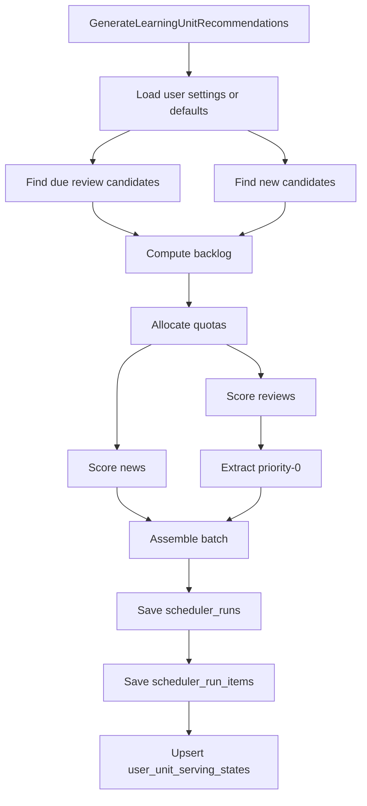

# 学习内容推荐模块设计文档（MVP）

状态：DEPRECATED
说明：本文档仅保留为历史讨论记录，不再作为当前系统实现依据。当前实现以《全新设计-总设计.md》《全新设计-学习引擎设计.md》《全新设计-推荐模块设计.md》《全新设计-Catalog-数据库设计.md》为准。

---

## 1. 文档目标

本文档只定义 **Recommendation 模块**。

它回答的问题是：

- Recommendation 在整体架构中的职责是什么
- Recommendation 读取哪些业务输入
- Recommendation 自己维护哪些表
- Recommendation 如何生成推荐批次

本文档 **不再** 定义以下内容：

- 学习事件模型如何维护
- 学习状态如何归约
- replay 如何重建学习状态
- 弱事件 / 强事件 / SM-2 / 状态迁移

上述内容已经从本模块文档中抽离，统一归到：

- [学习引擎设计.md](/Users/evan/Downloads/learning-video-recommendation-system/docs/学习引擎设计.md)

## 2. 模块定位与边界

## 2.1 Recommendation 在整体架构中的位置

当前系统应拆成两个平级模块：

1. Learning engine
   - 维护学习事件
   - 维护学习状态
   - 提供 replay
2. Recommendation
   - 读取学习状态
   - 生成推荐批次
   - 维护推荐投放状态与推荐审计

Recommendation 的输入来自 Learning engine，但 Recommendation 不是 Learning engine 的下游仓储写入者。

它的核心原则是：

> Recommendation 只读取 Learning engine 的业务表，不维护 Learning engine 的业务表。

## 2.2 Recommendation 负责什么

Recommendation 负责：

- 读取 `learning.user_unit_states`
- 读取 `semantic.coarse_unit`
- 计算 review / new 候选
- 计算 backlog 与 quota
- 进行排序与优先级提取
- 组装最终推荐批次
- 维护 Recommendation 自己的投放状态
- 保存推荐运行审计

## 2.3 Recommendation 不负责什么

Recommendation 不负责：

- 写 `learning.unit_learning_events`
- 写 `learning.user_unit_states`
- 维护学习状态迁移
- replay 学习状态
- 定义学习事件真相层

## 3. 与现有数据库的关系

## 3.1 `auth.users`

作为用户主表，由外部身份系统维护。

## 3.2 `semantic.coarse_unit`

作为统一学习内容实体表，由语义内容系统维护。

Recommendation 只读取：

- `id`
- `kind`
- `label`
- `pos`
- `english_def`
- `chinese_def`

## 3.3 `learning.user_unit_states`

这是 Learning engine 输出的业务输入表。

Recommendation 只读，不写。

对于 Recommendation 而言，这张表提供两类输入：

1. 学习目标属性
   - `is_target`
   - `target_source`
   - `target_source_ref_id`
   - `target_priority`
2. 学习状态属性
   - `status`
   - `progress_percent`
   - `mastery_score`
   - `last_quality`
   - `next_review_at`
   - `consecutive_wrong`
   - 其他计数与状态字段

## 3.4 Recommendation 自己维护的表

核心是 3 张：

- `recommendation.user_unit_serving_states`
- `recommendation.scheduler_runs`
- `recommendation.scheduler_run_items`

## 4. Recommendation 的核心设计原则

### 4.1 只消费学习状态，不维护学习状态

Recommendation 的职责是：

- 决定“现在该向用户推哪些学习单元”

而不是：

- 决定“这个学习单元掌握到什么程度”

### 4.2 评分信号必须分清来源

Recommendation 使用的信号有两类：

1. 来自 Learning engine 的学习信号
2. 来自 Recommendation 自己的投放信号

例如：

- `status / mastery_score / next_review_at` 来自 Learning engine
- `last_recommended_at` 来自 Recommendation 自己的 serving state

### 4.3 优先保 review，再补 new

MVP 阶段，Recommendation 的主策略不变：

- 先保护复习
- 再引入新内容

### 4.4 推荐审计必须与推荐输出解耦

`scheduler_runs` 和 `scheduler_run_items` 是 Recommendation 内部审计表。

它们的作用是：

- 记录为什么这次推了这些内容
- 支持排障与解释

它们不是学习状态，也不参与 replay。

### 4.5 MVP 不支持用户级调度配置

MVP 阶段明确约束：

- Recommendation 不支持按用户持久化 `session_default_limit`
- 不支持按用户持久化 `daily_new_unit_quota`
- 不支持按用户持久化 `daily_review_soft_limit / daily_review_hard_limit`
- 不支持按用户持久化 `timezone`

当前 Recommendation 统一使用模块内默认配置。

这样做是有意收敛，而不是遗漏实现。MVP 目标是先稳定：

- 候选读取
- backlog / quota 计算
- 排序
- 推荐审计
- serving state 闭环

而不是先引入额外的用户级配置表和配置管理链路。

后续如果需要扩展，建议仍由 Recommendation 自己维护配置，而不是回写 Learning engine。最简单的扩展方案是新增 Recommendation 自己的用户配置表，并只影响：

- session limit 默认值
- new / review quota 阈值
- 时区相关日界线

不改变现有评分器、配额器和推荐审计的主结构。

## 5. Recommendation 的输入模型

## 5.1 统一学习内容输入

Recommendation 只处理：

- `semantic.coarse_unit`

当前至少支持：

- `word`
- `phrase`
- `grammar`

## 5.2 review 候选输入

review 候选来自：

- `learning.user_unit_states`

筛选条件：

- `is_target = true`
- `status in ('learning', 'reviewing', 'mastered')`
- `next_review_at <= now`

## 5.3 new 候选输入

new 候选来自：

- `learning.user_unit_states`

筛选条件：

- `is_target = true`
- `status = 'new'`

## 5.4 Recommendation 投放状态输入

来自：

- `recommendation.user_unit_serving_states`

当前 MVP 只需要：

- `last_recommended_at`

它用于减少短时间内重复推荐。

## 6. Recommendation 自有数据表设计

## 6.1 `recommendation.user_unit_serving_states`

建议结构：

```sql
create table if not exists recommendation.user_unit_serving_states (
  user_id uuid not null references auth.users(id) on delete cascade,
  coarse_unit_id bigint not null references semantic.coarse_unit(id) on delete cascade,
  last_recommended_at timestamptz,
  last_recommendation_run_id uuid,
  created_at timestamptz not null default now(),
  updated_at timestamptz not null default now(),
  primary key (user_id, coarse_unit_id)
);
```

字段语义：

- `last_recommended_at`
  最近一次被 Recommendation 推出的时间
- `last_recommendation_run_id`
  最近一次被哪个 run 推出

## 6.2 `recommendation.scheduler_runs`

建议结构：

```sql
create table if not exists recommendation.scheduler_runs (
  run_id uuid primary key,
  user_id uuid not null references auth.users(id) on delete cascade,
  requested_limit int not null,
  generated_at timestamptz not null,
  due_review_count int not null default 0,
  selected_review_count int not null default 0,
  selected_new_count int not null default 0,
  context jsonb not null default '{}'::jsonb
);
```

## 6.3 `recommendation.scheduler_run_items`

建议结构：

```sql
create table if not exists recommendation.scheduler_run_items (
  run_id uuid not null references recommendation.scheduler_runs(run_id) on delete cascade,
  user_id uuid not null references auth.users(id) on delete cascade,
  coarse_unit_id bigint not null references semantic.coarse_unit(id) on delete cascade,
  recommend_type text not null check (recommend_type in ('review', 'new')),
  rank int not null,
  score numeric(8,4) not null,
  reason_codes text[] not null default '{}',
  primary key (run_id, coarse_unit_id)
);
```

## 7. 候选集生成

## 7.1 review 候选集

SQL 层只负责筛选与联表，不负责排序策略。

候选行至少应包含：

- `learning.user_unit_states` 的调度字段
- `semantic.coarse_unit` 的展示字段
- Recommendation 的 `last_recommended_at`

注意：

- `last_recommended_at` 不应再从 `learning.user_unit_states` 读取
- 应由 `recommendation.user_unit_serving_states` 左连接提供

## 7.2 new 候选集

new 候选同理：

- 从 `learning.user_unit_states` 中筛 `status='new'`
- 从 `recommendation.user_unit_serving_states` 读取最近推荐时间

## 8. 动态配额与 backlog 保护

backlog 和 quota 逻辑保留当前 MVP 规则。

### 8.1 backlog 定义

```text
backlog = due review 候选数
```

### 8.2 配额规则

按当前已确认实现：

- `R = 0`
  - `review_quota = 0`
  - `new_quota = session_limit`
- `1 <= R <= 5`
  - `review_quota = R`
  - `new_quota = session_limit - R`
- `6 <= R <= 20`
  - `review_quota = min(ceil(0.7 * session_limit), R)`
  - `new_quota = session_limit - review_quota`
- `soft < R <= hard`
  - 激活 backlog protection
  - 更激进压缩 new quota
- `R > hard`
  - `new_quota = 0`
  - 全部让给 review

这里的实现细节不属于 Learning engine，仍然属于 Recommendation。

## 9. 评分与排序

## 9.1 review 评分

当前保留公式：

```text
review_score =
  0.45 * overdue_score
  + 0.25 * target_priority
  + 0.20 * weak_memory_score
  + 0.10 * recency_adjustment
```

其中：

- `overdue_score`
  来自 `next_review_at`
- `target_priority`
  来自 `learning.user_unit_states`
- `weak_memory_score`
  来自 `mastery_score / consecutive_wrong / last_quality`
- `recency_adjustment`
  来自 `recommendation.user_unit_serving_states.last_recommended_at`

### `recency_adjustment`

MVP 规则：

- `last_recommended_at is null` -> `1`
- 距今 `>= 6h` -> `1`
- 否则 -> `0`

## 9.2 new 评分

当前保留公式：

```text
new_score =
  0.75 * target_priority
  + 0.15 * freshness_score
  + 0.10 * not_recently_recommended
```

其中：

- `target_priority`
  来自 `learning.user_unit_states`
- `freshness_score`
  来自 `seen_count / strong_event_count`
- `not_recently_recommended`
  来自 `recommendation.user_unit_serving_states.last_recommended_at`

### `not_recently_recommended`

MVP 规则：

- `last_recommended_at is null` -> `1`
- 距今 `>= 24h` -> `1`
- 否则 -> `0`

## 9.3 priority-0

priority-0 仍然属于 Recommendation 规则。

当前保留：

- `status = learning` 的 due review
- 最近失败内容：`last_quality <= 2`

## 10. 最终列表组装

组装顺序保持不变：

1. priority-0 review
2. 普通 review
3. new

同时要求：

- `coarse_unit_id` 去重
- 自动生成 rank
- 自动生成 `RecommendationBatch`

## 11. Recommendation 主流程



最后一步非常关键：

- Recommendation 生成推荐成功后，应更新 `user_unit_serving_states.last_recommended_at`
- 这一步不再污染 `learning.user_unit_states`

## 12. 对外接口边界

Recommendation 对外只暴露一个主入口：

- `GenerateLearningUnitRecommendations`

它的返回值是：

- 一组推荐学习单元
- 对应 score
- 对应 reason codes

它不对外暴露：

- 事件写入
- 状态更新
- replay

这些能力都属于 Learning engine。

## 13. 实现顺序建议

### 第一阶段：先拆 owner

先做硬切换：

- 把 `record events / replay / reducer` 搬到 Learning engine
- Recommendation 只保留生成推荐批次

### 第二阶段：迁移 `last_recommended_at`

新增：

- `recommendation.user_unit_serving_states`

然后：

- scorer 改读新表
- 生成推荐后更新新表
- 删除 `learning.user_unit_states.last_recommended_at`

### 第三阶段：补 Recommendation 审计闭环

确保：

- `scheduler_runs`
- `scheduler_run_items`
- `user_unit_serving_states`

三者形成完整 Recommendation 内部闭环。

## 14. 最终结论

Recommendation 模块的最终边界可以概括成一句话：

> Recommendation 只负责“基于 Learning engine 已维护好的学习状态，生成可解释的推荐批次，并维护推荐域自己的投放状态与审计数据”。

因此在最终版本里：

- `learning.unit_learning_events` 不归 Recommendation 维护
- `learning.user_unit_states` 不归 Recommendation 维护
- `last_recommended_at` 不再属于 Learning engine
- Recommendation 的核心 owner 是：
  - `recommendation.user_unit_serving_states`
  - `recommendation.scheduler_runs`
  - `recommendation.scheduler_run_items`
