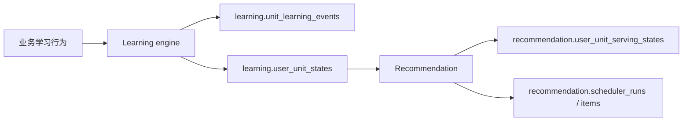
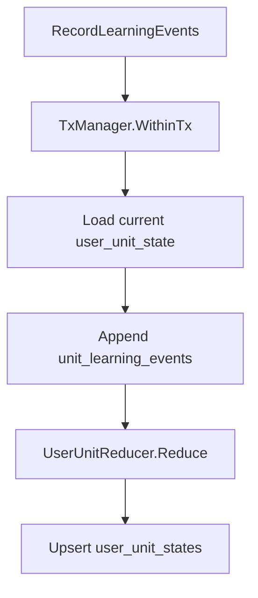
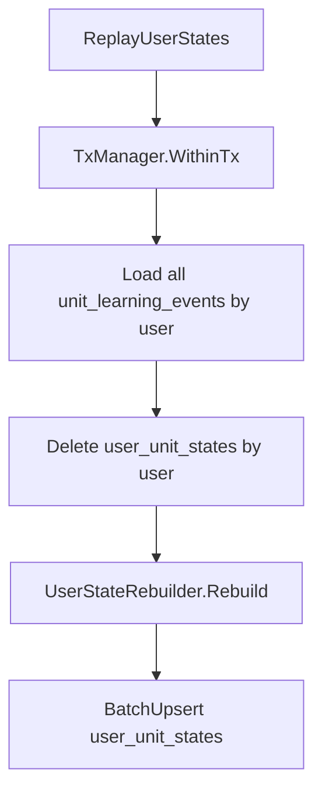

# 学习引擎设计文档（Learning engine / MVP）

## 1. 文档目标

本文档定义 **Learning engine** 的完整边界、数据模型、核心规则、工程实现方式与对外接口。

当前文档以设计为主。

如果需要看真实目录结构、分层职责、repository / `sqlc` / migration / 测试组织，应配合阅读：

- [学习引擎工程实现.md](/Users/evan/Downloads/learning-video-recommendation-system/docs/学习引擎工程实现.md)

Learning engine 负责：

- 记录学习行为事件
- 维护用户目标学习单元状态
- 提供状态重建能力
- 向 Recommendation 暴露稳定的读取输入

本文档是从原“学习调度系统”文档中抽出的 Learning engine 部分，并按当前新的模块边界重写。

当前代码目录：

- [internal/learningengine](/Users/evan/Downloads/learning-video-recommendation-system/internal/learningengine)

## 2. 模块定位

## 2.1 Learning engine 是什么

Learning engine 不是推荐系统。

它解决的问题是：

- 用户对某个学习单元目前处于什么状态
- 下一次什么时候该复习
- 当前掌握程度如何
- 这些状态如何由学习行为事件稳定归约而来

一句话：

> Learning engine 负责维护“学得怎么样”，不负责“这次推什么”。

## 2.2 Learning engine 不是什么

它不是：

- 视频推荐系统
- 推荐排序系统
- 推荐投放系统
- 推荐审计系统

这些都属于 Recommendation。

## 2.3 Learning engine 与 Recommendation 的关系

Recommendation 是 Learning engine 的消费者，但不是其 owner。

关系如下：



## 3. 核心设计原则

### 3.1 事件是真相，状态是归约结果

Learning engine 的根原则是：

- `learning.unit_learning_events` 是事实真相层
- `learning.user_unit_states` 是当前归约状态层

状态出错时，应该通过 replay 从事件重建，而不是把状态表当真相层修补。

### 3.2 状态只为目标学习单元存在

在当前业务定义里：

- 只有进入学习目标范围的单元，系统才维护它的状态

因此：

- 目标属性
- 状态属性

可以共存于同一张 `learning.user_unit_states` 表中。

### 3.3 弱事件不推进调度，强事件才推进调度

这是 Learning engine 的硬边界。

- 弱事件：
  - 更新曝光/接触信息
  - 不推进记忆状态
- 强事件：
  - 更新记忆状态
  - 更新复习节奏
  - 更新掌握程度

### 3.4 同一套规则同时服务在线写入与 replay

Learning engine 不能有两套状态规则：

- 一套给在线写入
- 一套给 replay

必须由同一个 reducer 完成：

- 在线写入时：当前状态 + 新事件 -> 新状态
- replay 时：从空状态开始按事件流重建

### 3.5 MVP replay 只支持 full replay

MVP 阶段只保留：

- `FullUserReplay`

即：

- 对某个用户按完整事件历史重建全部学习状态

不支持：

- scoped replay
- partial replay
- 增量 replay

### 3.6 当前工程 owner 已经独立

当前仓库中，Learning engine 已经拥有自己独立的：

- 代码目录
- migration 根
- sqlc 生成块
- 集成测试

对应工程入口：

- `make learningengine-migrate-up`
- `make learningengine-migrate-down`
- `make learningengine-migrate-version`

补充说明：

- Learning engine 与 Recommendation 共用同一数据库
- 但 migration tracking table 已拆分
- Learning engine 使用 `learningengine_schema_migrations`

## 4. 与现有数据库的关系

Learning engine 依赖以下已有基础表：

### 4.1 `auth.users`

用户主表。

### 4.2 `semantic.coarse_unit`

统一学习内容实体表。

当前至少支持：

- `word`
- `phrase`
- `grammar`

## 5. 核心概念

## 5.1 学习单元

统一用：

- `semantic.coarse_unit`

表示学习目标对象。

## 5.2 用户-学习单元状态

表示：

- 这个用户对这个目标学习单元当前学到什么程度

它不是推荐状态，不包含 Recommendation 的投放信息。

## 5.3 学习事件

表示：

- 用户针对某个学习单元发生了什么学习行为

Learning engine 只依赖事件流和状态 reducer，不依赖外部直接改状态。

## 6. 数据架构设计

## 6.1 `learning.user_unit_states`

这是 Learning engine 的核心状态总表。

建议结构：

```sql
create table if not exists learning.user_unit_states (
  user_id uuid not null references auth.users(id) on delete cascade,
  coarse_unit_id bigint not null references semantic.coarse_unit(id) on delete cascade,

  is_target boolean not null default true,
  target_source text,
  target_source_ref_id text,
  target_priority numeric(5,4) not null default 0.5,

  status text not null default 'new'
    check (status in ('new', 'learning', 'reviewing', 'mastered', 'suspended')),

  progress_percent numeric(5,2) not null default 0
    check (progress_percent between 0 and 100),

  mastery_score numeric(5,4) not null default 0
    check (mastery_score between 0 and 1),

  first_seen_at timestamptz,
  last_seen_at timestamptz,
  last_reviewed_at timestamptz,

  seen_count int not null default 0,
  strong_event_count int not null default 0,
  review_count int not null default 0,
  correct_count int not null default 0,
  wrong_count int not null default 0,
  consecutive_correct int not null default 0,
  consecutive_wrong int not null default 0,

  last_quality smallint check (last_quality between 0 and 5),
  recent_quality_window smallint[] not null default '{}',
  recent_correctness_window boolean[] not null default '{}',

  repetition int not null default 0,
  interval_days numeric(8,2) not null default 0,
  ease_factor numeric(6,4) not null default 2.5,
  next_review_at timestamptz,

  suspended_reason text,

  created_at timestamptz not null default now(),
  updated_at timestamptz not null default now(),

  primary key (user_id, coarse_unit_id)
);
```

### 为什么 `target_*` 留在这张表

因为当前业务定义是：

- 只要一个 unit 被纳入当前学习目标范围，系统才会维护它的状态

因此：

- 目标属性
- 状态属性

在 Learning engine 内属于同一个聚合，不需要再拆成单独目标表。

### 为什么 `last_recommended_at` 不在这张表

因为它是 Recommendation 的投放状态，不是 Learning engine 的学习状态。

## 6.2 `learning.unit_learning_events`

这是 Learning engine 的事实表。

建议结构：

```sql
create table if not exists learning.unit_learning_events (
  event_id bigint generated always as identity primary key,
  user_id uuid not null references auth.users(id) on delete cascade,
  coarse_unit_id bigint not null references semantic.coarse_unit(id) on delete cascade,
  video_id uuid references catalog.videos(video_id) on delete set null,
  event_type text not null,
  source_type text not null,
  source_ref_id text,
  is_correct boolean,
  quality smallint check (quality between 0 and 5),
  response_time_ms int,
  metadata jsonb not null default '{}'::jsonb,
  occurred_at timestamptz not null,
  created_at timestamptz not null default now()
);
```

### 为什么它必须 append-only

因为：

- 事件是真相层
- replay 要依赖完整历史
- 如果事件可以被覆盖式修改，就无法稳定重建状态

## 6.3 现有数据库的遗留清理

当前 Learning engine 只维护两张业务表：

- `learning.unit_learning_events`
- `learning.user_unit_states`

它不维护 Recommendation 的投放状态和推荐审计表。

## 7. 事件模型设计

## 7.1 事件类型

Learning engine 统一支持：

- `exposure`
- `lookup`
- `new_learn`
- `review`
- `quiz`

## 7.2 弱事件

### `exposure`

表示：

- 用户看到了该学习单元

作用：

- 增加 `seen_count`
- 更新 `last_seen_at`

不推进：

- `status`
- `repetition`
- `interval_days`
- `ease_factor`
- `next_review_at`

### `lookup`

表示：

- 用户对该学习单元进行查询、点击释义或显式查看解释

作用同样属于弱事件。

## 7.3 强事件

### `new_learn`

表示：

- 用户对一个新学习单元进行首次正式学习

### `review`

表示：

- 用户对已有学习单元进行复习

### `quiz`

表示：

- 用户对学习单元进行测验型验证

## 7.4 强事件输入信息

强事件可携带：

- `is_correct`
- `quality`
- `response_time_ms`

其中 `quality` 是 SM-2 及状态迁移的重要输入。

## 8. 质量评分体系

MVP 统一使用 `0..5` 的质量分。

建议语义：

- `5`
  - 轻松正确
- `4`
  - 正确但有轻微犹豫
- `3`
  - 勉强正确
- `2`
  - 错误但经过提示能想起
- `1`
  - 明显错误
- `0`
  - 完全不会

MVP 的关键分界是：

- `quality >= 3`
  视为通过
- `quality < 3`
  视为失败

## 9. 状态模型设计

## 9.1 状态定义

Learning engine 统一使用：

- `new`
- `learning`
- `reviewing`
- `mastered`
- `suspended`

### `new`

已纳入目标集，但还没有形成有效学习闭环。

### `learning`

刚进入正式学习阶段，仍需密集重复。

### `reviewing`

已经通过新手阶段，开始进入间隔复习。

### `mastered`

已达到当前 MVP 对“掌握”的定义阈值。

### `suspended`

暂时不参与正常调度。

## 9.2 状态迁移

### `new -> learning`

条件：

- 至少发生一次强事件

### `learning -> reviewing`

条件：

- 至少两次通过的强事件
- 最近两次质量分都 `>= 3`

### `reviewing -> mastered`

条件：

- `interval_days >= 21`
- 最近稳定
- 没有明显失败

### `mastered -> reviewing`

条件：

- 出现明显失败

## 9.3 掌握阈值

MVP 阶段统一使用：

- `21 天`

作为掌握阈值。

## 10. SM-2 与进度计算

## 10.1 成功分支

当 `quality >= 3` 时：

- `repetition = repetition + 1`
- 间隔按简化 SM-2 更新：
  - 第 1 次：`1`
  - 第 2 次：`3`
  - 第 3 次：`6`
  - 之后：`round(interval * EF)`
- 更新 `next_review_at`
- 更新 `ease_factor`

## 10.2 失败分支

当 `quality < 3` 时：

- `repetition = 0`
- `interval_days = 1`
- `next_review_at = occurred_at + 1 day`
- `ease_factor` 保持不变

## 10.3 `ease_factor` 下限

MVP 保留：

- `EF >= 1.3`

## 10.4 `progress_percent`

Learning engine 负责计算对外可展示的阶段性进度。

当前实现原则：

- `interval_days` 越接近掌握阈值，进度越高
- 最终封顶 `100`

## 10.5 `mastery_score`

Learning engine 负责计算一个 `0..1` 的掌握分。

当前仍使用混合信号：

- `progress_percent`
- 最近正确率
- 稳定性

## 11. 状态更新规则

## 11.1 弱事件更新

弱事件只更新：

- `seen_count`
- `last_seen_at`

## 11.2 强事件更新

强事件更新：

- `seen_count`
- `strong_event_count`
- `last_seen_at`
- `review_count`
- `last_reviewed_at`
- `correct_count`
- `wrong_count`
- `consecutive_correct`
- `consecutive_wrong`
- `last_quality`
- `recent_quality_window`
- `recent_correctness_window`
- `repetition`
- `interval_days`
- `ease_factor`
- `next_review_at`
- `status`
- `progress_percent`
- `mastery_score`

## 11.3 事务边界

Learning engine 的在线写链路必须保证：

- 写事件
- 写状态

在同一事务中完成。

## 12. Learning engine 主流程

## 12.1 在线事件写入



关键点：

- 先写事实
- 再写状态
- 同事务

## 12.2 replay 重建



关键点：

- MVP 只支持 full replay
- 同一套 reducer 既服务在线更新，也服务 replay

## 13. 工程实现设计

## 13.1 推荐目录结构

```text
internal/learningengine/
  application/
    command/
    dto/
    repository/
    service/
    usecase/
  domain/
    aggregate/
    enum/
    model/
    policy/
    rule/
    service/
  infrastructure/
    config.go
    db.go
    migration/
    persistence/
      mapper/
      query/
      queryctx/
      repository/
      sqlcgen/
      tx/
  test/
    integration/
```

## 13.2 `domain/aggregate`

Learning engine 的核心入口是：

- `UserUnitReducer`

它负责：

- 基于当前状态和当前事件，计算下一个状态

处理顺序建议是：

1. 识别弱/强事件
2. 调基础字段更新器
3. 更新最近质量/正确性窗口
4. 强事件带 `quality` 时走 SM-2
5. 重算状态迁移
6. 重算 `progress_percent`
7. 重算 `mastery_score`

## 13.3 `application/usecase`

Learning engine 只需要两个主用例：

### `RecordLearningEvents`

负责：

- 写事件
- 更新状态

### `ReplayUserStates`

负责：

- 对指定用户做 full replay

不应再把这两个能力保留在 Recommendation 下面。

## 13.4 Repository 接口

建议接口：

```go
type UnitLearningEventRepository interface {
    Append(ctx context.Context, events []model.LearningEvent) error
    ListByUserOrdered(ctx context.Context, userID uuid.UUID) ([]model.LearningEvent, error)
}

type UserUnitStateRepository interface {
    GetByUserAndUnit(ctx context.Context, userID uuid.UUID, coarseUnitID int64) (*model.UserUnitState, error)
    Upsert(ctx context.Context, state *model.UserUnitState) error
    BatchUpsert(ctx context.Context, states []*model.UserUnitState) error
    DeleteByUser(ctx context.Context, userID uuid.UUID) error
}
```

## 13.5 `sqlc` 方案

Learning engine 继续坚持：

- `sqlc`
- 主题化 SQL 文件
- mapper 隔离 `sqlc` 模型与领域模型

建议 SQL 文件：

- `unit_events.sql`
- `unit_states.sql`

## 14. 测试与验收

## 14.1 领域单测

至少覆盖：

- 弱事件处理
- 强事件处理
- SM-2
- 状态迁移
- progress/mastery
- reducer

## 14.2 集成测试

至少覆盖：

### 场景 A：新用户初学

- 第一次强事件应把 `new` 推进到 `learning`

### 场景 B：正常推进

- 多次通过后进入 `reviewing`
- 足够稳定后进入 `mastered`

### 场景 C：失败回退

- 失败后重置间隔
- `mastered` 回落到 `reviewing`

### 场景 D：full replay

- 在线状态与 full replay 重建结果一致

### 场景 E：事务回滚

- 状态写失败时，事件不应残留半成品

## 15. 与 Recommendation 的接口约定

Learning engine 对 Recommendation 暴露的核心输入是：

- `learning.user_unit_states`

Recommendation 可直接使用：

- `is_target`
- `target_priority`
- `status`
- `progress_percent`
- `mastery_score`
- `last_quality`
- `next_review_at`

但 Learning engine 不再提供：

- `last_recommended_at`

该字段已经属于 Recommendation 的 serving state。

## 16. 最终结论

Learning engine 的最终职责可以概括成一句话：

> 基于统一学习事件流，维护用户对目标学习单元的稳定状态总表，并通过 full replay 保证状态可重建、可验证、可修复。

因此在最终版本里：

- `learning.unit_learning_events` 是事实真相层
- `learning.user_unit_states` 是 Learning engine 维护的状态总表
- Learning engine 不负责 Recommendation 的投放状态
- Recommendation 只消费 Learning engine 的结果，不反向维护其业务表
