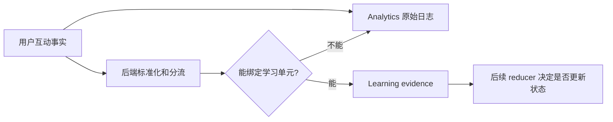
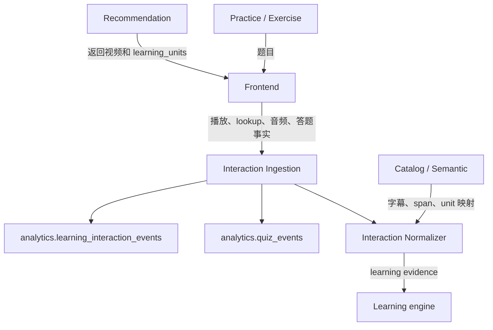
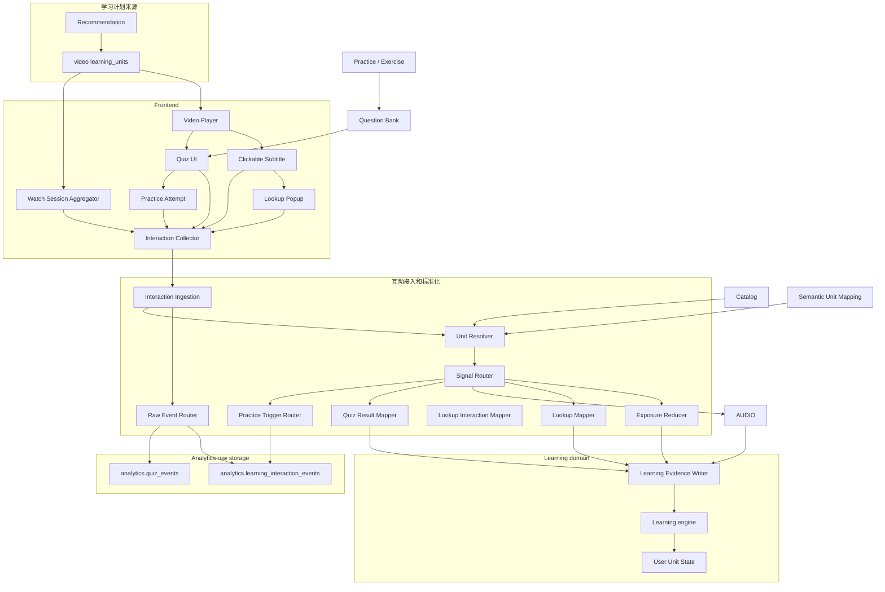
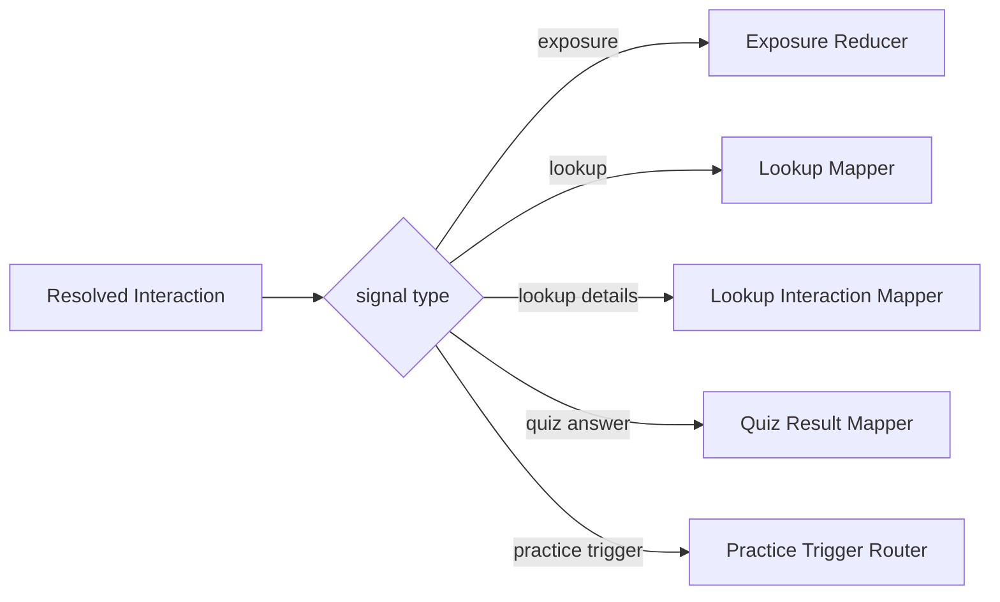
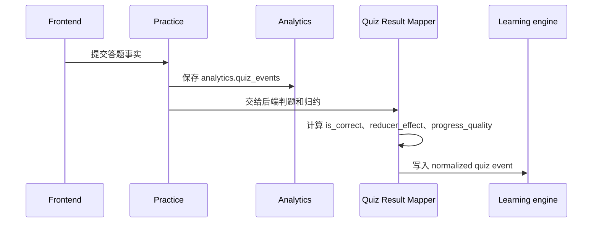
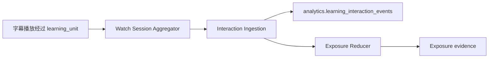
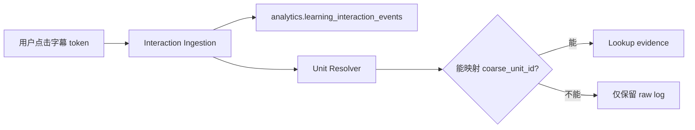
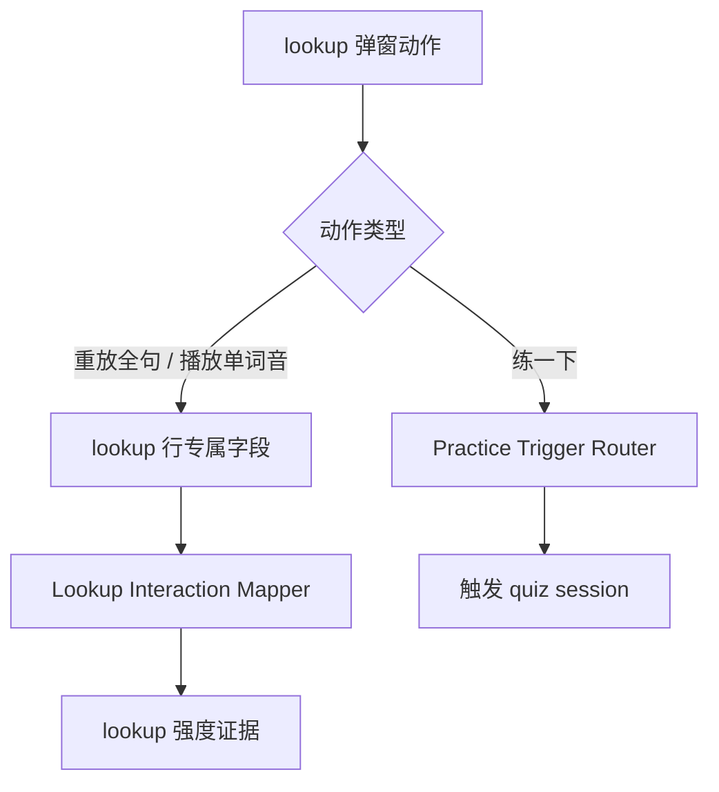
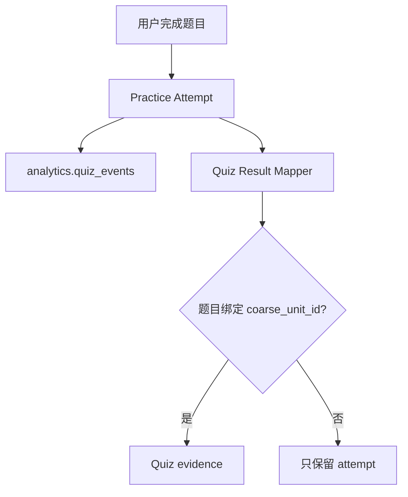

# 学习互动信号架构图

## 0. 文档信息

文档状态：MVP 架构图草案

目标读者：产品、前端、后端、数据、后续接手维护的人

当前范围：本文只用图说明学习互动信号链路中需要设计哪些组件、组件之间怎么协作、哪些数据进入 Learning engine。本文会标出未来 analytics 原始流水的逻辑表名，但不定义具体字段、索引、migration、API、队列、埋点 SDK 或代码目录。

配套阅读：

- [学习互动信号语义设计.md](学习互动信号语义设计.md)：解释 exposure、lookup、lookup 弹窗附加行为、习题答题这些信号的业务语义。
- [练习题绑定与生成设计.md](练习题绑定与生成设计.md)：解释习题生成、触发和题目形态。

## 1. 设计目标

学习互动信号架构要解决一个核心问题：

> 前端看到的是播放、字幕点击、弹窗按钮、答题这些用户行为；Learning engine 需要的是可以归约到 `user_id + coarse_unit_id` 的 learning evidence。

因此架构必须把两件事分开：

- **原始互动事实**：用户实际做了什么，未来应该进入 analytics。
- **learning evidence**：后端确认可以绑定学习单元、可供 reducer 使用的学习证据。



## 2. 简化架构图

最需要理解的主链路。



简化理解：

- Recommendation 告诉前端这个视频本轮要学哪些 `learning_units`。
- Frontend 只上报用户互动事实，不判断用户是否学会。
- Interaction Ingestion 是统一入口，先保留原始事实。
- 非习题类原始互动未来保存到 `analytics.learning_interaction_events`。
- 习题 / 练习答题原始事实未来保存到 `analytics.quiz_events`。
- Interaction Normalizer 判断哪些事实能转成 learning evidence。
- Learning engine 只接收可归约的 learning evidence。
- Practice / Exercise 负责题目，答题 attempt 原始事实进入 analytics，后续再归一化成 `quiz` event，并由 `reducer_effect` 决定是否推进 progress。

## 3. 详细设计图

这张图展示 MVP 阶段大致需要设计的组件。它是架构分解，不是代码包名。



## 4. 组件职责说明

### 4.1 Recommendation

Recommendation 的职责是给 feed 中每个视频附带 `learning_units`。

`learning_units` 不是视频完整词表，而是本轮这个用户看这个视频时，系统真正关心的学习单元。前端可以基于它做字幕高亮、exposure 聚合、末尾小测候选。

### 4.2 Frontend

Frontend 的职责是展示视频、字幕、弹窗和题目，并如实上报用户发生了什么。

前端不负责判断：

- 用户是否学会；
- 互动事实应该形成哪类 learning evidence；
- `quiz` evidence 的 `reducer_effect` 和 `progress_quality` 应该是多少；
- 这个 evidence 是否应该推进学习状态。

这些都由后端标准化层和 Learning engine 处理。

### 4.3 Interaction Collector

Interaction Collector 是前端侧的互动事实收集器。它收集：

- 字幕曝光候选；
- 字幕 token lookup；
- lookup 弹窗内重放全句音频、播放单词音；
- 点“练一下”的触发事实；
- 题目答题事实；
- watch session 中聚合后的 exposure 信息。

它的输出是互动事实，不是学习结论。

### 4.4 Watch Session Aggregator

Watch Session Aggregator 负责把播放过程中的 exposure 降噪。

MVP 语义是：

```text
一次观看 session 里，一个 video + coarse_unit_id 最多形成一次 exposure 候选。
```

它只围绕 Recommendation 返回的 `learning_units` 聚合，不对视频里所有 token 做全量 exposure。

### 4.5 Interaction Ingestion

Interaction Ingestion 是后端统一接入层。

它应该先做两件事：

1. 保存 raw interaction log，保证产品分析和排障有原始事实。
2. 把互动事实交给后端标准化链路，判断是否能形成 learning evidence 或练习触发审计。

这个层不应该直接更新学习状态。

### 4.6 Raw Interaction Log

Raw Interaction Log 是 analytics 数据。

未来按两张 analytics 表拆分：

- `analytics.learning_interaction_events`：保存 exposure、lookup、已学会等非习题类互动原始事实。MVP 中 lookup 弹窗内重放全句音频、播放单词音、点“练一下”等动作作为 lookup 行的专属字段保存。
- `analytics.quiz_events`：保存习题 / 练习答题原始事实。

它们保存用户实际做过什么，包括不能映射到学习单元的行为，例如 unmapped lookup。它们不直接改变学习状态。

当前状态：`analytics.quiz_events` 与 `analytics.learning_interaction_events` 都已有 migration。

### 4.7 Unit Resolver

Unit Resolver 负责把前端上报的 token、span、question、attempt 等事实映射到 `coarse_unit_id`。

如果无法得到明确 `coarse_unit_id`，这个行为不能进入 Learning engine，只能留在 raw interaction log 或 attempt 里。

### 4.8 Signal Router

Signal Router 负责把已经解析过的互动事实分到不同处理器：

- exposure 交给 Exposure Reducer；
- lookup 交给 Lookup Mapper；
- lookup 弹窗内音频动作作为 lookup 专属字段交给 Lookup Interaction Mapper；
- 习题答题交给 Quiz Result Mapper；
- “练一下”触发交给 Practice Trigger Router。



### 4.9 Exposure Reducer

Exposure Reducer 把聚合后的 exposure 候选解释成 exposure evidence。

单次 exposure 只表示“用户可能接触过这个 unit”，不表示用户理解或掌握。跨视频多次 exposure 是否形成 passive familiarity，由后续 reducer 规则决定。

### 4.10 Lookup Mapper

Lookup Mapper 把 mapped lookup 转成 active interest / possible difficulty 这类 lookup evidence。

unmapped lookup 只留在 Raw Interaction Log，不进入 Learning engine。

### 4.11 Lookup Interaction Mapper

Lookup Interaction Mapper 处理 lookup 弹窗中的附加行为：

- 重放全句音频；
- 播放单词字典音。
- 点“练一下”。

这些动作在 MVP 中不单独形成 raw event 行，而是作为 `analytics.learning_interaction_events(event_type = 'lookup')` 的 lookup 专属字段保存。它们可以帮助解释 lookup 强度，但不直接代表用户掌握。

### 4.12 Quiz Result Mapper

Quiz Result Mapper 处理习题答题。

答题原始事实先保存到 `analytics.quiz_events`。Quiz Result Mapper 再根据题目答案、题型、难度和答题结果，把 attempt 归一化成 Learning Engine event。是否推进学习进度不由 `event_type` 隐含决定，而由 normalizer 写入的 `reducer_effect` 决定。



### 4.13 Practice Trigger Router

Practice Trigger Router 处理“练一下”这类触发动作。

它不是学习结果，不应该直接写成会推进进度的 `quiz` 或 `lookup`。真正的学习反馈来自后续答题 attempt 和归一化出来的 `reducer_effect = 'affects_progress'` 事件。

### 4.14 Learning Evidence Writer

Learning Evidence Writer 是进入 Learning engine 前的最后一层。它写入的是 `learning.unit_learning_events` normalized ledger，不是 analytics raw log。

它只写可归约 learning evidence，例如：

- `exposure`
- `lookup`
- `quiz`
- `self_mark_mastered`

进入这里的数据必须已经有明确 `user_id + coarse_unit_id`，并且已经由 normalizer 决定 `reducer_effect`：

- `observe_only`：只更新观察字段。
- `affects_progress`：带 `progress_quality`，进入 progress / schedule reducer path。

### 4.15 Learning engine

Learning engine 只负责归约学习状态。

它不关心：

- 前端如何展示弹窗；
- 题目如何生成；
- 用户点击的是哪个原始 token；
- analytics 保存了哪些 raw log。

它只处理可归约 normalized event，并由 `reducer_effect` 决定是否更新 `user_id + coarse_unit_id` 对应的 progress / schedule 状态。

## 5. 关键信号流

### 5.1 exposure 流



### 5.2 lookup 流



### 5.3 lookup 弹窗附加行为流



### 5.4 quiz 流



## 6. 新人读图重点

读这个架构时，优先抓住四条边界：

1. Frontend 上报事实，不上报学习结论。
2. `analytics.learning_interaction_events` 和 `analytics.quiz_events` 保存原始行为，不更新学习状态。
3. Learning engine 只接收有明确 `coarse_unit_id` 的 learning evidence。
4. Practice attempt 和 Learning engine `quiz` evidence 是两层语义。

如果某个组件或接口设计无法回答“这条数据是原始事实、learning evidence、还是触发/控制动作”，说明边界还没有设计清楚。
