# 学习互动信号语义设计

## 0. 文档信息

文档状态：MVP 语义设计草案  
目标读者：产品、前端、后端、数据、后续接手维护的人  
当前范围：只解释学习互动信号的业务语义和模块边界，不讨论具体 API 路径、数据库表、代码模块、队列或埋点 SDK。后端实际 reducer 如何使用这些信号，本轮只确定方向，不在本文定稿算法。

这份文档回答一个问题：

> 用户看视频、看字幕、点词查义时，哪些行为应该被当成学习信号，哪些行为只应该作为产品分析数据保存？

## 1. 一句话结论

推荐系统在给前端 feed 列表时，不只是给视频列表，还会给每个视频一组该用户本轮预期学习的 `learning_units`。

每个视频大约有 1 到 8 个 `learning_units`。它们就是这个视频的学习重点。

MVP 阶段：

- 字幕自动曝光只围绕这些 `learning_units` 处理；
- 字幕点击 lookup 可以上报所有 token 点击；
- 能映射到学习单元的 lookup 才能成为可归约学习证据；
- 不能映射的 lookup 只作为 analytics 行为保存；
- lookup 弹窗不默认要求用户做“认识 / 模糊 / 不认识”三档自评；
- lookup 弹窗内的停留时长、重放全句音频、播放单词字典音、练一下，只作为附加行为或练习触发事实；
- exposure / lookup 默认不是掌握结论，但后端可以跨视频、跨 session 聚合它们，形成更强的学习证据；
- 前端只负责如实上报发生了什么，后端负责判断这些行为如何解释、是否影响学习状态。

## 2. 整体链路

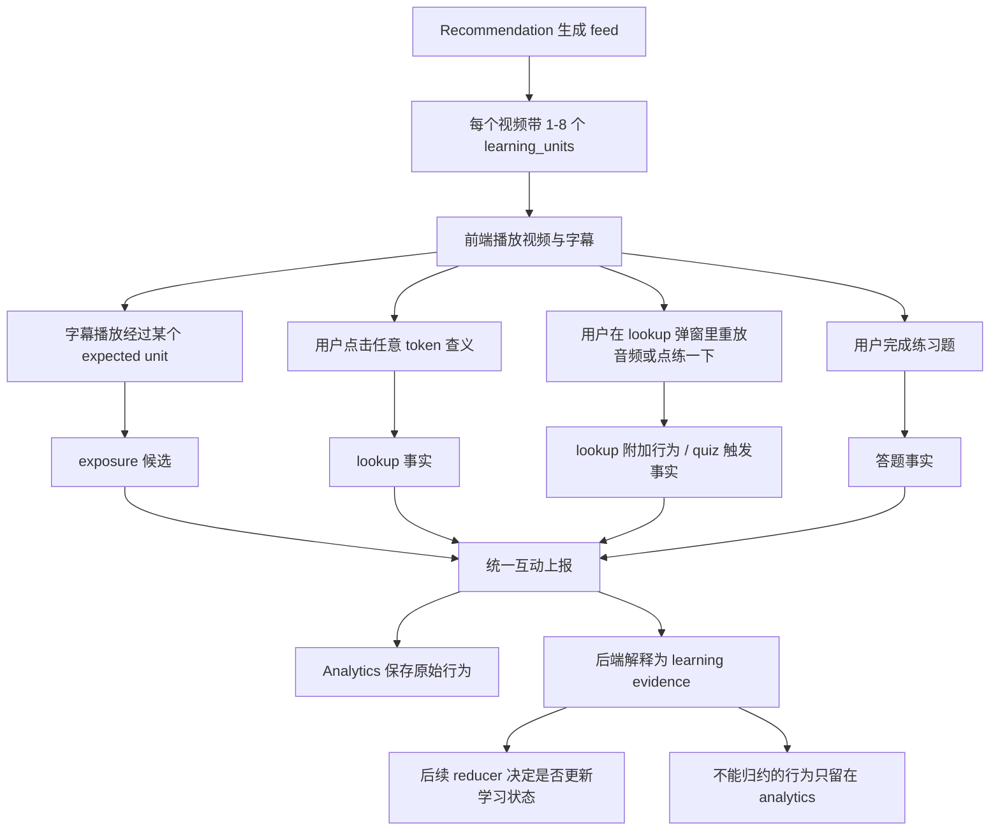

这张图里的重点是：**前端上报的是互动事实，不是学习结论。**

例如，前端可以告诉后端“用户点了这个字幕 token”。但它不应该判断“用户是不是学会了这个词”“这个词是不是 target”“这次行为应该推进多少学习状态”。这些判断都属于后端和 Learning engine。

## 3. 为什么 Recommendation 要给 learning_units

一个视频里可能出现很多词。用户看到字幕，并不代表他注意到了每个词，也不代表每个词都应该进入学习状态。

如果对视频里所有 token 都记录学习曝光，会出现几个问题：

- 事件量很大；
- 很多词只是路过，不是真正的学习目标；
- Learning engine 的 seen/exposure 信息会变得很虚；
- 前端需要理解太多学习策略，职责变重。

所以 Recommendation 会提前帮前端圈出重点：

```text
这个视频里，本轮最希望用户学习或复习哪些 unit？
```

这些重点就是 `learning_units`。

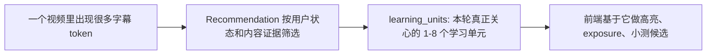

因此，`learning_units` 不是视频的完整词表，而是“这个用户这次看这个视频时，系统关心的学习目标”。

## 4. 几个角色分别负责什么


各自职责：

- Recommendation：决定每个视频本轮预期学习哪些 `learning_units`。
- Frontend：只记录用户实际发生的互动，例如播放经过、点击查义、lookup 弹窗操作、答题。
- Analytics：保存原始互动事实，包括不能映射到学习单元的 lookup。
- 后端标准化层：判断互动事实能不能绑定学习单元，并解释成哪类学习证据。
- Learning engine：维护学习状态，不接收没有明确学习对象的原始行为；具体 reducer 规则后续单独定稿。

### 4.1 三层语义模型

现在不再把事件类型简单分成“弱事件”和“强事件”两类。

更准确的模型是三层：

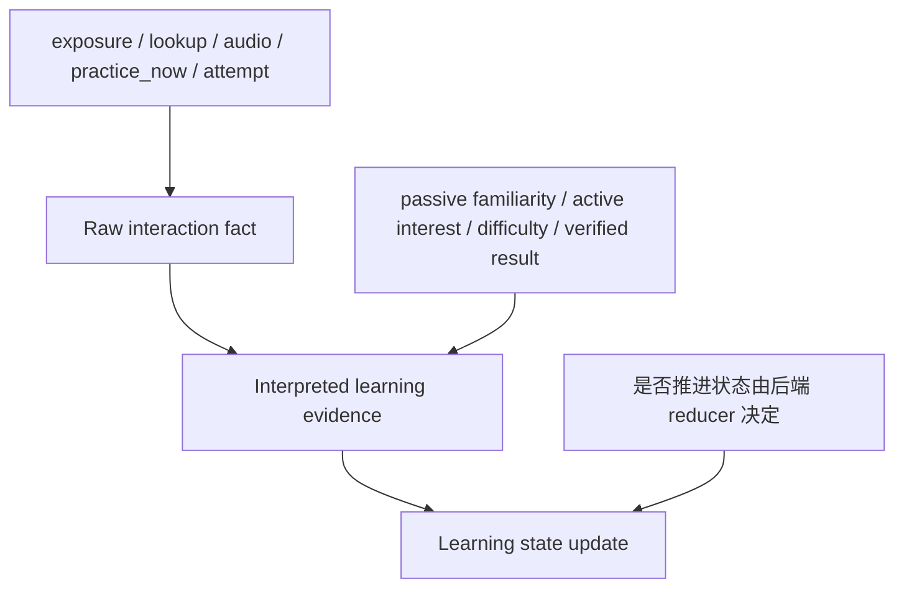

第一层是原始互动事实：用户看到了什么、点了什么、停留多久、是否重放、是否答题。

第二层是后端解释后的学习证据：例如可能熟悉、主动关注、疑似困难、验证通过或验证失败。

第三层才是学习状态更新：是否推进状态、推进多少、是否影响复习优先级，都由后续 reducer 规则决定。

本文只定义前两层的语义边界。第三层现在由 Learning Engine 的 normalized event 契约承接：normalizer 写入 `reducer_effect = 'observe_only'`、`reducer_effect = 'affects_progress'` 或 `reducer_effect = 'set_mastered'`，reducer 只按这个字段分发。至于某条 raw fact 何时应被解释成 `affects_progress`，仍属于 normalizer 规则，不在本文强行定阈值。

## 5. exposure：字幕自动曝光

### 5.1 exposure 表示什么

`exposure` 表示用户在看视频时，播放进度经过了某个系统关心的学习单元。

单次 exposure 只能说明用户可能接触到了这个 unit。

它不能直接说明：

```text
用户注意到了
用户理解了
用户学会了
```

但 exposure 也不应该被永久固定为“完全无用的弱事件”。如果同一个用户在多个视频、多个 session 中反复经过同一个 `coarse_unit_id`，并且没有 lookup、没有练习触发、没有答错题，这可以被后端解释为一种更强的被动熟悉证据。

这种证据可以先理解成：

```text
passive familiarity
```

它代表“用户可能已经比较熟悉，至少没有表现出明显困难”。它不等于 quiz 通过，也不等于 mastered。

### 5.2 MVP 只处理 learning_units

MVP 阶段，字幕 exposure 只处理当前视频的 `learning_units`。

也就是：

```text
只有 Recommendation 说这个视频本轮要学的 unit，才会产生有效 exposure。
```

不做全量 token exposure。

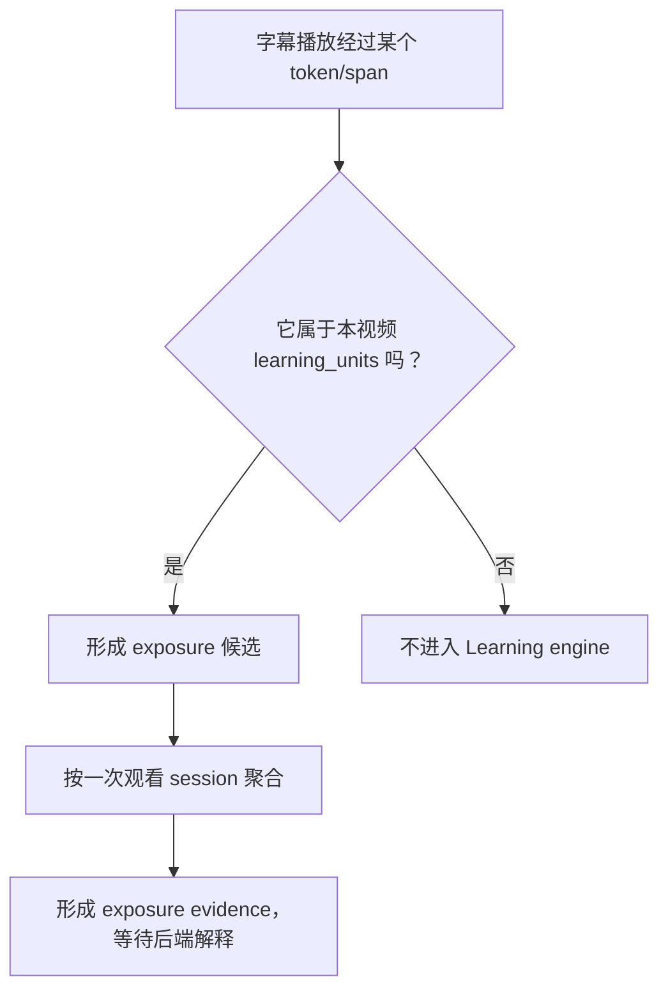

### 5.3 exposure 要聚合

同一个视频里，同一个 unit 可能出现多次。MVP 不应该每出现一次就写一次 exposure。

建议语义：

```text
一次观看 session 里，一个视频的一个 learning unit，最多形成一次 exposure。
```

如果同一个 unit 出现多次，可以把“出现了几次、最早什么时候看到、最后什么时候看到”作为附加信息保存，而不是刷多条状态更新。

### 5.4 后端可以跨视频解释 exposure

MVP 后续可以让后端按 `user_id + coarse_unit_id` 跨视频聚合 exposure。

例如：

```text
同一个 unit 在多个视频里作为 learning_unit 出现
用户多次观看经过
没有 lookup
没有 practice_now
没有相关 quiz 失败
```

这可以被解释成“可能熟悉”的学习证据，用于：

- 降低这个 unit 的重复打扰；
- 降低它进入强制练习的优先级；
- 在后续推荐里减少重复投放；
- 偶尔抽样出题验证。

但是本文不规定它是否直接推进学习状态，也不规定阈值。实际 reducer 可以在后续重构时决定：

```text
多次 exposure 是否更新 familiarity
是否影响 next_review
是否影响 mastery
需要多少次、跨多少视频、多久窗口内才生效
```

## 6. lookup：字幕点击查义

### 6.1 lookup 表示什么

`lookup` 表示用户主动点击了字幕 token，查看释义、解释或翻译。

它比 exposure 更有价值，因为它说明用户对这个词有主动关注。

单次普通 lookup 不代表用户已经学会，但 lookup 的强度差异很大。停留时长、是否重放全句音频、是否播放单词音、是否跨视频重复 lookup、是否点了“练一下”，都会影响后端对这次行为的解释。

所以 lookup 更适合被理解为：

```text
active interest / possible difficulty
```

它默认不是掌握结论，但也不应该被固定成永远只加一个弱计数。

### 6.2 lookup 可以上报所有点击

和 exposure 不同，lookup 可以上报所有字幕 token 点击。

原因是：用户点击了某个 token，本身就是有价值的产品行为。即使这个 token 暂时不能映射到学习单元，也可以用于分析：

- 哪些词经常被点；
- 哪些字幕 span 映射缺失；
- 哪些 unmapped token 未来值得补进词库；
- 用户是否真的在使用字幕查义功能。

### 6.3 mapped lookup 和 unmapped lookup

lookup 后端会分成两类：

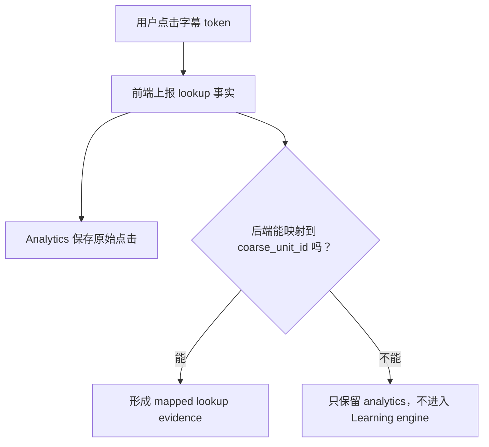

这就是 mapped 和 unmapped 的区别。

mapped lookup：

```text
用户点了一个 token，后端能确认它对应某个 coarse_unit_id。
```

它可以成为可归约学习证据。后端可以根据停留时长、附加行为、跨视频重复情况和后续 quiz 结果，决定它最终如何影响学习状态。

unmapped lookup：

```text
用户确实点了 token，但系统无法确认它对应哪个学习单元。
```

它不应该进入 Learning engine，因为 Learning engine 的学习状态是围绕 `user + coarse_unit` 维护的。没有明确 unit，就没有稳定的学习对象。

### 6.4 lookup 通过 learning interactions 上报

MVP 阶段，lookup 不需要每次点击都立刻独立调用一次 HTTP 请求，但它也不应该塞进 watch-progress API。

更自然的语义是：

```text
前端在 lookup 弹窗关闭或阶段性 flush 时，把这一段已经完成的 lookup 事实写入 learning interaction 队列，再通过 learning interaction 批量 API 上报。具体请求结构见 [学习事件上报API设计.md](API/学习事件上报API设计.md)。
```

lookup 事件可以携带这些关联字段：

- `video_id`
- `watch_session_id`
- `recommendation_run_id`
- `client_event_id`

这些字段不是为了让 lookup 归属于 watch-progress，而是为了后续能把一次 lookup 放回“哪个视频、哪次观看、哪次推荐、哪条前端事件”里追溯。

lookup 事件本身仍然只描述：

```text
用户点了哪个字幕 token，以及 lookup 弹窗内发生了哪些动作。
```

### 6.5 lookup 子事件建议包含什么

下面不是定稿 API，只是语义字段说明。

| 字段 | 建议 | 语义 |
| --- | --- | --- |
| `token_text` | 必需 | 用户点击的原始字幕文本。即使不能映射学习单元，也有 analytics 价值。 |
| `sentence_index` | 当前 batch API 必需 | 用户点击发生在哪一句字幕。它比纯播放时间更适合做字幕定位。 |
| `span_index` | 当前 batch API 必需 | 用户点击的是该句里的哪个 token/span。 |
| `coarse_unit_id` | 可选 | 如果前端已经知道映射结果，可以带上；后端仍应复核或补映射。 |
| `lookup_visible_ms` | 建议必需 | lookup 弹窗从出现到消失、被另一个 token 替换，或用户点“练一下”为止的可见时长。 |
| `lookup_sentence_audio_replay_count` | 可选，默认 0 | 用户在弹窗里重放全句音频的次数。 |
| `lookup_word_audio_play_count` | 可选，默认 0 | 用户在弹窗里播放该单词字典音的次数。 |
| `lookup_practice_now_clicked` | 可选，默认 false | 用户是否从 lookup 弹窗主动点了“练一下”。它只是练习触发事实，不是学习结果。 |

不建议放进 lookup 子事件的字段：

- `playback_ms`：如果有稳定的 `sentence_index + span_index`，优先使用字幕定位。
- `lookup_end_reason`：MVP 没有必要区分关闭原因。
- `favorite_clicked`：收藏单词属于收藏/词库功能，不作为学习互动信号。

### 6.6 lookup 附加行为怎么解释

lookup 弹窗会直接展示完整的上下文释义和字典义，所以 MVP 不设计“展开更多”“切换词典 tab”“展开上下文”这类信号。

真正需要关注的是自然动作：

- 用户停留了多久；
- 用户是否重放全句音频；
- 用户是否播放单词字典音；
- 用户是否主动点了“练一下”。

这些动作可以帮助后端和 analytics 判断一次 lookup 的强度，但它们仍然不是掌握结论。是否推进学习状态，取决于后端后续 reducer 规则。

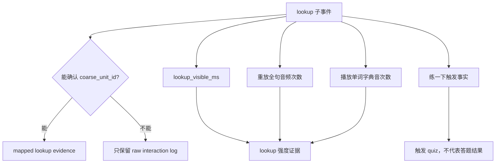

## 7. raw interaction log 是什么

raw interaction log 是 analytics 数据。它记录用户原始互动事实，但不直接改变学习状态。

落库方向是把前端原始流水放在 `analytics` owner 下，而不是放进 Learning engine：

- `analytics.learning_interaction_events`：保存非习题类学习互动原始事实，例如 exposure 聚合结果、lookup 子事件、lookup 弹窗内重放全句音频、播放单词音、点“练一下”等。
- `analytics.quiz_events`：保存习题 / 练习答题原始事实，例如题目、答案、是否跳过、用时、题目来源、当时题目版本等。

这两张表都是 analytics 原始事实层。它们不直接更新学习状态，也不等同于 Learning engine 的归约结果。

### 7.1 `analytics.learning_interaction_events` MVP 表职责

`analytics.learning_interaction_events` 保存非答题 attempt 的学习互动原始事实。MVP 只承接三类事件：

| `event_type` | 一行代表什么 | 是否必须有 `coarse_unit_id` | 后续解释 |
| --- | --- | --- | --- |
| `exposure` | 一次 watch session 内，一个 video + coarse unit 的聚合曝光。 | 是 | 后端可解释成 exposure evidence。 |
| `lookup` | 用户点击字幕 token 并查看 lookup 弹窗。 | 否 | mapped lookup 可解释成 lookup evidence；unmapped lookup 只留 analytics。 |
| `self_mark_mastered` | 用户在 lookup 弹窗或 quiz 页面主动点“已学会”。 | 进入 Learning engine 前必须有 | normalizer 生成 `reducer_effect = 'set_mastered'` 的 normalized event，直接把该 unit 标记为已掌握并移出目标学习范围。 |

`self_mark_mastered` 不放进 `analytics.quiz_events`。即使这个按钮出现在 quiz 页面，它也不是“用户完成一道题的作答事实”，而是用户主动声明掌握状态的互动事实。若它发生在 quiz 页面，可以通过 `related_quiz_event_id` 关联对应答题记录。

MVP 不单独设计 `audio_action` 或 `practice_trigger` 事件行。lookup 弹窗内的重放全句音频、播放单词音和“练一下”点击，先作为 `lookup` 行的 lookup 专属字段保存。真正答题后再写入 `analytics.quiz_events`。

### 7.2 推荐 DDL

```sql
create table analytics.learning_interaction_events (
  event_id uuid primary key default gen_random_uuid(),

  client_event_id text not null,

  user_id uuid not null
    references auth.users(id) on delete cascade,

  client_context jsonb not null default '{}'::jsonb,

  event_type text not null
    check (event_type in ('exposure', 'lookup', 'self_mark_mastered')),

  source_surface text not null,

  video_id uuid
    references catalog.videos(video_id) on delete set null,

  watch_session_id uuid
    references analytics.video_watch_events(watch_session_id) on delete set null,

  recommendation_run_id uuid,

  related_quiz_event_id uuid
    references analytics.quiz_events(event_id) on delete set null,

  coarse_unit_id bigint
    references semantic.coarse_unit(id) on delete set null,

  token_text text,
  sentence_index integer,
  span_index integer,

  occurred_at timestamptz not null,

  exposure_start_ms integer,
  exposure_end_ms integer,
  exposure_count integer,

  lookup_visible_ms integer,
  lookup_sentence_audio_replay_count integer not null default 0,
  lookup_word_audio_play_count integer not null default 0,
  lookup_practice_now_clicked boolean not null default false,

  event_payload jsonb not null default '{}'::jsonb,

  created_at timestamptz not null default now(),

  check (jsonb_typeof(client_context) = 'object'),
  check (jsonb_typeof(event_payload) = 'object'),
  check (exposure_start_ms is null or exposure_start_ms >= 0),
  check (exposure_end_ms is null or exposure_end_ms >= 0),
  check (
    exposure_start_ms is null
    or exposure_end_ms is null
    or exposure_end_ms >= exposure_start_ms
  ),
  check (exposure_count is null or exposure_count >= 1),
  check (lookup_visible_ms is null or lookup_visible_ms >= 0),
  check (lookup_sentence_audio_replay_count >= 0),
  check (lookup_word_audio_play_count >= 0)
);
```

### 7.3 字段说明

| 字段 | 作用 |
| --- | --- |
| `event_id` | 服务端生成的原始互动事件 ID。后续 normalizer 或 Learning engine evidence 可以用它做 `source_ref_id`。 |
| `client_event_id` | 前端为单条事件生成的幂等 ID。重复上报时用 `(user_id, client_event_id)` 去重。它是事件级 ID，不需要 `client_batch_id`。 |
| `user_id` | 用户 ID。由后端认证上下文填入，不信任前端请求体。 |
| `client_context` | 客户端环境上下文。三张 analytics raw fact 表统一使用该字段，保存 `platform`、`app_version`、`os_version`、`device_model` 等低频排障信息。 |
| `event_type` | 原始互动类型。MVP 只允许 `exposure`、`lookup`、`self_mark_mastered`。 |
| `source_surface` | 事件发生入口，例如 `video_player`、`lookup_popup`、`quiz`、`feed_card`。不做强枚举，避免后续加入口时频繁改 migration。 |
| `video_id` | 事件关联的视频。lookup / exposure 通常有；Feed 或 quiz 页面点击“已学会”可能没有。 |
| `watch_session_id` | 关联 `analytics.video_watch_events`。用于说明这个互动发生在哪次观看 session 内。 |
| `recommendation_run_id` | 如果来自某次推荐 feed 或推荐视频，记录对应 run id。MVP 不加外键，避免 analytics 和 recommendation 生命周期强耦合。 |
| `related_quiz_event_id` | 如果“已学会”按钮发生在 quiz 页面，可关联对应 `analytics.quiz_events.event_id`。它不表示该按钮属于 quiz attempt。 |
| `coarse_unit_id` | 互动能绑定到的学习单元。lookup 允许为空以保存 unmapped token；`self_mark_mastered` 后续要真正改学习状态时必须有值。 |
| `token_text` | 用户点击的原始字幕文本。主要用于 lookup；unmapped lookup 也有分析价值。 |
| `sentence_index` | 字幕句索引。用于定位 lookup / exposure 发生在哪一句。当前 `learning-interactions:batch` 的 `lookup` / `exposure` 都必须上传；未来新增其他 interaction type 时可按类型单独定义。 |
| `span_index` | 字幕 span/token 索引。用于定位用户具体点了哪个 token/span。当前 `learning-interactions:batch` 的 `lookup` / `exposure` 都必须上传；未来新增其他 interaction type 时可按类型单独定义。 |
| `occurred_at` | 客户端事件发生时间。用于按时间回放和后续聚合。 |
| `exposure_start_ms` | exposure 专属字段。表示本次 session 内第一次经过该 unit 的播放时间。 |
| `exposure_end_ms` | exposure 专属字段。表示本次 session 内最后一次经过该 unit 的播放时间。 |
| `exposure_count` | exposure 专属字段。表示本次 session 内该 unit 被经过的次数。 |
| `lookup_visible_ms` | lookup 专属字段。表示 lookup 弹窗可见时长，用于判断 lookup 强度。 |
| `lookup_sentence_audio_replay_count` | lookup 专属字段。表示 lookup 弹窗里重放全句音频的次数。 |
| `lookup_word_audio_play_count` | lookup 专属字段。表示 lookup 弹窗里播放单词字典音的次数。 |
| `lookup_practice_now_clicked` | lookup 专属字段。表示用户是否从 lookup 弹窗点了“练一下”。它只是触发事实，不是学习结果。 |
| `event_payload` | 少量扩展调试上下文。核心查询字段不要只放这里。 |
| `created_at` | 服务端入库时间。 |

### 7.4 推荐索引

```sql
create unique index uq_learning_interaction_events_user_client_event
on analytics.learning_interaction_events (user_id, client_event_id);

create index idx_learning_interaction_events_user_occurred_at
on analytics.learning_interaction_events (user_id, occurred_at desc);

create index idx_learning_interaction_events_user_unit_occurred_at
on analytics.learning_interaction_events (user_id, coarse_unit_id, occurred_at desc)
where coarse_unit_id is not null;

create index idx_learning_interaction_events_video_occurred_at
on analytics.learning_interaction_events (video_id, occurred_at desc)
where video_id is not null;

create index idx_learning_interaction_events_watch_session
on analytics.learning_interaction_events (watch_session_id, occurred_at asc)
where watch_session_id is not null;

create index idx_learning_interaction_events_related_quiz
on analytics.learning_interaction_events (related_quiz_event_id)
where related_quiz_event_id is not null;
```

这些索引覆盖 MVP 的主要查询：

- 按用户回看最近互动；
- 按 `user_id + coarse_unit_id` 聚合 exposure / lookup / 已学会；
- 按视频排查互动情况；
- 回看一次 watch session 里发生的学习互动；
- 从 quiz 页面点“已学会”时追溯对应 quiz attempt。

### 7.5 API 契约归属

学习事件上报 API 的 endpoint、前端上传 JSON、响应结构、错误结构、字段级 validation、队列与 flush 建议，统一维护在 [学习事件上报API设计.md](API/学习事件上报API设计.md)。

本文只保留互动信号语义：

- 哪些行为属于 learning interaction；
- 哪些行为只留在 Analytics；
- 哪些行为可以被 normalizer 解释成 Learning Engine evidence；
- learning interaction 与 watch-progress 的语义边界。

### 7.6 与 watch-progress API 的边界

learning interactions 不和视频观看进度合并成一个 API。

视频观看进度继续使用：

```http
POST /api/catalog/videos/{video_id}/watch-progress
```

两者分开有几个原因：

| API | 写入目标 | 前端语义 | 是否可合并 | 主要用途 |
| --- | --- | --- | --- | --- |
| `POST /api/catalog/videos/{video_id}/watch-progress` | `analytics.video_watch_events` + `catalog.video_user_states` | 当前观看 session 的最新进度状态 | 同一 session 内可覆盖，只保留最新进度和完成标记 | 视频消费进度、完成次数、Recommendation 读取的消费投影 |
| `POST /api/learning-interactions:batch` | `analytics.learning_interaction_events` | 用户发生过的 lookup / exposure 互动事件 | 不可随意覆盖；每条 lookup、每个聚合 exposure 都是独立事实 | lookup、exposure 等非答题学习互动分析和后续 evidence 归约 |
| `POST /api/quiz-attempts` | `analytics.quiz_events` | 用户完成一道题的答题事实 | 一题完成后一条 completed attempt | 判题、quiz evidence、题目效果分析 |
| `POST /api/learning-units:mark-mastered` | `analytics.learning_interaction_events` | 用户主动声明某个学习单元已掌握 | 每次点击是一条幂等 raw fact | self mark raw fact 和后续 `set_mastered` 归约 |

`watch-progress` 是 replace-latest state telemetry。前端同一 `video_id + watch_session_id` 只需要保留一个待上报状态，普通进度样本可以覆盖旧样本，`is_completed = true` 一旦出现则必须保留。

learning interaction 批量 API 是 append-only event telemetry。不同 lookup、不同聚合 exposure 都是需要独立解释的事实，不能像观看进度一样只保留最后一条。“已学会”点击虽然仍写入 `analytics.learning_interaction_events(event_type = 'self_mark_mastered')`，但通过单点 mark-mastered API 表达，不塞进 batch。

因此可以共享底层 telemetry flusher 的工程能力，例如定时 flush、unmount best-effort、失败重试和幂等 ID。但 watch-progress、learning interaction、quiz attempt 不能共享同一条业务队列合并规则；quiz attempt 是单点 completed attempt API，不进入 interaction batch。

它和可归约学习证据的区别可以这样理解：

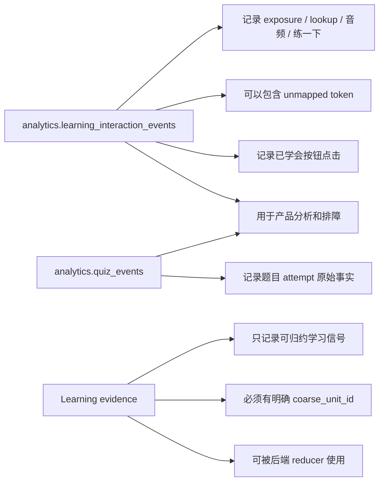

例如用户点击了一个无法映射的字幕词：

- analytics 需要知道用户点了它；
- Learning engine 不应该把它当可归约学习证据。

所以 raw interaction log 是“事实流水”，learning evidence 是“可用于学习状态归约的标准信号”。是否真正改变学习状态，由后端 reducer 决定。

## 8. lookup 弹窗内附加行为

lookup 弹窗的主要职责是解释当前字幕 token。

MVP 语义上，弹窗默认展示完整信息：

- 上下文释义；
- 字典义；
- 必要的词形、解释或例句信息。

它不应该默认要求用户做三档自评：

```text
认识 / 有点模糊 / 不认识
```

原因是：用户点词的主要目标是理解当前视频，不是填写学习状态问卷。三档自评会增加认知负担，而且主观噪声较大，不适合作为强学习反馈的默认来源。

弹窗里可以有这些自然动作：

```text
重放全句音频
播放单词字典音
练一下
已学会
```

它们也可以走统一互动上报，但语义不同：

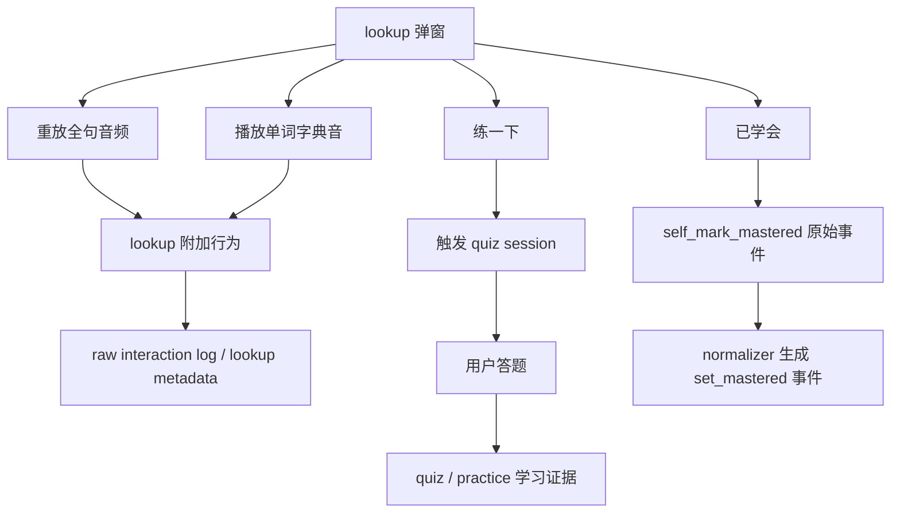

语义上：

- 重放全句音频是用户在对齐听力和上下文；
- 播放单词字典音是用户关注发音；
- “练一下”是用户主动触发练习；
- “练一下”本身不是学习结果，不应该直接当作会推进 progress 的 Learning Engine event；
- “已学会”是用户主动声明掌握状态，MVP 先记录为 `self_mark_mastered` 原始事件，normalizer 再生成 `event_type = 'self_mark_mastered'`、`reducer_effect = 'set_mastered'` 的 Learning Engine event；
- 后续答题结果才是强学习反馈，应该独立形成 practice / quiz evidence。

收藏单词不放在本文的学习互动信号里。它可以是收藏/词库功能，但不进入 Learning engine reducer。

## 9. practice / quiz attempt：习题答题上报

习题答题也是学习互动的一部分，但它和 exposure、lookup 的语义不同。

答题结果是当前产品形态里最明确的强反馈，因为它直接验证用户是否能回忆或理解某个学习单元。

当前产品里的强反馈基本都可以理解成 practice / quiz attempt：

- 视频末尾测试；
- Feed 复习卡；
- lookup 后点“练一下”；
- 学习模式中途练习。

它们的区别主要是触发位置、题型、上下文来源，而不是学习事件本质。

在 Learning engine 里，测验型验证可以统一写成 normalized event：

```text
event_type = quiz
reducer_effect = affects_progress
progress_quality = 0..5
```

`legacy-new-learn` / `review` 不再作为 Learning Engine 落库事件类型。首次学习、复习、验证通过、验证失败这类判断应作为 normalizer 或 reducer 的上下文解释，不应该让前端选择事件类型。

### 9.1 前端上报答题事实，不上报学习结论

前端不应该直接判断“用户掌握了这个单元”或“这个单元 `progress_quality = 4`”。前端只需要如实上报用户答题事实，例如：

- 用户答的是哪道题；
- 属于哪次测验；
- 用户选择了哪个选项或输入了什么；
- 是否跳过；
- 用了多久；
- 发生在什么时间。

`analytics.quiz_events` 保存的是答题原始事实。后端再根据题目的标准答案、题型、难度和答题结果，决定：

- 是否正确；
- 这次答题对应的 `progress_quality` 如何；
- 是否能转成 Learning engine 可使用的 `quiz` evidence；
- 是否应写成 `reducer_effect = 'affects_progress'`，还是只保留为 analytics raw fact；
- 这个 evidence 应该绑定哪个 `coarse_unit_id`；
- metadata 里保留哪些题目、视频、Recommendation 或上下文来源信息。

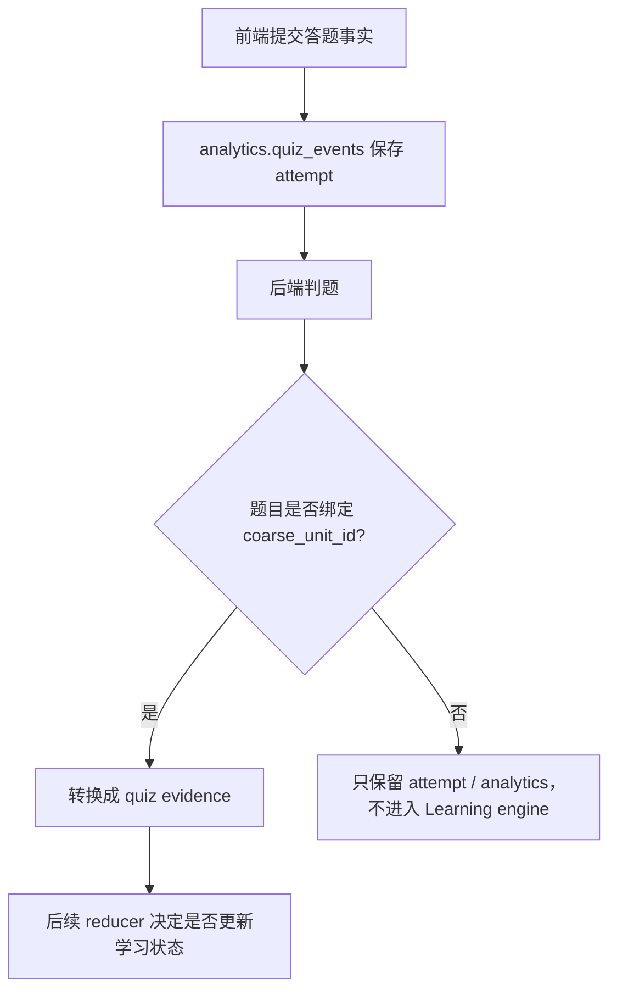

### 9.2 Practice attempt 和 Learning event 不是一回事

习题系统至少有两层语义：

- **attempt**：用户对某一道题的实际作答事实。
- **Learning evidence**：后端从 attempt 中归约出来、可供 Learning engine 使用的学习证据。

`analytics.quiz_events` 可以保存完整答题细节。Learning evidence 只保存能用于学习状态归约的标准信号。

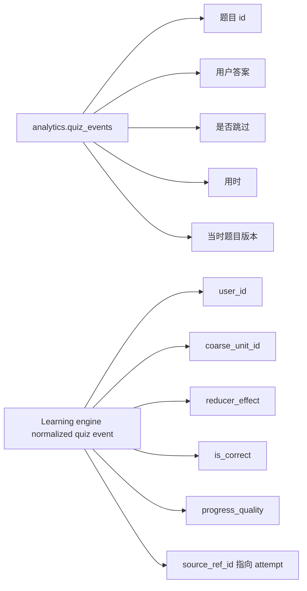

不要把完整题目、选项、用户答案都塞进 Learning engine。Learning engine 是学习状态系统，不是题库、答题记录系统或 analytics 原始流水系统。

### 9.3 practice / quiz evidence 必须有明确学习对象

practice / quiz evidence 必须绑定明确的 `coarse_unit_id`。

这和 lookup 的规则一致：如果某个行为不能映射到学习单元，就不能进入 Learning engine。

对习题来说，正常情况下题目本身就应该已经绑定了学习单元：

- per 单元题绑定 `coarse_unit_id`；
- per 视频 * 单元题绑定 `video_id + coarse_unit_id`。

因此，答题结果通常可以稳定转成 `event_type = 'quiz'` 的 normalized event。如果某道题缺少稳定 unit 绑定，它只能作为题目 attempt 或 analytics 保存，不能进入 Learning Engine。

### 9.4 practice / quiz attempt 的来源可以不同

不同触发入口产生的答题，都可以归一化成 practice / quiz attempt。

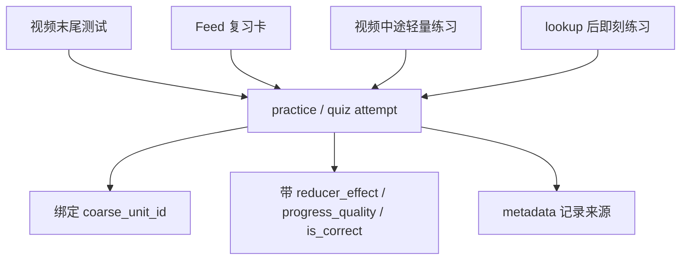

区别不在 `event_type`，而在来源信息：

- 视频末尾测试可以记录 video、recommendation run、quiz session；
- Feed 复习卡可以记录 review card session；
- 视频中途练习可以记录字幕句子、时间点、上下文题来源；
- lookup 后即刻练习可以记录 lookup 行为和题目来源。

这些来源信息用于审计、分析和排障，不应该改变 Learning engine 的核心聚合方式。

### 9.5 practice / quiz attempt 是当前主要强反馈

lookup 弹窗里的停留、重放音频、播放单词音、点“练一下”，都是有价值的互动事实，但它们仍然比较间接。

题目答题是更强的反馈，因为用户必须完成一次验证。尤其是上下文题、迁移题、填空题，能比简单自评或普通 lookup 更可靠地判断用户是否理解该学习单元。

因此，当前产品阶段可以把 `quiz` 视为主要 progress 反馈承载方式。后端可以根据 attempt 的来源和用户已有状态，决定它是否写成 `reducer_effect = 'affects_progress'`，以及对应的 `progress_quality`。

### 9.6 `legacy-new-learn` / `review` 的位置

`legacy-new-learn`、`review` 不再作为当前 Learning Engine 的落库 `event_type`。前端也不应该选择“这是 new learn 还是 review”。

前端只需要上报：

```text
用户完成了哪道题
答案是什么
是否正确
用时多久
题目绑定哪个 coarse_unit_id
题目来自视频末尾、Feed 复习卡、lookup 后练一下，还是学习模式中途练习
```

后端 normalizer 再决定：

- 这次 attempt 是否能写入 `learning.unit_learning_events`；
- 它的 `event_type` 是否为 `quiz`；
- 它的 `reducer_effect` 是 `observe_only` 还是 `affects_progress`；
- 如果推进学习状态，它的 `progress_quality` 是多少；
- 它对后续推荐和复习优先级有什么影响。

如果未来出现非题目型学习形态，例如学习卡完成、跟读训练、遮盖释义后的主动回忆，也应优先扩展 normalizer 规则或新增明确 event type，而不是恢复 `legacy-new-learn` / `review` 这种把阶段分类混进事件类型的设计。

MVP 不需要为了还没有出现的学习形态，让前端或产品层同时理解多套 progress 事件。

## 10. 为什么前端只负责上报事实

前端不应该理解完整学习策略。否则后续规则一变，前端也要跟着改。

前端只需要回答：

```text
用户刚刚做了什么？
```

后端再回答：

```text
这个行为能不能映射到学习单元？
它是不是本轮 learning_units？
它应该只进 analytics，还是形成 learning evidence？
它代表可能熟悉、主动关注、疑似困难，还是验证结果？
它是否应该影响学习状态？
```

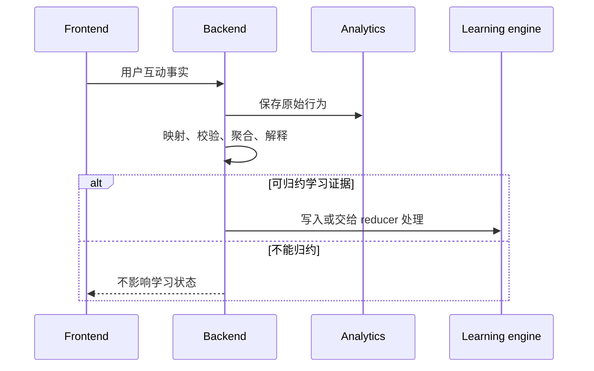

## 11. MVP 决策

MVP 阶段先定这些语义：

1. Feed 返回视频时，每个视频带 `learning_units`，约 1-8 个。
2. `learning_units` 是本轮视频学习的主范围。
3. exposure 只处理当前视频的 `learning_units`。
4. 单次 exposure 只表示“可能接触过”，不是掌握结论。
5. exposure 按观看 session 聚合，不逐 token 写。
6. 后端可以跨视频聚合 exposure，形成 passive familiarity 证据；实际 reduce 规则后续定。
7. lookup 可以上报所有字幕点击。
8. mapped lookup 可以形成 active interest / possible difficulty 证据。
9. unmapped lookup 只进入 analytics。
10. lookup 通过 `POST /api/learning-interactions:batch` 上报，可以批量发送，但不塞进 watch-progress API。
11. lookup 弹窗不默认要求用户做三档自评。
12. `lookup_visible_ms`、重放全句音频、播放单词字典音，都是 lookup 附加行为，可作为解释 lookup 强度的证据。
13. “练一下”只表示触发练习，不代表学习结果。
14. lookup 弹窗和 quiz 页面里的“已学会”按钮通过 `POST /api/learning-units:mark-mastered` 上报，统一记录为 `analytics.learning_interaction_events(event_type = 'self_mark_mastered')`。
15. 收藏单词不是学习信号，不进入 Learning engine reducer。
16. 当前产品阶段，practice / quiz attempt 是主要 progress 反馈。
17. `legacy-new-learn` / `review` 不作为 Learning Engine 落库事件类型；attempt 来源和用户状态只作为 normalizer 上下文。
18. 非习题类原始互动进入 `analytics.learning_interaction_events`。
19. 习题答题原始事实进入 `analytics.quiz_events`。
20. 习题答题再由后端归一化成 `event_type = 'quiz'`，并由 `reducer_effect` 决定是否推进 progress。
21. attempt 必须绑定明确的 `coarse_unit_id`，否则不进入 Learning engine。
22. 前端不上报学习结论，只上报题目答案、用时、跳过等答题事实；`self_mark_mastered` 只表示用户点了“已学会”，后端 normalizer 将其转成 `set_mastered` normalized event 后才直接改变学习状态。
23. lookup / exposure 使用 learning interaction 批量 API 写入 `analytics.learning_interaction_events`；quiz attempt 使用单点 API 写入 `analytics.quiz_events`；self mark 使用单点 mark-mastered API 写入 `analytics.learning_interaction_events`。
24. learning interaction batch 和 watch-progress 不合并；前者是 append-only 事件，后者是同 session 可覆盖的最新观看状态。

## 12. 当前不讨论的内容

下面这些暂时不在本文档里定：

- `analytics.learning_interaction_events` 和 `analytics.quiz_events` 的分区和保留策略；
- Learning engine 写入是同步还是异步；
- exposure 跨视频聚合到什么程度才影响学习状态；
- lookup 重复、停留和音频行为如何映射到具体 reducer 权重；
- `lookup_visible_ms` 如何分桶或加权；
- 重放全句音频、播放单词字典音如何影响练习候选排序；
- `lookup_practice_now_clicked` 是否影响后续推荐或复习优先级；
- 是否在高级学习模式中重新引入显性自评；
- 题目练习 session、attempt 表和题库表如何设计；
- 每种题型如何映射 `progress_quality`。

当前只先确定一条主线：

```text
Recommendation 告诉前端这个视频本轮学什么。
前端如实上报用户互动。
analytics 保存原始行为。
后端把能解释的行为转成 learning evidence。
Learning engine 是否更新状态由后续 reducer 规则决定。
```
