# 学习互动信号语义设计

## 0. 文档信息

文档状态：MVP 语义设计草案  
目标读者：产品、前端、后端、数据、后续接手维护的人  
当前范围：只解释学习互动信号的业务语义和模块边界，不讨论具体 API 路径、数据库表、代码模块、队列或埋点 SDK。

这份文档回答一个问题：

> 用户看视频、看字幕、点词查义时，哪些行为应该被当成学习信号，哪些行为只应该作为产品分析数据保存？

## 1. 一句话结论

推荐系统在给前端 feed 列表时，不只是给视频列表，还会给每个视频一组该用户本轮预期学习的 `learning_units`。

每个视频大约有 1 到 8 个 `learning_units`。它们就是这个视频的学习重点。

MVP 阶段：

- 字幕自动曝光只围绕这些 `learning_units` 处理；
- 字幕点击 lookup 可以上报所有 token 点击；
- 能映射到学习单元的 lookup 才进入 Learning engine；
- 不能映射的 lookup 只作为 analytics 行为保存；
- 前端只负责如实上报发生了什么，后端负责判断这些行为是否能变成学习事件。

## 2. 整体链路

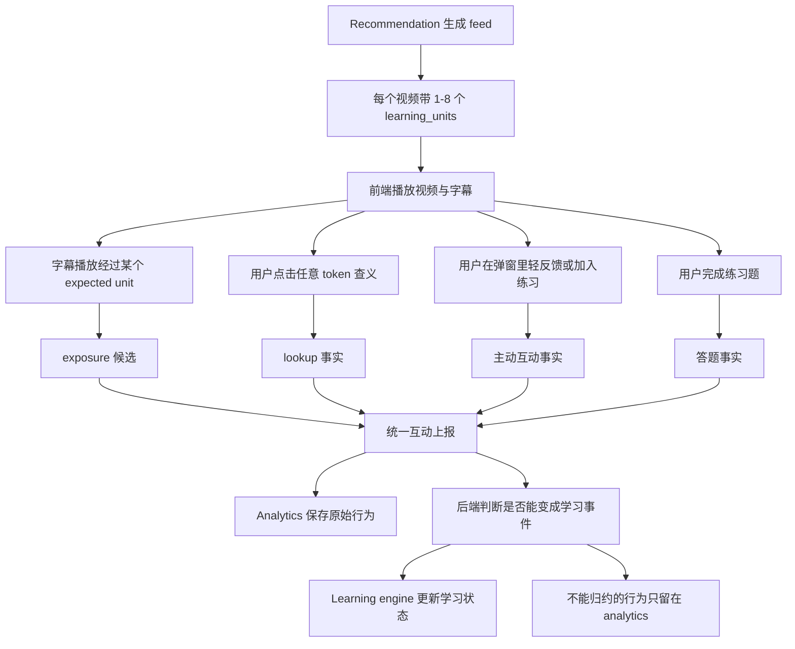

这张图里的重点是：**前端上报的是互动事实，不是学习结论。**

例如，前端可以告诉后端“用户点了这个字幕 token”。但它不应该判断“用户是不是学会了这个词”“这个词是不是 target”“应该进入 new_learn 还是 review”。这些判断都属于后端和 Learning engine。

## 3. 为什么 Recommendation 要给 learning_units

一个视频里可能出现很多词。用户看到字幕，并不代表他注意到了每个词，也不代表每个词都应该进入学习状态。

如果对视频里所有 token 都记录学习曝光，会出现几个问题：

- 事件量很大；
- 很多词只是路过，不是真正的学习目标；
- Learning engine 的 seen/exposure 信息会变得很虚；
- 前端需要理解太多学习策略，职责变重。

所以 Recommendation 会提前帮前端圈出重点：

```text
这个视频里，本轮最希望用户学习或复习哪些 unit？
```

这些重点就是 `learning_units`。

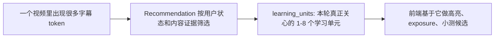

因此，`learning_units` 不是视频的完整词表，而是“这个用户这次看这个视频时，系统关心的学习目标”。

## 4. 几个角色分别负责什么

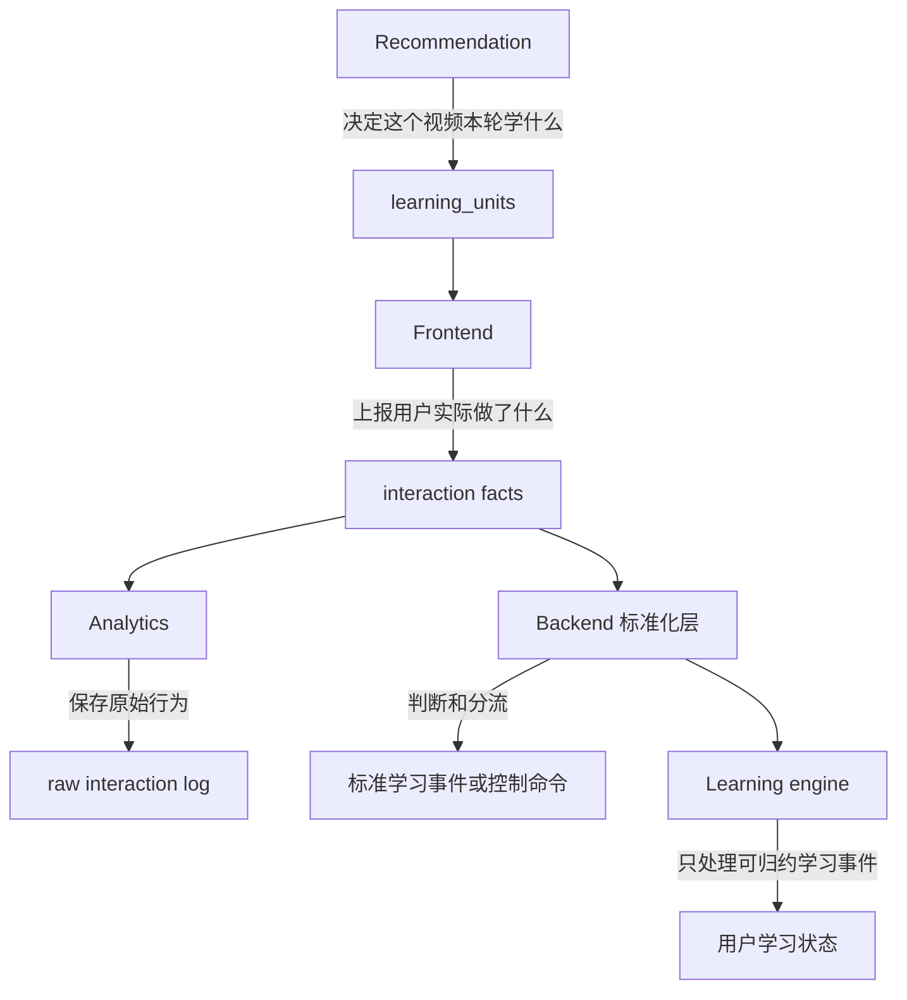

各自职责：

- Recommendation：决定每个视频本轮预期学习哪些 `learning_units`。
- Frontend：只记录用户实际发生的互动，例如播放经过、点击查义、点击反馈按钮。
- Analytics：保存原始互动事实，包括不能映射到学习单元的 lookup。
- 后端标准化层：判断互动事实能不能变成学习事件，能的话再转给 Learning engine。
- Learning engine：只维护学习状态，不接收没有明确学习对象的原始行为。

## 5. exposure：字幕自动曝光

### 5.1 exposure 表示什么

`exposure` 表示用户在看视频时，播放进度经过了某个系统关心的学习单元。

它是很弱的信号。

它只说明：

```text
用户可能接触到了这个 unit
```

它不说明：

```text
用户注意到了
用户理解了
用户学会了
```

### 5.2 MVP 只处理 learning_units

MVP 阶段，字幕 exposure 只处理当前视频的 `learning_units`。

也就是：

```text
只有 Recommendation 说这个视频本轮要学的 unit，才会产生有效 exposure。
```

不做全量 token exposure。

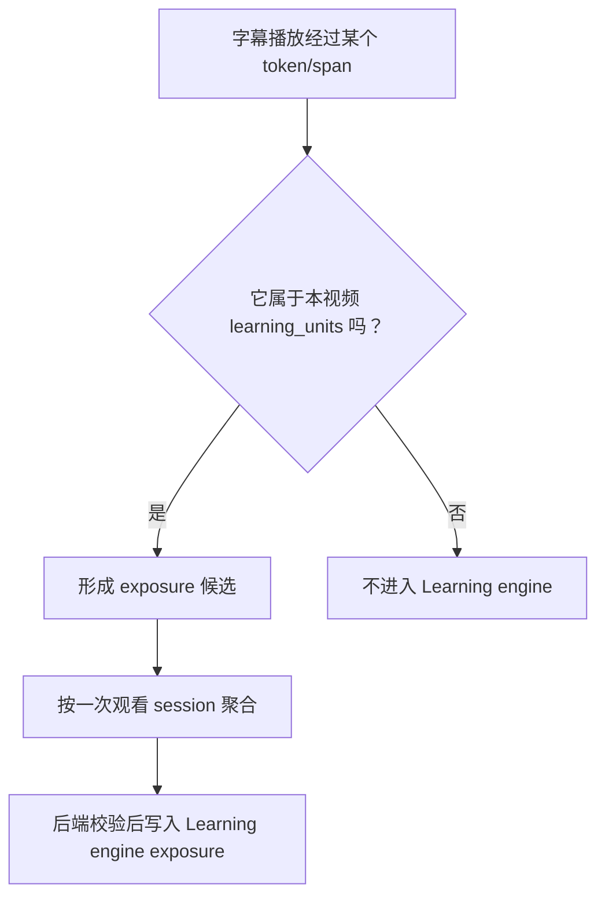

### 5.3 exposure 要聚合

同一个视频里，同一个 unit 可能出现多次。MVP 不应该每出现一次就写一次 exposure。

建议语义：

```text
一次观看 session 里，一个视频的一个 learning unit，最多形成一次 exposure。
```

如果同一个 unit 出现多次，可以把“出现了几次、最早什么时候看到、最后什么时候看到”作为附加信息保存，而不是刷多条学习事件。

## 6. lookup：字幕点击查义

### 6.1 lookup 表示什么

`lookup` 表示用户主动点击了字幕 token，查看释义、解释或翻译。

它比 exposure 更有价值，因为它说明用户对这个词有主动关注。

但它仍然是弱信号。用户查了词，不代表已经学会。

### 6.2 lookup 可以上报所有点击

和 exposure 不同，lookup 可以上报所有字幕 token 点击。

原因是：用户点击了某个 token，本身就是有价值的产品行为。即使这个 token 暂时不能映射到学习单元，也可以用于分析：

- 哪些词经常被点；
- 哪些字幕 span 映射缺失；
- 哪些 unmapped token 未来值得补进词库；
- 用户是否真的在使用字幕查义功能。

### 6.3 mapped lookup 和 unmapped lookup

lookup 后端会分成两类：

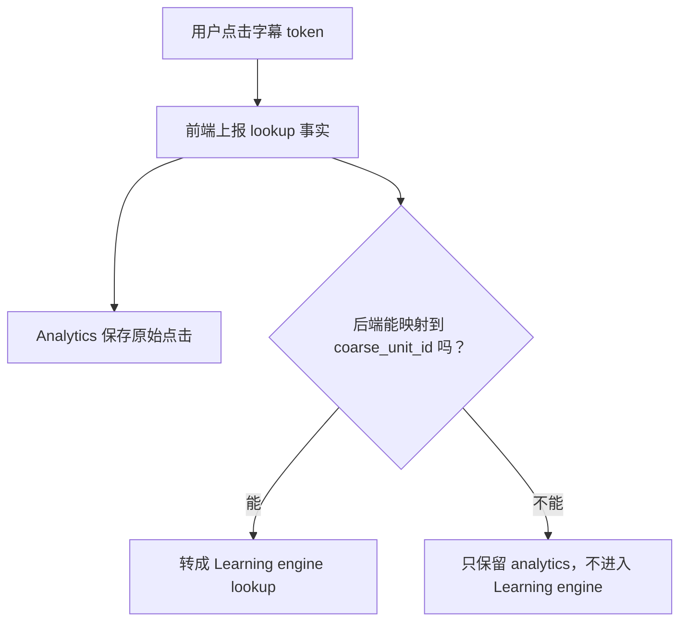

这就是 mapped 和 unmapped 的区别。

mapped lookup：

```text
用户点了一个 token，后端能确认它对应某个 coarse_unit_id。
```

它可以进入 Learning engine，成为 `lookup` 学习事件。

unmapped lookup：

```text
用户确实点了 token，但系统无法确认它对应哪个学习单元。
```

它不应该进入 Learning engine，因为 Learning engine 的学习状态是围绕 `user + coarse_unit` 维护的。没有明确 unit，就没有稳定的学习对象。

## 7. raw interaction log 是什么

raw interaction log 是 analytics 数据。它记录用户原始互动事实，但不直接改变学习状态。

它和 Learning engine event 的区别可以这样理解：

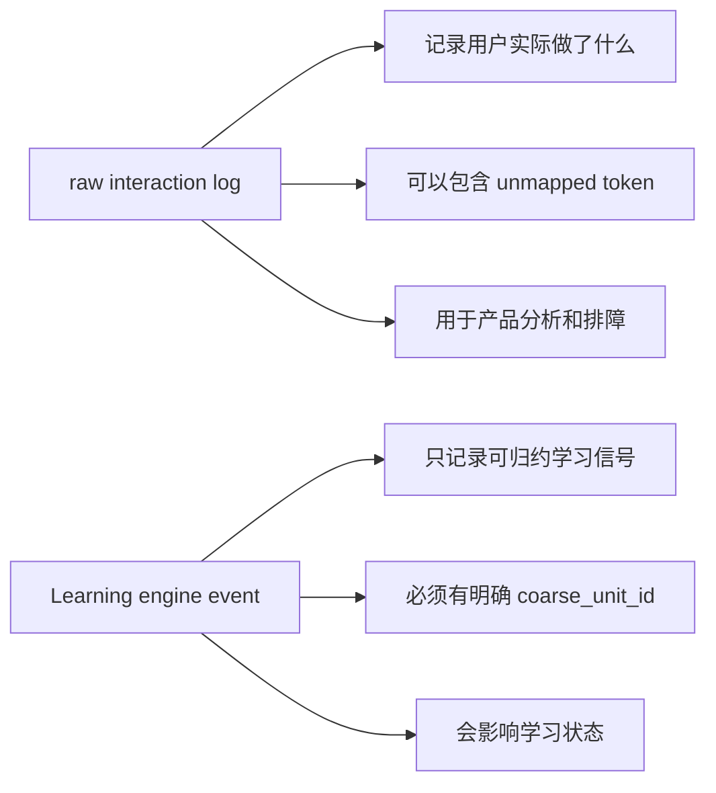

例如用户点击了一个无法映射的字幕词：

- analytics 需要知道用户点了它；
- Learning engine 不应该把它当学习事件。

所以 raw interaction log 是“事实流水”，Learning engine event 是“可用于学习状态归约的标准信号”。

## 8. 弹窗反馈和加入练习

lookup 弹窗里可能会有几个轻按钮：

```text
认识
有点模糊
不认识
加入练习
```

它们也可以走同一套互动上报语义，但后端分流不同。

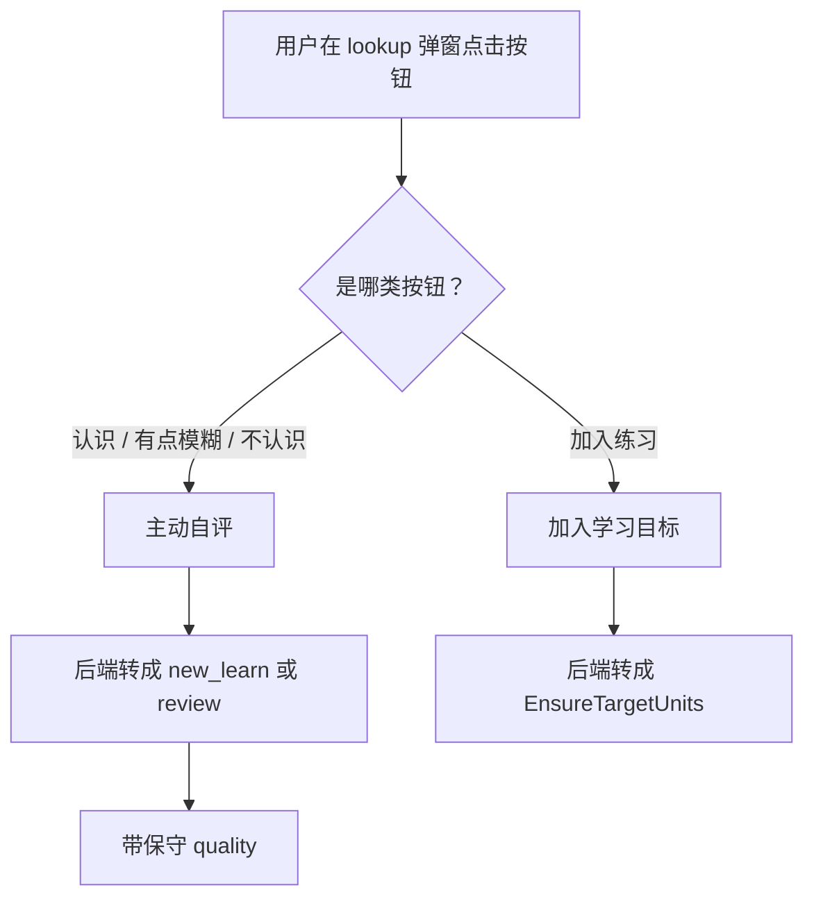

语义上：

- “认识 / 有点模糊 / 不认识” 是主动自评，不是自动信号；
- 它们可以转成强学习事件，但要保守，不能直接代表 mastered；
- `new_learn` 还是 `review` 应由后端根据用户状态判断；
- “加入练习” 不是学习事件，它是把这个 unit 加入学习目标范围。

## 9. quiz：习题答题上报

习题答题也是学习互动的一部分，但它和 exposure、lookup 的语义不同。

exposure 和 lookup 是弱信号。答题结果是强信号，因为它直接验证用户是否能回忆或理解某个学习单元。

在 Learning engine 里，测验型验证应该写成：

```text
event_type = quiz
```

### 9.1 前端上报答题事实，不上报学习结论

前端不应该直接判断“用户掌握了这个单元”或“这个单元 quality = 4”。前端只需要如实上报用户答题事实，例如：

- 用户答的是哪道题；
- 属于哪次测验；
- 用户选择了哪个选项或输入了什么；
- 是否跳过；
- 用了多久；
- 发生在什么时间。

后端再根据题目的标准答案、题型、难度和答题结果，决定：

- 是否正确；
- 这次答题质量如何；
- 是否能转成 Learning engine 的 `quiz` 事件；
- `quiz` 事件应该绑定哪个 `coarse_unit_id`；
- metadata 里保留哪些题目、视频、Recommendation 或上下文来源信息。

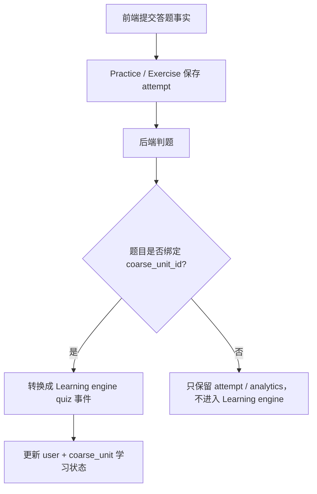

### 9.2 Practice attempt 和 Learning event 不是一回事

习题系统至少有两层语义：

- **attempt**：用户对某一道题的实际作答事实。
- **Learning engine event**：后端从 attempt 中归约出来的标准学习事件。

attempt 可以保存完整答题细节。Learning engine event 只保存能用于学习状态归约的标准信号。

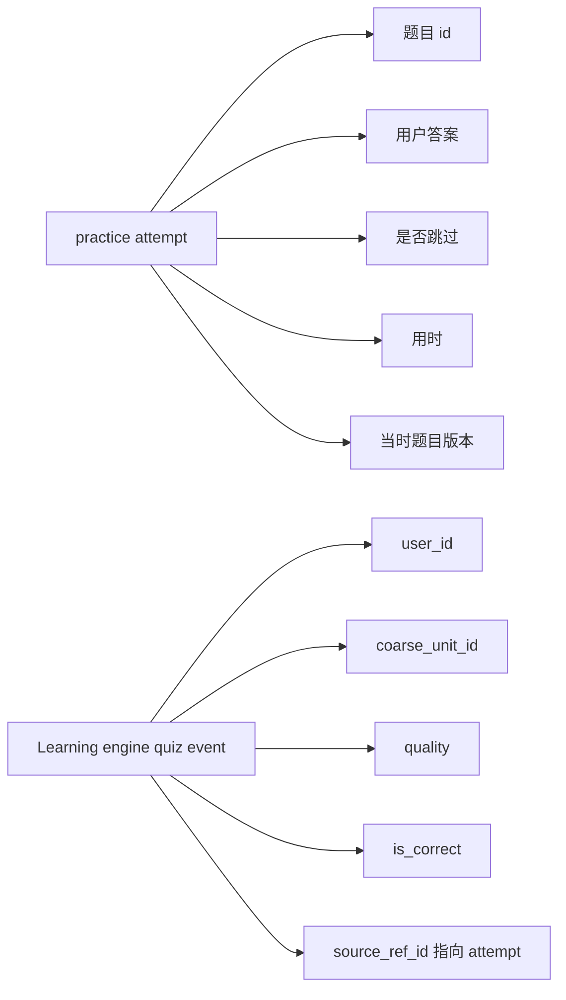

不要把完整题目、选项、用户答案都塞进 Learning engine。Learning engine 是学习状态系统，不是题库或答题记录系统。

### 9.3 quiz 必须有明确学习对象

`quiz` 事件必须绑定明确的 `coarse_unit_id`。

这和 lookup 的规则一致：如果某个行为不能映射到学习单元，就不能进入 Learning engine。

对习题来说，正常情况下题目本身就应该已经绑定了学习单元：

- per 单元题绑定 `coarse_unit_id`；
- per 视频 * 单元题绑定 `video_id + coarse_unit_id`。

因此，答题结果通常可以稳定转成 `quiz`。如果某道题缺少稳定 unit 绑定，它只能作为题目 attempt 或 analytics 保存，不能更新学习状态。

### 9.4 quiz 的来源可以不同

不同触发入口产生的答题，都可以归一化成 `quiz` 事件。

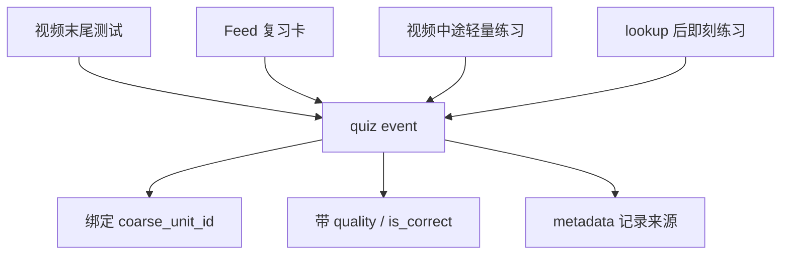

区别不在 `event_type`，而在来源信息：

- 视频末尾测试可以记录 video、recommendation run、quiz session；
- Feed 复习卡可以记录 review card session；
- 视频中途练习可以记录字幕句子、时间点、上下文题来源；
- lookup 后即刻练习可以记录 lookup 行为和题目来源。

这些来源信息用于审计、分析和排障，不应该改变 Learning engine 的核心聚合方式。

### 9.5 quiz 比自评更强

弹窗里的“认识 / 有点模糊 / 不认识”是主动自评。它有价值，但仍然比较主观。

题目答题是更强的反馈，因为用户必须完成一次验证。尤其是上下文题、迁移题、填空题，能比简单自评更可靠地判断用户是否理解该学习单元。

因此，后端归约学习状态时，`quiz` 应该被视为强事件。它可以更新记忆状态、复习参数、掌握程度和状态迁移。

## 10. 为什么前端只负责上报事实

前端不应该理解完整学习策略。否则后续规则一变，前端也要跟着改。

前端只需要回答：

```text
用户刚刚做了什么？
```

后端再回答：

```text
这个行为能不能映射到学习单元？
它是不是本轮 learning_units？
它应该只进 analytics，还是也进入 Learning engine？
它是弱事件、强事件，还是 target 控制？
```

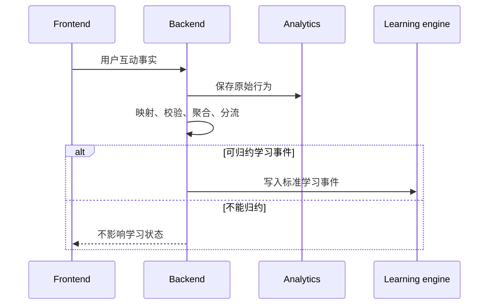

## 11. MVP 决策

MVP 阶段先定这些语义：

1. Feed 返回视频时，每个视频带 `learning_units`，约 1-8 个。
2. `learning_units` 是本轮视频学习的主范围。
3. exposure 只处理当前视频的 `learning_units`。
4. exposure 是弱信号，只表示“可能接触过”。
5. exposure 按观看 session 聚合，不逐 token 写。
6. lookup 可以上报所有字幕点击。
7. mapped lookup 进入 Learning engine。
8. unmapped lookup 只进入 analytics。
9. raw interaction log 是 analytics，不参与学习状态归约。
10. 前端只上报事实，后端负责解释和分流。
11. 弹窗自评是主动反馈，不是自动信号。
12. 加入练习是 target 控制，不是学习事件。
13. 习题答题先保存为 attempt，再由后端归约成 `quiz` 学习事件。
14. `quiz` 必须绑定明确的 `coarse_unit_id`，否则不进入 Learning engine。
15. 前端不上报学习结论，只上报题目答案、用时、跳过等答题事实。

## 12. 当前不讨论的内容

下面这些暂时不在本文档里定：

- 具体 API 长什么样；
- 具体表结构怎么设计；
- 前端如何批量上报和失败重试；
- analytics 数据存在哪里；
- Learning engine 写入是同步还是异步；
- lookup 是否需要停留时长阈值；
- 自评按钮最终 quality 是否要个性化；
- 题目练习 session、attempt 表和题库表如何设计；
- 每种题型如何映射 quality。

当前只先确定一条主线：

```text
Recommendation 告诉前端这个视频本轮学什么。
前端如实上报用户互动。
analytics 保存原始行为。
后端把能解释的行为转成标准学习事件。
Learning engine 只归约标准学习事件。
```
