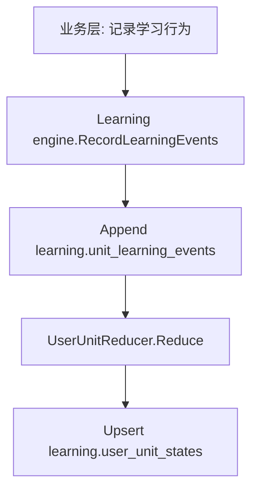
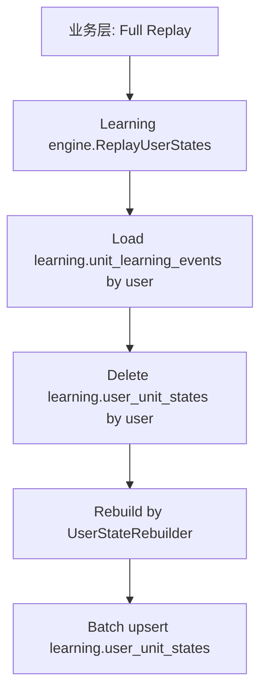
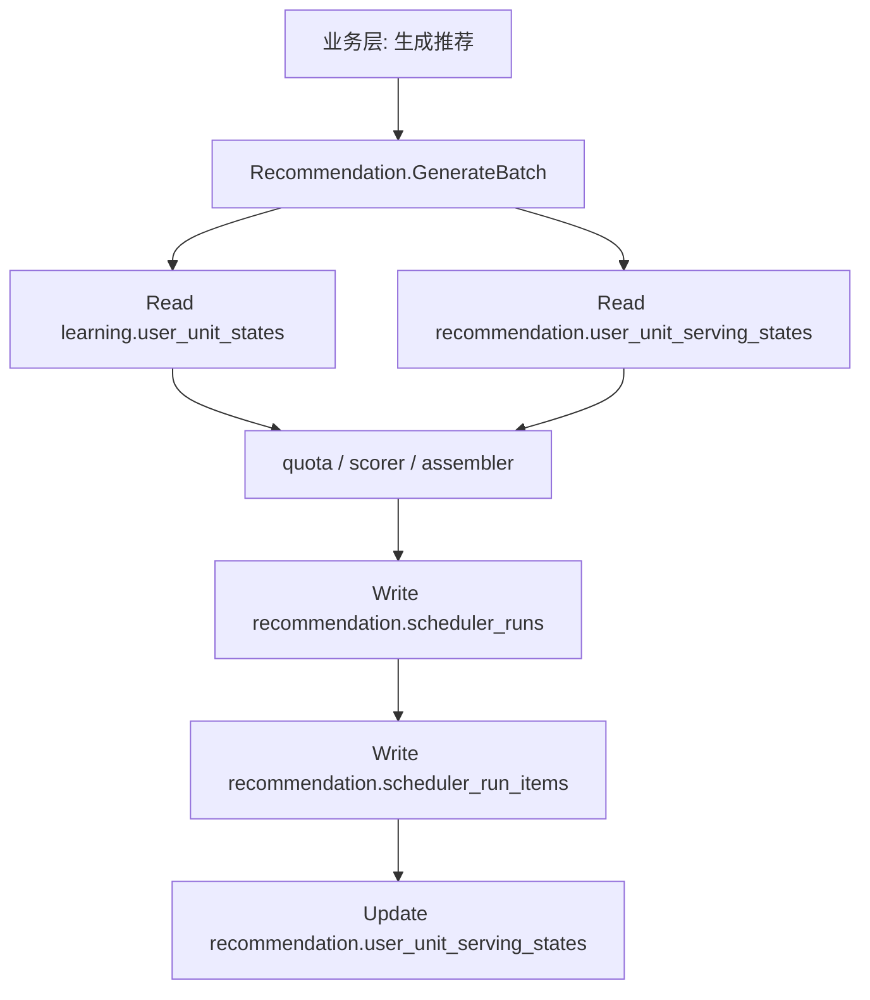

# 学习引擎与推荐系统最终重构方案

## 1. 背景与最终结论

当前仓库中的 `internal/recommendation/scheduler` 实际上混合了两类职责：

1. Learning engine 职责
   - 记录学习事件
   - 维护用户学习状态
   - replay 重建状态
2. Recommendation 职责
   - 读取状态生成推荐批次
   - 维护推荐运行审计
   - 维护“最近推荐过没有”这类推荐投放状态

这两类职责不应该继续放在同一个模块中。

最终重构结论是：

- `Learning engine` 维护学习事件与学习状态
- `Recommendation` 只读取 Learning engine 的业务表，不再维护 Learning engine 的业务表
- `Recommendation` 只维护自己使用的投放状态和审计表
- `target_*` 继续保留在 `learning.user_unit_states`
- `last_recommended_at` 必须从 `learning.user_unit_states` 迁出

这次方案按“不要向后兼容”的标准设计，不保留旧边界。

## 2. 最终模块边界

### 2.1 Learning engine

职责：

- 接收学习行为事件
- 维护学习事件真相层
- 维护用户学习状态总表
- 提供全量 replay
- 对外暴露读取状态的能力

明确不负责：

- 推荐批次生成
- 推荐运行审计
- 最近推荐时间维护
- 推荐去重/投放控制

### 2.2 Recommendation

职责：

- 读取学习状态
- 生成推荐批次
- 保存推荐运行快照
- 维护推荐域自己的 serving state

明确不负责：

- 写学习事件
- 写学习状态
- replay 学习状态

## 3. 最终数据表归属

最终表结构收敛为 5 张表。

### 3.1 Learning engine 持有

#### `learning.unit_learning_events`

定位：

- 学习行为事实真相层

说明：

- append-only
- 记录用户真实发生过的学习行为
- replay 的唯一事实来源

#### `learning.user_unit_states`

定位：

- 用户目标学习单元的完整学习状态总表

说明：

- 由 `unit_learning_events` 归约维护
- 只要某个 unit 进入学习目标范围，就在这张表里维护
- 既保存学习状态，也保存学习目标属性
- replay 的输出目标

这里要特别说明：

- `is_target / target_source / target_source_ref_id / target_priority` 继续保留在这张表里
- 这是有意设计，不是临时兼容

原因是：

- 系统只为“已进入学习目标范围”的 unit 建状态
- 先有学习目标，才有状态维护
- 在这个前提下，目标属性和状态属性属于同一个 Learning engine 聚合

### 3.2 Recommendation 持有

#### `recommendation.user_unit_serving_states`

定位：

- 推荐投放状态

说明：

- 例如 `last_recommended_at`
- 用于控制重复推荐、冷却时间、近期投放
- 这是 Recommendation 内部状态，不属于学习状态

#### `recommendation.scheduler_runs`

定位：

- 一次推荐批次的运行快照

说明：

- 用于审计、排障、解释

#### `recommendation.scheduler_run_items`

定位：

- 一次推荐批次内每个 item 的明细

说明：

- 保存 rank、score、reason codes 等

## 4. 为什么最终方案是 5 张表

最终保留的 5 张表是：

- `learning.unit_learning_events`
- `learning.user_unit_states`
- `recommendation.user_unit_serving_states`
- `recommendation.scheduler_runs`
- `recommendation.scheduler_run_items`

这里最关键的决定是：

- 不再新增 `learning.user_unit_targets`

原因不是“先简化”，而是逻辑上没有必要。

在当前业务定义里：

- 某个 `coarse_unit` 只有进入学习目标范围，系统才会为它建立状态
- 既然状态只为目标单元存在，那么目标属性和状态属性天然属于同一个 Learning engine 聚合

所以：

- `is_target`
- `target_source`
- `target_source_ref_id`
- `target_priority`

应继续保留在 `learning.user_unit_states`。

真正必须拆出去的只有：

- `last_recommended_at`

因为它不是学习状态，而是 Recommendation 的投放状态。

## 5. 每张表应该包含什么

## 5.1 `learning.unit_learning_events`

保留字段：

- `event_id`
- `user_id`
- `coarse_unit_id`
- `video_id`
- `event_type`
- `source_type`
- `source_ref_id`
- `is_correct`
- `quality`
- `response_time_ms`
- `metadata`
- `occurred_at`
- `created_at`

原则：

- 这是事实层
- 不做覆盖式更新
- 不承载推荐状态

## 5.2 `learning.user_unit_states`

最终保留字段：

- `user_id`
- `coarse_unit_id`
- `is_target`
- `target_source`
- `target_source_ref_id`
- `target_priority`
- `status`
- `progress_percent`
- `mastery_score`
- `first_seen_at`
- `last_seen_at`
- `last_reviewed_at`
- `seen_count`
- `strong_event_count`
- `review_count`
- `correct_count`
- `wrong_count`
- `consecutive_correct`
- `consecutive_wrong`
- `last_quality`
- `recent_quality_window`
- `recent_correctness_window`
- `repetition`
- `interval_days`
- `ease_factor`
- `next_review_at`
- `suspended_reason`
- `created_at`
- `updated_at`

必须删除的字段：

- `last_recommended_at`

说明：

- 这张表不再被定义为“纯状态投影表”
- 它被定义为“Learning engine 对用户目标学习单元的完整状态总表”

## 5.3 `recommendation.user_unit_serving_states`

MVP 建议字段：

- `user_id`
- `coarse_unit_id`
- `last_recommended_at`
- `last_recommendation_run_id`
- `created_at`
- `updated_at`

后续可扩展：

- `last_served_at`
- `last_exposed_at`
- `recent_recommend_count_24h`

## 5.4 `recommendation.scheduler_runs`

保留：

- `run_id`
- `user_id`
- `requested_limit`
- `generated_at`
- `due_review_count`
- `selected_review_count`
- `selected_new_count`
- `context`

## 5.5 `recommendation.scheduler_run_items`

保留：

- `run_id`
- `user_id`
- `coarse_unit_id`
- `recommend_type`
- `rank`
- `score`
- `reason_codes`

## 6. 最终代码模块结构

建议目录如下：

```text
internal/
  learningengine/
    application/
      command/
      dto/
      repository/
      service/
      usecase/
    domain/
      aggregate/
      enum/
      model/
      policy/
      rule/
      service/
    infrastructure/
      config.go
      db.go
      migration/
      persistence/
        mapper/
        query/
        queryctx/
        repository/
        sqlcgen/
        tx/

  recommendation/
    application/
      command/
      dto/
      query/
      repository/
      usecase/
    domain/
      enum/
      model/
      service/
    infrastructure/
      config.go
      db.go
      migration/
      persistence/
        mapper/
        query/
        queryctx/
        repository/
        sqlcgen/
        tx/
```

核心原则：

- `learningengine` 和 `recommendation` 完全平级
- `recommendation` 不 import `learningengine` 的内部实现
- `recommendation` 只通过 repository / query 输入读取 Learning engine 的数据

## 7. 最终调用关系

## 7.1 Learning engine 写链路



说明：

- 事件先写入真相层
- 状态再按 reducer 归约维护
- 两者必须同事务

## 7.2 Learning engine replay 链路



说明：

- MVP 只支持 full replay
- 不支持 scoped replay
- 不支持增量 replay

## 7.3 Recommendation 读链路



说明：

- Recommendation 只读 Learning engine 数据
- Recommendation 自己维护 serving state 和 run 审计

## 8. `last_recommended_at` 的最终处理

这是当前最容易混淆的字段。

结论：

- `last_recommended_at` 不能再留在 `learning.user_unit_states`
- 它必须迁移到 `recommendation.user_unit_serving_states`

原因：

- 它不是学习事件
- 它不是学习状态
- 它是 Recommendation 的投放状态

### 8.1 为什么不能留在 Learning engine

如果还留在 `learning.user_unit_states`，会导致：

- Learning engine 必须感知 Recommendation 行为
- replay 语义被污染
- 学习状态表混入推荐域字段
- owner 不清晰

### 8.2 Recommendation 如何使用它

推荐评分阶段：

- review scorer 读取 `last_recommended_at`
- new scorer 读取 `last_recommended_at`

推荐批次成功写入后：

- Recommendation 自己更新 `recommendation.user_unit_serving_states.last_recommended_at`

这就是完整闭环。

## 9. `is_target / target_*` 的最终处理

这 4 个字段继续保留在 `learning.user_unit_states`：

- `is_target`
- `target_source`
- `target_source_ref_id`
- `target_priority`

原因：

- 在当前业务定义里，状态只为目标学习单元存在
- 先有学习目标，才有状态维护
- 因此目标属性和状态属性属于同一个 Learning engine 聚合

所以这里的边界不是：

- “纯状态”和“目标”必须拆表

而是：

- “Learning engine 聚合”和“Recommendation 投放状态”必须拆开

Recommendation 在生成批次时：

- 从 `learning.user_unit_states` 读“该不该学、优先级多少、学得怎样”
- 从 `recommendation.user_unit_serving_states` 读“最近是否推荐过”

这已经足够形成清晰边界。

## 10. 现有代码对应的重构动作

## 10.1 从 Recommendation 中搬走的代码

这些代码应该迁到新模块 `internal/learningengine`：

- 事件记录 usecase
- replay usecase
- `UserUnitReducer`
- 弱事件规则
- 强事件规则
- SM-2
- 状态迁移
- progress/mastery
- `unit_learning_events` repository
- `user_unit_states` repository

当前仓库里对应的大致位置是：

- `internal/recommendation/scheduler/application/usecase/record_events_and_update_state.go`
- `internal/recommendation/scheduler/application/usecase/replay_user_unit_states.go`
- `internal/recommendation/scheduler/domain/aggregate/user_unit_reducer.go`
- `internal/recommendation/scheduler/domain/rule/*`
- `internal/recommendation/scheduler/domain/service/sm2_updater.go`
- `internal/recommendation/scheduler/domain/service/status_transitioner.go`
- `internal/recommendation/scheduler/domain/service/progress_calculator.go`
- `internal/recommendation/scheduler/domain/service/mastery_calculator.go`

## 10.2 留在 Recommendation 的代码

这些代码保留在 `internal/recommendation`：

- `GenerateLearningUnitRecommendations`
- `BacklogCalculator`
- `QuotaAllocator`
- `ReviewScorer`
- `NewScorer`
- `PriorityZeroExtractor`
- `RecommendationAssembler`
- `scheduler_runs` repository
- `scheduler_run_items` repository
- 新增 `user_unit_serving_states` repository

## 10.3 必须删除的旧混合设计

重构时应直接删除：

- `learning.user_unit_states` 里的 `last_recommended_at`
- Recommendation 侧对学习事件和学习状态的写入能力
- Recommendation 侧的 replay 入口

## 11. 数据迁移方案

因为要求“不做向后兼容”，迁移方案应直接分成硬切换步骤。

### 第一步：创建新表

新增：

- `recommendation.user_unit_serving_states`

### 第二步：迁出字段

从 `learning.user_unit_states` 迁出：

- `last_recommended_at`

迁移规则：

- 全部迁到 `recommendation.user_unit_serving_states`

### 第三步：改代码 owner

- `record events / replay / reducer` 全部移入 `learningengine`
- `recommendation` 改成只读 Learning engine 表

### 第四步：删除旧列

确认新代码全量切换后，直接删除 `learning.user_unit_states.last_recommended_at`。

不要保留兼容列。

## 12. 推荐评分输入的最终来源

最终 Recommendation 中不同信号的来源应是：

### Learning engine 信号

来源：

- `learning.user_unit_states`

例如：

- `is_target`
- `target_priority`
- `target_source`
- `status`
- `progress_percent`
- `mastery_score`
- `next_review_at`
- `last_quality`
- `consecutive_wrong`

### Recommendation 投放信号

来源：

- `recommendation.user_unit_serving_states`

例如：

- `last_recommended_at`

## 13. 为什么这是最终最优结构

因为它把真正需要拆开的 owner 拆开了：

1. 发生了什么
   - `learning.unit_learning_events`
2. 这个目标学习单元当前处于什么状态
   - `learning.user_unit_states`
3. Recommendation 最近怎么投放过
   - `recommendation.user_unit_serving_states`
4. 为什么这次推荐了这些内容
   - `recommendation.scheduler_runs`
   - `recommendation.scheduler_run_items`

同时：

- Learning engine replay 只重建学习域数据，不会误改 Recommendation 投放状态
- Recommendation 可以自由调整 serving 规则，而不污染 Learning engine
- 表 owner 清晰
- 代码 owner 清晰
- 边界更贴近真实业务

## 14. 最终结论

如果以“严格权责分离”为标准，最终方案不是继续在当前 `scheduler` 模块里混放所有能力，而是拆成两个平级模块：

- `Learning engine`
- `Recommendation`

并将 5 张表按 owner 明确划分：

- 学习事实 -> `learning.unit_learning_events`
- 学习状态总表 -> `learning.user_unit_states`
- 推荐投放状态 -> `recommendation.user_unit_serving_states`
- 推荐运行审计 -> `recommendation.scheduler_runs`
- 推荐明细审计 -> `recommendation.scheduler_run_items`

在这个最终版本里：

- `target_*` 保留在 Learning engine
- `last_recommended_at` 迁到 Recommendation

这就是当前业务定义下最稳定、最可维护的边界。
