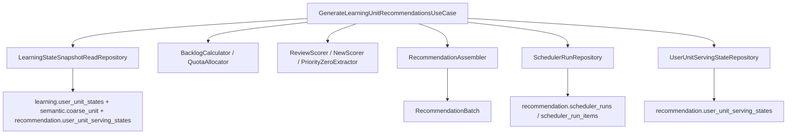

# 学习内容推荐模块实施说明

本文档描述当前 **Recommendation 模块** 的真实代码结构与实施方式。

对应代码目录：

- [internal/recommendation/README.md](/Users/evan/Downloads/learning-video-recommendation-system/internal/recommendation/README.md)
- [internal/recommendation/scheduler/README.md](/Users/evan/Downloads/learning-video-recommendation-system/internal/recommendation/scheduler/README.md)
- [internal/recommendation](/Users/evan/Downloads/learning-video-recommendation-system/internal/recommendation)

## 1. 当前模块目标

当前 Recommendation 只负责一件事：

- 读取 Learning engine 的状态输入，生成一轮推荐批次，并维护 Recommendation 自己的投放状态与审计表

当前模块不再负责：

- 写 `learning.unit_learning_events`
- 写 `learning.user_unit_states`
- replay 学习状态
- SM-2 / 状态迁移 / progress / mastery

这些能力都已经迁到：

- [学习引擎设计文档.md](/Users/evan/Downloads/learning-video-recommendation-system/docs/学习引擎设计文档.md)
- [internal/learningengine](/Users/evan/Downloads/learning-video-recommendation-system/internal/learningengine)

## 2. 当前目录结构

```text
internal/recommendation/
  README.md
  scheduler/
    README.md
    application/
      command/
      dto/
      query/
      repository/
      usecase/
    domain/
      enum/
      model/
      service/
    infrastructure/
      config.go
      db.go
      migration/
      persistence/
        mapper/
        query/
        queryctx/
        repository/
        schema/
        sqlcgen/
        tx/
    test/
      integration/
```

理解这套结构时，记住一句话：

- `recommendation` 根目录负责模块边界和子模块组织
- `scheduler/domain` 放推荐规则
- `scheduler/application` 放用例编排
- `scheduler/infrastructure` 放 SQL 和落库
- `scheduler/test` 证明 Recommendation 只读 Learning engine、只写 Recommendation

## 3. 当前分层职责

## 3.1 `domain`

Recommendation 领域层当前只保留推荐规则：

- `BacklogCalculator`
- `QuotaAllocator`
- `ReviewScorer`
- `NewScorer`
- `PriorityZeroExtractor`
- `RecommendationAssembler`

这里不再出现：

- 事件处理
- reducer
- replay

## 3.2 `application`

当前 Recommendation 只有一个主用例：

- [generate_recommendations.go](/Users/evan/Downloads/learning-video-recommendation-system/internal/recommendation/scheduler/application/usecase/generate_recommendations.go)

它负责：

1. 读取 due review 候选
2. 读取 new 候选
3. 计算 backlog 与 quota
4. 分别打分
5. 提取 P0
6. 组装 `RecommendationBatch`
7. 在同一事务里写：
   - `recommendation.scheduler_runs`
   - `recommendation.scheduler_run_items`
   - `recommendation.user_unit_serving_states`

## 3.3 `infrastructure`

这里只负责：

- 读取 `learning.user_unit_states`
- 读取 `semantic.coarse_unit`
- 读写 `recommendation.user_unit_serving_states`
- 读写 `recommendation.scheduler_runs`
- 读写 `recommendation.scheduler_run_items`

这里不允许重新实现业务规则。

## 4. 真实调用链

当前 Recommendation 主链路如下：



## 5. 当前数据 owner

Recommendation 当前只拥有 3 张表：

- `recommendation.user_unit_serving_states`
- `recommendation.scheduler_runs`
- `recommendation.scheduler_run_items`

Recommendation 当前只读取、不写：

- `learning.user_unit_states`
- `semantic.coarse_unit`

`last_recommended_at` 的唯一 owner 已经切到：

- `recommendation.user_unit_serving_states.last_recommended_at`

不再允许从 `learning.user_unit_states` 读取这个字段。

## 6. 当前 SQL 结构

当前 SQL 已按 Recommendation 自己的主题拆分：

- [candidates.sql](/Users/evan/Downloads/learning-video-recommendation-system/internal/recommendation/scheduler/infrastructure/persistence/query/candidates.sql)
- [serving_states.sql](/Users/evan/Downloads/learning-video-recommendation-system/internal/recommendation/scheduler/infrastructure/persistence/query/serving_states.sql)
- [scheduler_runs.sql](/Users/evan/Downloads/learning-video-recommendation-system/internal/recommendation/scheduler/infrastructure/persistence/query/scheduler_runs.sql)

其中：

- `candidates.sql` 只做候选读取
- `serving_states.sql` 只做 serving state upsert
- `scheduler_runs.sql` 只做 run / run item 审计写入

## 7. 当前工程工作流

## 7.1 sqlc

当前全仓只剩 Learning engine 与 Recommendation 两套 `sqlc` 配置块。

可用命令：

- `make sqlc-generate`
- `make learningengine-sqlc-generate`
- `make recommendation-sqlc-generate`

## 7.2 migration

当前 migration 入口已经拆开：

- `make learningengine-migrate-up`
- `make learningengine-migrate-down`
- `make learningengine-migrate-version`
- `make recommendation-migrate-up`
- `make recommendation-migrate-down`
- `make recommendation-migrate-version`

这两套命令会自动附加不同的 migration tracking table：

- `learningengine_schema_migrations`
- `recommendation_schema_migrations`

这是必须的，因为两个模块共用同一个数据库，但 migration owner 已经分离。

补充边界：

- 如果当前数据库还没应用新 migration 根，直接执行 `*-migrate-version` 可能返回 `no migration`
- 这表示新的 tracking table 尚未建立，不表示命令本身不可用

## 7.3 统一验收

当前统一验收命令仍是：

- `make check`

它覆盖：

- `sqlc generate`
- `fmt-check`
- `go vet`
- `staticcheck`
- `go test ./...`

## 8. 当前测试策略

## 8.1 领域测试

Recommendation 领域测试覆盖：

- quota
- scorer
- assembler

对应目录：

- [internal/recommendation/scheduler/domain/service](/Users/evan/Downloads/learning-video-recommendation-system/internal/recommendation/scheduler/domain/service)

## 8.2 集成测试

Recommendation 集成测试重点验证 4 件事：

1. candidate query 正确读取 serving state
2. Recommendation 执行后不修改 `learning.*`
3. run / run_items 能正确落库
4. `last_recommended_at` 有正式写回闭环

对应目录：

- [internal/recommendation/scheduler/test/integration](/Users/evan/Downloads/learning-video-recommendation-system/internal/recommendation/scheduler/test/integration)

所有集成测试都遵守：

- 不使用已有用户数据
- 测试自建用户、自建 coarse unit
- 测试结束后清理

## 9. 新人建议阅读顺序

如果你第一次接手 Recommendation，建议按这个顺序读：

1. [internal/recommendation/scheduler/README.md](/Users/evan/Downloads/learning-video-recommendation-system/internal/recommendation/scheduler/README.md)
2. [学习调度系统设计.md](/Users/evan/Downloads/learning-video-recommendation-system/docs/学习调度系统设计.md)
3. [generate_recommendations.go](/Users/evan/Downloads/learning-video-recommendation-system/internal/recommendation/scheduler/application/usecase/generate_recommendations.go)
4. `domain/service/*`
5. `infrastructure/persistence/query/*`
6. `test/integration/*`

## 10. 不该做什么

以后继续改 Recommendation 时，不要再做这些事：

- 不要把 Learning engine 的规则搬回 Recommendation
- 不要重新往 `learning.user_unit_states` 加推荐字段
- 不要在 repository 或 SQL 里写评分逻辑
- 不要恢复旧 `scheduler` 路径
- 不要把两个 migration 根重新合并成一套
