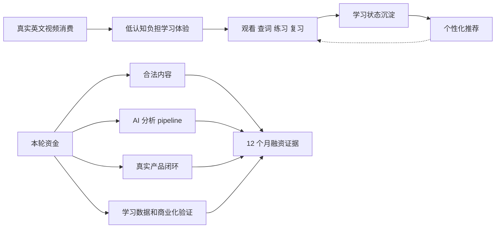
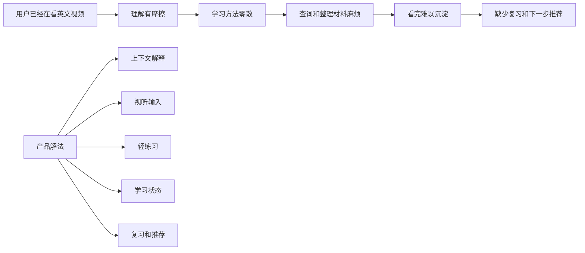
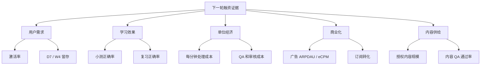

# 短视频语言学习平台融资 Memo

> 项目机会、产品闭环

## Executive Summary

本文是一份面向投资人的融资 memo，用于说明当前项目的机会、已有基础、关键缺口、融资用途、关键能力补强和 12 个月路线。

本文不是正式产品规格，也不是工程实现计划。它的目标是帮助读者快速判断：

- 这个项目解决什么问题；
- 当前已经形成了哪些产品和系统基础；
- 下一阶段最重要的缺口是什么；
- 融资会优先用在哪里；
- 12 个月后应该用哪些指标判断进展。

本文适合作为 pitch deck、one-pager、融资 FAQ 和团队能力计划的文字底稿。

本文采用一个对外沟通口径：

> 已经完成设计、边界清楚、产品路径明确的部分，可以在投资人叙事中按“已经成立的基础”来表达；真正需要融资解决的是内容、生产化、真实数据、学习效果、增长和商业化验证。

换句话说，当前不是在 pitch 一个“还没想清楚的点子”，而是在 pitch 一个已经有产品形态、内容处理雏形、学习状态引擎和推荐系统骨架的项目，下一阶段需要资金把它推到真实市场。

### 一句话定位

这是一个以短视频内容为入口、以字幕理解和互动练习为过程、以学习状态和个性化推荐为核心的 AI 语言学习平台。

用户不是从传统课程、词表或题库开始学习，而是从自己愿意看的视频内容进入学习。系统在观看过程中提供字幕理解、查词、原句重放、练习题、学习沉淀和推荐反馈，把一次性内容消费转化为可积累、可复习、可个性化推荐的学习资产。

产品的核心不是把 AI 分析结果直接丢给用户，而是把视频理解、重点表达提取、上下文解释、轻练习、复习和推荐包装成一个低认知负担的学习流程。用户只需要继续看自己感兴趣的视频，系统在合适的时机把解释、练习和复习自然送到面前。

### 当前已经形成什么基础

当前项目已经形成几项关键基础，下一阶段要用真实用户、真实内容和真实数据验证商业假设：

1. 移动端体验路径成立：内容流、沉浸式播放、字幕互动、查词、选择题、学习列表和个人空间已经形成清晰产品形态。
2. 内容可以被转化为学习资产：普通视频可以被转写、切片，变成字幕、关键表达、语境解释和练习题，并进入可推荐的内容资产库。
3. 学习状态建模方向清楚：系统不是只记录用户看过什么，而是要把观看、查词、答题和复习转化成学习进度。
4. 推荐逻辑区别于普通内容流：系统不是只推荐热门视频，而是围绕用户学习状态、兴趣和当前学习目标生成可解释的视频学习计划。
5. 学习流程产品化方向清楚：复杂的视频分析、解释、练习和复习由系统组织，用户侧保持轻量、连续、可碎片化。
6. 商业化入口清楚：平台内容流天然适合广告变现，订阅会员提供进阶学习和去广告权益，用户上传或提交链接可以作为增值实验。

### 下一笔资金要解决什么

下一笔资金不是用来探索方向，而是用来解锁五件事：

1. 扩大合法、高质量、可持续的视频内容供给。
2. 把脚本化 AI 内容处理链路升级成可规模化、可审核的 AI 分析 pipeline 和学习资产生成系统。
3. 上线真实产品闭环，让观看、查词、答题、收藏、复习和推荐进入真实数据流。
4. 建立学习信号、进度量化、推荐优化和学习效果验证体系。
5. 验证留存、广告承载、订阅转化和市场定位。

### 12 个月后的目标状态

融资后 12 个月，项目应该从“核心体验和系统骨架已经成立”推进到：

- 有稳定合法内容进入系统；
- 有一批真实用户完成观看、查词、练习、复习和学习沉淀；
- 有真实用户行为进入数据闭环，被解释成学习状态，并反过来驱动个性化推荐；
- 有可解释的学习进度指标和早期学习效果证据；
- 有初步商业化验证，尤其是内容流广告承载和订阅转化；
- 有可衡量的内容处理成本、质量通过率和题目生成通过率；
- 有明确的早期 ICP、留存数据和下一轮融资触发条件。

### 投资判断摘要

| 问题           | 当前回答                                                               |
| -------------- | ---------------------------------------------------------------------- |
| 当前阶段       | 核心产品路径和系统基础已经收敛，仍需真实用户、真实内容和真实商业化验证 |
| 本轮资金买什么 | 真实内容、真实产品、真实学习数据、广告 / 订阅验证和学习资产生成能力    |
| 最大风险       | 内容供给、学习效果、单位经济、留存和商业化效率                         |
| 12 个月目标    | 验证一个可重复的早期用户和商业化闭环，并形成下一轮融资所需的数据证据   |

投资判断可以用一张图概括：

## 第一部分：产品机会与市场切入

### 1. 用户痛点

大量语言学习者已经在看英文视频、剧集、访谈、播客、课程、YouTube 或 B 站内容，但这些观看行为通常很难沉淀为学习成果。

典型问题是：

- 看完就过去了，没有形成词汇、表达或句子的长期记忆；
- 遇到不懂的词或短语，需要跳出播放器去查；
- 字幕能帮助理解，但不能自动变成练习和复习；
- 用户很难知道自己到底掌握了什么、还需要复习什么；
- 用户即使用 AI 工具，也需要自己复制上下文、判断重点、整理材料、生成练习和安排复习；
- 内容平台知道用户喜欢看什么，但不知道用户学到了什么；
- 传统学习产品能做练习和打卡，但内容不够真实，启动门槛高。

更具体地说，早期用户的痛点不是“不想学”，而是：

- 觉得 Duolingo / 多邻国类产品太基础，适合入门和打卡，但很难支撑中高阶进阶；
- 知道应该多听、多看、多在上下文里学表达，但实际学习时仍容易退回死背单词；
- 认可大模型（LLM）很强，但懒得自己复制上下文、设计提问方式、整理解释、生成题目和安排复习；
- 觉得学习本身痛苦，只有当学习嵌入感兴趣的视频和短内容时，认知负担才会明显下降；
- 知道真实语境学习有效，但找不到稳定、合适、难度匹配、可持续使用的学习资源。

这个项目切入的不是“再做一个播放器”，而是解决一个更具体的问题：

> 如何把用户本来就愿意看的真实视频内容，转化成可理解、可练习、可复习、可推荐的个性化学习路径。

真正的机会不是让用户多操作一个 AI 学习工具，而是把原本高摩擦的“看视频、理解上下文、查表达、做练习、安排复习、寻找下一条材料”框架化成自动学习流程。用户感受到的是轻量、有趣、适合碎片化时间的观看体验，系统在后台完成内容分析、学习判断和复习推荐。

用户痛点和产品解法可以简化成：

### 2. 为什么现在是机会

这个机会现在更成熟，是因为几个条件同时出现：

- 用户已经习惯用短视频、播客、剧集和碎片化内容获取语言输入；
- 移动端交互可以自然承载全屏播放、字幕、查词、原句重放和轻练习；
- AI 模型降低了解释、总结、题目生成和内容结构化的成本；
- 但单次 AI 解释会越来越商品化，真正有价值的是长期内容资产和学习状态；
- 传统语言学习产品仍偏课程、词表、闯关和题库，真实内容语境不足；
- 内容平台虽然有海量视频，却缺学习状态、复习、题目和效果验证。
- 用户对 AI 学习的接受度提高了，但大多数人仍不会把大模型稳定地变成自己的学习流程；
- 中高阶学习者不再满足于入门打卡产品，需要更真实、更有上下文、更贴近兴趣的输入；
- 碎片化内容消费已经成为习惯，产品可以把原本的内容消费时间转化为低摩擦学习时间。

因此，机会不在于“给视频加一个 AI 按钮”，而在于把真实内容、AI 内容处理、学习状态、互动练习和推荐系统组织成一个持续运转的学习闭环。

### 3. 第一目标用户

早期不应该把目标用户讲成“所有语言学习者”。更清晰的第一市场是：

> 已经在看英文视频、剧集、访谈、课程或社媒内容，但理解和沉淀效率不高的中高阶语言学习者。

这个人群有几个特点：

- 已经有真实内容消费习惯，不需要教育他们为什么要看英文内容；
- 已经感受到字幕、查词、反复听和记录表达的价值；
- 不满足于传统课程和词表，希望用自己感兴趣的内容学习；
- 对去广告、进阶练习、学习报告或个性化处理有潜在付费意愿；
- 比初学者更能感受到真实语境、口音、表达和上下文解释的价值。

可以进一步拆成三类早期 ICP：

| 用户类型                 | 核心需求                       | 适合验证什么                 |
| ------------------------ | ------------------------------ | ---------------------------- |
| 英文视频重度消费者       | 看得懂一部分，但缺沉淀和复习   | 内容流留存、查词、收藏和复习 |
| 留学 / 考试 / 职场学习者 | 需要真实听力、表达和场景输入   | 学习效果、题目和进度指标     |
| 有自选内容的人           | 想学自己喜欢的视频、课程或播客 | 个性化增值需求               |

早期的市场叙事不应是“我们服务所有想学英语的人”，而应是：

> 我们先服务已经有真实英文内容消费行为的人，把低效率观看转化成可沉淀、可练习、可复习的学习体验。

### 4. 初步商业模型假设

商业化不应写成复杂收入清单。早期主线可以收敛为“内容流广告 + 订阅会员”，用户自选内容处理作为增值实验保留。

| 入口                  | 商业化逻辑                                                       | 验证阶段                                   |
| --------------------- | ---------------------------------------------------------------- | ------------------------------------------ |
| 内容流广告            | 类似短视频平台，在免费学习内容流中承载广告，补贴内容和 AI 成本   | 公测期验证广告承载、eCPM、广告对留存的影响 |
| 订阅会员              | 去广告、更多内容、进阶练习、学习报告、复习系统和更多 AI 分析额度 | 3-6 个月验证订阅转化                       |
| 用户上传 / 链接处理   | 把自己真正想看的视频变成学习材料，作为按次或额度增值项           | 3-6 个月验证是否值得继续投入               |
| 机构 / 创作者批量处理 | 把课程、培训或内容库批量转成学习资产                             | 6-12 个月后作为扩展方向验证                |

### 5. 替代方案与差异化

投资人通常会把项目与 Duolingo、YouTube、B 站、Anki、字幕工具、ChatGPT 和口语工具比较。对外沟通时，不需要否认这些产品的价值，而要讲清组合差异。

| 替代方案                | 它解决什么               | 它缺什么                                                     | 本项目差异                               |
| ----------------------- | ------------------------ | ------------------------------------------------------------ | ---------------------------------------- |
| Duolingo / 多邻国类产品 | 打卡、低门槛练习、游戏化 | 偏入门、偏打卡，真实语境和中高阶进阶不足                     | 用真实视频做入口，并把学习状态接回推荐   |
| YouTube / B 站          | 内容丰富，用户已有兴趣   | 没有学习状态、题目、复习和长期档案                           | 把内容消费转化为学习资产                 |
| Anki / 单词 App         | 记忆效率和间隔复习       | 缺真实视频语境和听力输入                                     | 从真实上下文中抽取关键表达，再沉淀到复习 |
| 字幕 / 查词工具         | 降低单次理解成本         | 不形成长期学习路径                                           | 每次查词和练习都会进入学习状态           |
| ChatGPT / Claude        | 单次解释强               | 能力强，但需要用户自己组织上下文、提问方式、材料、练习和复习 | 把一次解释变成长期学习系统的一部分       |
| 口语工具                | 发音和跟读训练           | 内容入口和学习推荐弱                                         | 后续把跟读、听力填空嵌入真实视频场景     |

差异化可以收敛成一句话：

> 单点 AI 解释容易复制，长期结构化内容资产、用户学习状态、行为数据和推荐闭环不容易复制。

## 第二部分：产品基础、学习闭环与未来升级

这一部分不再按功能清单展开，而是回答投资人最关心的问题：当前项目已经形成哪些基础能力，哪些地方仍是权宜之计，融资后要把哪些能力推到可验证状态，以及这笔钱具体花在哪里。

当前不是“只有想法”。产品入口、视频学习体验、字幕互动、原句重放、选择题、学习状态方向、推荐方向和 AI 视频处理链路已经收敛。第二部分要讲清的是：这些雏形如何升级成可以服务真实用户、真实内容、真实数据和真实商业化的能力体系。

读这一部分时，可以把它理解成 8 类能力升级：内容解决“学什么”，AI pipeline 解决“如何把视频变成学习资产”，学习进度量化解决“用户学到了什么”，推荐解决“下一步给什么”，产品形态解决“怎么低负担地学”，用户上传和链接处理解决“如何把用户自己的兴趣内容变成学习材料”，留存解决“为什么持续回来”，市场宣传解决“谁会先理解并传播”。

### 0. 第二部分总览：融资要升级的 8 类能力

| 能力模块                        | 为什么重要                                               | 当前状态与权宜之计                                                   | 融资后升级重点                                                     | 钱花在哪里                                                                           | 12 个月验证指标                                                       |
| ------------------------------- | -------------------------------------------------------- | -------------------------------------------------------------------- | ------------------------------------------------------------------ | ------------------------------------------------------------------------------------ | --------------------------------------------------------------------- |
| 内容供给与版权资产              | 内容是推荐、复习、留存、广告和订阅商业化的燃料           | 视频转学习资产的路径成立，但内容池仍小，授权和合作来源不足           | 从样本内容池升级到合法、多来源、多难度的视频资产池                 | 授权合作、创作者/机构合作、内容分级、审核和下架机制                                  | 可上线内容数、每周新增、内容覆盖、推荐候选池覆盖率                    |
| AI 分析 pipeline 和学习资产生成 | 决定普通视频能否稳定变成可理解、可练习、可复习的资产     | 单条处理链路跑通，但仍偏脚本化、本地化、人工校准                     | 从单条脚本升级到可批量、可审核、token 可管理的 pipeline            | 原始视频分析、clip 筛选、上下文解释、学习内容识别、mapping、题目生成、质检和缓存复用 | token 消耗/分钟、处理成功率、mapping 准确率、题目通过率、人工审核成本 |
| 学习进度量化                    | 决定产品能否证明用户真的学到了，而不是只证明用户看了视频 | 观看、查词、原句重放、答题、复习等行为边界清楚，但学习信号权重仍初步 | 从记录行为升级到解释学习信号、掌握度、遗忘和复习节奏               | 行为数据、指标体系、分析看板、学习效果实验、数据分析能力                             | 复习正确率、重复查词下降、掌握度增长、学习报告打开率                  |
| 推荐模块                        | 决定产品是否越用越懂用户                                 | 推荐方向清楚，但冷启动规则和真实数据实验仍不足                       | 从启发式推荐升级到真实学习状态驱动的推荐实验                       | 内容标签、用户画像、推荐策略、A/B test、推荐解释和审计                               | 推荐完成率、推荐后练习转化、策略实验提升、跳过率下降                  |
| 产品形态升级                    | 决定用户是否从“看懂”进入“练会”和“记住”                   | 字幕互动、原句重放、选择题方向清楚，但学习触发点还少                 | 从字幕/查词/选择题升级到跟读、字幕挖空、听力填空、复习卡、错题回收 | 移动端交互、题型体验、复习卡、跟读/听力形态、错题回收                                | 原句重放率、跟读尝试率、字幕挖空/听力填空完成率、复习卡打开率         |
| 用户上传 / 链接处理与增值商业化 | 把用户真正感兴趣的内容变成学习材料，天然具备付费价值     | 方向清楚，但任务队列、支付、进度、失败重试、版权和成本控制仍需补齐   | 从概念入口升级到可付费、可追踪、可退款、可控成本的增值处理服务     | 上传入口、链接解析、任务队列、支付额度、处理进度、失败重试、存储和合规               | 上传转化率、处理成功率、处理毛利、失败率、退款率                      |
| 留存与学习习惯                  | 决定产品是否形成长期学习关系                             | 内容入口低门槛，但即时反馈、打卡、学习报告和复习提醒还未系统化       | 从用户靠自律升级到即时反馈、复习提醒、学习报告驱动的习惯循环       | 多巴胺式即时反馈、声音/震动/微动画、streak、学习时长、学习报告、push                 | D1/D7/W4 留存、学习天数、即时反馈后继续学习率、复习率                 |
| 市场宣传与定位验证              | 决定用户是否快速理解新品类和愿意尝试                     | 差异化方向清楚，但哪种叙事、哪个 ICP、哪个渠道最有效仍未验证         | 从定位假设升级到可传播叙事、低成本获客和早期转化路径               | demo 页面、内容示例、社媒内容、小规模投放、社区/创作者合作、用户研究                 | landing 转化率、demo 完播率、激活率、订阅转化、CAC 初步区间           |

### 1. 内容供给与版权资产

#### 投资判断

内容供给决定推荐质量、学习覆盖、复习空间、广告承载、订阅价值和版权安全，是这个产品最核心的供给侧壁垒。

这个产品不是做一个有限课程库，而是把真实视频持续转化成学习材料。用户愿意打开，是因为内容本身有兴趣；用户愿意继续学，是因为这些内容被加工成可理解、可练习、可复习的资产。没有足够内容，推荐模块没有候选池；没有合法内容，广告和订阅商业化都很难放大；没有多样内容，中高阶用户很快会觉得重复和不够进阶。

第一大缺口就是内容供给。这个产品的入口是视频流，内容数量和质量决定了用户能不能留下来。推荐系统再聪明，也无法推荐不存在的视频；学习进度系统再精细，也需要足够多真实语境来承载同一个表达、同一个句型、同一个听力难点。

投资人应该把内容供给理解成“视频学习平台的库存系统”。库存不只是数量，还包括版权状态、难度、主题、口音、语速、场景、表达密度和适配用户。

一个更具体的例子是：同样是一条英文采访视频，普通内容平台只关心它是否好看、是否完播；这个产品还要判断它适合什么水平的人、里面有哪些值得学的表达、语速是否适合听力训练、能否拆成短 clip、能否生成复习材料、是否适合公开推荐和广告承载。内容供给的价值不是“有视频”，而是“有可学习、可推荐、可复用的视频资产”。

如果内容供给做得好，产品可以围绕不同人群形成内容组合：中高阶用户需要真实访谈、播客、职场表达和影视片段；考试或留学用户需要高频场景、听力材料和表达训练；泛兴趣用户需要短视频、文化内容和娱乐片段。不同内容组合会直接影响留存、广告空间和订阅价值。

#### 当前状态与权宜之计

当前不是没有内容能力，而是已经验证了“视频可以被加工成学习资产”：视频可以被转写、切分、结构化，关联到关键表达、解释和题目。

当前权宜之计是内容样本仍小，更多依赖可控样例和本地处理结果。这个阶段足以证明处理路径成立，但还不能证明内容供给可以支撑真实用户长期使用。真正进入市场后，内容池需要覆盖不同难度、主题、口音、场景和兴趣，否则推荐系统没有足够候选池，复习和练习也缺少真实语境。

另一个权宜之计是内容判断仍偏人工和经验。早期可以凭直觉判断哪些视频有趣、哪些表达值得学，但规模化后需要形成内容准入标准：什么视频适合初中级，什么视频适合中高阶，什么视频适合听力，什么视频适合表达学习，什么视频虽然热门但学习价值低。

如果内容库太小，问题会很快暴露：用户刷到重复内容，某些学习单元没有足够视频承载，不同兴趣、水平、口音和题材的用户无法被覆盖，推荐也会被迫在少量候选里打转。因此内容供给不是后续运营小事，而是产品能否进入真实市场的前置条件。

#### 核心缺口与未来升级

融资后要从“小样本内容池”升级到“合法、多来源、可持续扩张的视频学习资产池”。

重点不是简单堆视频数量，而是建立适合学习、适合推荐、适合复习、版权边界清楚的内容供给系统。平台公开内容池应优先使用授权内容、合作内容或自有可分发内容；用户上传和链接处理则定位为私人学习处理服务，不默认进入公开分发。

未来内容供给应该分层管理：公开可推荐内容用于内容流、广告和订阅；合作内容用于高质量学习场景和品牌安全；用户私人处理内容用于个性化需求验证；内部样例内容用于 pipeline 测试和 demo。不同层级的版权、缓存、展示和复用权限要分开。

融资后的优先级应该先解决“公开内容池是否能稳定扩大”，再解决“内容是否足够丰富和分层”。如果一开始就追求所有品类都覆盖，容易变成内容运营负担；更好的路径是先围绕 1-2 个核心 ICP 建内容密度，再扩展到更多主题和难度。

这部分投入不只是工程投入，也需要内容运营、版权合作和语言学习内容策划。工程师负责把内容接入和处理流程跑通，内容运营负责来源和节奏，版权合作负责合法可分发边界，语言学习内容策划负责判断哪些内容真正有学习价值。

#### 钱花在哪里

| 花钱方向                 | 目的                                         |
| ------------------------ | -------------------------------------------- |
| 内容授权和版权合作       | 建立可公开推荐、展示和复用的合法内容池       |
| 创作者、机构、课程方合作 | 获得垂直主题和高质量场景内容                 |
| 内容分级和准入标准       | 判断内容难度、学习价值、口音、语速和适配人群 |
| 内容审核和下架机制       | 控制版权、安全、品牌调性和质量风险           |
| 内容运营和教研顾问       | 判断哪些视频适合学习、练习、推荐和长期复用   |

#### 12 个月验证指标

- 可上线内容数量和每周新增内容数量；
- 内容覆盖的难度、主题、口音和场景数；
- 推荐候选池覆盖率；
- 单条内容平均观看、查词、答题和复习次数；
- 授权内容、合作内容和用户私人处理内容的边界清楚；
- 内容 QA 通过率和下架响应时长；
- 内容重复曝光率下降。

#### 投资人表达

> 我们已经有把视频加工成学习资产的路径，融资后第一优先级是扩大合法内容供给。内容越丰富，推荐、复习、广告和订阅商业化越有发挥空间。

### 2. AI 分析 pipeline 和学习资产生成

#### 投资判断

AI 分析 pipeline 决定普通视频能否稳定变成可理解、可练习、可复习的学习资产。

这个模块的价值不是“调用 LLM 解释字幕”，而是把原始视频变成结构化学习资产：哪些视频值得处理，哪些片段有趣，哪些表达值得学，哪些词和短语需要结合上下文解释，哪些学习单元应该被映射到视频片段和用户状态，哪些句子适合出题，哪些证据应该支撑解释和题目，哪些处理结果应该被质检或重跑。

投资人需要理解：AI 的能力本身会越来越普遍，但把 AI 放进稳定、可审核、可计成本、可复用的内容生产流程，才是产品化能力。这里也会产生较大的 token 消耗，尤其是长视频、上下文解释、题目生成和多轮质检；融资不是只为了省成本，而是为了在质量、规模和成本之间建立可控流程。

一个具体处理场景是：系统拿到一条 3 分钟视频后，先判断它是否适合学习，再切出有信息密度和趣味性的片段；随后识别片段中的关键表达、跨句搭配和上下文含义；再生成字幕解释、轻练习、复习卡和可能的听力填空；最后通过质检决定是否上线、是否需要人工抽检、是否需要重跑。用户看到的是轻量体验，背后其实是一条学习资产生产线。

这个 pipeline 还决定单位经济。公开视频可以被多次复用，适合投入更完整的分析；用户上传或链接处理更像高成本增值项，需要限制额度、控制处理深度或要求付费。不同内容类型应该对应不同处理深度，而不是所有视频都用同样昂贵的模型流程。

要商业化，这条流水线不能每一步都依赖最贵的大模型。低价值视频要先过滤，适合学习的片段再进入高质量处理；字幕生成或校准、词语和短语抽取、学习单元映射、上下文解释、题目生成、证据选择和质量校验要分层处理。简单任务可以交给小模型、规则或缓存，关键解释和高价值题目再使用更强模型。

#### 当前状态与权宜之计

当前不是“只会调用模型”，而是已经跑通单条视频从原始素材到学习资产的处理路径。它可以证明视频能被拆成片段、字幕、学习内容、上下文解释和题目。

当前权宜之计是流程仍偏脚本化、本地化和研发化，对大量视频、用户上传、失败重跑、版本回滚、质检和 token 消耗管理还不够生产化。少量样例可以靠人工判断质量，但内容规模扩大后，必须知道每一步的成功率、成本、耗时、错误类型和可复用程度。

现阶段另一个问题是资产质量还没有足够治理。视频切分是否有趣，解释是否真的结合上下文，题目是否过于机械，学习内容是否和用户状态匹配，这些都不能只靠模型输出，需要 pipeline 里的规则、质检、反馈和版本管理。

这里的核心矛盾是质量和成本。内容资产质量低，用户会失去信任；处理成本太高，广告和订阅很难覆盖。未来的 AI 内容处理流水线必须同时回答两个问题：能不能稳定生产高质量学习内容，以及能不能用可接受成本持续生产。

#### 核心缺口与未来升级

融资后要从“单条脚本处理”升级到“可批量、可审核、token 可管理的 AI 分析 pipeline”。

核心升级包括四段：

- 视频筛选、切片和字幕生成 / 校准：先判断视频和片段是否值得处理，再生成或校准可用字幕；
- 词语、短语和学习单元识别：抽取值得学习的词语、短语、搭配、句型和跨句表达；
- 学习单元映射、上下文解释和证据选择：把学习内容放回视频时间轴、字幕、片段和用户状态，并用原句和上下文支撑解释；
- 题目生成和学习资产封装：生成选择题、字幕挖空、听力填空、跟读提示和复习卡；
- 质量和 token 消耗控制：通过小模型、规则、缓存、复用、自动质检、人工抽检和失败重跑管理质量与成本。

未来这个模块应该像可控成本的 AI 内容工厂一样运行：每条视频进入后，系统能判断是否值得处理，选择处理深度，产出可上线学习资产，记录质量和成本，并允许后续根据用户反馈修正。

融资后的优先级应该先做“可批量处理 + 可质检 + 可计成本”，再追求更复杂的题型生成。否则题型越多，质量和成本越难控制。投资人更应该看到的是处理吞吐、质量通过率和单位成本，而不是单次 demo 中 AI 生成了多少内容。

这部分会成为长期壁垒，因为谁能用更低成本稳定生产高质量学习内容，谁就能更快扩大内容库，也更容易支撑广告、订阅和用户个性化处理。

#### 钱花在哪里

| 花钱方向                           | 目的                                                 |
| ---------------------------------- | ---------------------------------------------------- |
| AI 分析 pipeline 后台              | 把本地脚本变成可批量处理、可监控、可回滚的生产流程   |
| 原始视频分析和 clip 筛选           | 提前过滤低价值内容，避免浪费 token 和审核成本        |
| 上下文解释、学习内容识别和 mapping | 把学习内容和视频、字幕、片段、用户状态建立可追溯关系 |
| 题目生成和复习材料生成             | 把视频变成可练习、可复习的学习资产                   |
| 自动质检、人工抽检和版本管理       | 控制解释、题目、mapping 和内容上线质量               |
| token 消耗监控、缓存和复用         | 控制每分钟视频处理成本和高成本任务毛利               |

#### 12 个月验证指标

- 每分钟视频 token 消耗；
- 每分钟视频处理成本；
- 视频处理成功率和失败重跑率；
- clip 筛选通过率；
- 上下文解释通过率；
- mapping 准确率；
- 题目生成通过率；
- 人工审核成本；
- 内容从进入系统到可上线的平均耗时；
- 高成本处理任务毛利。

#### 投资人表达

> AI 不是壁垒本身，稳定地把视频分析成片段、上下文解释、学习内容、题目和复习材料才是壁垒。融资后我们要把单条处理链路升级成 AI 分析 pipeline。

### 3. 学习进度量化

#### 投资判断

学习进度量化决定产品能否证明用户真的在学习，而不是只证明用户看了很多视频。

这是语言学习产品和普通内容平台的关键分野。普通视频平台可以优化播放、停留和互动，但语言学习产品必须回答更难的问题：用户是否听懂了，是否记住了，是否还会忘，是否应该复习，是否应该进入更难内容。

如果没有学习进度量化，产品很容易退化成“带 AI 解释的视频工具”。如果能把行为转化成可信学习状态，后续推荐、复习、学习报告、订阅权益和长期壁垒都会建立在这套数据之上。

第三个核心难点是学习信号处理。用户在视频中产生的行为很多：看完、滑走、暂停、重放、点击字幕、打开解释、播放原句、点“练一下”、答题、标记已学会。这些行为很有价值，但它们并不天然等于学习进步。看过不代表注意到，点击不代表学会，停留很久可能是认真学习，也可能是走神，答对一道题也可能是猜中。

一个具体例子是：用户第一次点开某个表达的解释，只能说明他对这个表达有需求；如果用户随后完成相关题目，说明短期理解可能成立；如果三天后复习仍能答对，才更接近掌握；如果之后在类似视频里不再反复查同一表达，系统可以更有信心降低这个表达的复习优先级。学习进度量化就是把这些分散动作变成可解释的学习状态。

这类指标也会影响商业化。学习报告、掌握度、复习提醒和个性化推荐都可以成为订阅价值的一部分。用户愿意付费，不只是因为有更多视频，而是因为系统让他看到自己真的在进步。

#### 当前状态与权宜之计

当前不是没有数据基础，而是观看、查词、原句重放、答题、复习等行为边界已经清楚。这些行为可以成为学习信号的来源。

当前权宜之计是行为还不能天然等于学习进步。看过一个词不代表掌握，点开解释可能是不懂也可能只是好奇，答对题可能是真懂也可能是猜对。不加解释地统计行为，只能得到产品活跃数据，不能得到可信学习进度。

早期冷启动阶段只能先用规则、启发式权重和人工判断。比如查词是弱信号，查词后完成练习是更强信号，延迟复习还能答对是更强信号；连续跳过同类内容可能说明太难、太简单或不感兴趣，需要结合上下文判断。

未来需要建立学习信号解释模型，把原始行为转化为可量化的学习进度。例如，多次曝光是否代表熟悉，lookup 停留时长是否代表困难，答题用时和错误次数如何影响掌握度，跨多个视频的表现如何合并，什么时候应该复习，什么时候应该减少打扰。这不是单纯埋点工作，需要数据科学、学习科学和后端系统共同投入。

#### 核心缺口与未来升级

融资后要从“记录行为”升级到“解释学习信号、量化掌握度和复习节奏”。

系统需要判断哪些行为是弱学习证据，哪些行为能推进学习进度，哪些行为说明用户卡住，哪些行为应该触发复习、练习或下一次推荐。真实用户数据积累后，再逐步引入 A/B test、学习效果实验和机器学习指标。

这部分未来可以形成三层指标：行为层证明用户在使用，短期学习层证明用户在小单元上学会，延迟记忆层证明用户过一段时间还能想起来。投资人不需要先看到标准化考试提升，但需要看到这三层证据逐步建立。

融资后的优先级应该先建立清晰的学习信号字典，再做复杂模型。哪些行为是弱信号、哪些是强信号、哪些表示挫败、哪些表示进步，必须先定义清楚。没有这层解释，后续 A/B test 和机器学习指标也会失去业务含义。

这部分的阶段边界也要清楚：冷启动阶段先靠规则和人工校准，数据积累后再引入更复杂的指标和模型；早期目标不是证明用户综合语言能力大幅提升，而是先证明关键表达、听力片段和复习材料这些小单元上有可测进步。

#### 钱花在哪里

| 花钱方向               | 目的                                           |
| ---------------------- | ---------------------------------------------- |
| 行为数据采集           | 稳定记录观看、查词、重放、答题、复习等关键行为 |
| 学习信号解释模型       | 把行为转化为进度、掌握度、遗忘和复习信号       |
| 数据分析和学习效果看板 | 让团队能判断用户是否真的在进步                 |
| 小规模学习效果实验     | 验证练习、复习和推荐是否提升学习结果           |
| 学习科学顾问或外部评估 | 校准学习指标，避免只用播放时长代表学习效果     |

#### 12 个月验证指标

- 行为上报成功率；
- 查词后练习转化率；
- 视频后小测完成率；
- 复习正确率；
- 重复查词下降；
- 关键表达掌握度增长；
- 延迟复习正确率；
- 学习报告打开率；
- 用户主观学习进步反馈。

#### 投资人表达

> 我们不仅要让用户觉得好用，还要逐步验证用户真的学到了。下一阶段的核心投入，是把观看、查词、重放、答题和复习转化成可信的学习进度。

### 4. 推荐模块

#### 投资判断

推荐模块决定产品能否从“用户自己找内容”升级为“系统持续给出合适的下一步学习输入”。

这不是普通短视频推荐。普通内容推荐通常优化点击、停留和完播；学习推荐还要考虑难度是否合适、表达是否覆盖学习目标、是否需要复习、是否会让用户挫败、是否能让用户在兴趣内容里逐步进阶。

推荐模块也是内容、学习数据和产品形态之间的连接器。内容供给越丰富，学习状态越准确，推荐越能给出“下一条该看什么、下一次该练什么、什么时候该复习什么”。

第四个方向是推荐系统升级。当前合理路线是规则化、可解释、供给感知，先保证 MVP 不崩溃；长期则要从“规则正确”走向“数据驱动优化”。它不能只优化观看时长，也不能只优化答题正确率，而要平衡用户愿不愿意看、内容是否适合当前水平、是否能促进学习、是否避免重复疲劳。

一个具体场景是：用户连续重放快语速片段，查了几个听力相关表达，并在视频后小测中错了相似题。普通内容推荐可能继续推同类热门视频；学习推荐应该判断用户可能需要更慢语速、更清晰上下文或针对同一表达的复习材料。它推荐的不只是下一条视频，也可能是一次复习、一段原句重放或一个听力填空。

推荐模块还要处理兴趣和难度的平衡。如果只按兴趣推荐，用户可能一直看得开心但不进阶；如果只按难度推荐，用户可能很快流失。好的推荐应该让用户觉得内容有趣，同时在边际上推进学习目标。

#### 当前状态与权宜之计

当前不是没有推荐方向，而是推荐逻辑已经明确：它不应该只推热门内容，而应该结合用户水平、兴趣、学习状态、内容难度、关键表达覆盖和复习需求。

当前权宜之计是冷启动阶段不能假装已经有成熟算法。早期推荐主要依赖用户水平、兴趣选择、学习目标和可解释规则；真正的推荐壁垒要在真实观看、查词、答题、复习和留存数据积累后，通过策略实验和排序优化建立。

推荐模块当前最需要避免两个极端：一是太像普通短视频，只追求用户刷下去；二是太像课程系统，只按难度机械推进。更好的方向是把兴趣和学习目标结合起来，让用户愿意看，同时看完有学习沉淀。

推荐还需要同时处理两种冷启动：用户冷启动和内容冷启动。新用户没有行为历史时，需要显式水平、兴趣和目标来启动；新内容刚进入系统时，需要依靠内容标签、难度、学习表达覆盖和相似内容表现来判断推荐对象。没有这两层冷启动，内容库扩大后也很难被有效消费。

#### 核心缺口与未来升级

融资后要从“可解释冷启动规则”升级到“真实学习状态驱动的推荐实验系统”。

推荐模块要同时优化用户愿不愿意看、难度是否合适、是否覆盖当前学习目标、是否能触发复习和练习、是否避免重复和疲劳。长期目标不是最大化播放时长，而是同时提升留存和学习效果。

未来推荐还应该能解释结果：为什么推荐这条视频，是因为主题兴趣、听力难度、复习需求、关键表达覆盖，还是因为用户最近在练某类表达。推荐解释不一定要完整展示给用户，但团队需要能审计和调优。

融资后的优先级应该先把推荐做成“可解释、可实验”的系统，而不是直接追求复杂模型。早期可用规则和小样本实验启动，但每次推荐都应该能回到内容特征、用户状态和学习目标，避免变成不可解释的信息流。

未来需要逐步引入 A/B test、排序模型、多目标优化和长期学习效果指标。推荐系统会成为核心护城河之一，因为它连接内容供给、学习进度、练习触发和留存商业化，越多真实学习数据进入系统，越能形成个性化优势。

#### 钱花在哪里

| 花钱方向            | 目的                                     |
| ------------------- | ---------------------------------------- |
| 内容难度和兴趣标签  | 建立可推荐的内容候选池                   |
| 用户学习画像接入    | 让推荐基于真实学习状态运行               |
| 冷启动推荐规则      | 在数据不足时仍能给出合理学习路径         |
| 推荐策略和 A/B test | 比较不同策略对留存、练习和学习效果的影响 |
| 推荐解释和审计后台  | 让团队知道为什么推荐、推荐是否有效       |

#### 12 个月验证指标

- 推荐视频完成率；
- 推荐后查词、答题和复习转化率；
- 推荐策略实验提升；
- D1 / D7 / W4 留存；
- 推荐内容覆盖当前学习目标的比例；
- 推荐结果被跳过或负反馈的比例下降；
- 重复和疲劳反馈下降。

#### 投资人表达

> 推荐模块不是普通内容推荐，而是学习路径推荐。融资后的目标是让系统根据真实学习状态决定下一条视频、下一次练习和下一次复习。

### 5. 产品形态升级

#### 投资判断

产品形态升级决定用户能否从“看懂视频”进入“练会、记住、持续复习”。第五个增长空间就是练习形态和触发点。

这部分是用户最直接感受到的产品价值。用户不应该感觉自己在操作复杂学习系统，也不应该需要自己向 LLM 提问、整理字幕、出题、复习。好的产品形态应该把这些流程藏在视频体验里，让学习像观看内容一样自然发生。

投资人需要理解：题型数量不是重点，触发时机和认知负担才是重点。用户在看不懂、听不清、想确认、刚看完、需要复习时，产品都应该提供刚好足够的学习动作，而不是把用户拉进沉重课程界面。

一个具体学习路径可以是：用户刷到一条感兴趣的视频，遇到听不清的句子时点原句重放；看到不懂的表达时点解释；看完后系统给一个 10 秒轻练习；第二天复习卡提醒他回忆这个表达；之后推荐一条包含相似表达但略高难度的视频。用户感受到的是自然观看，系统背后完成了学习、复习和推荐的组织。

这种产品形态的关键是把 LLM 分析结果包装成“用户不需要思考怎么用 AI”的体验。用户不需要复制字幕、粘贴到模型、要求出题或安排复习；产品已经把流程框架化，只在合适时机给出最小必要动作。

当前系统已经有选择题和原句重放基础，但这只是第一层。未来可以扩展 lookup 后“练一下”、视频末尾小测、Feed 复习卡、字幕挖空、听力填空、跟读模式、上下文迁移题、错题回收等能力。这些功能会把产品从“看视频学词”升级为“围绕真实内容进行多样化训练”。

#### 当前状态与权宜之计

当前不是单纯内容浏览。产品已经有内容流、沉浸式播放、字幕互动、查词、原句重放、选择题、观看进度、收藏和学习列表方向。

当前权宜之计是学习触发点还不够丰富。原句重放和选择题可以先验证“看完后愿不愿意练一下”，但还不足以覆盖听力、口语、语境记忆和长期复习。

现有原句重放是一个重要起点，因为它把“没听清”这个高频痛点变成了低成本学习动作。未来的产品升级应该沿着这个方向扩展：不是把学习变复杂，而是把更多学习场景变成轻触发。

#### 核心缺口与未来升级

融资后要从“字幕互动 + 原句重放 + 选择题”升级到“多触发点、低认知负担的学习体验”。

未来产品形态应按触发点组织：看不懂时有上下文解释，听不清时有原句重放，lookup 后可以立刻“练一下”，看完后有视频末尾小测，刷 Feed 时能遇到复习练习卡，想练输出时有跟读，想练听力时有听力填空，想复习时有字幕挖空、上下文迁移题和错题回收。

跟读、听力填空和个性化题包也天然具备付费价值。订阅权益不应只是“去广告”或“功能解锁”，而应体现更完整的学习路径、更丰富的练习形态和更高质量的 AI 分析结果。

融资后的优先级应该先打磨高频核心动作，再扩展复杂学习形态。原句重放、查词解释、视频后轻练习和基础复习卡是主链路；跟读、字幕挖空、听力填空、上下文迁移题和个性化题包是逐步增强。这样既能保持产品轻，也能让投资人看到清晰的阶段边界。

#### 钱花在哪里

| 花钱方向                                    | 目的                                           |
| ------------------------------------------- | ---------------------------------------------- |
| 移动端学习交互                              | 打磨字幕互动、原句重放、轻练习和复习入口       |
| lookup 后练一下、视频末尾小测和 Feed 复习卡 | 增加低负担触发点，让学习不只发生在视频播放中   |
| 跟读、字幕挖空、听力填空                    | 扩展输入、输出、听力和语境记忆训练             |
| 复习卡和错题回收                            | 把一次观看沉淀成长期复习                       |
| 上下文迁移题和个性化题包                    | 把单个表达迁移到更多真实语境，形成进阶订阅价值 |

#### 12 个月验证指标

- 原句重放使用率；
- 查词后练习转化率；
- 视频后小测完成率；
- 跟读尝试率；
- 字幕挖空 / 听力填空完成率；
- lookup 后练一下触发率；
- Feed 复习卡完成率；
- 复习卡打开率和复习正确率；
- 每用户每周学习触发次数；
- 订阅转化率。

#### 投资人表达

> 产品形态升级的核心不是多做几个题型，而是把解释、原句重放、轻练习、跟读、听力填空和复习自然嵌入视频观看流程。

### 6. 用户上传 / 链接处理与增值商业化

#### 投资判断

用户自主上传视频或提交 B 站、YouTube 链接，是非常清晰的增值商业化入口。它的价值在于：用户可以把自己真正感兴趣、真正需要的内容变成学习材料。

平台内容流解决低门槛启动、广告承载和订阅转化；用户上传 / 链接处理解决更强的个性化需求。比如一段面试视频、一集剧、一段演讲、一个教程、一个喜欢的博主视频，用户本来就想看，如果系统能为它生成字幕、重点表达、上下文解释、题目和复习材料，付费逻辑会比普通功能订阅更直接。

这个方向不一定是早期商业化主线，但它是很重要的高意愿需求验证。它也能帮助产品识别用户真正想学什么内容，反过来指导平台内容供给和市场定位。

#### 当前状态与权宜之计

当前不是没有方向。产品已经明确“把任何视频变成学习材料”的价值主张，AI pipeline 也具备把视频加工成学习资产的基础。

当前权宜之计是完整付费处理闭环还没有生产化。用户上传或链接处理不只是一个上传按钮，还需要链接解析、任务队列、支付、额度、处理进度、失败重试、退款、版权合规、内容安全、存储和成本控制。任何一个环节不稳，都会影响用户信任。

另一个权宜之计是处理成本和体验预期还需要分层。短视频、长视频、课程、播客、影视片段的处理成本不同，用户对字幕精度、题目质量和交付时间的要求也不同。不能用同一个价格和同一套处理深度覆盖所有场景。

#### 核心缺口与未来升级

融资后要从“个性化内容处理概念”升级到“可付费、可追踪、可退款、可控成本的增值处理服务”。

未来可以形成几种商业模式：按视频处理收费，订阅会员包含一定处理额度，高级处理质量单独收费，长视频或高精度处理额外收费，学校、培训机构和内容创作者批量处理服务作为中后期扩展。

这个模块的重点不是马上把用户上传做成大业务，而是验证三件事：用户是否愿意为自己的内容处理付费，处理成本是否能被价格覆盖，处理结果是否足够好到让用户复购或升级订阅。

#### 钱花在哪里

| 花钱方向                     | 目的                                                |
| ---------------------------- | --------------------------------------------------- |
| 上传入口和链接解析           | 支持本地视频、B 站、YouTube、课程、播客等多来源输入 |
| 支付、订阅额度和高级处理包   | 验证按次、额度、订阅包含和高精度处理的价格接受度    |
| 任务队列、处理进度和失败重试 | 让用户知道处理状态，并在失败时可恢复、可退款        |
| 版权合规、内容安全和隐私边界 | 明确私人学习处理和公开内容分发的边界                |
| 存储、转码和成本控制         | 管理视频、字幕、题目、复习材料和高成本 AI 处理费用  |

#### 12 个月验证指标

- 上传 / 链接提交转化率；
- 付费处理转化率；
- 平均处理时长；
- 处理成功率和失败重试率；
- 退款率；
- 单条处理任务毛利；
- 订阅会员处理额度使用率；
- 用户对生成学习包的满意度；
- 机构或创作者批量处理线索数。

#### 投资人表达

> 用户上传和链接处理不是简单上传功能，而是“把用户真正想看的内容变成学习材料”的增值入口。它可以验证更强付费意愿，但必须同时解决队列、支付、版权、存储和处理成本。

### 7. 留存与学习习惯

#### 投资判断

留存与学习习惯决定产品是否能从一次性工具变成长期学习关系，并最终支撑广告、订阅和复购。

语言学习天然反馈慢，用户很容易开始，也很容易中断。这个产品的优势是用用户感兴趣的视频降低启动门槛，但长期留存仍然需要即时反馈、复习提醒、进步感和习惯机制。没有这些机制，用户可能觉得产品好用，但不会形成稳定学习关系。

第七个方向是留存和习惯设计。学习产品最难的不是让用户打开一次，而是让用户每天回来。这个产品应该围绕“今天看一点、学一点、复习一点”设计习惯系统，而不是只追求一次性处理或一次性观看。

这部分可以借鉴 Duolingo 和短视频产品，但目标不同。Duolingo 的打卡和即时反馈证明习惯机制有效，短视频的信息流证明碎片时间可以被高频使用；本产品要把这些机制服务于学习，而不是只追求上瘾式停留。

一个具体习惯循环是：用户早上通勤看一个短 clip，中午收到一个复习提醒，晚上用 2 分钟完成昨天错过的听力填空。系统不要求用户坐下来学一整节课，而是把学习拆成多次低门槛触发。碎片时间越能被利用，留存越可能成立。

即时反馈也要和学习信号相连。声音、震动、动画和 streak 不是装饰，而是告诉用户“你刚刚完成了一个有效学习动作”。如果反馈只奖励观看时长，会把产品拉向娱乐；如果反馈奖励查词后练习、延迟复习答对、原句听懂，就能把多巴胺反馈服务于学习。

#### 当前状态与权宜之计

当前不是没有留存基础。兴趣内容入口、学习列表、题目、观看进度、个人空间和互动信号已经给习惯形成提供了基础。

当前权宜之计是持续反馈和习惯机制还不够系统。语言学习反馈慢、材料容易枯燥、复习靠自律；如果没有即时反馈和长期进步感，用户可能看一次、查几个词、处理一次上传后离开。

目前更像“用户主动来学”，未来要逐步变成“系统提醒用户回来完成一个很小的学习动作”。这个动作可以是复习一个表达、听一遍原句、完成一个字幕挖空，或者看一个 30 秒 clip。

#### 核心缺口与未来升级

融资后要从“用户靠自律回来”升级到“即时反馈、复习提醒和学习报告驱动的习惯循环”。

多巴胺式即时反馈应该服务学习闭环，而不是服务纯娱乐刷时长。它可以来自答对题后的声音和震动、完成 clip 后的微动画、原句重放后听懂的即时确认、学习时长、连续天数、错题回收和学习报告里的可视化进步。

长期习惯循环应该是：用户被感兴趣内容吸引进入，系统在低负担场景触发学习，学习行为产生即时反馈，关键表达进入复习，学习报告让用户看到进步，推荐再带回下一批合适内容。

融资后的优先级应该先验证哪些反馈真的提升回访，而不是把所有游戏化元素一次做满。声音、震动、学习时长、连续天数、周报、push 都要通过留存和复习指标验证。投资人需要看到的是习惯机制提高学习频率，而不是界面更热闹。

可以逐步验证的体验包括每日打卡、学习时长、连续学习天数、今日掌握内容、复习提醒、声音和震动反馈、周报、成就、错题挑战等。它们看起来偏产品体验，但会直接影响留存、订阅转化和学习成果。

#### 钱花在哪里

| 花钱方向                   | 目的                                 |
| -------------------------- | ------------------------------------ |
| 声音、震动和完成动效       | 给轻练习、答题、复习提供即时正反馈   |
| streak、学习时长、每日目标 | 让用户形成低压力的持续学习节奏       |
| 复习提醒和 push lifecycle  | 把碎片行为沉淀成长期复习             |
| 学习报告和进步可视化       | 让用户看到持续投入的结果             |
| 成就、周报和错题挑战       | 把短期反馈和长期进步感结合起来       |
| 留存实验和数据分析         | 判断哪些反馈真正提升回访和学习完成率 |

#### 12 个月验证指标

- D1 / D7 / W4 留存；
- 每用户每周学习天数；
- 每用户学习时长；
- 每用户查词、答题、复习次数；
- streak 使用率；
- 即时反馈触发后的继续学习率；
- 学习报告打开率；
- push 打开率；
- 复习率和订阅转化率。

#### 投资人表达

> 内容让用户愿意打开，学习反馈让用户愿意回来。融资后要验证这个产品不只是好用工具，而是能形成长期学习习惯。

### 8. 市场宣传与定位验证

#### 投资判断

市场宣传决定用户是否能快速理解“这不是又一个背单词 App”，而是把感兴趣视频变成个性化学习体验的新入口。

这个产品需要教育的不是“为什么要学英语”，而是“为什么看视频也可以变成系统学习”。很多用户已经知道死背单词效率低，也知道真实语境有价值，但他们缺好的资源、缺方法、缺持续复习框架，也不知道如何让 LLM 帮自己稳定完成这套流程。

最后，市场宣传不能后置。这个产品必须被清楚地讲出来：它不是又一个学英语 App，而是“把你感兴趣的视频变成可理解、可练习、可复习的学习材料”。如果这个定位讲不清，用户很容易把它误解成字幕工具、背词工具、AI 聊天工具或普通短视频 App。

市场宣传的任务不是包装技术，而是把方法论讲清楚：不用自己找材料、切字幕、问 AI、出题、复习；产品把这些流程框架化，并尽量降低认知负担。

一个更容易传播的表达是：用户本来就在看英文视频，但现在这些视频看完就过去了；产品把视频变成可理解、可练习、可复习的学习包，让用户用自己感兴趣的内容持续进步。这个表达比“AI 学习系统”更容易让普通用户理解。

市场宣传还应该展示真实 before / after：原本一条视频只是字幕和播放，处理后变成重点表达、上下文解释、原句重放、练习题、复习卡和下一条推荐。投资人和用户都更容易理解这种可见变化。

#### 当前状态与权宜之计

当前不是没有定位方向。产品差异化已经清楚：用用户真正感兴趣的视频内容，自动生成可理解、可练习、可复习的个性化学习体验。

当前权宜之计是哪种叙事最容易被用户理解、哪个 ICP 最愿意重复使用、哪个入口最容易转化还没有被真实市场验证。市场宣传不是后置包装，而是产品验证的一部分。

现在可以提出多个痛点切口：多邻国类产品过于基础、传统背词方法低效、LLM 很强但用户懒得组织流程、真实视频有趣但缺学习框架、很多人知道要用上下文学习却找不到好资源。融资后要用真实点击、激活、留存和订阅转化判断哪个切口最有效。

#### 核心缺口与未来升级

融资后要从“定位假设”升级到“可传播叙事、明确 ICP 和低成本获客路径”。

需要测试用户更理解“看美剧 / 短视频学英语”“把任何英文视频变成学习材料”“不背词表，从真实语境学表达”，还是“AI 视频学习助手”。不同叙事要用真实点击、激活、留存、广告承载和订阅数据判断。

市场宣传还要和内容供给配合。一个好的 demo 不只是解释产品功能，而是让用户立刻看到：一条他们本来想看的视频，如何被拆成可理解的表达、可练习的题目、可复习的卡片和下一条推荐。

融资后的优先级应该先找到一组最容易转化的内容样例和用户群，而不是泛泛宣传“AI 学英语”。比如用美剧片段吸引泛兴趣用户，用访谈和播客吸引中高阶听力用户，用职场视频吸引职业英语用户。不同样例会带来不同 ICP，市场验证要反过来指导内容供给和产品重点。

早期可以测试几个定位：看美剧 / 短视频学英语，把任何英文视频变成学习材料，刷视频也能沉淀词汇和表达，为兴趣内容生成专属练习。市场投入不只是买量，还包括示例内容、社媒短视频、KOL 合作、学习效果案例、用户故事和垂直社区运营。

#### 钱花在哪里

| 花钱方向                  | 目的                                         |
| ------------------------- | -------------------------------------------- |
| demo 页面和转化漏斗       | 测试用户是否理解产品价值                     |
| 内容示例和社媒短视频      | 低成本展示产品效果和使用场景                 |
| KOL、创作者和垂直社区合作 | 找到早期高意愿用户群体                       |
| 学习效果案例和用户故事    | 让用户相信这不是娱乐包装，而是能沉淀学习成果 |
| 小规模投放实验            | 验证 CAC 初步区间和可扩张渠道                |
| 用户访谈和定位测试        | 判断最清晰 ICP 和最有效叙事                  |

#### 12 个月验证指标

- landing page 转化率；
- demo 完播率；
- 内容示例点击率；
- ICP 访谈转化率；
- 激活率；
- 广告承载指标；
- 订阅转化率；
- CAC 初步区间；
- 用户推荐和分享率。

#### 投资人表达

> 市场宣传不是单纯买量，而是验证用户如何理解这个新品类。早期要找到最容易传播的定位、最清晰的 ICP，以及能带来真实激活和留存的获客方式。

### 9. 长期壁垒如何形成

第二部分前 8 类能力最终会沉淀成同一条飞轮：更多高质量内容进入系统，AI pipeline 把内容变成结构化学习资产，用户行为被解释成学习状态，推荐模块给出更合适的内容和练习，产品形态和留存机制提升复习与回访，用户上传和链接处理验证高意愿个性化需求，市场宣传带来更多目标用户和内容消费。

这条飞轮的关键是每一环都会强化下一环。内容越多，AI pipeline 越有复用价值；学习行为越多，学习进度量化越准确；学习状态越准，推荐越能提升留存；留存越好，广告和订阅商业化越容易成立；市场定位越清楚，内容合作和目标用户获取也更有效。

| 壁垒资产               | 如何形成                                            | 为什么难复制                                      |
| ---------------------- | --------------------------------------------------- | ------------------------------------------------- |
| 结构化内容资产         | 视频被处理成 clip、字幕、上下文解释、题目和复习材料 | 需要内容来源、AI pipeline、审核和用户反馈长期积累 |
| 学习行为数据           | 用户观看、查词、重放、答题、复习和上传持续沉淀      | 普通内容平台不知道用户学到了什么                  |
| 个性化学习状态         | 系统逐步知道用户掌握什么、卡在哪里、什么时候该复习  | 越用越有个人历史，迁移成本逐步提高                |
| 推荐和复习闭环         | 学习状态反过来驱动内容、练习和复习推荐              | 不是单点算法，而是内容、行为、学习效果共同作用    |
| 用户个性化内容处理入口 | 用户把自己真正感兴趣的视频变成学习包                | 能带来高意愿内容需求、付费信号和私有学习历史      |
| 市场定位和内容渠道     | 找到最清晰 ICP、创作者合作和可传播内容示例          | 早期认知和渠道也会形成复利                        |

> 我们的壁垒不是一个单点 AI 功能，而是内容资产、AI 分析 pipeline、学习行为数据、个性化学习状态、推荐闭环和市场认知的复合积累。

## 第三部分：资金计划、12 个月证据与风险应对

第三部分的核心不是继续列功能，而是回答投资人最关心的四个问题：这笔钱会买到什么能力，这些能力什么时候变成可验证证据，下一轮融资前应该证明什么，以及主要风险如何降低。

换句话说，融资用途要从“做哪些事”转化为“买到哪些证据”。

### 0. 第三部分总览：资金如何转化为下一轮融资证据

第一笔资金不应该平均分散，也不应该被讲成完整组织扩张。更清晰的表达是：用 12-18 个月跑道，把当前已经成立的产品和系统骨架推到真实用户、真实内容、真实学习数据和真实商业化面前。

| 融资主题               | 为什么要花钱                                | 钱买到什么                                                         | 3-6 个月证据                             | 12 个月证据                                 | 主要风险                |
| ---------------------- | ------------------------------------------- | ------------------------------------------------------------------ | ---------------------------------------- | ------------------------------------------- | ----------------------- |
| 真实产品体验           | 证明产品不是 demo，而是可连续使用的学习入口 | 移动端体验、内容流、字幕互动、原句重放、轻练习、复习入口           | 内测用户完成观看、查词、练习和复习       | D1 / D7 / W4 留存和每周学习触发次数稳定     | 产品好看但留不住        |
| 线上基础设施和部署     | 真实用户、视频播放和 AI 处理都需要稳定承载  | 服务器、数据库、对象存储、转码 / CDN、后台任务队列、监控和部署流程 | App 可稳定访问，内容处理任务可排队和重试 | 稳定性、响应时间、处理吞吐和 infra 成本可控 | 服务不稳定或成本失控    |
| 内容供给和 AI 学习资产 | 内容是推荐、广告、订阅和复习的燃料          | 合法内容池、AI 分析 pipeline、质检、成本监控                       | 内容规模扩大，QA 通过率和处理成本可衡量  | 内容持续供给，处理成本和质量可控            | 版权、质量和 token 成本 |
| 学习数据和推荐         | 形成区别于普通短视频平台的核心壁垒          | 学习进度指标、行为解释、推荐实验、A/B test                         | 学习信号可记录、可解释、可复盘           | 推荐能提升练习、复习和留存                  | 冷启动和学习效果不清楚  |
| 留存、广告和订阅商业化 | 验证免费内容流和订阅权益能形成商业闭环      | 广告承载、订阅权益、去广告、学习报告、会员漏斗                     | eCPM、广告 ARPDAU、订阅转化有早期基线    | 广告、订阅、留存和 AI 成本形成正循环        | 广告伤体验或订阅弱      |
| 市场定位和合规边界     | 找到第一批高意愿用户，并降低公开上线风险    | ICP 验证、demo 页面、内容示例、投放实验、版权和隐私流程            | 激活、CAC、定位话术和合规边界初步清楚    | 可重复获客路径和风险边界清楚                | 获客贵、版权不稳        |

这张表应成为第三部分的主线：资金不是用来把所有功能做满，而是优先把下一轮融资最需要的证据跑出来。

### 1. 融资用途：优先买到六类证据

#### 1.1 真实产品和学习体验证据

投资人首先要相信：用户不是只看了一次 demo，而是能在真实内容流里完成学习行为。

| 钱花在哪里                 | 买到什么证据                                   |
| -------------------------- | ---------------------------------------------- |
| 移动端内容流和播放体验     | 用户可以连续观看真实内容，而不是只体验样例视频 |
| 字幕互动、查词和原句重放   | 用户在不跳出视频的情况下完成理解和回放         |
| 视频后小测、轻练习和复习卡 | 用户从“看懂”进入“练一下”和“回来复习”           |
| 基础账号、状态和行为记录   | 学习行为能沉淀到用户档案和后续推荐             |

阶段判断：前 3 个月最重要的不是题型数量，而是证明真实用户愿意在这个体验里完成一次完整学习闭环。

#### 1.2 内容供给和 AI 学习资产证据

内容供给决定产品能否持续被打开，AI 学习资产生成决定内容能否规模化变成可练习、可复习、可推荐的材料。

| 钱花在哪里                         | 买到什么证据                               |
| ---------------------------------- | ------------------------------------------ |
| 授权、合作和可分发内容池           | 公开内容来源合法、稳定、可扩张             |
| 原始视频分析、切分和 clip 筛选     | 系统能先判断哪些视频值得处理               |
| 上下文解释、学习内容识别和 mapping | 学习内容能放回视频语境和用户状态里         |
| 题目生成、质检和反馈重跑           | 学习资产不是一次性 AI 输出，而是可审核资产 |
| token 消耗、缓存和复用             | 大模型成本可管理，不随内容量线性失控       |

阶段判断：3-6 个月必须证明内容处理不是手工 demo 流程，而是可以批量、质检、复用和计成本的生产流程。

#### 1.3 学习数据和推荐效果证据

这部分是项目最核心的长期差异化。普通内容平台知道用户看了什么，但不知道用户学会了什么；本项目必须逐步证明自己能理解学习状态。

| 钱花在哪里          | 买到什么证据                                   |
| ------------------- | ---------------------------------------------- |
| 学习行为数据        | 观看、查词、重放、答题、复习能进入统一学习档案 |
| 学习进度指标        | 行为能转化成掌握度、复习需求和学习报告         |
| 推荐策略实验        | 推荐不是热门内容排序，而是学习路径选择         |
| A/B test 和分析看板 | 团队能判断哪些练习、复习和推荐策略有效         |

阶段判断：早期不需要宣称已经有复杂机器学习系统，但必须证明学习信号可以被解释，推荐策略可以被实验优化。

#### 1.4 留存、广告和订阅商业化证据

商业化不要写成复杂收入清单。早期主线应聚焦两件事：免费内容流能否承载广告，订阅会员能否提供足够强的进阶价值。

| 钱花在哪里         | 买到什么证据                                                           |
| ------------------ | ---------------------------------------------------------------------- |
| 广告位和频次控制   | 免费用户是否能产生广告收入，且不明显伤害学习留存                       |
| 订阅权益设计       | 去广告、进阶练习、学习报告、复习系统和更多 AI 分析额度是否足够有吸引力 |
| 会员漏斗和定价实验 | 哪类用户愿意从免费层升级到订阅层                                       |
| 留存机制           | 打卡、学习时长、周报、提醒和即时反馈是否提升长期回访                   |

阶段判断：广告和订阅要一起验证。广告适合承接免费用户规模，订阅负责提升用户价值和毛利；用户上传 / 链接处理保留为增值实验，不作为早期商业化主线。

#### 1.5 市场定位和合规边界证据

产品机会成立不等于市场表达成立。早期必须验证用户到底更容易理解哪个叙事，以及公开内容、私人处理和用户数据的边界是否清楚。

| 钱花在哪里                      | 买到什么证据                             |
| ------------------------------- | ---------------------------------------- |
| demo 页面、内容示例和短视频素材 | 用户能快速理解“短视频语言学习平台”是什么 |
| 小规模投放和社区实验            | 找到第一批高意愿 ICP 和 CAC 初步区间     |
| 创作者、机构和内容合作          | 扩大合法内容来源，并测试合作模式         |
| 用户协议、内容审核和隐私流程    | 公开上线前风险边界清楚                   |

阶段判断：市场宣传不是单纯买量，而是定位验证。先证明哪个用户群、哪个叙事、哪个渠道最容易带来真实激活和留存。

#### 1.6 线上基础设施、服务器和部署证据

基础设施不是核心壁垒，但是真实产品闭环、视频播放、AI 分析任务、广告展示、订阅权益和学习数据都需要稳定承载。早期不能只靠本地脚本和临时服务，也不应该过早搭建过重架构。

| 钱花在哪里                 | 买到什么证据                                            |
| -------------------------- | ------------------------------------------------------- |
| 应用服务器、API 和数据库   | 用户、学习状态、推荐和商业化权益能在真实环境稳定运行    |
| 对象存储、转码和 CDN       | 视频、音频、字幕、封面和学习资产可以稳定分发            |
| 后台任务队列和失败重试     | AI 分析、内容处理和用户上传任务可以异步执行、失败可恢复 |
| 部署流程、日志、监控和告警 | 团队能稳定发布、定位错误、回滚问题和观察线上质量        |
| 成本看板和用量限额         | 服务器、存储、带宽、转码和模型调用成本能被持续跟踪      |

阶段判断：infra 投入应先服务内测、公测和内容处理规模化，不是为了假想大流量提前重仓。投资人需要看到服务稳定、成本可见、失败可恢复，而不是复杂架构本身。

#### 第一笔资金暂不优先做什么

为了让融资用途更可信，需要明确阶段边界：

- 不先做泛娱乐推荐。推荐必须围绕学习状态和学习目标，而不是追求普通短视频内容流的纯停留时长。
- 不先做完整课程平台。当前入口仍是内容驱动学习，不提前背负课程编排、班课、作业和教师后台复杂度。
- 不先做复杂社交。分享、排行榜、社群挑战可以后置，早期先验证个人学习闭环。
- 不先把所有题型做完。优先跑通视频后小测、查词后练习、原句重放和基础复习卡，再扩展跟读、听力填空、字幕挖空。
- 不把用户上传内容默认公开分发。用户上传 / 链接处理先定位为私人学习处理服务，公开内容池单独走授权和合作。
- 不过早重型机器学习化。早期先用可解释规则和小规模实验建立数据闭环，等真实数据积累后再扩大模型排序和自动策略优化。
- 不先做超前规模的基础设施。服务器、部署、监控和任务队列要能支撑内测、公测和内容处理，但不为了假想流量过早投入复杂架构。

### 2. 早期团队能力配置

这里不应被理解成马上招聘完整大公司团队。更现实的融资口径是：少数复合型成员、founder 直接参与、顾问和工具化流程共同覆盖关键能力；等真实用户、内容规模和商业化验证跑出来后，再拆分更专门的岗位。

| 优先级 | 关键能力                        | 为什么重要                                                                 | 早期配置方式                                                                       |
| ------ | ------------------------------- | -------------------------------------------------------------------------- | ---------------------------------------------------------------------------------- |
| P0     | 学习信号、进度量化与效果验证    | 回答用户是否真的进步，不是普通埋点分析                                     | 优先由能做行为解释、指标设计、学习效果分析和数据实验的复合型人才覆盖               |
| P0     | 推荐策略与实验                  | 决定产品能否越用越懂用户，并同时提升留存和学习效果                         | 由能连接内容、学习状态、推荐策略和 A/B test 的复合型人才覆盖                       |
| P0     | AI 分析 pipeline 与学习资产生成 | 决定视频切分、上下文解释、学习内容 mapping、题目质量和 token 成本          | 由兼具 AI、后端和数据意识的工程 owner 覆盖，不一定拆成多岗                         |
| P0     | 移动端产品和学习交互            | 把原句重放、轻练习、复习和未来跟读做成低认知负担体验                       | 需要强移动端和产品交互能力，基础设施先务实                                         |
| P1     | 线上基础设施、部署和成本控制    | 真实用户、视频资产和 AI 任务需要稳定承载，否则产品闭环和成本模型都不可验证 | 早期可由后端 / 全栈工程 owner 兼任，优先用托管云服务和自动化监控，不单独堆运维团队 |
| P1     | 内容供给与学习内容判断          | 内容丰富度和学习价值决定推荐候选池、广告空间和留存                         | founder、内容运营和外部教研顾问共同覆盖                                            |
| P1     | 留存和商业化实验                | 验证广告频次、订阅权益、学习报告、提醒和会员漏斗                           | 产品、数据、运营可以兼任，先做小实验而不是重团队                                   |
| P1     | 市场定位和低成本获客            | 验证哪个 ICP 最容易理解、留存和商业化                                      | 产品 / 运营 generalist 兼任，少量投放和访谈验证                                    |

学习进度量化和推荐模块需要特别强调。前者回答“用户是否真的进步”，后者回答“下一步应该给用户什么内容和练习”。早期不需要完整推荐算法团队，但必须有人持续把用户行为、内容特征、学习状态和推荐结果连起来。

### 3. 12 个月路线图

早期里程碑不应过度承诺未经验证的绝对数值。更好的表达方式是：前 3 个月确保关键指标可采集、可复盘；3-6 个月找出第一批真实基线；6-12 个月再围绕留存、学习效果、广告、订阅和单位经济设定提升目标。

下一轮融资证据可以先按指标树组织：

#### 0-3 个月：真实产品闭环

阶段判断：这一阶段要证明产品可以被真实用户连续使用，而不是只在 demo 中成立。

必须完成：

- 真实内容源进入系统；
- 移动端接入真实内容流；
- 登录、用户状态和基础学习档案可用；
- 基础服务器、数据库、对象存储、部署流程和监控可用；
- 字幕、查词、原句重放、题目、收藏和学习列表形成闭环；
- 观看进度和学习行为能真实上报；
- 个性化推荐能被真实产品消费；
- 小规模用户内测开始。

必须验证：

- 激活率；
- 视频完成率；
- 查词使用率；
- 原句重放率；
- 小测完成率；
- 收藏 / 学习列表使用率；
- D1 / D7 留存；
- 内容处理成功率；
- API 错误率和视频加载成功率；
- 行为上报成功率。

不在本阶段追求：大规模投放、复杂社交、完整课程系统和重型推荐模型。

阶段结束投资人应该看到：产品已经从样例 demo 进入真实学习闭环，用户行为可以被记录和复盘。

#### 3-6 个月：内容、数据和商业化基线

阶段判断：这一阶段要证明内容供给可以扩大，学习行为可以解释，广告和订阅有早期基线。

必须完成：

- 内容库规模扩大；
- 原始视频分析、切分、clip 筛选、上下文解释、学习内容 mapping 和题目生成流程更自动化；
- 内容 QA 通过率可衡量；
- 推荐开始使用真实学习状态；
- 学习效果指标和基础看板上线；
- 后台任务队列、失败重试、转码 / 存储 / CDN 成本监控初步可用；
- 跑第一批 A/B test；
- 验证一到两个核心用户群体；
- 初步验证广告承载和订阅转化；
- 轻量验证用户上传或链接处理是否值得继续投入。

必须验证：

- 内容处理成本 / 分钟；
- token 消耗 / 分钟；
- 内容 QA 通过率；
- mapping 准确率；
- 题目生成通过率；
- 后台任务成功率；
- 存储、带宽和转码成本 / 分钟视频；
- 推荐视频完成率；
- 广告 ARPDAU / eCPM；
- 订阅转化率；
- 复习正确率；
- 每用户关键表达沉淀数。

不在本阶段追求：把所有内容品类铺满，或为了短期收入过早牺牲学习体验。

阶段结束投资人应该看到：内容和 AI 处理可以规模化，学习数据开始形成，商业化有第一批真实基线。

#### 6-12 个月：留存、学习效果和增长飞轮

阶段判断：这一阶段要证明产品不是一次性工具，而是能形成内容、数据、推荐、留存和商业化的正循环。

必须完成：

- 稳定内容合作；
- 推荐效果随用户数据提升；
- 学习报告和复习体系完善；
- 跟读、听力填空、字幕挖空等更强学习形态开始验证；
- streak、学习时长、周报、提醒等留存系统上线；
- 广告商业化和订阅模型跑通；
- 线上服务稳定性和基础设施成本进入常规看板；
- 建立可重复增长渠道；
- 形成可复用内容生产平台；
- 用户上传处理作为增值项有初步取舍判断。

必须验证：

- 广告 ARPDAU / eCPM；
- 订阅转化率；
- 付费留存；
- 获客成本和回本周期；
- 每用户关键表达沉淀数；
- 推荐策略实验提升；
- 内容生产吞吐；
- 服务稳定性、错误率和部署恢复时间；
- infra 成本 / 活跃用户；
- 增值处理毛利；
- 周留存和月留存；
- 延迟复习正确率。

不在本阶段追求：无限扩张品类、重度线下教研组织或大规模销售团队。

阶段结束投资人应该看到：产品能持续留住用户，并逐步提升学习效果和商业转化。

### 4. 下一轮融资触发条件

下一轮融资前，最好能形成一组清晰的证据包，而不是只展示功能完成度。

| 证据类别     | 应该证明什么                                     | 关键指标                                                   |
| ------------ | ------------------------------------------------ | ---------------------------------------------------------- |
| 用户需求     | 目标用户愿意用真实英文视频学习，并反复回来       | 激活率、D1 / D7 / W4、周学习天数                           |
| 学习行为     | 用户不只是观看，还会查词、重放、练习和复习       | 查词率、原句重放率、小测完成率、复习卡打开率               |
| 学习效果     | 产品能证明小单元上的学习进步                     | 小测正确率、复习正确率、重复查词下降、关键表达掌握度       |
| 内容供给     | 合法内容可以持续进入系统                         | 授权内容规模、每周新增、内容 QA 通过率、投诉率             |
| AI 资产生产  | 视频能被稳定处理成学习资产                       | 每分钟处理成本、题目通过率、失败重跑率、缓存命中率         |
| 线上基础设施 | 产品、视频播放和 AI 处理任务能在真实环境稳定运行 | 服务稳定性、API 错误率、任务成功率、存储 / 带宽 / 转码成本 |
| 推荐效果     | 推荐能基于学习状态提升留存和练习                 | 推荐点击、完成率、负反馈率、策略实验提升                   |
| 商业化       | 免费内容流和订阅权益有早期正反馈                 | 广告 ARPDAU / eCPM、订阅转化、付费留存、订阅用户毛利       |
| 市场定位     | 找到至少一个高意愿 ICP 和可重复获客路径          | CAC 初步区间、landing 转化、demo 完播、用户推荐            |
| 风险边界     | 版权、隐私、用户上传和内容审核边界清楚           | 授权占比、下架响应、隐私流程、审核通过率                   |

这些条件的意义是：下一轮投资人不只会看产品是否做出来，还会看内容、数据、留存、广告、订阅和单位经济是否开始形成正循环。

### 5. 投资人关键问题与风险应对

实际路演中，投资人通常会先问“用户为什么需要、为什么能商业化”，再进入版权、AI 质量、模型成本和竞争风险。口头回答建议先抓住四个核心判断：

1. 用户已经在看真实英文内容，痛点是看完后无法沉淀。
2. 商业化主线是内容流广告和订阅，用户自选视频处理是增值实验。
3. 版权边界要把公开内容池和用户私人处理服务分开。
4. AI 风险要用 AI 分析 pipeline 的质量、token 消耗和人工抽检体系控制。

#### 风险总览

| 风险           | 投资人真正担心什么                                           | 降低风险的核心动作                                 | 关键指标                                        |
| -------------- | ------------------------------------------------------------ | -------------------------------------------------- | ----------------------------------------------- |
| 内容版权       | 内容不能公开分发，用户上传带来风险                           | 授权、合作、用户私人处理边界、下架流程             | 授权占比、投诉率、下架响应                      |
| AI 质量        | 错误解释和低质量题目影响信任                                 | 自动质检、人工抽检、反馈重跑、版本管理             | 题目通过率、用户反馈问题率                      |
| 模型成本       | token 消耗吃掉广告和订阅毛利                                 | 分层模型、缓存复用、内容价值筛选                   | 每分钟成本、缓存命中率、订阅用户毛利            |
| 学习效果       | 产品只是娱乐视频包装                                         | 行为、短期学习、延迟复习三层指标                   | 小测、复习、重复查词下降                        |
| 推荐冷启动     | 没有数据时推荐不可用                                         | 内容侧标签、显式兴趣、规则启发式和小实验           | 冷启动点击、完成率、首周留存                    |
| 商业化         | 广告伤留存，订阅不转化                                       | 控制广告频次，设计会员权益，跟踪单位经济           | ARPDAU、eCPM、订阅转化                          |
| 基础设施和部署 | 真实用户增长后服务不稳定，或服务器、存储、带宽、转码成本失控 | 托管云服务、任务队列、监控告警、成本看板和容量规划 | 错误率、响应时间、任务成功率、infra 成本 / 用户 |
| 大公司竞争     | 单点 AI 功能容易被复制                                       | 积累内容资产、学习状态、行为数据和推荐闭环         | 内容资产、学习档案、推荐提升                    |

#### 5.1 内容版权风险

问题：没有稳定合法内容来源，产品难以规模化。

当前回答：平台公开内容池优先走授权、合作或可分发内容；用户上传 / 链接处理先定位为私人学习处理服务，不默认进入公开内容池。

融资后降低风险：建立内容准入和授权流程，拓展创作者和机构合作，完善用户协议、内容处理边界、投诉和下架机制。

可验证指标：授权内容占比、公开内容和私人处理内容边界、内容投诉率、审核通过率、下架响应时长。

#### 5.2 AI 生成内容质量风险

问题：AI 转写、解释、关键表达识别和题目生成可能质量不稳定。

当前回答：AI 输出不应直接成为最终产品；AI 分析 pipeline 需要结构化校验、自动质检、人工抽检、版本管理和回滚。

融资后降低风险：建立自动质检规则、人工抽检流程、题目质量评估、用户反馈入口和低质量内容重跑机制。

可验证指标：题目生成通过率、关键表达识别质检通过率、用户反馈问题率、人工审核成本、低质量内容下架率。

#### 5.3 模型成本风险

问题：如果所有内容处理步骤都依赖高成本模型，广告和订阅毛利可能被吃掉。

当前回答：前置低成本筛选，低风险任务用低成本模型和规则处理，大模型只处理高价值步骤，解释、题目和关键表达识别结果尽量缓存复用。

融资后降低风险：建设模型调用管理、成本监控、缓存复用、内容价值筛选和失败重跑控制。

可验证指标：每分钟视频处理成本、广告 ARPDAU / eCPM、订阅用户毛利、缓存命中率、大模型调用占比、失败重跑成本。

#### 5.4 学习效果风险

问题：用户可能喜欢看，但不一定真的学到。

当前回答：不只看播放时长，要看查词、答题、复习和掌握度；学习效果先分层验证：行为层、短期学习层、延迟记忆层。

融资后降低风险：建立学习效果指标，做小规模用户实验，比较不同推荐和练习策略，建立复习正确率和遗忘指标。

可验证指标：查词后练习转化、小测正确率、复习正确率、重复查词下降、关键表达掌握度增长、用户主观进步反馈。

#### 5.5 推荐冷启动风险

问题：没有大量用户数据时，推荐系统怎么启动？

当前回答：早期用内容侧信号、用户显式信号和规则启发式启动，先保证教育逻辑正确、可解释、可审计，数据积累后再进入策略实验和模型排序。

融资后降低风险：建立内容难度和关键表达标签，加入初始水平和兴趣问答，记录早期观看、查词、答题、收藏和复习，跑小规模 A/B test。

可验证指标：新用户首日完播率、新用户查词 / 小测使用率、冷启动推荐点击和完成率、首周留存、推荐策略实验提升。

#### 5.6 商业化风险

问题：广告和订阅能否支撑早期商业化？

当前回答：商业化主线是内容流广告和订阅会员。广告承接免费用户规模，订阅提供去广告、进阶练习、学习报告、复习系统和更多 AI 分析额度；用户上传 / 链接处理保留为增值实验。

融资后降低风险：控制广告频次和展示位置，测试免费、广告、订阅三层权益，建立会员价值，跟踪广告收入、订阅转化和 AI 成本。

可验证指标：广告 ARPDAU / eCPM、广告对 D1 / D7 留存的影响、订阅转化率、付费留存、去广告权益转化、每用户收入、退款率。

#### 5.7 大公司竞争风险

问题：大公司或现有语言学习产品为什么不能直接做？

当前回答：单点功能当然可以被复制；真正难复制的是长期结构化内容资产、用户学习状态、学习行为数据和推荐闭环。内容平台有内容但缺学习状态，学习 App 有练习但缺真实内容消费入口，AI 助手有解释但缺长期学习路径。

融资后降低风险：快速积累结构化内容资产、真实学习行为、用户学习档案、内容生产效率优势和清晰 ICP。

可验证指标：内容资产规模、用户学习状态沉淀深度、重复使用率、推荐效果提升、内容处理单位成本。

#### 5.8 基础设施和部署风险

问题：真实上线后，服务器、存储、转码、带宽和部署成本是否会失控？

当前回答：早期不需要搭建重型基础设施，但必须有可支撑真实用户和内容处理的基础线上能力。视频播放、字幕资产、学习行为、推荐结果、广告展示、订阅权益和 AI 分析任务都需要稳定服务承载。

融资后降低风险：优先使用成熟托管云服务，建立部署流程、日志、监控、告警、任务队列、失败重试、成本看板和用量限额；对视频、字幕、封面、转码、CDN 和模型调用分别跟踪成本。

可验证指标：服务稳定性、API 错误率、视频加载成功率、后台任务成功率、失败重跑成本、存储 / 带宽 / 转码成本、infra 成本 / 活跃用户、部署回滚时间。

### 6. 一页 Pitch Script

#### 30 秒版本

很多人每天都在看英文视频，但这些观看很难沉淀成学习成果。我们做的是一个 AI 视频语言学习平台：不是让用户操作复杂的 AI 工具，而是把视频分析、字幕解释、轻练习和复习藏进短视频观看流程里。用户像刷内容一样低门槛学习，系统记录观看、查词和答题行为，形成学习状态，再推荐下一批更合适的视频和练习。下一笔资金用于扩大合法内容、建设 AI 分析 pipeline、上线真实产品，并验证内容流广告和订阅会员两条商业化主线。

#### 2 分钟版本

传统语言学习产品通常从课程、词表或题库开始，学习启动门槛高；普通视频平台内容丰富，但只解决消费，不解决学习沉淀。我们把这两件事结合起来：用户像刷内容一样进入学习，系统在视频播放中提供字幕、查词、原句重放、选择题和学习沉淀，再把观看、查词、答题和复习这些行为转化成用户学习状态。

机会来自几件事同时发生：入门打卡产品太浅，纯大模型工具太重，死背单词效率低，而真实视频内容虽然有吸引力，却缺学习框架。我们把这些拼成一个低认知负担的学习流程。

产品体验上，我们把学习、复习和 AI 分析流程框架化：用户不用自己整理上下文、挑重点、生成题目或安排复习，系统会根据视频内容和用户行为在合适时机触发解释、练习、复习和下一条推荐。这让学习更适合碎片化时间，也更容易围绕用户真正感兴趣的内容形成习惯。

后台把视频处理成学习资产，记录用户在观看中的学习行为，形成学习状态，再根据学习状态推荐下一批更合适的视频和练习。

当前我们已经形成了核心体验和系统架构，下一阶段真正缺的是公司化能力：合法内容供给、可规模化 AI 分析 pipeline、真实线上产品、基础设施和部署能力、真实用户数据、学习效果验证、留存增长和商业化验证。融资会优先用于把这些能力从 MVP 推到真实用户面前。

长期壁垒不是某一个 AI 功能，而是结构化内容资产、AI 分析 pipeline、学习行为数据、个性化学习状态和推荐闭环。商业化上，免费内容流可以承载广告，订阅会员提供去广告和进阶学习权益，用户上传或提交链接只作为增值选项保留。

#### 商业化版本

平台内容让用户低门槛开始学习，并像短视频平台一样形成广告承载空间；订阅会员提供去广告、进阶练习、学习报告、复习系统和更多 AI 分析额度。用户上传和链接处理可以保留为增值项，但第一阶段商业化重点是验证广告效率、订阅转化和留存之间是否能形成正循环。

#### 融资用途版本

> 这笔钱买到的不是更多 demo 功能，而是从“核心体验和系统骨架”到“真实内容、真实用户、真实线上服务、真实学习数据、真实商业化证据”的跃迁。

### 7. 投资人材料建议

这份 memo 可以继续拆成以下材料：

| 材料                  | 应该呈现什么                                                                                           |
| --------------------- | ------------------------------------------------------------------------------------------------------ |
| Pitch deck            | 问题、解决方案、产品 demo、当前基础、融资用途、壁垒、12 个月路线和融资需求                             |
| One-pager             | 一句话定位、当前基础、融资后解锁什么、12 个月指标和团队能力重点                                        |
| Demo 材料             | 一条完整处理后的视频样例，以及移动端内容流、全屏播放、查词、原句重放、题目和学习列表                   |
| 内容和 infra 成本模型 | 每分钟视频字幕处理、AI 解释、服务器、存储、带宽、转码、审核成本，广告 / 订阅毛利，内容复用率和缓存策略 |
| FAQ                   | 版权、AI 质量、模型成本、学习效果、推荐冷启动、商业化效率和大公司竞争                                  |
