# 练习题绑定与生成设计

## 0. 文档信息

文档状态：MVP 语义设计草案

适用范围：视频学习场景中的练习题生成、题目触发、题目形态与答题反馈。

当前边界：本文只解释产品语义和模块关系，不定数据库表结构、API DTO、AI prompt、审核流或批处理实现细节。

本文档面向新接手项目的人，目标是先讲清楚“为什么这样设计”。它不要求读者先理解代码实现，也不把方案提前收敛成表字段。

## 1. 总体结论

练习题系统可以拆成三个语义模块：

1. **生成方案**：题目从哪里来，绑定什么对象，如何控制 AI 生成范围。
2. **触发方案**：用户在什么时机遇到题目，哪些默认开启，哪些放进学习模式。
3. **题目形态**：MVP 先做哪些题型，哪些题型后续扩展。

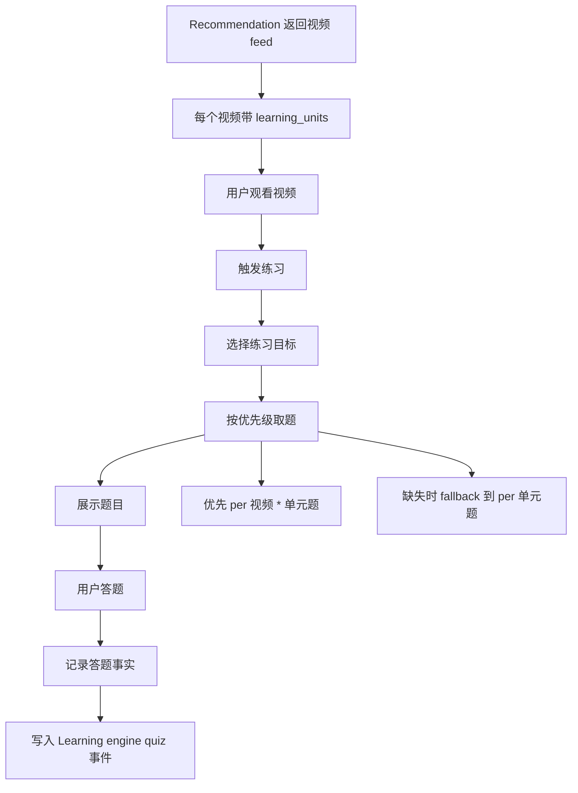

核心结论是：

- 视频学习题目不应该只绑定视频，也不应该只绑定单元。
- 题目来源分为 **per 单元题** 和 **per 视频 * 单元题**。
- per 单元题绑定 `coarse_unit_id`，适合大规模生成和长期复用。
- per 视频 * 单元题绑定 `video_id + coarse_unit_id`，MVP 阶段主要由 AI 判断视频上下文后，只给少量高价值组合生成。
- 视频末尾测试的练习目标主要来自当前视频的 `learning_units`，辅以播放中 lookup 过的少量单元。
- 答题结果最终写成 Learning engine 的 `quiz` 事件，核心绑定仍然是 `user_id + coarse_unit_id`。

这里的“单元”不是字幕里的某个 token 字符串，而是后端已经映射好的 `coarse_unit_id`。前端看到的是单词或短语，学习系统真正追踪的是学习单元。

## 2. 模块一：生成方案

生成方案解决三个问题：

- 题目和什么绑定；
- AI 应该为哪些对象生成题；
- 题目生成后如何被复用、选用和回写。

### 2.1 为什么需要两类题源

只按视频生成题，会变成“每个视频里所有可能学习的词都要生成题”。一个视频可能有很多词，真正会被推荐给某个用户学习的只是一小部分。全量生成会让 AI 成本、存储成本和维护成本失控。

只按单元生成题，又会失去视频语境。用户刚看完一句字幕，如果题目能围绕这句字幕考察含义、语境或回忆，学习闭环会更自然。

所以题源分成两类：

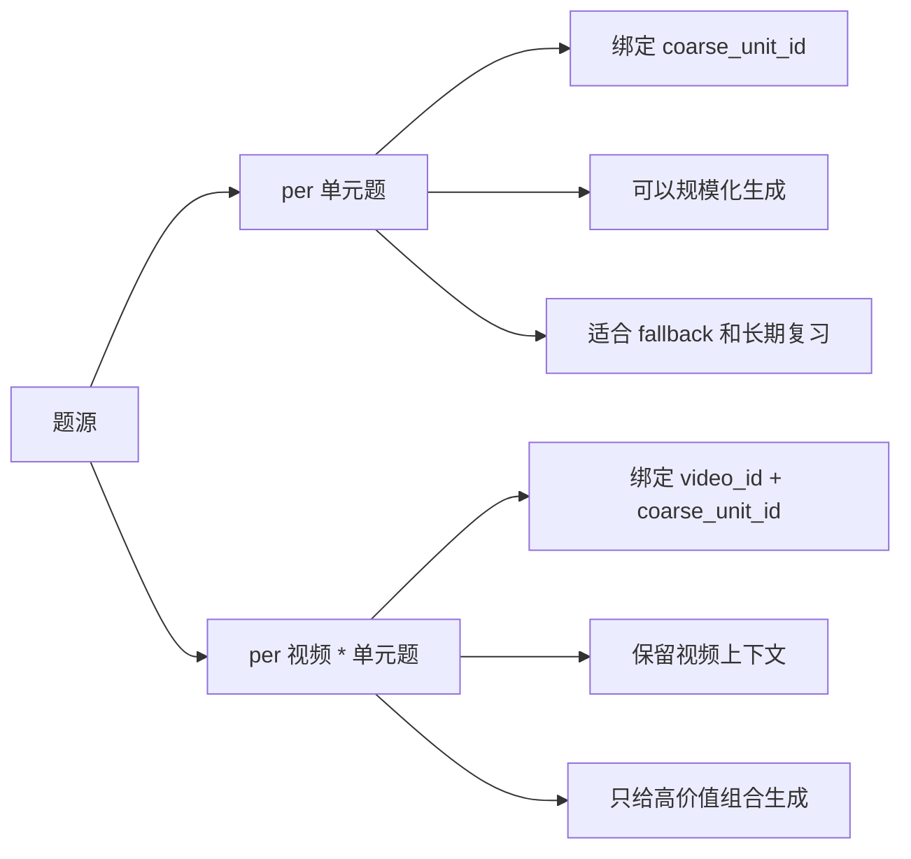

### 2.2 per 单元题

per 单元题回答的是：

> 这个学习单元本身应该怎么练？

它不依赖具体视频，只绑定 `coarse_unit_id`。例如一个词的基础含义、常见搭配、拼写、听音识别、释义选择，都可以做成通用题。

这类题的价值是复用率高。它可以提前批量生成、人工整理、长期维护，也可以被多个视频、多个用户、多个复习场景重复使用。

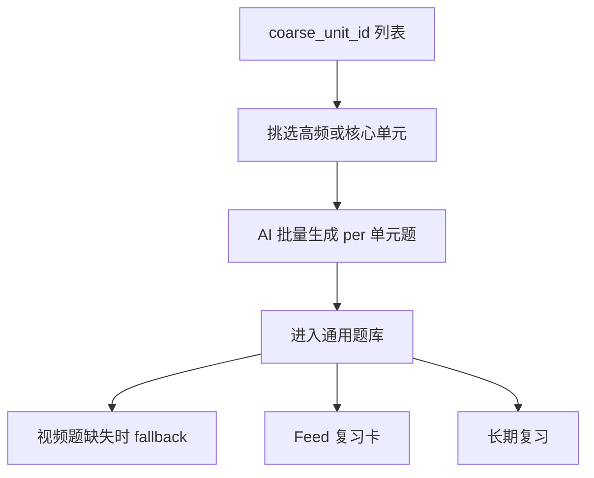

per 单元题适合：

- 大规模 AI 生成；
- 高频学习单元的基础题；
- 视频上下文题缺失时的 fallback；
- Feed 复习卡；
- 错题复习和长期复习。

### 2.3 per 视频 * 单元题

per 视频 * 单元题回答的是：

> 这个学习单元在这个视频的这段语境里应该怎么理解？

它绑定 `video_id + coarse_unit_id`，并记录一个代表性的上下文来源。这个上下文来源可以是一句字幕、一个 span、一个播放时间段，作用是解释这道题为什么和这个视频有关。

关键边界是：**不要为每次出现都生成题。**

同一个单元在一个视频里可能出现多次，但不应该因为出现了 5 次就生成 5 道题。MVP 只需要选一个最适合出题的上下文。后续如果同一个 `video_id + coarse_unit_id` 下需要多道题，也应该是因为题型不同或考察角度不同，而不是因为 evidence 出现位置不同。

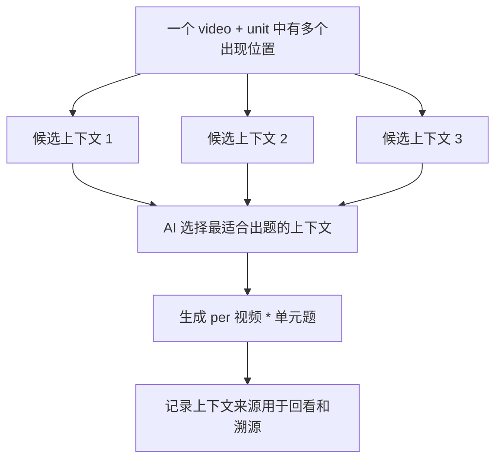

MVP 阶段，per 视频 * 单元题的主要来源是 **AI 对视频上下文的判断**。也就是说，视频处理或补题时，AI 读取字幕、语义映射和候选学习单元，挑出那些“这个视频语境本身很适合出题”的 `video_id + coarse_unit_id`。

其他信号可以作为后续增强，但 MVP 阶段先不依赖它们：

- Recommendation 的 `learning_units` 可以决定末尾小测要练哪些单元，但不一定负责决定视频上下文题预生成范围。
- 历史推荐中经常出现的 video-unit 组合需要积累数据后才有价值。
- 用户 lookup 频繁的单元需要真实使用数据后才能稳定使用。
- 人工标注或运营挑选可以作为补充，但不作为 MVP 主路径。

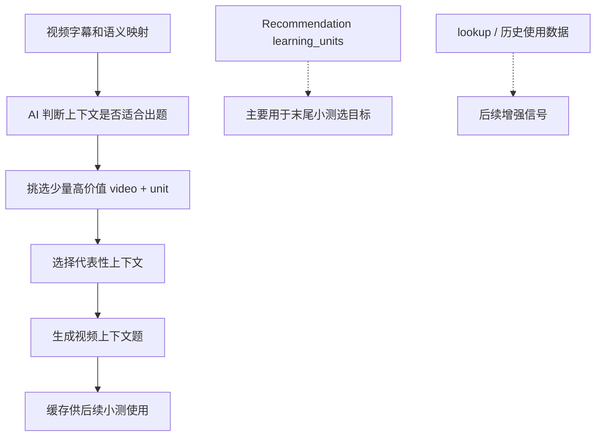

### 2.4 生成时机

per 单元题适合批量生成。它不依赖视频，不需要等待用户看完某个视频，也不会因为某个视频字幕调整而大量失效。

per 视频 * 单元题可以在不同时间生成：

- 视频处理后，由 AI 只挑少量强上下文单元生成；
- 用户打开视频后，为本视频可用题目做预取或补题；
- 视频接近结束时，为末尾小测补齐题目；
- 后台根据最近推荐和使用数据异步补题。

MVP 不需要一开始把这些触发方式都做完。当前最自然的主路径是：

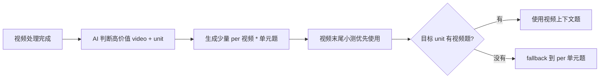

### 2.5 取题顺序

练习目标确定后，取题顺序固定为：

1. 先找 per 视频 * 单元题；
2. 如果没有，再找 per 单元题；
3. 如果还没有，就跳过、延迟生成，或进入后台补题队列。

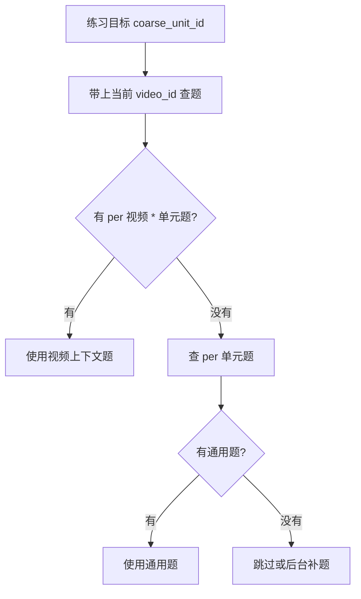

这样做的原因是：

- 有视频上下文题时，用户刚看过对应字幕，练习更贴近观看体验；
- 没有视频上下文题时，通用题仍然可以完成学习验证；
- 不因为题库暂时缺失就阻断整个视频学习流程。

### 2.6 应该保存什么

本文不定具体表结构，但需要先明确哪些东西在语义上应该被保存。

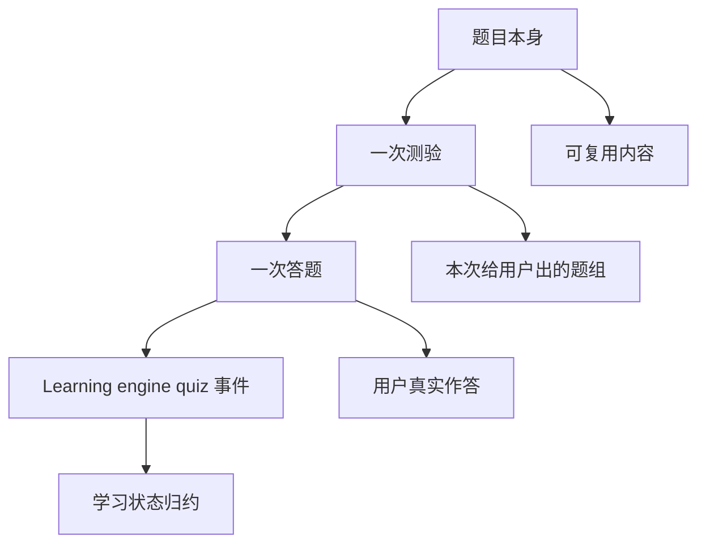

**题目本身** 是可复用内容。它应该表达：

- 考察哪个学习单元；
- 是 per 单元题，还是 per 视频 * 单元题；
- 如果是视频上下文题，它来自哪个视频；
- 使用了哪段代表性上下文；
- 题干、选项、答案、解释；
- 题型和难度；
- 当前是否可用。

**一次测验** 是用户在某个时刻看到的一组题。它应该表达：

- 属于哪个用户；
- 来自哪个视频；
- 是否来自某次 Recommendation；
- 这次测验包含哪些题；
- 触发原因是视频结尾、学习模式，还是其他入口。

**一次答题** 是用户对某道题的实际反应。它应该表达：

- 用户答了哪道题；
- 答案是什么；
- 是否正确；
- 用了多久；
- 是否跳过；
- 当时题目版本和上下文是什么。

**Learning engine 学习事件** 只接收归一化后的学习信号。不要把完整题目、选项、用户答案都塞进 Learning engine。Learning engine 是学习状态系统，不是题库或答题系统。

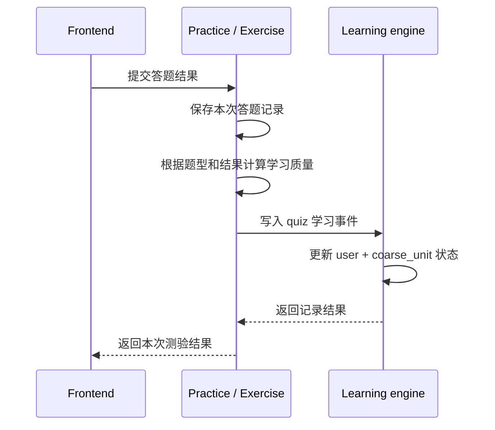

## 3. 模块二：触发方案

触发方案解决的是：用户在什么时机遇到题目，以及这个题目会不会打断学习体验。

当前建议把触发分成两层：

- **默认学习体验**：尽量少打断用户观看，适合所有用户默认开启。
- **学习模式**：用户主动开启后，允许更密集、更强学习导向的练习插入。

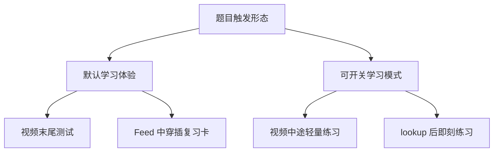

### 3.1 视频末尾测试

视频末尾测试是 MVP 最稳的主入口。它发生在用户看完视频之后，不打断观看流程，也最容易围绕当前视频的学习目标出题。

练习目标主要来自：

1. 当前视频的 `learning_units`；
2. 播放中 lookup 过的少量单元。

末尾测验不需要覆盖视频里的所有词。它只需要围绕这两个来源取少量目标。

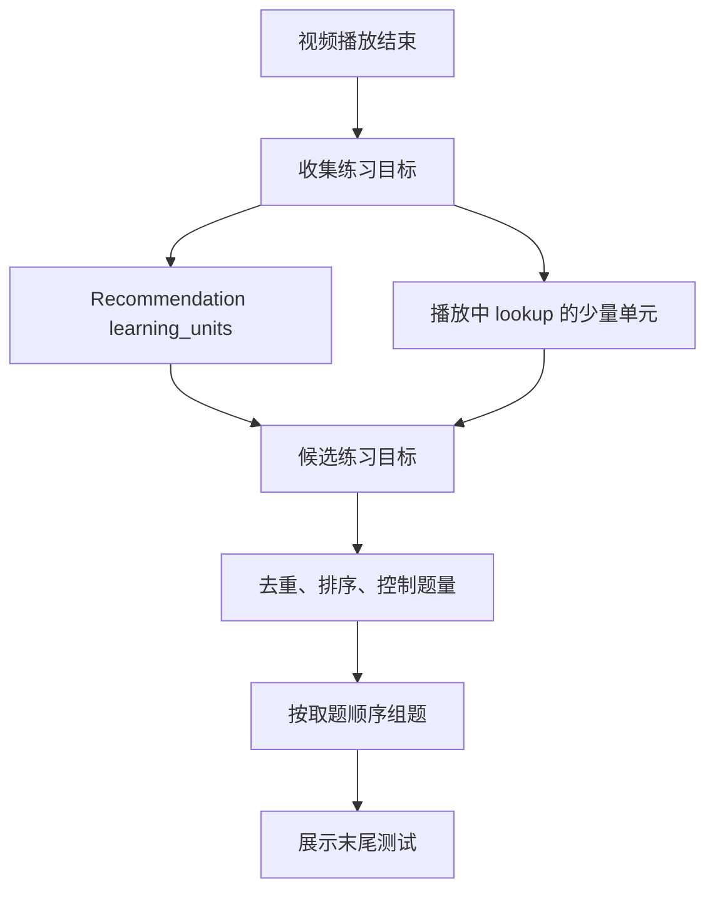

推荐的目标优先级是：

1. 用户在播放中 lookup 过、且能映射到学习单元的词；
2. `learning_units` 里 `is_primary = true` 的单元；
3. role 为 `hard_review` 或 `new_now` 的单元；
4. role 为 `soft_review` 的单元；
5. role 为 `near_future` 的单元。

如果用户点击了不在当前视频 `learning_units` 里的词，也可以进入候选，但应该有数量上限。它代表用户兴趣，但末尾测验仍应主要服务本轮推荐的学习目标。

### 3.2 Feed 中穿插复习卡

Feed 中穿插复习卡是独立复习流。用户上下滑 feed 时，偶尔刷到一个全屏题目页，答完后继续回到 feed。

这类题通常不依赖当前视频上下文，更适合使用 per 单元题。它主要服务：

- 已经进入学习状态的单元；
- 到期复习单元；
- 之前低分或答错的单元；
- hard review 类单元。

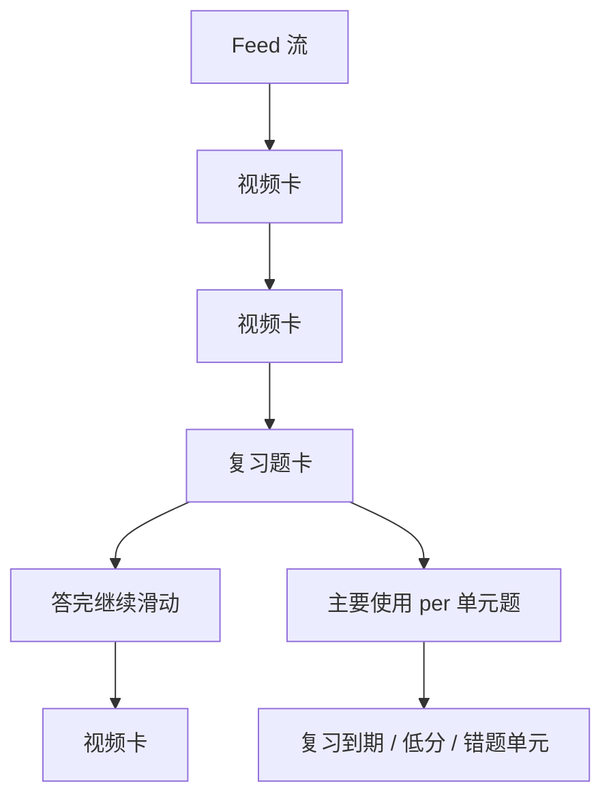

它不应该出现得太频繁，否则会破坏 feed 体验。MVP 可以把它视为第二阶段能力。

### 3.3 视频中途轻量练习

视频中途轻量练习发生在用户观看过程中，例如看完一个关键字幕句子后，轻量插入一道和该句相关的题。

这种形态上下文最强，也最容易打断观看。因此它不适合默认开启，更适合放在学习模式里，并且限制很严：

- 一条视频最多出现少量题目；
- 只在句子结束或自然停顿后出现；
- 只针对非常关键的学习单元；
- 题目必须很轻，可以快速完成；
- 用户可以跳过。

这类题更适合使用 per 视频 * 单元题，因为它依赖刚刚出现的字幕上下文。

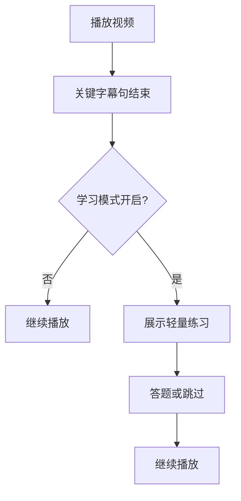

### 3.4 lookup 后即刻练习

lookup 后即刻练习发生在用户点击字幕查看解释或释义之后。这个动作本身说明用户对该单元有兴趣或不确定，因此学习意图比普通曝光更强。

建议不要在用户打开释义弹窗时强制弹题，而是在弹窗里提供轻入口，例如：

- 练一下；
- 加入练习；
- 看完后测我。

如果用户主动选择即刻练习，则优先使用当前 `video_id + coarse_unit_id` 的 per 视频 * 单元题；没有时再 fallback 到 per 单元题。

如果 lookup 的单元不在当前视频 `learning_units` 里，也可以进入练习候选，但数量应该受控，避免末尾测验偏离本轮推荐的学习目标。

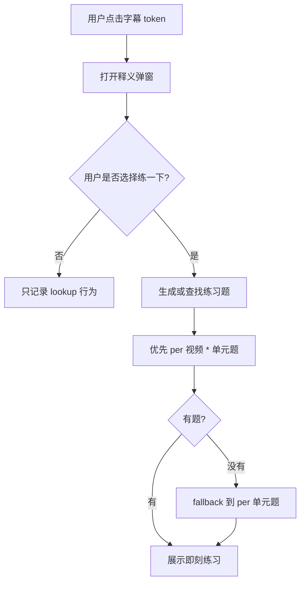

### 3.5 阶段优先级

当前推荐优先级是：

1. 视频末尾测试：默认开启，最适合作为 MVP 主入口。
2. lookup 后可选即刻练习：用户主动触发，学习意图强，但不强制。
3. Feed 中穿插复习卡：适合长期复习，需要题库和学习状态积累。
4. 视频中途自动插题：放入学习模式，后续再做。


最终原则是：默认模式少打断，学习模式才允许更密集的练习。这样既能先跑通视频学习闭环，也保留未来扩展更强学习形态的空间。

## 4. 模块三：题目形态

题目形态解决的是：AI 具体生成什么样的题，以及这些题适合 per 单元还是 per 视频 * 单元。

所有题目都可以由 AI 生成，但 MVP 不应依赖 AI 做实时判分。更稳的做法是：AI 生成题干、选项、答案和解释，后端保存为可确定判分的题目；用户答题后，系统按预设答案判分，再写入 Learning engine 的 `quiz` 事件。

MVP 题型应该满足：

- 题目可以自动判分；
- 正确答案唯一；
- 前端展示简单；
- 题干不泄露答案；
- AI 生成后可以做基础规则校验；
- 答题结果能稳定映射成 `quiz + quality`。

### 4.1 MVP 推荐的 4 种题型

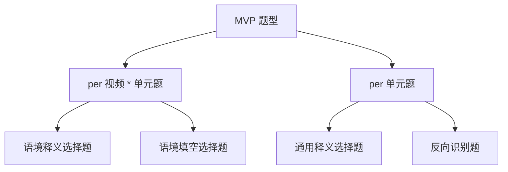

| 题型 | 绑定粒度 | 适合场景 | 说明 |
| --- | --- | --- | --- |
| 语境释义选择题 | per 视频 * 单元题 | 视频末尾测试、lookup 后即刻练习、学习模式中途练习 | 给出当前视频字幕句子，问目标词在这个语境里的意思。 |
| 通用释义选择题 | per 单元题 | fallback、Feed 复习卡、长期复习 | 给出词或短语，选择正确释义。 |
| 语境填空选择题 | per 视频 * 单元题 | 视频末尾测试、关键字幕后轻量练习 | 把当前视频字幕里的目标词隐去，让用户从选项中选回去。 |
| 反向识别题 | per 单元题 | Feed 复习卡、复习任务、错题复习 | 给出中文义或释义，让用户选择对应英文词或短语。 |

#### 语境释义选择题

这是 per 视频 * 单元题的主力形态。它利用用户刚看过的视频上下文，考察“这个词在这句话里是什么意思”。

示例语义：

```text
字幕句子：I barely made it to the meeting on time.
问题：这里的 “barely” 最接近什么意思？

A. 几乎不 / 勉强
B. 非常快
C. 提前
D. 故意
```

它最适合视频末尾测试和 lookup 后即刻练习。AI 生成时必须保证干扰项合理，但正确答案唯一。

#### 通用释义选择题

这是 per 单元题的基础形态。它不依赖视频上下文，可以大规模生成，也可以作为视频上下文题缺失时的 fallback。

示例语义：

```text
问题：“barely” 通常是什么意思？

A. 几乎不 / 勉强
B. 经常
C. 明显地
D. 马上
```

它适合 Feed 复习卡和长期复习。缺点是视频感较弱，但复用率最高。

#### 语境填空选择题

这是 per 视频 * 单元题。它把当前视频字幕中的目标词隐去，让用户根据上下文选回正确词。

示例语义：

```text
I _____ made it to the meeting on time.

A. barely
B. loudly
C. deeply
D. usually
```

它比单纯释义题更接近“能不能在语境中识别用法”。AI 生成时需要控制干扰项的词性和难度，否则题目会过于简单，或出现多个可接受答案。

#### 反向识别题

这是 per 单元题。它从释义出发，让用户回忆对应英文词或短语。

示例语义：

```text
哪个词最接近“勉强、几乎不”？

A. barely
B. almost
C. already
D. exactly
```

它比普通释义题更偏回忆，适合 Feed 复习卡、错题复习和到期复习。

### 4.2 后续可能的题目形态

后续题型可以更丰富，但不建议 MVP 第一批全部实现。它们可以作为题库能力和交互能力成熟后的扩展池。

#### 字幕挖空 / 听力填空

这类题主要是 per 视频 * 单元题，因为它依赖真实视频字幕、音频片段和播放时间点。

形态可以包括：

- 看字幕选缺失词；
- 听音频补缺失词；
- 看上下文选正确含义；
- 重放片段后再答。

它适合学习模式中的中途练习，也适合视频末尾测试。它的学习价值高，但实现依赖更强：需要音频片段、字幕时间轴、重放控制和更严格的答案归一化。

#### 上下文迁移练习

这是更高级但很有价值的形态。它不是问用户“这个视频里这个词什么意思”，而是换一个新句子，问同一个词或表达在新上下文里的含义。

它可以判断用户是否真的掌握了这个学习单元，而不是只记住当前字幕里的答案。

示例语义：

```text
原视频里学过：barely

新句子：She barely recognized him after ten years.
问题：这里的 “barely” 更接近什么意思？
```

这类题主要适合 per 单元题，因为它不依赖原视频也能生成和复用。它也可以作为 per 视频 * 单元题的延伸：先从视频上下文引入某个学习单元，再用新上下文测试迁移能力。

事件映射仍然是 `quiz + quality`。它是强反馈，因为用户必须在真实语境中回忆，而不是只点“认识”。

#### 拼写输入题

拼写输入题主要适合 per 单元题，也可以在有音频片段时变成 per 视频 * 单元题。

它的价值是更接近主动回忆，但 MVP 暂不优先，因为需要处理大小写、词形变化、标点、空格和拼写容错。

#### 听音选词题

听音选词题可以有两种来源：

- 使用通用 TTS 或词音频时，它是 per 单元题；
- 使用视频原声片段时，它是 per 视频 * 单元题。

它适合后续补充听力能力，但依赖音频质量和切片准确度。

#### 开放翻译或解释题

开放题可以考察更深理解，但不适合 MVP。原因是判分通常需要 AI 或复杂规则，成本和不确定性都更高。

后续如果要做，建议先把它作为练习展示，不直接作为高权重学习状态反馈；等 AI 判分稳定后，再写入强 `quiz` 事件。

### 4.3 题型和触发场景的关系

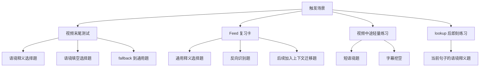

不同触发场景适合不同题型：

- 视频末尾测试：优先语境释义选择题和语境填空选择题，fallback 到通用释义选择题和反向识别题。
- Feed 复习卡：优先通用释义选择题和反向识别题，后续可加入拼写输入题和上下文迁移练习。
- 视频中途轻量练习：优先语境释义选择题或字幕挖空题，题目必须短、轻、可跳过。
- lookup 后即刻练习：优先“刚才这个词在句子里是什么意思”的语境释义选择题，缺失时 fallback 到通用释义选择题。

### 4.4 AI 生成约束

AI 生成题目时，应生成结构化候选题，而不是直接生成不可校验的自然语言结果。每道题至少需要有题干、选项、正确答案、答案解释和绑定关系。

基础校验包括：

- 必须绑定一个 `coarse_unit_id`；
- per 视频题必须绑定 `video_id + coarse_unit_id` 和上下文来源；
- 必须有唯一正确答案；
- 干扰项必须和正确答案同类型；
- 选项长度不要差异过大；
- 题干不能直接泄露答案；
- 答案解释必须和题干一致；
- 自动判分不应依赖再次调用 AI。

## 5. 模块边界

测验能力可以理解为一个独立的 Practice / Exercise 层。它连接视频内容、推荐计划和学习状态，但不取代它们。

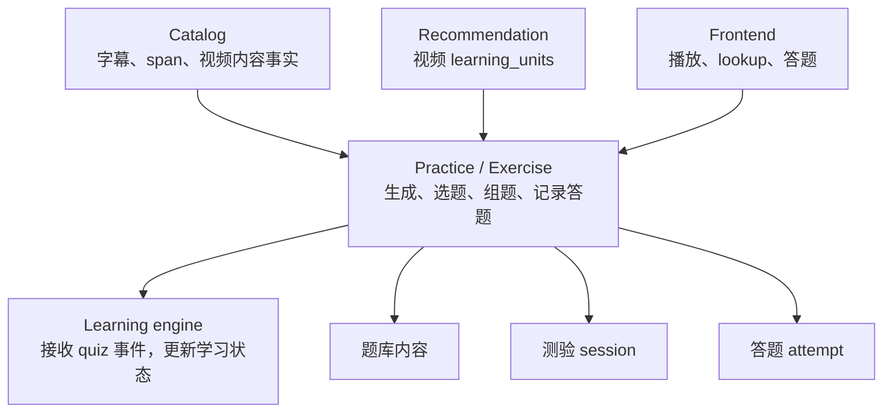

各模块职责如下：

- Catalog 提供视频和字幕事实。
- Recommendation 告诉前端和练习系统：这个视频本轮预期学习哪些单元。
- Practice / Exercise 决定生成哪些题、从哪里取题、何时展示题、如何记录答题。
- Learning engine 只维护用户对学习单元的学习状态。
- Frontend 只展示视频、展示题目、如实上报用户行为。

## 6. MVP 决策摘要

1. 题源分为 per 单元题和 per 视频 * 单元题。
2. per 单元题绑定 `coarse_unit_id`，适合规模化生成和长期复用。
3. per 视频 * 单元题绑定 `video_id + coarse_unit_id`，MVP 阶段主要由 AI 判断视频上下文后，只给高价值、强上下文相关的组合生成。
4. per 视频 * 单元题不按每个 evidence occurrence 生成。
5. 同一个 `video_id + coarse_unit_id` 可以因为题型不同有多道题，但不因为出现位置多而扩张。
6. 视频末尾测试是 MVP 主入口，练习目标主要来自 Recommendation 的 `learning_units`。
7. 播放中 lookup 的单元可以进入候选，但数量应受控。
8. 取题优先使用 per 视频 * 单元题，缺失时 fallback 到 per 单元题。
9. 默认模式少打断；学习模式才允许中途插题等更强干预。
10. MVP 推荐先做语境释义选择题、通用释义选择题、语境填空选择题和反向识别题。
11. 题目、测验 session、答题 attempt 和 Learning engine 学习事件是不同语义。
12. 答题结果最终写成 Learning engine 的 `quiz` 事件，核心绑定仍然是 `user_id + coarse_unit_id`。

## 7. 暂不定稿的内容

以下内容后续实现设计再收敛：

- 每种题型的 payload 结构；
- 具体数据库表结构；
- AI prompt 和生成质量规则；
- 是否需要人工审核；
- 题目版本和字幕版本如何失效；
- per 视频 * 单元题在视频处理阶段生成，还是运行时按需生成；
- 一次末尾小测固定出几题；
- Feed 复习卡插入频率；
- 学习模式具体开关和强度档位。
