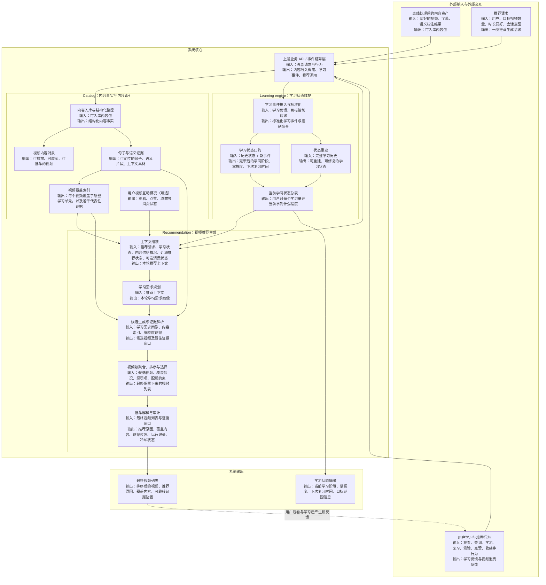
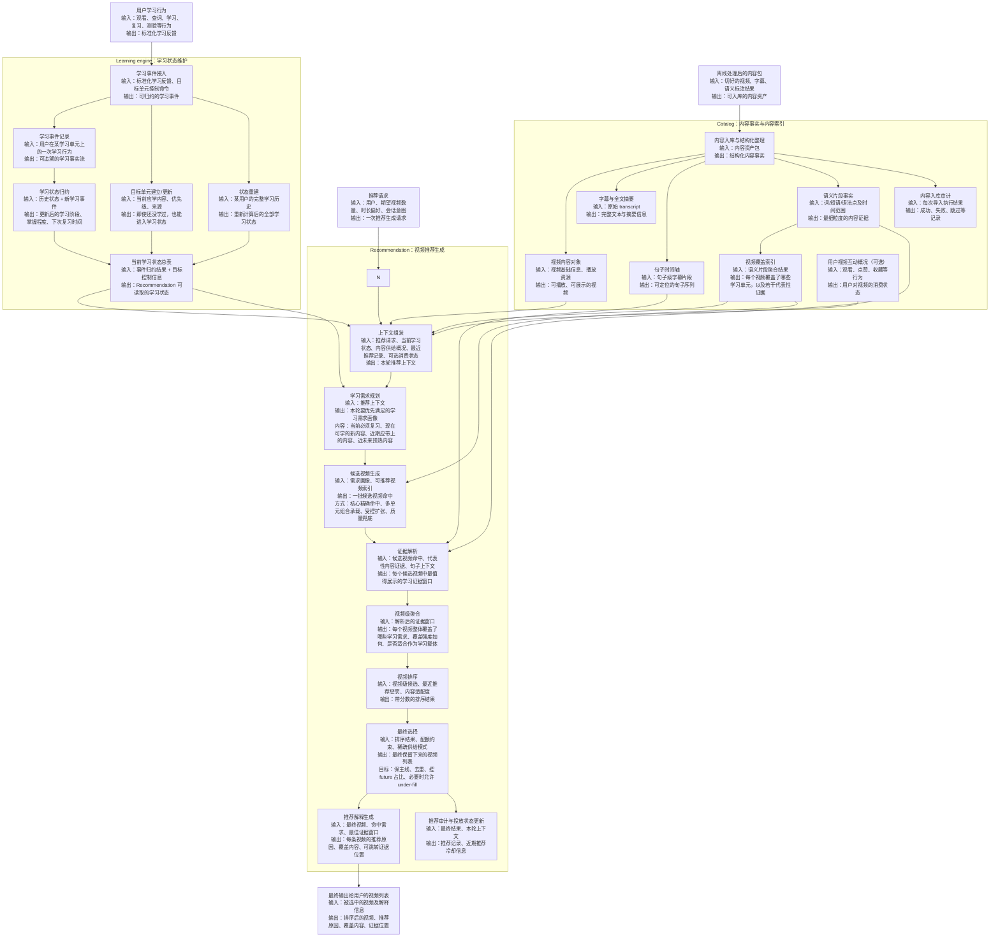
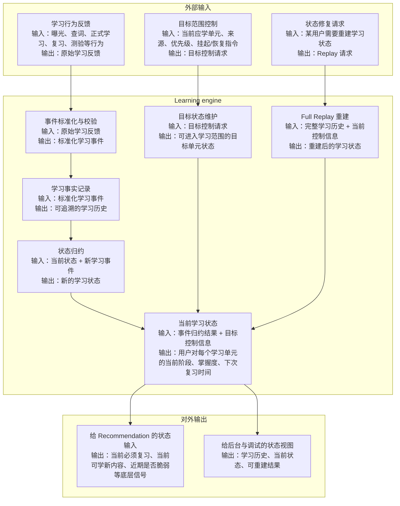
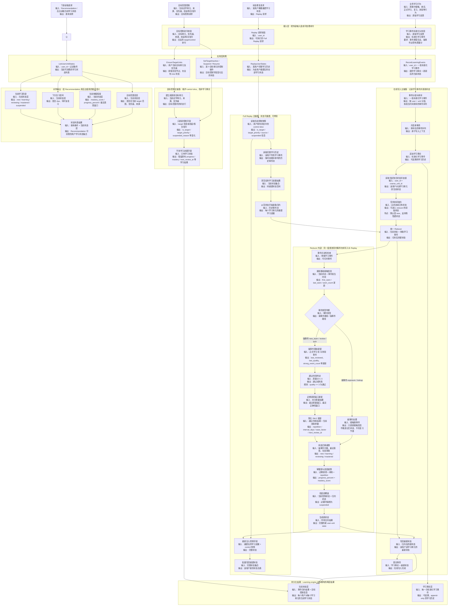
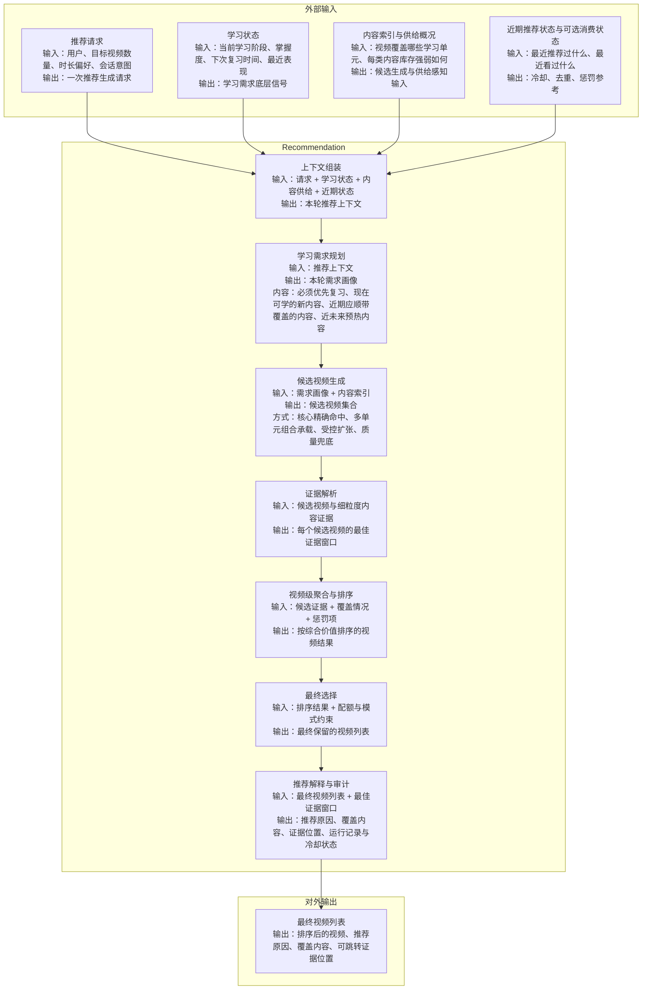
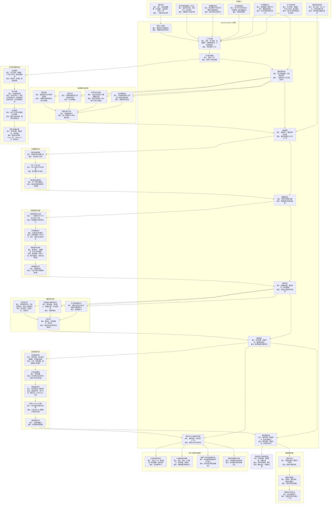
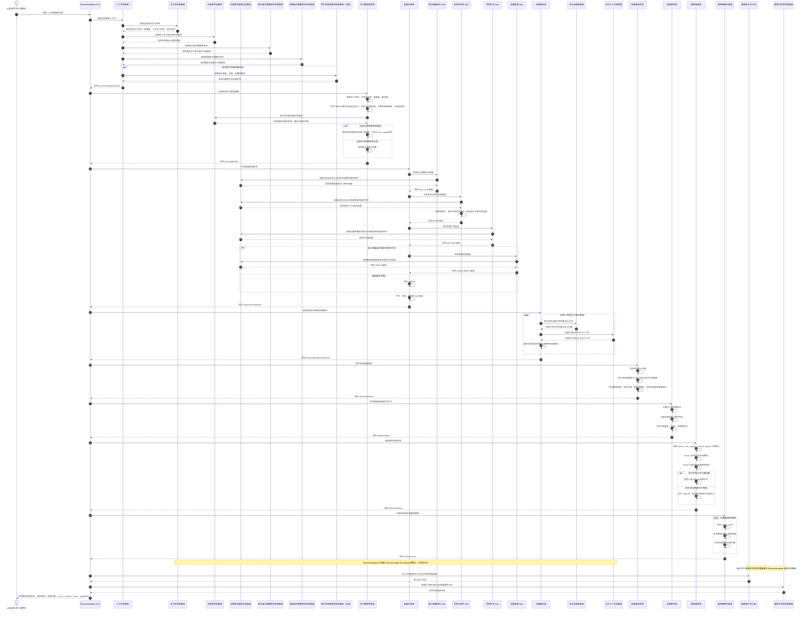

## 总设计

#### 总览图

```mermaid
flowchart TD

subgraph EXT["外部输入与外部交互"]
    ext_content["离线处理后的内容资产<br/>输入：切好的视频、字幕、语义标注结果<br/>输出：可入库内容包"]
    ext_behavior["用户学习与观看行为<br/>输入：观看、查词、学习、复习、测验、点赞、收藏等行为<br/>输出：学习反馈与视频消费反馈"]
    ext_request["推荐请求<br/>输入：用户、目标视频数量、时长偏好、会话意图<br/>输出：一次推荐生成请求"]
end

subgraph PLATFORM["系统核心"]
    api["上层业务 API / 事件结算层<br/>输入：外部请求与行为<br/>输出：内容导入调用、学习事件、推荐调用"]

    subgraph CAT["Catalog：内容事实与内容索引"]
        cat_ingest["内容入库与结构化整理<br/>输入：可入库内容包<br/>输出：结构化内容事实"]
        cat_video["视频内容对象<br/>输出：可播放、可展示、可推荐的视频"]
        cat_sentence["句子与语义证据<br/>输出：可定位的句子、语义片段、上下文素材"]
        cat_index["视频覆盖索引<br/>输出：每个视频覆盖了哪些学习单元，以及若干代表性证据"]
        cat_user["用户视频互动概况（可选）<br/>输出：观看、点赞、收藏等消费状态"]
    end

    subgraph LE["Learning engine：学习状态维护"]
        le_event["学习事件接入与标准化<br/>输入：学习反馈、目标控制请求<br/>输出：标准化学习事件与控制命令"]
        le_reduce["学习状态归约<br/>输入：历史状态 + 新事件<br/>输出：更新后的学习阶段、掌握度、下次复习时间"]
        le_replay["状态重建<br/>输入：完整学习历史<br/>输出：可重建、可修复的学习状态"]
        le_state["当前学习状态总表<br/>输出：用户对每个学习单元当前学到什么程度"]
    end

    subgraph REC["Recommendation：视频推荐生成"]
        rec_ctx["上下文组装<br/>输入：推荐请求、学习状态、内容供给概况、近期推荐状态、可选消费状态<br/>输出：本轮推荐上下文"]
        rec_plan["学习需求规划<br/>输入：推荐上下文<br/>输出：本轮学习需求画像"]
        rec_generate["候选生成与证据解析<br/>输入：学习需求画像、内容索引、细粒度证据<br/>输出：候选视频及最佳证据窗口"]
        rec_rank["视频级聚合、排序与选择<br/>输入：候选视频、覆盖情况、惩罚项、配额约束<br/>输出：最终保留下来的视频列表"]
        rec_explain["推荐解释与审计<br/>输入：最终视频列表与证据窗口<br/>输出：推荐原因、覆盖内容、证据位置、运行记录、冷却状态"]
    end
end

subgraph OUT["系统输出"]
    out_video["最终视频列表<br/>输出：排序后的视频、推荐原因、覆盖内容、可跳转证据位置"]
    out_state["学习状态输出<br/>输出：当前学习阶段、掌握度、下次复习时间、目标范围信息"]
end

ext_content --> api
ext_behavior --> api
ext_request --> api

api --> cat_ingest
cat_ingest --> cat_video
cat_ingest --> cat_sentence
cat_sentence --> cat_index

api --> le_event
le_event --> le_reduce
le_reduce --> le_state
le_event --> le_replay
le_replay --> le_state

api --> rec_ctx
le_state --> rec_ctx
le_state --> out_state

cat_index --> rec_ctx
cat_index --> rec_generate
cat_sentence --> rec_generate
cat_user --> rec_ctx

rec_ctx --> rec_plan
rec_plan --> rec_generate
rec_generate --> rec_rank
rec_rank --> rec_explain
rec_explain --> out_video

out_video -. 用户观看与学习后产生新反馈 .-> ext_behavior
```

#### 详细设计图

```mermaid
flowchart TD

A["离线处理后的内容包<br/>输入：切好的视频、字幕、语义标注结果<br/>输出：可入库的内容资产"] --> B

U["用户学习行为<br/>输入：观看、查词、学习、复习、测验等行为<br/>输出：标准化学习反馈"] --> H

R["推荐请求<br/>输入：用户、期望视频数量、时长偏好、会话意图<br/>输出：一次推荐生成请求"] --> N

subgraph CAT["Catalog：内容事实与内容索引"]
    B["内容入库与结构化整理<br/>输入：内容资产包<br/>输出：结构化内容事实"]

    C1["视频内容对象<br/>输入：视频基础信息、播放资源<br/>输出：可播放、可展示的视频"]
    C2["字幕与全文摘要<br/>输入：原始 transcript<br/>输出：完整文本与摘要信息"]
    C3["句子时间轴<br/>输入：句子级字幕片段<br/>输出：可定位的句子序列"]
    C4["语义片段事实<br/>输入：词/短语/语法点及时间范围<br/>输出：最细粒度的内容证据"]
    C5["视频覆盖索引<br/>输入：语义片段聚合结果<br/>输出：每个视频覆盖了哪些学习单元，以及若干代表性证据"]
    C6["内容入库审计<br/>输入：每次导入执行结果<br/>输出：成功、失败、跳过等记录"]
    C7["用户视频互动概况（可选）<br/>输入：观看、点赞、收藏等行为<br/>输出：用户对视频的消费状态"]

    B --> C1
    B --> C2
    B --> C3
    B --> C4
    C4 --> C5
    B --> C6
end

subgraph LE["Learning engine：学习状态维护"]
    H["学习事件接入<br/>输入：标准化学习反馈、目标单元控制命令<br/>输出：可归约的学习事件"]

    L1["学习事件记录<br/>输入：用户在某学习单元上的一次学习行为<br/>输出：可追溯的学习事实流"]
    L2["学习状态归约<br/>输入：历史状态 + 新学习事件<br/>输出：更新后的学习阶段、掌握程度、下次复习时间"]
    L3["目标单元建立/更新<br/>输入：当前应学内容、优先级、来源<br/>输出：即使还没学过，也能进入学习状态"]
    L4["状态重建<br/>输入：某用户的完整学习历史<br/>输出：重新计算后的全部学习状态"]
    L5["当前学习状态总表<br/>输入：事件归约结果 + 目标控制信息<br/>输出：Recommendation 可读取的学习状态"]

    H --> L1
    H --> L3
    H --> L4
    L1 --> L2
    L2 --> L5
    L3 --> L5
    L4 --> L5
end

subgraph REC["Recommendation：视频推荐生成"]
    N --> N1

    N1["上下文组装<br/>输入：推荐请求、当前学习状态、内容供给概况、最近推荐记录、可选消费状态<br/>输出：本轮推荐上下文"]

    N2["学习需求规划<br/>输入：推荐上下文<br/>输出：本轮要优先满足的学习需求画像<br/>内容：当前必须复习、现在可学的新内容、近期应带上的内容、近未来预热内容"]

    N3["候选视频生成<br/>输入：需求画像、可推荐视频索引<br/>输出：一批候选视频命中<br/>方式：核心精确命中、多单元组合承载、受控扩张、质量兜底"]

    N4["证据解析<br/>输入：候选视频命中、代表性内容证据、句子上下文<br/>输出：每个候选视频中最值得展示的学习证据窗口"]

    N5["视频级聚合<br/>输入：解析后的证据窗口<br/>输出：每个视频整体覆盖了哪些学习需求、覆盖强度如何、是否适合作为学习载体"]

    N6["视频排序<br/>输入：视频级候选、最近推荐惩罚、内容适配度<br/>输出：带分数的排序结果"]

    N7["最终选择<br/>输入：排序结果、配额约束、稀疏供给模式<br/>输出：最终保留下来的视频列表<br/>目标：保主线、去重、控 future 占比、必要时允许 under-fill"]

    N8["推荐解释生成<br/>输入：最终视频、命中需求、最佳证据窗口<br/>输出：每条视频的推荐原因、覆盖内容、可跳转证据位置"]

    N9["推荐审计与投放状态更新<br/>输入：最终结果、本轮上下文<br/>输出：推荐记录、近期推荐冷却信息"]

    N1 --> N2
    N2 --> N3
    N3 --> N4
    N4 --> N5
    N5 --> N6
    N6 --> N7
    N7 --> N8
    N7 --> N9
end

C1 --> N1
C5 --> N1
C5 --> N3
C4 --> N4
C3 --> N4
C7 --> N1

L5 --> N1
L5 --> N2

N8 --> Z["最终输出给用户的视频列表<br/>输入：被选中的视频及解释信息<br/>输出：排序后的视频、推荐原因、覆盖内容、证据位置"]
```

### 学习引擎

##### 学习引擎简化总览图

```mermaid
flowchart TD

subgraph LE_INPUT["外部输入"]
    le_in1["学习行为反馈<br/>输入：曝光、查词、正式学习、复习、测验等行为<br/>输出：原始学习反馈"]
    le_in2["目标范围控制<br/>输入：当前应学单元、来源、优先级、挂起/恢复指令<br/>输出：目标控制请求"]
    le_in3["状态修复请求<br/>输入：某用户需要重建学习状态<br/>输出：Replay 请求"]
end

subgraph LE_CORE["Learning engine"]
    le_step1["事件标准化与校验<br/>输入：原始学习反馈<br/>输出：标准化学习事件"]
    le_step2["学习事实记录<br/>输入：标准化学习事件<br/>输出：可追溯的学习历史"]
    le_step3["状态归约<br/>输入：当前状态 + 新学习事件<br/>输出：新的学习状态"]
    le_step4["目标状态维护<br/>输入：目标控制请求<br/>输出：可进入学习范围的目标单元状态"]
    le_step5["Full Replay 重建<br/>输入：完整学习历史 + 当前控制信息<br/>输出：重建后的学习状态"]
    le_state["当前学习状态<br/>输入：事件归约结果 + 目标控制信息<br/>输出：用户对每个学习单元的当前阶段、掌握度、下次复习时间"]
end

subgraph LE_OUTPUT["对外输出"]
    le_out1["给 Recommendation 的状态输入<br/>输出：当前必须复习、当前可学新内容、近期是否脆弱等底层信号"]
    le_out2["给后台与调试的状态视图<br/>输出：学习历史、当前状态、可重建结果"]
end

le_in1 --> le_step1
le_step1 --> le_step2
le_step2 --> le_step3
le_step3 --> le_state

le_in2 --> le_step4
le_step4 --> le_state

le_in3 --> le_step5
le_step5 --> le_state

le_state --> le_out1
le_state --> le_out2
```

##### 学习引擎详细设计图

```mermaid
flowchart TD

%% =========================
%% 外部输入
%% =========================
A["业务学习行为<br/>输入：观看中接触、查词、正式学习、复习、测验等行为<br/>输出：原始学习反馈"] --> B
A2["目标范围控制<br/>输入：当前应学单元、来源、优先级、挂起/恢复指令<br/>输出：目标控制请求"] --> C
A3["状态修复请求<br/>输入：某用户需要重建学习状态<br/>输出：Replay 请求"] --> D
A4["下游读取请求<br/>输入：Recommendation / 后台读取当前学习状态<br/>输出：查询请求"] --> Q

%% =========================
%% 接入层
%% =========================
subgraph IN["接入层：把外部输入变成可处理命令"]
    B["学习事件标准化与校验<br/>输入：原始学习反馈<br/>输出：标准化学习事件<br/>要求：事件类型合法、强事件必须有质量分"]

    C["目标控制命令校验<br/>输入：目标单元、优先级、来源、挂起/恢复指令<br/>输出：合法的 target/control 命令"]

    D["Replay 请求校验<br/>输入：user_id<br/>输出：可执行的 Full Replay 请求"]
end

%% =========================
%% 主用例层
%% =========================
subgraph UC["应用层用例"]
    U1["RecordLearningEvents<br/>输入：user_id + 一批标准化学习事件<br/>输出：新的学习事实 + 更新后的当前状态"]

    U2["EnsureTargetUnits<br/>输入：用户当前目标单元及优先级<br/>输出：即使还没学过，也会有 new 状态"]

    U3["SetTargetInactive / Suspend / Resume<br/>输入：某个目标单元的控制操作<br/>输出：目标控制字段变化后的状态"]

    U4["ReplayUserStates<br/>输入：某用户完整学习历史<br/>输出：为该用户重建后的全部学习状态"]

    U5["ListUserUnitStates<br/>输入：user_id + 过滤条件<br/>输出：当前可消费的学习状态列表"]
end

B --> U1
C --> U2
C --> U3
D --> U4
Q --> U5

%% =========================
%% 在线写入主链路
%% =========================
subgraph ONLINE["在线写入主链路：记录学习事件并更新状态"]
    O1["事件分组与排序<br/>输入：一批标准化学习事件<br/>输出：按 user + unit 分组、按发生时间排序的事件序列"]

    O2["开启单事务<br/>输入：排序后的事件序列<br/>输出：原子写入上下文"]

    O3["追加学习事实<br/>输入：标准化学习事件<br/>输出：可追溯的学习历史"]

    O4["读取当前聚合状态并加锁<br/>输入：user_id + coarse_unit_id<br/>输出：该用户对该学习单元的当前状态"]

    O5["空状态初始化<br/>输入：无状态或已有状态<br/>输出：可进入 reducer 的初始状态<br/>特点：默认是 new，支持惰性建状态"]

    O6["统一 Reducer<br/>输入：当前状态 + 单条学习事件<br/>输出：归约后的新状态"]

    O7["写回最新状态<br/>输入：归约后的新状态<br/>输出：该用户该学习单元的最新状态"]

    O8["提交事务<br/>输入：学习事实 + 最新状态<br/>输出：在线写入完成"]
end

U1 --> O1
O1 --> O2
O2 --> O3
O3 --> O4
O4 --> O5
O5 --> O6
O6 --> O7
O7 --> O8

%% =========================
%% Reducer 内部
%% =========================
subgraph RED["Reducer 内部：同一套规则同时服务在线写入与 Replay"]
    R1["事件合法性检查<br/>输入：单条学习事件<br/>输出：可归约事件"]

    R2["更新基础接触信息<br/>输入：当前状态 + 事件发生时间<br/>输出：first_seen / last_seen / seen_count 更新"]

    R3{"事件类型判断<br/>输入：事件类型<br/>输出：弱事件路径 / 强事件路径"}

    R4["弱事件处理<br/>输入：接触类事件<br/>输出：只更新接触信息<br/>不推进记忆状态、不改复习节奏"]

    R5["强事件基础更新<br/>输入：正式学习/复习/测验事件<br/>输出：last_reviewed、last_quality、strong_event_count 等更新"]

    R6["通过/失败判定<br/>输入：质量分 0..5<br/>输出：通过或失败<br/>规则：quality >= 3 为通过"]

    R7["近期表现窗口更新<br/>输入：本次质量结果<br/>输出：最近质量窗口、最近正确性窗口"]

    R8["简化 SM-2 更新<br/>输入：通过/失败结果 + 当前间隔参数<br/>输出：repetition / interval_days / ease_factor / next_review_at"]

    R9["状态迁移重算<br/>输入：强事件次数、最近表现、当前间隔<br/>输出：new / learning / reviewing / mastered"]

    R10["掌握度与进度重算<br/>输入：近期表现 + 间隔 + repetition<br/>输出：progress_percent + mastery_score"]

    R11["挂起态覆盖<br/>输入：当前控制状态 + 归约状态<br/>输出：必要时强制为 suspended"]

    R12["生成新状态<br/>输入：所有归约结果<br/>输出：完整的新 user-unit state"]
end

O6 --> R1
R1 --> R2
R2 --> R3
R3 -->|弱事件 exposure / lookup| R4
R3 -->|强事件 new_learn / review / quiz| R5
R5 --> R6
R6 --> R7
R7 --> R8
R8 --> R9
R4 --> R9
R9 --> R10
R10 --> R11
R11 --> R12
R12 --> O7

%% =========================
%% Target / Control 主链路
%% =========================
subgraph CTRL["目标控制主链路：维护 control slice，而非学习事实"]
    T1["建立或更新目标单元<br/>输入：当前应学单元、来源、优先级<br/>输出：目标范围内的状态行"]

    T2["只更新控制字段<br/>输入：target 信息或挂起/恢复指令<br/>输出：is_target / target_priority / suspended_reason 等变化"]

    T3["不改学习进展字段<br/>输入：已有学习状态<br/>输出：保留原有 progress / mastery / next_review_at 等学习结果"]
end

U2 --> T1
T1 --> T2
T2 --> T3
T3 --> S2

U3 --> T2

%% =========================
%% Replay 主链路
%% =========================
subgraph REPLAY["Full Replay 主链路：状态可重建、可修复"]
    P1["读取当前控制快照<br/>输入：用户现有状态中的 control slice<br/>输出：is_target / target_priority / source / suspended 信息"]

    P2["读取完整学习历史<br/>输入：该用户所有学习事件<br/>输出：按时间顺序排列的历史事件流"]

    P3["清空旧的学习进展结果<br/>输入：当前状态集合<br/>输出：待重建状态空间"]

    P4["从空状态开始逐条归约<br/>输入：历史事件流<br/>输出：每个学习单元的重建学习进展"]

    P5["重新注入控制字段<br/>输入：重建后的学习进展 + control 快照<br/>输出：完整状态"]

    P6["批量写回重建状态<br/>输入：完整状态集合<br/>输出：该用户新的状态总表"]
end

U4 --> P1
P1 --> P2
P2 --> P3
P3 --> P4
P4 --> O6
R12 --> P5
P1 --> P5
P5 --> P6

%% =========================
%% 持久化语义层
%% =========================
subgraph STORE["持久化结果：Learning engine 对外拥有的两层结果"]
    S1["学习事实层<br/>输入：每一次标准化学习事件<br/>输出：可追溯、append-only 的学习历史"]

    S2["当前状态层<br/>输入：事件归约结果 + 目标控制信息<br/>输出：每个用户对每个学习单元的当前学习状态"]
end

O3 --> S1
O7 --> S2
P6 --> S2

%% =========================
%% 读取输出
%% =========================
subgraph OUT["对外输出：给 Recommendation 和后台使用的稳定语义"]
    Q1["当前学习阶段<br/>输入：当前状态层<br/>输出：new / learning / reviewing / mastered / suspended"]

    Q2["下次复习信号<br/>输入：当前状态层<br/>输出：是否 due、何时该复习"]

    Q3["当前掌握程度<br/>输入：当前状态层<br/>输出：mastery_score / progress_percent / 最近表现窗口"]

    Q4["目标范围信息<br/>输入：当前状态层<br/>输出：是否在当前 target 范围、优先级、来源"]

    Q5["状态列表结果<br/>输入：查询条件 + 当前状态层<br/>输出：Recommendation 可消费的用户学习状态集合"]
end

U5 --> Q1
U5 --> Q2
U5 --> Q3
U5 --> Q4
Q1 --> Q5
Q2 --> Q5
Q3 --> Q5
Q4 --> Q5
```

### 推荐模块

##### 推荐模块简化总览图

```mermaid
flowchart TD

subgraph REC_INPUT["外部输入"]
    rec_in1["推荐请求<br/>输入：用户、目标视频数量、时长偏好、会话意图<br/>输出：一次推荐生成请求"]
    rec_in2["学习状态<br/>输入：当前学习阶段、掌握度、下次复习时间、最近表现<br/>输出：学习需求底层信号"]
    rec_in3["内容索引与供给概况<br/>输入：视频覆盖哪些学习单元、每类内容库存强弱如何<br/>输出：候选生成与供给感知输入"]
    rec_in4["近期推荐状态与可选消费状态<br/>输入：最近推荐过什么、最近看过什么<br/>输出：冷却、去重、惩罚参考"]
end

subgraph REC_CORE["Recommendation"]
    rec_step1["上下文组装<br/>输入：请求 + 学习状态 + 内容供给 + 近期状态<br/>输出：本轮推荐上下文"]

    rec_step2["学习需求规划<br/>输入：推荐上下文<br/>输出：本轮需求画像<br/>内容：必须优先复习、现在可学的新内容、近期应顺带覆盖的内容、近未来预热内容"]

    rec_step3["候选视频生成<br/>输入：需求画像 + 内容索引<br/>输出：候选视频集合<br/>方式：核心精确命中、多单元组合承载、受控扩张、质量兜底"]

    rec_step4["证据解析<br/>输入：候选视频与细粒度内容证据<br/>输出：每个候选视频的最佳证据窗口"]

    rec_step5["视频级聚合与排序<br/>输入：候选证据 + 覆盖情况 + 惩罚项<br/>输出：按综合价值排序的视频结果"]

    rec_step6["最终选择<br/>输入：排序结果 + 配额与模式约束<br/>输出：最终保留的视频列表"]

    rec_step7["推荐解释与审计<br/>输入：最终视频列表 + 最佳证据窗口<br/>输出：推荐原因、覆盖内容、证据位置、运行记录与冷却状态"]
end

subgraph REC_OUTPUT["对外输出"]
    rec_out1["最终视频列表<br/>输出：排序后的视频、推荐原因、覆盖内容、可跳转证据位置"]
end

rec_in1 --> rec_step1
rec_in2 --> rec_step1
rec_in3 --> rec_step1
rec_in4 --> rec_step1

rec_step1 --> rec_step2
rec_step2 --> rec_step3
rec_step3 --> rec_step4
rec_step4 --> rec_step5
rec_step5 --> rec_step6
rec_step6 --> rec_step7
rec_step7 --> rec_out1
```

##### 推荐模块详细设计图

```mermaid
flowchart TD

subgraph INPUTS["外部输入"]
  req_in["推荐请求<br/>输入：用户、目标视频数量、时长偏好、会话意图、请求上下文<br/>输出：一次推荐生成请求"]
  state_in["学习状态快照<br/>输入：学习阶段、掌握度、下次复习时间、最近表现<br/>输出：当前学习需求的底层状态信号"]
  index_in["内容覆盖索引<br/>输入：视频覆盖了哪些学习单元、覆盖强度如何<br/>输出：可用于粗召回的内容入口"]
  inventory_in["内容供给概况<br/>输入：每个学习单元有多少可用视频、整体强弱如何<br/>输出：供给强弱判断"]
  evidence_in["细粒度内容证据<br/>输入：语义片段、句子上下文、代表性证据引用<br/>输出：可回查的证据窗口素材"]
  serve_in["近期推荐状态<br/>输入：最近哪些学习单元和视频已经被推荐过<br/>输出：冷却与重复惩罚信号"]
  consume_in["用户视频消费概况（可选）<br/>输入：最近是否看过、看过多少、是否看完<br/>输出：消费惩罚与去重参考"]
end

subgraph REC_MAIN["Recommendation 主流程"]
  rec_entry["推荐入口编排<br/>输入：推荐请求与依赖输入<br/>输出：完整推荐流水线执行"]
  rec_ctx["上下文组装<br/>输入：请求、学习状态、供给概况、近期推荐状态、可选消费概况<br/>输出：本轮推荐上下文"]
  rec_plan["学习需求规划<br/>输入：推荐上下文<br/>输出：本轮学习需求画像"]
  rec_cand["候选视频生成<br/>输入：学习需求画像、内容覆盖索引<br/>输出：一批视频-学习单元候选命中"]
  rec_resolve["证据解析<br/>输入：候选命中、细粒度内容证据<br/>输出：最佳证据窗口与句子上下文"]
  rec_agg["视频级聚合<br/>输入：解析后的候选证据<br/>输出：按视频聚合的候选结果"]
  rec_rank["视频排序<br/>输入：视频级候选、推荐惩罚、内容适配度<br/>输出：带综合分数的排序结果"]
  rec_select["最终选择<br/>输入：排序结果、配额约束、稀疏供给模式<br/>输出：最终保留的视频列表"]
  rec_explain["推荐解释生成<br/>输入：最终视频、覆盖需求、最佳证据窗口<br/>输出：推荐原因、覆盖内容、证据定位信息"]
  rec_audit["推荐审计与投放状态更新<br/>输入：最终结果、本轮运行上下文<br/>输出：推荐记录与冷却状态"]
end

subgraph PLAN_DETAIL["学习需求规划内部"]
  plan_parse["状态解释<br/>输入：学习阶段、掌握度、下次复习时间、最近质量表现<br/>输出：紧急度、成熟度、脆弱度判断"]
  plan_bucket["需求分桶<br/>输入：状态解释结果<br/>输出：当前必须复习、现在可学的新内容、近期应顺带覆盖的内容、近未来预热内容"]
  plan_supply["供给感知<br/>输入：每个学习单元的视频库存强弱<br/>输出：哪些内容供给弱、哪些内容供给强"]
  plan_budget["预算与配额分配<br/>输入：需求分桶、供给强弱、目标条数<br/>输出：候选生成预算、future 占比、fallback 占比、模式标记"]
end

subgraph CAND_DETAIL["候选视频生成内部"]
  cand_exact["核心精确命中<br/>输入：当前最重要的复习内容与高优先级新内容<br/>输出：高精度核心候选"]
  cand_bundle["多单元组合承载<br/>输入：当前主线内容与可顺带覆盖内容<br/>输出：能同时承载多个高价值学习单元的视频"]
  cand_expand["受控扩张<br/>输入：近期应覆盖内容与近未来预热内容<br/>输出：补充型候选"]
  cand_fallback["质量兜底<br/>输入：候选明显不足时的兜底规则<br/>输出：少量教育适配度较高的补位候选"]
  cand_merge["候选去重与合并<br/>输入：四路候选命中<br/>输出：统一的视频-学习单元候选集合"]
end

subgraph EVID_DETAIL["证据解析内部"]
  evid_lookup["代表性证据回查<br/>输入：候选命中的证据引用<br/>输出：对应的语义片段"]
  evid_context["句子上下文补全<br/>输入：语义片段与句子时间轴<br/>输出：更完整的句子窗口"]
  evid_best["本轮最佳证据选择<br/>输入：多个可用证据窗口<br/>输出：最适合解释和跳转的一处证据"]
end

subgraph AGG_DETAIL["视频级聚合内部"]
  agg_dedup["同视频同单元去重<br/>输入：一个视频对同一学习单元的多个命中<br/>输出：保留最有代表性的命中"]
  agg_cover["需求覆盖统计<br/>输入：去重后的命中集合<br/>输出：该视频覆盖了多少复习、新学、近期与近未来内容"]
  agg_feature["视频级特征构造<br/>输入：覆盖统计、证据强度、时长与内容密度<br/>输出：覆盖强度、组合价值、教育适配度、未来价值等特征"]
  agg_video["视频候选生成<br/>输入：视频级特征<br/>输出：可进入排序的视频候选对象"]
end

subgraph RANK_DETAIL["视频排序内部"]
  rank_cover["学习需求覆盖评分<br/>输入：视频对当前主线与次级需求的覆盖情况<br/>输出：需求覆盖分"]
  rank_quality["内容承载与教学性评分<br/>输入：覆盖强度、组合能力、证据集中度、时长适配度<br/>输出：内容质量分"]
  rank_penalty["惩罚项计算<br/>输入：近期推荐状态、可选消费状态、重复与过载风险<br/>输出：重复惩罚、过载惩罚、已看惩罚"]
  rank_final["综合打分<br/>输入：覆盖分、内容质量分、惩罚项<br/>输出：按综合价值排序的视频列表"]
end

subgraph SELECT_DETAIL["最终选择内部"]
  select_mode["供给模式判断<br/>输入：候选总量、核心候选健康度、是否触发兜底<br/>输出：正常、供给偏弱、极度稀疏三种模式"]
  select_core["先保主线覆盖<br/>输入：排序结果<br/>输出：优先保住当前必须复习和当前可学新内容"]
  select_margin["再做边际填充<br/>输入：剩余候选与已选结果<br/>输出：兼顾多样性、减少冗余、适度加入 soft 和 future 内容"]
  select_underfill["兜底与 under-fill 决策<br/>输入：是否还能合理补足条数<br/>输出：少量 fallback 或明确少推而不乱推"]
  select_final["最终视频列表<br/>输入：已选视频集合<br/>输出：本轮最终推荐结果"]
end

subgraph EXPLAIN_DETAIL["推荐解释内部"]
  explain_reason["原因码生成<br/>输入：该视频满足了哪些学习需求<br/>输出：结构化原因标签"]
  explain_text["解释文案拼装<br/>输入：原因码、覆盖内容、最佳证据窗口<br/>输出：可展示的推荐理由"]
  explain_jump["证据定位信息生成<br/>输入：最佳证据窗口<br/>输出：可跳转的时间位置与上下文"]
end

subgraph AUDIT_DETAIL["审计与推荐状态维护"]
  audit_run["记录本轮推荐运行<br/>输入：请求上下文、规划结果、候选摘要、选择模式<br/>输出：本轮推荐审计"]
  audit_item["记录每条最终视频<br/>输入：排名、分数、主导需求、最佳证据、原因码<br/>输出：视频级推荐明细审计"]
  audit_unit["更新学习单元级推荐冷却<br/>输入：本轮被视频承载到的学习单元<br/>输出：这些内容近期已被服务过"]
  audit_video["更新视频级推荐冷却<br/>输入：本轮最终选中的视频<br/>输出：这些视频近期已被推荐过"]
end

rec_output["输出给用户的视频列表<br/>输入：最终视频、推荐解释、证据位置<br/>输出：排序后的视频、推荐原因、覆盖内容、可跳转证据"]

req_in --> rec_entry
state_in --> rec_ctx
index_in --> rec_ctx
inventory_in --> rec_ctx
serve_in --> rec_ctx
consume_in --> rec_ctx

index_in --> rec_cand
evidence_in --> rec_resolve

rec_entry --> rec_ctx
rec_ctx --> rec_plan
rec_plan --> rec_cand
rec_cand --> rec_resolve
rec_resolve --> rec_agg
rec_agg --> rec_rank
rec_rank --> rec_select
rec_select --> rec_explain
rec_select --> rec_audit
rec_explain --> rec_output

rec_plan --> plan_parse
plan_parse --> plan_bucket
plan_bucket --> plan_supply
plan_supply --> plan_budget

rec_cand --> cand_exact
rec_cand --> cand_bundle
rec_cand --> cand_expand
rec_cand --> cand_fallback
cand_exact --> cand_merge
cand_bundle --> cand_merge
cand_expand --> cand_merge
cand_fallback --> cand_merge
cand_merge --> rec_resolve

rec_resolve --> evid_lookup
evid_lookup --> evid_context
evid_context --> evid_best
evid_best --> rec_agg

rec_agg --> agg_dedup
agg_dedup --> agg_cover
agg_cover --> agg_feature
agg_feature --> agg_video
agg_video --> rec_rank

rec_rank --> rank_cover
rec_rank --> rank_quality
rec_rank --> rank_penalty
rank_cover --> rank_final
rank_quality --> rank_final
rank_penalty --> rank_final
rank_final --> rec_select

rec_select --> select_mode
select_mode --> select_core
select_core --> select_margin
select_margin --> select_underfill
select_underfill --> select_final
select_final --> rec_explain
select_final --> rec_audit

rec_explain --> explain_reason
explain_reason --> explain_text
explain_text --> explain_jump

rec_audit --> audit_run
rec_audit --> audit_item
rec_audit --> audit_unit
rec_audit --> audit_video
```

##### 时序图

```mermaid
sequenceDiagram
    autonumber

    actor Client as 上层业务 API / 调用方
    participant Facade as Recommendation 入口
    participant Ctx as 上下文组装器
    participant LS as 学习状态读取器
    participant INV as 内容供给读取器
    participant RVU as 可推荐内容索引读取器
    participant USS as 单元级近期推荐状态读取器
    participant VSS as 视频级近期推荐状态读取器
    participant VUS as 用户视频消费状态读取器（可选）
    participant Planner as 学习需求规划器
    participant Cand as 候选生成器
    participant Exact as 核心精确命中 lane
    participant Bundle as 多单元组合 lane
    participant Future as 受控扩张 lane
    participant Fallback as 质量兜底 lane
    participant Resolver as 证据解析器
    participant Span as 语义证据读取器
    participant Sentence as 句子上下文读取器
    participant Agg as 视频级聚合器
    participant Ranker as 视频排序器
    participant Selector as 最终选择器
    participant Explainer as 推荐解释生成器
    participant Audit as 推荐审计写入器
    participant Serving as 推荐冷却状态管理器

    Client->>Facade: 发起一次视频推荐请求
    Facade->>Ctx: 组装本轮推荐上下文

    Ctx->>LS: 读取当前目标学习状态
    LS-->>Ctx: 返回当前学习阶段、掌握度、下次复习时间、最近表现

    Ctx->>INV: 读取每个学习单元的供给强弱
    INV-->>Ctx: 返回供给概况与强弱等级

    Ctx->>USS: 读取单元级近期推荐状态
    USS-->>Ctx: 返回哪些学习单元最近已被服务

    Ctx->>VSS: 读取视频级近期推荐状态
    VSS-->>Ctx: 返回哪些视频最近已被推荐

    opt 启用用户视频消费状态
        Ctx->>VUS: 读取最近观看、完成、收藏等概况
        VUS-->>Ctx: 返回消费惩罚与去重参考
    end

    Ctx-->>Facade: 返回 RecommendationContext

    Facade->>Planner: 生成本轮学习需求画像
    Planner->>Planner: 解释学习状态，判定紧急度、成熟度、脆弱度
    Planner->>Planner: 将学习单元分桶为当前必须复习、现在可学新内容、近期应顺带覆盖、近未来预热
    Planner->>INV: 结合供给强弱做供给感知
    INV-->>Planner: 返回哪些内容供给弱、哪些内容供给强

    alt 当前主线内容供给偏弱
        Planner->>Planner: 提高组合承载与受控扩张预算，并标记 low_supply 模式
    else 当前主线内容供给正常
        Planner->>Planner: 使用默认预算与配额
    end

    Planner-->>Facade: 返回 DemandBundle

    Facade->>Cand: 生成候选视频集合

    Cand->>Exact: 生成核心精确命中候选
    Exact->>RVU: 读取当前必须复习与高优先级新内容的命中
    RVU-->>Exact: 返回高精度视频-学习单元候选
    Exact-->>Cand: 返回 exact_core 候选

    Cand->>Bundle: 生成多单元组合承载候选
    Bundle->>RVU: 读取当前主线与可顺带覆盖内容的命中
    RVU-->>Bundle: 返回视频-学习单元候选
    Bundle->>Bundle: 按视频聚合，筛出可同时承载多个高价值学习单元的视频
    Bundle-->>Cand: 返回 bundle 候选

    Cand->>Future: 生成受控扩张候选
    Future->>RVU: 读取近期应覆盖内容与近未来预热内容的命中
    RVU-->>Future: 返回补充型候选
    Future-->>Cand: 返回 soft_future 候选

    alt 前三路候选合起来仍明显不足
        Cand->>Fallback: 生成质量兜底候选
        Fallback->>RVU: 读取教育适配度较高且弱相关的视频
        RVU-->>Fallback: 返回 fallback 候选
        Fallback-->>Cand: 返回 quality_fallback 候选
    else 候选量已足够
        Cand->>Cand: 跳过 fallback
    end

    Cand->>Cand: 合并、去重、裁剪各 lane 候选
    Cand-->>Facade: 返回 VideoUnitCandidates

    Facade->>Resolver: 解析候选中的最佳证据窗口

    loop 对每个视频-学习单元候选
        Resolver->>Span: 按代表性证据引用回查语义片段
        Span-->>Resolver: 返回片段时间范围与语义内容
        Resolver->>Sentence: 读取片段所在句子与上下文
        Sentence-->>Resolver: 返回句子窗口与文本上下文
        Resolver->>Resolver: 选择本轮最适合解释与跳转的证据窗口
    end

    Resolver-->>Facade: 返回 ResolvedEvidenceWindows

    Facade->>Agg: 聚合为视频级候选
    Agg->>Agg: 同视频同单元去重
    Agg->>Agg: 统计该视频覆盖了多少当前主线与次级需求
    Agg->>Agg: 构造覆盖强度、组合价值、教育适配度、未来价值等视频级特征
    Agg-->>Facade: 返回 VideoCandidates

    Facade->>Ranker: 对视频级候选做综合打分
    Ranker->>Ranker: 计算学习需求覆盖分
    Ranker->>Ranker: 计算内容承载与教学性分
    Ranker->>Ranker: 扣除近期重复、已看、过载等惩罚
    Ranker-->>Facade: 返回 RankedVideos

    Facade->>Selector: 选择最终视频列表
    Selector->>Selector: 判断 normal、low_supply、extreme_sparse 三种模式
    Selector->>Selector: Phase A 先保当前主线覆盖
    Selector->>Selector: Phase B 按边际收益继续填充

    alt 仍不足且允许少量兜底
        Selector->>Selector: 接受少量 fallback 视频补位
    else 仍不足但兜底也不合理
        Selector->>Selector: 允许 under-fill，避免明显弱相关内容进入
    end

    Selector-->>Facade: 返回 SelectedVideos

    Facade->>Explainer: 为最终视频生成推荐解释

    loop 对每条最终视频
        Explainer->>Explainer: 生成 reason codes
        Explainer->>Explainer: 生成覆盖内容与推荐原因
        Explainer->>Explainer: 生成可跳转的证据位置
    end

    Explainer-->>Facade: 返回 FinalVideoList

    Note over LS,Sentence: Recommendation 只读取 Learning engine 与 Catalog 的输出，不回写它们
    Note over Audit,Serving: 审计写入与推荐冷却状态更新属于 Recommendation 自己的写路径

    Facade->>Audit: 写入本轮推荐运行记录与最终视频明细
    Audit-->>Facade: 审计写入完成

    Facade->>Serving: 更新学习单元级与视频级推荐冷却
    Serving-->>Facade: 冷却状态更新完成

    Facade-->>Client: 返回最终视频列表、推荐原因、证据位置、run_id、selector_mode、underfilled
```
