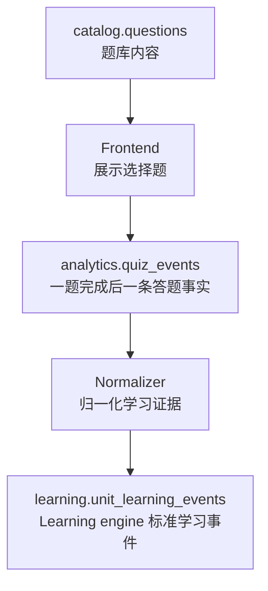

# 题目入库文档

## 0. 文档信息

文档状态：MVP 数据库设计草案

适用范围：选择题题库入库、前端答题结果上报、后续归一化为 Learning engine 学习事件。

当前边界：本文只设计 `catalog.questions` 和 `analytics.quiz_events` 两张表。本文不设计题目生成 prompt、前端 UI、题目推荐算法、Learning engine reducer 细节。

## 1. 总体结论

MVP 只需要两张新增表：

```text
catalog.questions
analytics.quiz_events
```

它们分别承担两个不同层级：

```text
catalog.questions
= 题库内容资产。保存题是什么、考察哪个学习单元、题干和选项是什么。

analytics.quiz_events
= 前端汇总后的答题事实。用户完成一道题后一次性上报一条记录。
```

`analytics.quiz_events` 不是 Learning engine 事件表。它只记录前端发生的事实。后续标准化层再根据这些事实生成 `learning.unit_learning_events(event_type = 'quiz')`。

整体链路如下：



## 2. 设计原则

### 2.1 题库是内容资产

题目属于 Catalog owner，因为它是围绕 `semantic.coarse_unit`、`catalog.videos`、字幕上下文生成的内容资产。

题目表只保存可复用内容，不保存用户答题行为。

### 2.2 答题上报是 analytics 原始事实

用户答题过程属于前端交互事实，进入 Analytics owner。

`analytics.quiz_events` 不直接改变学习状态，不保存 `progress_quality`，也不代表用户已经掌握某个学习单元。

### 2.3 前端负责选择题本地判定

MVP 所有题都是选择题。题目 payload 直接包含正确选项。前端可以基于 option id 判断：

```text
option.id == "correct"
```

因此不需要后端实时判题，也不需要把正确答案藏在单独的安全字段里。

### 2.4 一道题只上报一次完成事件

前端允许用户一直选择错误选项。错误选项标红，用户可以继续选；选到正确选项后标绿并锁定，进入下一题。

数据库不记录每次点击为独立事件。前端在用户选到正确选项、当前题完成时，一次性上报：

- 选择过哪些选项；
- 每次选择前等待了多久；
- 第一次是否选对；
- 总用时。

## 3. `catalog.questions`

### 3.1 表职责

`catalog.questions` 保存题目内容。它回答的问题是：

```text
系统有哪些题？
每道题考察哪个 coarse_unit？
这道题是通用题，还是视频上下文题？
前端应该展示什么 question、context、options 和 explanation？
```

它不回答：

- 哪个用户看过这道题；
- 哪个用户选了什么；
- 用户是否掌握了这个学习单元；
- 这次答题是否应该影响 Learning engine。

### 3.2 推荐 DDL

```sql
create table catalog.questions (
  question_id uuid primary key default gen_random_uuid(),

  scope_type text not null
    check (scope_type in ('unit', 'video_unit')),

  question_type text not null
    check (question_type in (
      'context_meaning_choice',
      'unit_meaning_choice',
      'context_cloze_choice',
      'reverse_identification_choice'
    )),

  coarse_unit_id bigint not null
    references semantic.coarse_unit(id) on delete restrict,

  target_text text not null,

  video_id uuid
    references catalog.videos(video_id) on delete cascade,

  context_sentence_index integer,
  context_span_index integer,
  context_start_ms integer,
  context_end_ms integer,

  content_payload jsonb not null,

  status text not null default 'active'
    check (status in ('draft', 'active', 'retired', 'rejected')),

  created_at timestamptz not null default now(),
  updated_at timestamptz not null default now(),

  check (jsonb_typeof(content_payload) = 'object'),
  check (
    (scope_type = 'unit' and video_id is null)
    or
    (scope_type = 'video_unit' and video_id is not null)
  ),
  check (
    context_start_ms is null
    or context_end_ms is null
    or context_end_ms > context_start_ms
  )
);
```

### 3.3 字段说明

| 字段 | 类型 | 必填 | 作用 |
| --- | --- | --- | --- |
| `question_id` | `uuid` | 是 | 题目主键。前端拉题、答题上报、analytics 事件都用它引用题目。 |
| `scope_type` | `text` | 是 | 题目绑定粒度。`unit` 表示 per unit 通用题；`video_unit` 表示 per video * unit 视频上下文题。 |
| `question_type` | `text` | 是 | 题型。MVP 固定为四种选择题类型。 |
| `coarse_unit_id` | `bigint` | 是 | 学习系统真正追踪的学习单元 ID。后续能否生成 Learning engine quiz evidence，核心取决于这个字段。 |
| `target_text` | `text` | 是 | 题目实际展示和考察的单词或短语文本，例如 `barely`。它是词面，不替代 `coarse_unit_id`。 |
| `video_id` | `uuid` | 否 | 视频上下文题所属视频。`scope_type = video_unit` 时必填；`scope_type = unit` 时必须为空。 |
| `context_sentence_index` | `integer` | 否 | 视频上下文题使用的代表性字幕句索引。用于回看、定位和排障。 |
| `context_span_index` | `integer` | 否 | 视频上下文题中目标词或短语对应的 semantic span 索引。 |
| `context_start_ms` | `integer` | 否 | 上下文片段开始时间。单位毫秒。 |
| `context_end_ms` | `integer` | 否 | 上下文片段结束时间。单位毫秒。必须晚于 `context_start_ms`。 |
| `content_payload` | `jsonb` | 是 | 前端渲染题目需要的完整内容，包括 question、可选 context_text、options、explanation。正确选项也在这里。 |
| `status` | `text` | 是 | 题目生命周期。`active` 可出题；`draft` 未上线；`retired` 已下线；`rejected` 生成后被拒绝。 |
| `created_at` | `timestamptz` | 是 | 题目创建时间。 |
| `updated_at` | `timestamptz` | 是 | 题目最后更新时间。 |

### 3.4 `scope_type`

`scope_type = 'unit'` 表示通用题。

这类题只绑定 `coarse_unit_id`，不绑定具体视频。适合：

- 通用释义选择题；
- 反向识别题；
- Feed 复习卡；
- 视频上下文题缺失时的 fallback。

`scope_type = 'video_unit'` 表示视频上下文题。

这类题绑定 `video_id + coarse_unit_id`。适合：

- 语境释义选择题；
- 语境填空选择题；
- 视频末尾测试；
- lookup 后即刻练习。

### 3.5 `question_type`

MVP 题型固定为四种：

| 值 | 说明 | 典型 `scope_type` |
| --- | --- | --- |
| `context_meaning_choice` | 语境释义选择题。给出视频上下文，问目标词在此语境中的意思。 | `video_unit` |
| `unit_meaning_choice` | 通用释义选择题。给出词或短语，选择正确释义。 | `unit` |
| `context_cloze_choice` | 语境填空选择题。把上下文里的目标词隐去，让用户选回正确词。 | `video_unit` |
| `reverse_identification_choice` | 反向识别题。给出中文义或释义，让用户选择对应英文词或短语。 | `unit` |

### 3.6 `content_payload`

`content_payload` 是前端直接使用的题目内容。

MVP 约定：

```json
{
  "question": "这里的 “barely” 最接近什么意思？",
  "context_text": "I barely made it to the meeting on time.",
  "options": [
    { "id": "correct", "text": "几乎不 / 勉强" },
    { "id": "wrong_1", "text": "非常快" },
    { "id": "wrong_2", "text": "提前" },
    { "id": "wrong_3", "text": "故意" }
  ],
  "explanation": "barely 在这句话里表示差一点没做到，也就是勉强赶上。"
}
```

字段含义：

| 字段 | 必填 | 作用 |
| --- | --- | --- |
| `question` | 是 | 题目问题文本。字段名使用 `question`，不使用 `prompt`。 |
| `context_text` | 否 | 上下文文本。语境题通常有；通用题可以没有。 |
| `options` | 是 | 选择项数组。存储顺序固定为正确项第一，错误项随后。前端展示时可以自行打乱顺序。 |
| `options[].id` | 是 | 选项稳定 ID。正确项固定为 `correct`；错误项使用 `wrong_1`、`wrong_2`、`wrong_3` 等。 |
| `options[].text` | 是 | 选项展示文本。 |
| `explanation` | 否 | 中文解释正确选项为什么对。用户第一次选错时不展示；最终选对后展示。它不解释每个错误选项为什么错。 |

注意：

- `content_payload` 不需要 `target_text`，因为 `target_text` 已经是表字段。
- `content_payload` 不需要 `correct_option_id`，因为正确选项固定为 `options[].id = 'correct'`。
- `content_payload` 不需要单独的 `answer_payload`，因为前端需要知道正确答案并在本地判定。

### 3.7 约束取舍

同一个 `coarse_unit_id + question_type` 可以有多道通用题。

同一个 `video_id + coarse_unit_id + question_type` 也可以有多道视频上下文题。

因此 MVP 不设置这类唯一约束：

```text
unique(coarse_unit_id, question_type)
unique(video_id, coarse_unit_id, question_type)
```

题库可以自然积累多个变体。取题策略由业务层决定，例如随机取、按最近未出现取、按创建时间取。

### 3.8 推荐索引

```sql
create index idx_questions_video_unit_active
on catalog.questions (video_id, coarse_unit_id, question_type, created_at desc)
where scope_type = 'video_unit' and status = 'active';

create index idx_questions_unit_active
on catalog.questions (coarse_unit_id, question_type, created_at desc)
where scope_type = 'unit' and status = 'active';

create index idx_questions_status_created_at
on catalog.questions (status, created_at desc);
```

索引目的：

- 优先按 `video_id + coarse_unit_id` 找视频上下文题；
- fallback 时按 `coarse_unit_id` 找通用题；
- 管理后台或批处理按状态扫描题库。

### 3.9 Catalog ingest 写入规则

本地 Catalog ingest 从每个 clip 同名 question JSON 的 `questions[]` 写入 `catalog.questions`。question JSON 文件必须与父 clip 推导出的 transcript 文件同名，且必须和 transcript 同时存在。这个 ingest 入口只负责视频上下文题，写库时固定使用 `scope_type = 'video_unit'`，不通过该入口写入 `scope_type = 'unit'` 的通用题。

写入规则固定如下：

- `scope_type` 由 ingest 固定写为 `video_unit`；question JSON 可以省略该字段，如果显式提供则必须是 `video_unit`。
- `video_id` 由当前 clip 的 `catalog.videos` upsert 结果回填，所有入库题目都必须与当前视频绑定。
- `status` 由 ingest 固定写为 `active`；question JSON 中即使带有 `status` 也会被忽略。
- `question_id` 由 ingest 生成 deterministic UUID，避免同一文件重复导入产生重复题。
- deterministic UUID 的输入为：`source_clip_key + coarse_unit_id + question_type + context_sentence_index + context_span_index + canonical content_payload hash`。
- `content_payload` 按 JSON 原样写入，字段契约仍以本文 `content_payload` 约定为准。
- 本次导入未出现但属于同一 `video_id` 的旧 `video_unit` questions 更新为 `retired`，不删除，避免破坏已有 `analytics.quiz_events` 历史外键。
- question payload 或 `selected_coarse_unit_refs` 与 transcript 不一致时，该 clip 记为入库失败。

### 3.10 入库样例：视频上下文题

```sql
insert into catalog.questions (
  scope_type,
  question_type,
  coarse_unit_id,
  target_text,
  video_id,
  context_sentence_index,
  context_span_index,
  context_start_ms,
  context_end_ms,
  content_payload,
  status
) values (
  'video_unit',
  'context_meaning_choice',
  123,
  'barely',
  '4f431b2f-64f5-4df8-a9ce-a7f9ddf1da9e',
  8,
  2,
  15200,
  17600,
  '{
    "question": "这里的 “barely” 最接近什么意思？",
    "context_text": "I barely made it to the meeting on time.",
    "options": [
      { "id": "correct", "text": "几乎不 / 勉强" },
      { "id": "wrong_1", "text": "非常快" },
      { "id": "wrong_2", "text": "提前" },
      { "id": "wrong_3", "text": "故意" }
    ],
    "explanation": "barely 在这句话里表示差一点没做到，也就是勉强赶上。"
  }'::jsonb,
  'active'
);
```

### 3.11 入库样例：通用题

```sql
insert into catalog.questions (
  scope_type,
  question_type,
  coarse_unit_id,
  target_text,
  content_payload,
  status
) values (
  'unit',
  'unit_meaning_choice',
  123,
  'barely',
  '{
    "question": "“barely” 通常是什么意思？",
    "options": [
      { "id": "correct", "text": "几乎不 / 勉强" },
      { "id": "wrong_1", "text": "经常" },
      { "id": "wrong_2", "text": "明显地" },
      { "id": "wrong_3", "text": "马上" }
    ],
    "explanation": "barely 通常表示 barely enough 或 almost not，也就是“几乎不、勉强”。"
  }'::jsonb,
  'active'
);
```

## 4. `analytics.quiz_events`

### 4.1 表职责

`analytics.quiz_events` 保存前端汇总后的答题事实。

它回答的问题是：

```text
用户完成了哪道题？
用户按什么顺序选择了哪些选项？
每次选择之前间隔了多久？
第一次是否选对？
这道题发生在哪个视频、推荐 run 或触发场景下？
```

它不回答：

- 用户最终掌握程度是多少；
- 这次答题应该给 Learning Engine 多少 `progress_quality`；
- 下次什么时候复习；
- 是否应该影响推荐排序。

这些属于后续 normalize 和 Learning engine reducer。

### 4.2 推荐 DDL

```sql
create schema if not exists analytics;

create table analytics.quiz_events (
  event_id uuid primary key default gen_random_uuid(),

  client_event_id text not null,

  user_id uuid not null
    references auth.users(id) on delete cascade,

  client_context jsonb not null default '{}'::jsonb,

  question_id uuid not null
    references catalog.questions(question_id) on delete restrict,

  coarse_unit_id bigint not null
    references semantic.coarse_unit(id) on delete restrict,

  video_id uuid
    references catalog.videos(video_id) on delete set null,

  recommendation_run_id uuid,

  trigger_type text not null
    check (trigger_type in (
      'video_end',
      'lookup_practice',
      'feed_review',
      'mid_video',
      'manual'
    )),

  selected_option_ids text[] not null,
  selection_interval_ms integer[] not null,

  is_first_try_correct boolean not null,
  total_elapsed_ms integer not null,

  shown_at timestamptz not null,
  completed_at timestamptz not null,

  created_at timestamptz not null default now(),

  check (cardinality(selected_option_ids) >= 1),
  check (cardinality(selected_option_ids) = cardinality(selection_interval_ms)),
  check (selected_option_ids[cardinality(selected_option_ids)] = 'correct'),
  check (is_first_try_correct = (selected_option_ids[1] = 'correct')),
  check (total_elapsed_ms >= 0),
  check (completed_at >= shown_at),
  check (jsonb_typeof(client_context) = 'object')
);
```

### 4.3 字段说明

| 字段 | 类型 | 必填 | 作用 |
| --- | --- | --- | --- |
| `event_id` | `uuid` | 是 | 服务端生成的 analytics 事件主键。后续 normalize 可用它追溯原始答题事实。 |
| `client_event_id` | `text` | 是 | 前端生成的幂等 ID。网络重试时保持不变，用于避免重复入库。 |
| `user_id` | `uuid` | 是 | 用户 ID。应由后端认证上下文填入，不信任前端请求体。 |
| `client_context` | `jsonb` | 是 | 客户端环境上下文。三张 analytics raw fact 表统一使用该字段，保存 `platform`、`app_version`、`os_version`、`device_model` 等低频排障信息。 |
| `question_id` | `uuid` | 是 | 用户完成的是哪道题。引用 `catalog.questions`。 |
| `coarse_unit_id` | `bigint` | 是 | 本次答题绑定的学习单元。通常来自题目表，用于后续 normalize。 |
| `video_id` | `uuid` | 否 | 本次答题发生的视频上下文。通用题也可能在某个视频末尾被触发，因此它不是只属于视频上下文题。 |
| `recommendation_run_id` | `uuid` | 否 | 如果本次题目来自某次推荐 feed 或视频末尾测试，记录对应 recommendation run。MVP 不强制外键，避免 analytics 表和 Recommendation 生命周期强耦合。 |
| `trigger_type` | `text` | 是 | 触发来源。区分视频末尾、lookup 后练习、Feed 复习卡、视频中途、手动触发。 |
| `selected_option_ids` | `text[]` | 是 | 用户实际选择过的 option id 序列。最后一项必须是 `correct`，因为前端在选对后才完成并上报。 |
| `selection_interval_ms` | `integer[]` | 是 | 每次选择前的间隔时间。数组长度必须和 `selected_option_ids` 一致。 |
| `is_first_try_correct` | `boolean` | 是 | 用户第一次选择是否就是正确选项。它是前端交互事实，不是 Learning engine 学习结论。 |
| `total_elapsed_ms` | `integer` | 是 | 从题目展示到最终选对完成的总耗时。单位毫秒。 |
| `shown_at` | `timestamptz` | 是 | 题目展示时间。 |
| `completed_at` | `timestamptz` | 是 | 用户选到正确选项并完成本题的时间。 |
| `created_at` | `timestamptz` | 是 | 服务端入库时间。 |

前端应在 telemetry 基础层维护一个全局只读的客户端环境上下文，并在每次 quiz attempt 上报时填入 `client_context`：

```ts
const telemetryClientContext = {
  platform: "ios",
  app_version: "1.3.0",
  os_version: "18.5",
  device_model: "iPhone16,2"
};
```

`client_context` 只描述客户端运行环境，不描述答题入口。答题入口继续使用 `trigger_type`，例如 `video_end`、`lookup_practice`、`feed_review`。

### 4.4 `selection_interval_ms` 语义

`selection_interval_ms` 不是每次点击之后的耗时，而是每次选择之前的等待时间。

定义如下：

```text
题目出现
  -> selection_interval_ms[0]
  -> selected_option_ids[0]
  -> selection_interval_ms[1]
  -> selected_option_ids[1]
  -> selection_interval_ms[2]
  -> selected_option_ids[2]
```

因此：

```text
cardinality(selection_interval_ms) = cardinality(selected_option_ids)
```

例子：

```json
{
  "selected_option_ids": ["wrong_2", "wrong_1", "correct"],
  "selection_interval_ms": [1800, 1200, 900]
}
```

含义是：

```text
题目出现 1800ms 后，用户选择 wrong_2
再过 1200ms 后，用户选择 wrong_1
再过 900ms 后，用户选择 correct
```

### 4.5 `is_first_try_correct`

`is_first_try_correct` 表示用户第一次选择是否选对。

它必须和 `selected_option_ids[1] = 'correct'` 一致。PostgreSQL 数组下标从 1 开始，因此 DDL 中使用：

```sql
check (is_first_try_correct = (selected_option_ids[1] = 'correct'))
```

该字段是冗余摘要字段，但它有两个价值：

- 前端、analytics 查询和后续 normalizer 不必每次解析数组；
- 数据含义更直观，方便统计首答正确率。

### 4.6 推荐索引

```sql
create unique index uq_quiz_events_user_client_event
on analytics.quiz_events (user_id, client_event_id);

create index idx_quiz_events_user_completed_at
on analytics.quiz_events (user_id, completed_at desc);

create index idx_quiz_events_question_completed_at
on analytics.quiz_events (question_id, completed_at desc);

create index idx_quiz_events_unit_completed_at
on analytics.quiz_events (coarse_unit_id, completed_at desc);

create index idx_quiz_events_video_completed_at
on analytics.quiz_events (video_id, completed_at desc)
where video_id is not null;
```

索引目的：

- `uq_quiz_events_user_client_event` 保证前端重试幂等；
- 按用户回看答题历史；
- 按题目统计使用情况；
- 按学习单元聚合答题行为；
- 按视频分析视频末尾测试或上下文题效果。

### 4.7 前端上报 JSON 样例

用户看到一道题，前端自己打乱选项顺序。用户先选 `wrong_2`，再选 `wrong_1`，最后选 `correct`，选对后本题锁定并上报。

请求体：

```json
{
  "client_event_id": "evt_20260511_001",
  "client_context": {
    "platform": "ios",
    "app_version": "1.3.0",
    "os_version": "18.5",
    "device_model": "iPhone16,2"
  },
  "question_id": "8ef5f19d-2f5d-45e3-8d6e-5df96b6c7f31",
  "coarse_unit_id": 123,
  "video_id": "4f431b2f-64f5-4df8-a9ce-a7f9ddf1da9e",
  "recommendation_run_id": "ac99d61b-f88f-4433-ad51-23d8076769bd",
  "trigger_type": "video_end",
  "selected_option_ids": ["wrong_2", "wrong_1", "correct"],
  "selection_interval_ms": [1800, 1200, 900],
  "is_first_try_correct": false,
  "total_elapsed_ms": 3900,
  "shown_at": "2026-05-11T20:10:01Z",
  "completed_at": "2026-05-11T20:10:05Z"
}
```

如果用户第一次就选对：

```json
{
  "client_event_id": "evt_20260511_002",
  "client_context": {
    "platform": "ios",
    "app_version": "1.3.0",
    "os_version": "18.5",
    "device_model": "iPhone16,2"
  },
  "question_id": "8ef5f19d-2f5d-45e3-8d6e-5df96b6c7f31",
  "coarse_unit_id": 123,
  "video_id": "4f431b2f-64f5-4df8-a9ce-a7f9ddf1da9e",
  "recommendation_run_id": "ac99d61b-f88f-4433-ad51-23d8076769bd",
  "trigger_type": "video_end",
  "selected_option_ids": ["correct"],
  "selection_interval_ms": [2100],
  "is_first_try_correct": true,
  "total_elapsed_ms": 2100,
  "shown_at": "2026-05-11T20:12:01Z",
  "completed_at": "2026-05-11T20:12:03.100Z"
}
```

### 4.8 入库 SQL 样例

后端应从认证上下文取得 `user_id`，不要信任前端传入。

```sql
insert into analytics.quiz_events (
  client_event_id,
  user_id,
  client_context,
  question_id,
  coarse_unit_id,
  video_id,
  recommendation_run_id,
  trigger_type,
  selected_option_ids,
  selection_interval_ms,
  is_first_try_correct,
  total_elapsed_ms,
  shown_at,
  completed_at
) values (
  $1,
  $2,
  $3,
  $4,
  $5,
  $6,
  $7,
  $8,
  $9,
  $10,
  $11,
  $12,
  $13,
  $14
)
on conflict (user_id, client_event_id) do nothing;
```

## 5. 与 `learning.unit_learning_events` 的关系

`analytics.quiz_events` 是前端答题事实，不是 Learning engine 事件。

后续 normalizer 可以按如下规则读取一条 quiz event：

```text
event = analytics.quiz_events
```

然后派生 Learning engine 标准事件：

```text
event_type = 'quiz'
source_type = 'quiz_event'
source_ref_id = analytics.quiz_events.event_id
coarse_unit_id = analytics.quiz_events.coarse_unit_id
video_id = analytics.quiz_events.video_id
response_time_ms = analytics.quiz_events.total_elapsed_ms
metadata = {
  "question_id": "...",
  "trigger_type": "video_end",
  "selected_option_ids": ["wrong_2", "wrong_1", "correct"],
  "wrong_selection_count": 2,
  "is_first_try_correct": false
}
```

是否写入、写入时 `progress_quality` 如何计算，不在本文定稿。MVP 可以先只保证 analytics 原始事实完整、可追溯。

## 6. 取题与上报流程

### 6.1 取题

推荐取题顺序：

1. 当前视频有 `video_unit` 题时，优先使用 `video_id + coarse_unit_id` 查 `catalog.questions`。
2. 没有视频上下文题时，fallback 到 `scope_type = 'unit'` 的通用题。
3. 同一个类型有多道题时，不在数据库层限制，由业务层决定取哪道。

示例查询：

```sql
select *
from catalog.questions
where scope_type = 'video_unit'
  and status = 'active'
  and video_id = $1
  and coarse_unit_id = $2
order by random()
limit 1;
```

fallback：

```sql
select *
from catalog.questions
where scope_type = 'unit'
  and status = 'active'
  and coarse_unit_id = $1
order by random()
limit 1;
```

### 6.2 前端展示

前端收到题目后：

1. 读取 `content_payload.options`；
2. 自行打乱展示顺序；
3. 用户选错时标红，继续允许选择；
4. 用户选中 `id = 'correct'` 时标绿并锁定；
5. 显示 `content_payload.explanation`；
6. 当前题完成时，一次性上报 `analytics.quiz_events`，然后再进入下一题或关闭练习。

### 6.3 入库

后端收到前端上报后：

1. 从 auth/session 取得 `user_id`；
2. 可选地校验 `question_id` 是否存在；
3. 可选地校验 `coarse_unit_id` 是否等于题目表中的 `coarse_unit_id`；
4. 校验 `client_context` 是 JSON object；未传时使用 `{}`；
5. 插入 `analytics.quiz_events`；
6. 使用 `(user_id, client_event_id)` 保证幂等。

## 7. 暂不做的内容

MVP 不做以下内容：

- 不设计 `quiz_sessions`；
- 不设计 `quiz_session_questions`；
- 不按每次选项点击写多条事件；
- 不保存 `shown_option_ids`；
- 不保存 `answer_payload`；
- 不保存 `progress_quality`；
- 不保存 `source_transcript_checksum`；
- 不限制同一个 unit/type 或 video/unit/type 只能有一题；
- 不把完整题目或用户答案塞进 `learning.unit_learning_events`。

这些约束可以避免数据库过度设计。当前只保留题库内容与一题完成后的前端事实。
