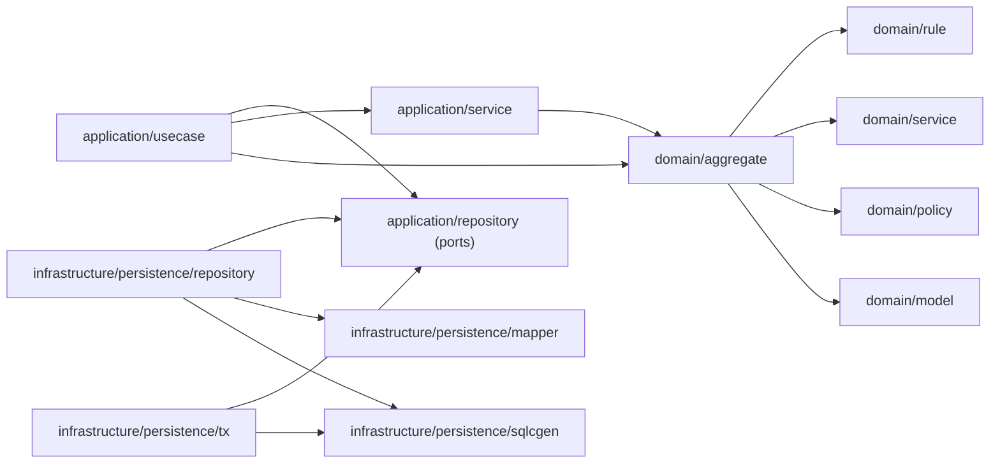
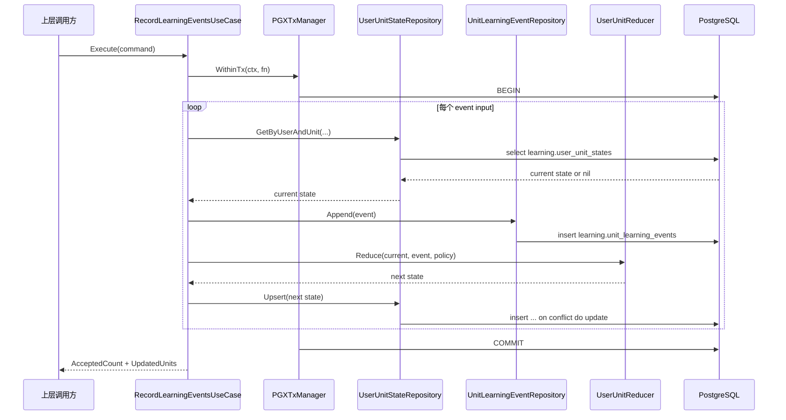
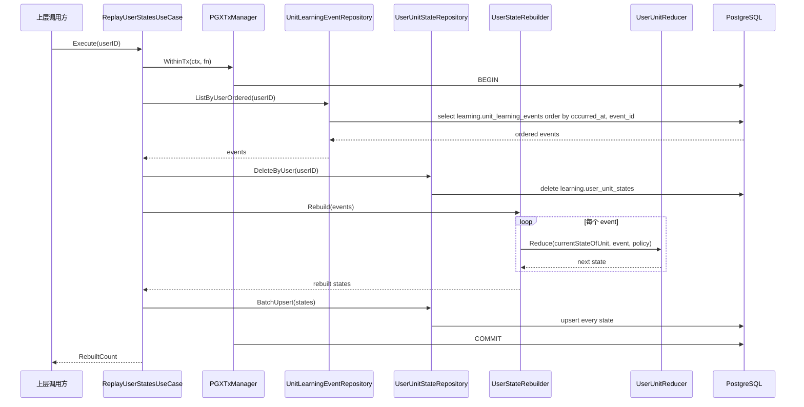
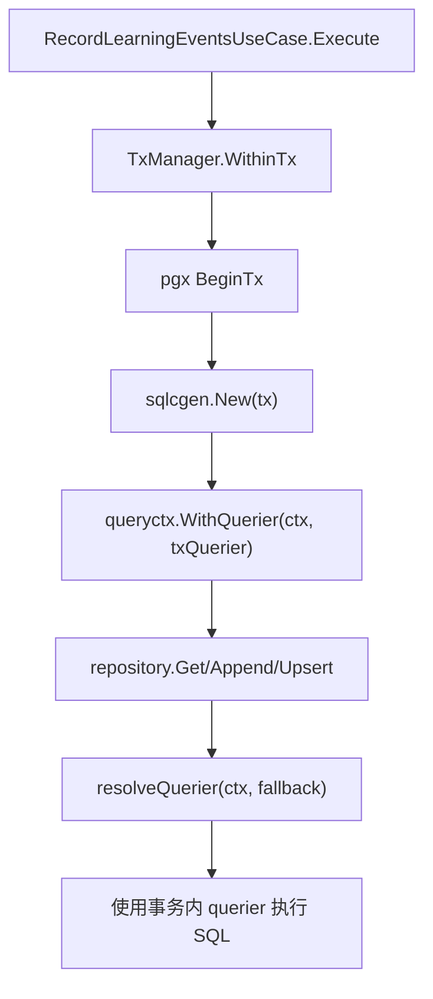
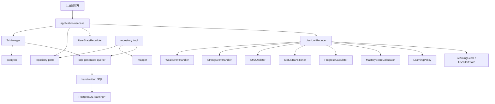

# 学习引擎工程实现（代码实现详解）

## 1. 文档目标

这份文档只讲 `internal/learningengine` 的**当前真实代码实现**。

面向对象是第一次接手这个模块的新同学。阅读完以后，应该能回答下面这些问题：

- 这个模块在整个项目里到底负责什么，不负责什么
- 代码为什么按现在这套目录分层
- 每一层、每个目录、每个关键文件分别做什么
- 在线事件写入是如何从 use case 一路走到 SQL 的
- full replay 是如何复用同一套 reducer 的
- 事务是怎么传递到 repository 的
- 测试分别覆盖了什么
- 想改某类规则时，应该改哪几个文件，不能改哪几个文件

这份文档尽量不重复产品设计和领域规则定义本身。下面这些内容仍以仓库总文档为准：

- 学习事件语义
- 强 / 弱事件边界
- 状态迁移规则
- SM-2 规则
- replay 的产品范围

对应总文档：

- [学习引擎-整体设计.md](/Users/evan/Downloads/learning-video-recommendation-system/docs/学习引擎-整体设计.md)

---

## 2. 模块定位

`internal/learningengine` 是一个**独立的学习状态引擎**，不是推荐模块，也不是上层 API。

它只负责两件事：

1. 追加记录学习事件真相层 `learning.unit_learning_events`
2. 维护状态投影层 `learning.user_unit_states`

它不负责：

- 推荐批次
- 推荐投放状态
- 推荐审计
- 视频召回
- 学习任务组装

一句话概括：

> Learning engine 负责把“用户发生了哪些学习行为”稳定归约成“用户当前对某个 coarse unit 学到了什么程度”。

---

## 3. 实现总览

### 3.1 当前目录结构

```text
internal/learningengine/
  README.md
  doc.go
  docs/
    学习引擎工程实现.md
  application/
    doc.go
    command/
      doc.go
      record_learning_events.go
      replay_user_states.go
    dto/
      doc.go
      record_learning_events_result.go
      replay_user_states_result.go
    repository/
      doc.go
      tx_manager.go
      unit_learning_event_repository.go
      user_unit_state_repository.go
    service/
      user_state_rebuilder.go
    usecase/
      doc.go
      record_learning_events.go
      replay_user_states.go
  domain/
    doc.go
    aggregate/
      user_unit_reducer.go
    enum/
      doc.go
      event_type.go
      unit_kind.go
      unit_status.go
    model/
      doc.go
      coarse_unit_ref.go
      learning_event.go
      user_unit_state.go
    policy/
      doc.go
      learning_policy.go
    rule/
      doc.go
      state_helpers.go
      strong_event_handler.go
      weak_event_handler.go
    service/
      doc.go
      mastery_calculator.go
      progress_calculator.go
      sm2_updater.go
      status_transitioner.go
  infrastructure/
    doc.go
    config.go
    db.go
    migration/
      000001_create_learning_schema.up.sql
      000001_create_learning_schema.down.sql
      000002_create_user_unit_states.up.sql
      000002_create_user_unit_states.down.sql
      000003_create_unit_learning_events.up.sql
      000003_create_unit_learning_events.down.sql
      000004_create_learning_indexes.up.sql
      000004_create_learning_indexes.down.sql
      README.md
    persistence/
      mapper/
        doc.go
        pgtype_helpers.go
        unit_learning_event_mapper.go
        user_unit_state_mapper.go
      query/
        unit_events.sql
        unit_states.sql
      queryctx/
        context.go
      repository/
        doc.go
        querier_resolver.go
        unit_learning_event_repo.go
        user_unit_state_repo.go
      schema/
        external.sql
      sqlcgen/
        db.go
        models.go
        querier.go
        unit_events.sql.go
        unit_states.sql.go
      tx/
        doc.go
        pgx_tx_manager.go
  test/
    doc.go
    unit/
      doc.go
      domain/
        aggregate/
          user_unit_reducer_test.go
        policy/
          learning_policy_test.go
        rule/
          strong_event_handler_test.go
          weak_event_handler_test.go
        service/
          progress_mastery_calculator_test.go
          sm2_updater_test.go
          status_transitioner_test.go
      infrastructure/
        config_test.go
    integration/
      doc.go
      fixture/
        helpers.go
      infrastructure/
        db_integration_test.go
      usecase/
        record_learning_events_usecase_test.go
        replay_user_states_usecase_test.go
```

### 3.2 分层设计的核心原则

当前实现严格遵守这条边界：

- `application` 负责用例编排
- `domain` 负责纯规则
- `infrastructure` 负责数据库与技术落地
- `test` 负责验证

这套结构的直接收益是：

- 业务规则不会散在 SQL、repository、用例里
- replay 和在线写入能共享同一套 reducer
- repository 只做数据读写，不做状态机
- 新人排查问题时可以按层定位

### 3.3 模块内依赖方向



可以把它理解成：

- 用例层只依赖 port 和领域规则
- 领域层不反向依赖数据库实现
- 基础设施层实现 port，并把 SQL/pgx/sqlc 接进去

---

## 4. 两条主流程

Learning engine 只有两条核心业务流程：

1. 在线写入事件并更新状态
2. full replay 重建状态

### 4.1 在线写入总流程



### 4.2 replay 总流程



这两条流程最关键的工程原则是：

- **在线写入和 replay 共用同一个 reducer**
- **事务边界在 use case 外层统一控制**
- **repository 不承担领域规则**

---

## 5. 关键对象与数据模型

### 5.1 领域模型

当前领域层最重要的两个对象是：

- `model.LearningEvent`
- `model.UserUnitState`

它们分别对应：

- 事件真相层 `learning.unit_learning_events`
- 状态投影层 `learning.user_unit_states`

### 5.2 `LearningEvent`

文件：

- [learning_event.go](/Users/evan/Downloads/learning-video-recommendation-system/internal/learningengine/domain/model/learning_event.go)

作用：

- 表示一次标准化后的学习行为
- 是 reducer 的输入
- 也是事件表 append 的写入对象

关键字段：

- `UserID`
- `CoarseUnitID`
- `VideoID`
- `EventType`
- `SourceType`
- `SourceRefID`
- `IsCorrect`
- `Quality`
- `ResponseTimeMs`
- `Metadata`
- `OccurredAt`
- `CreatedAt`

### 5.3 `UserUnitState`

文件：

- [user_unit_state.go](/Users/evan/Downloads/learning-video-recommendation-system/internal/learningengine/domain/model/user_unit_state.go)

作用：

- 表示某个用户对某个 coarse unit 的当前学习状态
- 是 reducer 的输出
- 是 Recommendation 读取的核心输入之一

可以把它按 6 类字段理解：

1. 主键与归属
   - `UserID`
   - `CoarseUnitID`
2. 目标属性
   - `IsTarget`
   - `TargetSource`
   - `TargetSourceRefID`
   - `TargetPriority`
3. 当前学习状态
   - `Status`
   - `ProgressPercent`
   - `MasteryScore`
4. 最近行为时间
   - `FirstSeenAt`
   - `LastSeenAt`
   - `LastReviewedAt`
5. 计数与窗口
   - `SeenCount`
   - `StrongEventCount`
   - `ReviewCount`
   - `CorrectCount`
   - `WrongCount`
   - `ConsecutiveCorrect`
   - `ConsecutiveWrong`
   - `LastQuality`
   - `RecentQualityWindow`
   - `RecentCorrectnessWindow`
6. 调度相关状态
   - `Repetition`
   - `IntervalDays`
   - `EaseFactor`
   - `NextReviewAt`

### 5.4 枚举

文件：

- [event_type.go](/Users/evan/Downloads/learning-video-recommendation-system/internal/learningengine/domain/enum/event_type.go)
- [unit_kind.go](/Users/evan/Downloads/learning-video-recommendation-system/internal/learningengine/domain/enum/unit_kind.go)
- [unit_status.go](/Users/evan/Downloads/learning-video-recommendation-system/internal/learningengine/domain/enum/unit_status.go)

作用：

- 给事件类型、学习单元类型、状态枚举统一命名
- 避免上层逻辑散落硬编码字符串

当前事件类型：

- `exposure`
- `lookup`
- `new_learn`
- `review`
- `quiz`

当前状态类型：

- `new`
- `learning`
- `reviewing`
- `mastered`
- `suspended`

### 5.5 固定策略

文件：

- [learning_policy.go](/Users/evan/Downloads/learning-video-recommendation-system/internal/learningengine/domain/policy/learning_policy.go)

作用：

- 集中管理 MVP 当前固定参数
- 避免 magic numbers 散在 reducer 和 service 中

当前内置默认值：

- `MasteredIntervalDays = 21`
- `InitialIntervals = [1, 3, 6]`
- `MinEaseFactor = 1.3`

---

## 6. application 层详解

`application` 只负责**用例编排**，不负责纯规则。

### 6.1 `application/doc.go`

作用：

- 作为 `application` 包层的文档锚点
- 帮助 IDE / godoc 展示层级说明

### 6.2 `application/command/`

这个目录定义 use case 输入对象。

#### `command/doc.go`

作用：

- 说明 command 子包用途

#### `record_learning_events.go`

定义：

- `LearningEventInput`
- `RecordLearningEventsCommand`

职责：

- 给“记录学习事件”用例提供稳定输入结构
- 把上层输入和领域对象构造解耦

关键点：

- `LearningEventInput` 还不是 domain event
- use case 内会把它转换成 `model.LearningEvent`
- `IdempotencyKey` 已经在 command 上预留，但当前实现尚未真正用于幂等控制

#### `replay_user_states.go`

定义：

- `ReplayUserStatesCommand`

职责：

- full replay 只需要一个 `UserID`
- 用最小 command 表达 replay 请求

### 6.3 `application/dto/`

这个目录定义用例输出对象。

#### `dto/doc.go`

作用：

- 说明 DTO 子包用途

#### `record_learning_events_result.go`

定义：

- `RecordLearningEventsResult`

职责：

- 返回本次 accepted event 数量
- 返回哪些 coarse unit 被更新

#### `replay_user_states_result.go`

定义：

- `ReplayUserStatesResult`

职责：

- 返回重建出的状态数
- 返回 replay 是否出现错误

### 6.4 `application/repository/`

这个目录只放 port interface，不放实现。

#### `repository/doc.go`

作用：

- 说明这里只是应用层依赖的仓储接口

#### `tx_manager.go`

定义：

- `TxManager`

职责：

- 把事务边界抽象成应用层接口
- 让 use case 不依赖 pgx 的具体事务实现

#### `unit_learning_event_repository.go`

定义：

- `UnitLearningEventRepository`

职责：

- 暴露事件表的 append 和按用户顺序读取能力

#### `user_unit_state_repository.go`

定义：

- `UserUnitStateRepository`

职责：

- 暴露状态表的单条读取、upsert、批量 upsert、按用户删除能力

### 6.5 `application/service/`

当前这里只有一个服务。

#### `user_state_rebuilder.go`

定义：

- `UserStateRebuilder`
- `userStateRebuilder`
- `NewUserStateRebuilder`
- `Rebuild`

职责：

- replay 时按事件顺序为每个 unit 逐步重建最终状态
- 内部使用 `map[int64]*UserUnitState` 按 `CoarseUnitID` 聚合
- 完全复用 `aggregate.UserUnitReducer`

为什么它放在 `application/service` 而不是 `domain/service`：

- 它不是原子业务规则
- 它承担的是“如何组织 replay 重建过程”的编排职责
- 它把 reducer 组合成一个批处理过程，更接近 application 层

### 6.6 `application/usecase/`

这是应用层真正的业务入口。

#### `usecase/doc.go`

作用：

- 说明 use case 是模块入口

#### `record_learning_events.go`

定义：

- `RecordLearningEventsUseCase`
- `NewRecordLearningEventsUseCase`
- `Execute`

依赖：

- `TxManager`
- `UserUnitStateRepository`
- `UnitLearningEventRepository`
- `aggregate.UserUnitReducer`

核心流程：

1. 初始化结果容器 `updatedUnits`
2. 创建 `seenUnits`，用于结果去重
3. 读取默认 `LearningPolicy`
4. 进入 `WithinTx`
5. 对每个输入事件：
   - 读取当前 state
   - 构造 `model.LearningEvent`
   - append 到事件表
   - 调 reducer 计算 next state
   - upsert 到状态表
   - 记录被影响的 coarse unit
6. 事务提交后返回 DTO

几个实现细节要注意：

- 这里是**逐事件处理**，不是先批量写事件再统一计算状态
- `OccurredAt` 允许为空；为空时回退到当前时间
- `CreatedAt` 直接在 use case 中生成
- 当前实现没有显式校验 command 中事件类型是否合法，最终由 reducer 和 DB 约束兜底

#### `replay_user_states.go`

定义：

- `ReplayUserStatesUseCase`
- `NewReplayUserStatesUseCase`
- `Execute`

依赖：

- `TxManager`
- `UserUnitStateRepository`
- `UnitLearningEventRepository`
- `UserStateRebuilder`

核心流程：

1. 进入事务
2. 读取用户的全部事件历史
3. 删除用户当前所有状态
4. 调 `rebuilder.Rebuild(events)`
5. `BatchUpsert` 重建结果
6. 返回重建数量

几个实现细节要注意：

- replay 是**先删再重建**
- 如果用户没有事件，删除后直接返回 `RebuiltCount = 0`
- 出错时返回 `ErrorCount = 1`
- replay 本身不直接调用 reducer，而是通过 rebuilder 间接调用

---

## 7. domain 层详解

`domain` 是整个模块最重要的层。

如果你要改学习规则，通常第一落点就在这里。

### 7.1 `domain/doc.go`

作用：

- 作为领域层说明锚点

### 7.2 `domain/model/`

#### `model/doc.go`

作用：

- 说明这里放领域对象

#### `coarse_unit_ref.go`

定义：

- `CoarseUnitRef`

职责：

- 用轻量结构表示 `semantic.coarse_unit`
- 当前模块内暂未大规模使用，但为以后需要附带 unit 展示信息的场景预留

#### `learning_event.go`

职责前面已经介绍，这里不重复。

#### `user_unit_state.go`

职责前面已经介绍，这里不重复。

### 7.3 `domain/rule/`

这一层放“原子规则处理器”和状态初始化辅助函数。

#### `rule/doc.go`

作用：

- 说明 rule 层存放原子状态处理逻辑

#### `state_helpers.go`

定义：

- `cloneOrInitState`

职责：

- 如果当前 state 不存在，则初始化一个默认 state
- 如果当前 state 已存在，则复制出一个新的可变副本
- 同时深拷贝 `RecentQualityWindow` 和 `RecentCorrectnessWindow`

这是 reducer 正确工作的关键基础设施。原因是：

- reducer 不能直接就地污染传入对象
- slice 如果不拷贝，会出现共享底层数组的问题

初始化默认值时，这里会设置：

- `IsTarget = true`
- `Status = new`
- `EaseFactor = 2.5`
- 两个 recent window 初始化为空切片

#### `weak_event_handler.go`

定义：

- `WeakEventHandler`
- `weakEventHandler`

职责：

- 只处理 `exposure` 和 `lookup`
- 更新弱事件允许改变的字段

当前只改：

- `SeenCount`
- `LastSeenAt`

它**不会**改：

- `Status`
- `Repetition`
- `IntervalDays`
- `EaseFactor`
- `NextReviewAt`

#### `strong_event_handler.go`

定义：

- `StrongEventHandler`
- `strongEventHandler`

职责：

- 只处理 `new_learn` / `review` / `quiz`
- 更新强事件的基础统计字段

当前会更新：

- `SeenCount`
- `StrongEventCount`
- `LastSeenAt`
- `ReviewCount`
- `LastReviewedAt`
- `CorrectCount`
- `WrongCount`
- `ConsecutiveCorrect`
- `ConsecutiveWrong`
- `LastQuality`

它**不会**做这些事：

- 不算 SM-2
- 不做状态迁移
- 不算 `ProgressPercent`
- 不算 `MasteryScore`

也就是说，它只负责“强事件先把基础计数更新好”。

### 7.4 `domain/service/`

这一层放“可复用的领域计算器”。

#### `service/doc.go`

作用：

- 说明 service 层存放领域级计算组件

#### `sm2_updater.go`

定义：

- `SM2Updater`
- `sm2Updater`
- `Apply`

职责：

- 只负责根据 `quality` 更新：
  - `Repetition`
  - `IntervalDays`
  - `EaseFactor`
  - `NextReviewAt`

成功分支：

- `quality >= 3`
- repetition 加一
- 前三次间隔使用 `[1, 3, 6]`
- 第四次及以后使用 `round(interval * ease_factor)`
- 重新计算 EF，并受 `MinEaseFactor` 下限保护

失败分支：

- `quality < 3`
- `Repetition = 0`
- `IntervalDays = 1`
- `NextReviewAt = occurredAt + 1 day`
- EF 不变

#### `status_transitioner.go`

定义：

- `StatusTransitioner`
- `statusTransitioner`
- `Recompute`

职责：

- 根据当前 state 和 recent qualities 重算状态机

当前实现规则：

- `new -> learning`
  - `StrongEventCount >= 1`
- `learning -> reviewing`
  - `StrongEventCount >= 2`
  - 最近两次 quality 都 `>= 3`
- `reviewing -> mastered`
  - `IntervalDays >= MasteredIntervalDays`
  - `ConsecutiveWrong == 0`
  - 最近两次 quality 都 `>= 3`
- `mastered -> reviewing`
  - `ConsecutiveWrong > 0` 或最近有失败
- `suspended`
  - 直接返回，不自动迁移

#### `progress_calculator.go`

定义：

- `ProgressCalculator`

职责：

- 仅根据 `IntervalDays` 计算 `ProgressPercent`

实现方式：

- 使用对数增长曲线
- 以 `MasteredIntervalDays + 1` 作为归一化目标
- 最终 clamp 到 `[0, 100]`

#### `mastery_calculator.go`

定义：

- `MasteryScoreCalculator`

职责：

- 计算 `0..1` 的 `MasteryScore`

当前公式：

```text
0.45 * (progress / 100)
+ 0.35 * recentAccuracy
+ 0.20 * stabilityScore
```

其中：

- `recentAccuracy` 来自最近正确率窗口
- `stabilityScore = min(1, IntervalDays / MasteredIntervalDays)`

### 7.5 `domain/aggregate/`

这里只有一个核心文件，也是整个模块最重要的文件。

#### `user_unit_reducer.go`

定义：

- `UserUnitReducer`
- `userUnitReducer`
- `NewUserUnitReducer`
- `Reduce`

内部组合的组件：

- `WeakEventHandler`
- `StrongEventHandler`
- `SM2Updater`
- `StatusTransitioner`
- `ProgressCalculator`
- `MasteryScoreCalculator`

它的职责不是“做某一个规则”，而是**把所有领域规则按正确顺序串起来**。

当前 `Reduce` 的执行顺序可以拆成 8 步：

1. 如果 policy 为空，回退到默认 policy
2. 按事件类型分流到 weak / strong handler
3. 补齐 `CreatedAt` / `UpdatedAt`
4. 如果是弱事件，直接返回
5. 如果有 `Quality`，更新 `RecentQualityWindow`
6. 如果有 `Quality`，执行 SM-2 更新
7. 如果有 `IsCorrect`，更新 `RecentCorrectnessWindow`
8. 重算状态迁移、progress、mastery

其中几个细节非常重要：

- `qualityWindowSize = 5`
- `correctnessWindowSize = 5`
- recent windows 采用“保留最近 N 条”的滚动窗口
- 只有强事件才会进入 SM-2、状态迁移、progress/mastery 计算
- `CreatedAt` 首次建 state 时来自 event；后续 upsert 时保留原值

### 7.6 reducer 内部辅助函数

同文件里的几个辅助函数值得知道：

- `isStrongEvent`
  - 判定事件是否属于强事件
- `nonZeroTime`
  - 时间零值回退
- `appendIntWindow`
  - 维护 quality 窗口
- `appendBoolWindow`
  - 维护 correctness 窗口
- `recentAccuracy`
  - 计算最近正确率

这些函数虽然小，但都是 reducer 行为稳定性的基础。

---

## 8. infrastructure 层详解

这一层负责把 Learning engine 接到 PostgreSQL / `pgx` / `sqlc`。

### 8.1 `infrastructure/doc.go`

作用：

- 标记基础设施层说明

### 8.2 配置与连接

#### `config.go`

定义：

- `Config`
- `LoadConfig`
- `Validate`

职责：

- 从环境变量读取配置
- 强制使用 `DATABASE_URL`
- 显式拒绝把 `SUPABASE_URL` 当成 fallback

这反映了当前项目的明确约束：

- Learning engine 使用 PostgreSQL 直连
- 不走 Supabase HTTP 风格接口

#### `db.go`

定义：

- `NewDBPool`
- `PingDB`

职责：

- 从 `DATABASE_URL` 创建 `pgxpool.Pool`
- 用 `select 1` 做最小连通性检查

### 8.3 migration

#### `migration/README.md`

作用：

- 明确这里只能放 Learning engine 自己 owner 的 migration

#### `000001_create_learning_schema.up.sql`

职责：

- 创建 `learning` schema

#### `000001_create_learning_schema.down.sql`

职责：

- 删除整个 `learning` schema

#### `000002_create_user_unit_states.up.sql`

职责：

- 创建 `learning.user_unit_states`

关键点：

- 主键 `(user_id, coarse_unit_id)`
- 外键到 `auth.users`、`semantic.coarse_unit`
- 数值字段附带检查约束
- 直接承载状态投影和目标属性

#### `000002_create_user_unit_states.down.sql`

职责：

- 删除 `learning.user_unit_states`

#### `000003_create_unit_learning_events.up.sql`

职责：

- 创建 `learning.unit_learning_events`

关键点：

- `event_id bigserial` 主键
- 外键到 `auth.users`、`semantic.coarse_unit`
- `video_id` 外键到 `catalog.videos`
- `event_type` 用 check 限定允许值
- `metadata` 使用 `jsonb`

#### `000003_create_unit_learning_events.down.sql`

职责：

- 删除 `learning.unit_learning_events`

#### `000004_create_learning_indexes.up.sql`

职责：

- 创建核心索引

当前索引：

- `idx_user_unit_states_target_status`
- `idx_user_unit_states_next_review`
- `idx_unit_learning_events_user_unit_time`
- `idx_unit_learning_events_user_video_time`

#### `000004_create_learning_indexes.down.sql`

职责：

- 删除上述索引

### 8.4 persistence/query/

这里是 hand-written SQL，`sqlc` 从这里生成代码。

#### `unit_events.sql`

定义 3 类查询：

- `CountUnitLearningEvents`
- `InsertUnitLearningEvent`
- `ListUnitLearningEventsByUserOrdered`

最关键的是：

- replay 依赖 `ListUnitLearningEventsByUserOrdered`
- 排序规则是 `occurred_at asc, event_id asc`
- 这保证同一时间戳下仍有稳定顺序

#### `unit_states.sql`

定义 4 类查询：

- `CountUserUnitStates`
- `GetUserUnitStateByUserAndUnit`
- `DeleteUserUnitStatesByUser`
- `UpsertUserUnitState`

最关键的是：

- 当前状态表写入全部通过 `UpsertUserUnitState`
- replay 先 `DeleteByUser` 再 `BatchUpsert`
- `on conflict (user_id, coarse_unit_id) do update` 是状态持久化核心

### 8.5 persistence/schema/

#### `external.sql`

作用：

- 给 `sqlc` 提供外部 schema 的最小定义

因为 Learning engine 自己的 SQL 里依赖这些外部对象：

- `auth.users`
- `catalog.videos`
- `semantic.coarse_unit`

如果没有这份 schema，`sqlc` 无法在本模块内独立生成代码。

### 8.6 persistence/sqlcgen/

这里是生成代码，不手改。

#### `db.go`

作用：

- 定义 `DBTX`
- 定义 `Queries`
- 支持 `WithTx`

#### `querier.go`

作用：

- 定义生成后的 `Querier` 接口
- repository 通过它依赖 generated query methods

#### `models.go`

作用：

- 生成数据库行结构

本模块最常用的行模型是：

- `LearningUnitLearningEvent`
- `LearningUserUnitState`

#### `unit_events.sql.go`

作用：

- 由 `unit_events.sql` 生成
- 提供事件相关 SQL 方法

#### `unit_states.sql.go`

作用：

- 由 `unit_states.sql` 生成
- 提供状态相关 SQL 方法

### 8.7 persistence/mapper/

mapper 层的作用是：

- 隔离 domain model 与 `sqlc` 行模型 / 参数模型
- 避免 `pgtype` 和 generated structs 泄漏到 application/domain

#### `mapper/doc.go`

作用：

- 说明 mapper 层定位

#### `pgtype_helpers.go`

职责：

- 集中处理 `uuid`、`timestamptz`、`numeric`、`text`、数组、`jsonb` 的双向转换

这是整个持久化层最底层的转换工具箱。

它解决的问题包括：

- `pgtype.UUID <-> uuid.UUID`
- `pgtype.Timestamptz <-> time.Time`
- `pgtype.Numeric <-> float64`
- `smallint[] <-> []int`
- `boolean[] <-> []bool`
- `jsonb <-> map[string]any`

#### `unit_learning_event_mapper.go`

职责：

- `LearningEventFromRow`
- `LearningEventToInsertParams`

也就是：

- 从数据库行恢复领域事件
- 把领域事件转成 insert 参数

#### `user_unit_state_mapper.go`

职责：

- `UserUnitStateFromRow`
- `UserUnitStateToUpsertParams`

也就是：

- 从数据库行恢复领域状态
- 把领域状态转成 upsert 参数

这里的一个关键点是：

- `parseUnitStatus` 会校验状态字符串是否合法
- 非法状态不会静默吞掉，而是直接报错

### 8.8 persistence/queryctx/

#### `context.go`

定义：

- `WithQuerier`
- `FromContext`

职责：

- 把事务内的 `sqlcgen.Querier` 放进 `context.Context`
- 让 repository 在事务内自动用 tx querier，在事务外回退到默认 querier

这个机制是当前事务传播的关键。

### 8.9 persistence/repository/

这里实现 application 层的 repository port。

#### `repository/doc.go`

作用：

- 说明这里是应用层仓储接口的 pg/sqlc 实现

#### `querier_resolver.go`

定义：

- `resolveQuerier`

职责：

- 如果 `ctx` 中带了事务 querier，就优先使用它
- 否则回退到 repository 构造时注入的默认 querier

这样做的结果是：

- use case 不需要手动把 tx 显式传给每个 repository
- repository 也不需要知道调用方当前是否在事务里

#### `unit_learning_event_repo.go`

定义：

- `unitLearningEventRepository`
- `NewUnitLearningEventRepository`
- `Append`
- `ListByUserOrdered`

职责：

- 实现事件表写入和读取

实现要点：

- `Append` 目前是循环逐条插入
- `ListByUserOrdered` 读取后逐条映射成 domain event

#### `user_unit_state_repo.go`

定义：

- `userUnitStateRepository`
- `NewUserUnitStateRepository`
- `GetByUserAndUnit`
- `Upsert`
- `BatchUpsert`
- `DeleteByUser`

职责：

- 实现状态表读写

实现要点：

- `GetByUserAndUnit` 把 `pgx.ErrNoRows` 转成 `nil, nil`
- `BatchUpsert` 当前是简单循环调用 `Upsert`
- replay 依赖 `DeleteByUser`

### 8.10 persistence/tx/

#### `tx/doc.go`

作用：

- 说明这里放事务实现

#### `pgx_tx_manager.go`

定义：

- `pgxTxManager`
- `NewPGXTxManager`
- `WithinTx`

职责：

- 统一开启 / 提交 / 回滚事务
- 把 `sqlcgen.New(tx)` 注入到 context

这段代码的流程是：

1. `pool.BeginTx`
2. defer 处理回滚
3. 把 tx 包装成 querier 放进 context
4. 执行回调
5. 成功则 `Commit`

这个实现让事务边界非常清晰：

- application 只知道 `WithinTx`
- repository 自动感知 context 里的 tx querier

### 8.11 事务传播图



---

## 9. 测试结构详解

### 9.1 测试总原则

当前测试分成两层：

- `test/unit`
  - 测纯领域规则和基础设施最小校验
- `test/integration`
  - 测真实数据库、真实 transaction、真实 SQL 编排

### 9.2 `test/doc.go`

作用：

- 标记测试根目录

### 9.3 单元测试

#### `test/unit/doc.go`

作用：

- 标记单测目录

#### `domain/aggregate/user_unit_reducer_test.go`

覆盖内容：

- 弱事件不推进调度
- 第一条强事件把 `new` 推到 `learning`
- 两次通过的强事件推进到 `reviewing`
- 成功分支会走 SM-2、progress、mastery
- 失败分支会重置间隔但不改 EF
- 长间隔稳定后进入 `mastered`
- `mastered` 失败后回落到 `reviewing`

这是当前最关键的一组领域测试。

#### `domain/rule/weak_event_handler_test.go`

覆盖内容：

- `exposure` / `lookup` 只更新允许更新的字段
- 弱事件 handler 会拒绝强事件

#### `domain/rule/strong_event_handler_test.go`

覆盖内容：

- `new_learn` / `review` / `quiz` 的基础计数更新
- review / quiz 会更新 review 相关字段
- 正确 / 错误 streak 更新
- `LastQuality` 的更新行为
- 强事件 handler 会拒绝弱事件

#### `domain/policy/learning_policy_test.go`

覆盖内容：

- 默认策略值是否符合设计文档
- `DefaultLearningPolicy()` 是否返回独立拷贝，避免共享底层 slice

#### `domain/service/sm2_updater_test.go`

覆盖内容：

- 前 1/2/3 次成功分支的固定间隔
- 第 4 次以后按 `interval * EF`
- 失败分支重置间隔
- `MinEaseFactor` 下限保护

#### `domain/service/status_transitioner_test.go`

覆盖内容：

- 全生命周期状态迁移
- 不满足最近两次通过时不升级
- 不稳定时不进入 `mastered`

#### `domain/service/progress_mastery_calculator_test.go`

覆盖内容：

- 进度曲线关键点
- 进度上限截断
- mastery 公式
- mastery clamp 到 `[0,1]`

#### `infrastructure/config_test.go`

覆盖内容：

- 缺少 `DATABASE_URL` 时必须报错
- 不能用 `SUPABASE_URL` 代替

### 9.4 集成测试

#### `test/integration/doc.go`

作用：

- 标记集成测试目录

#### `fixture/helpers.go`

这是集成测试的装配中心。

它负责：

- 创建 use case 实例
- 创建 `pgxpool.Pool`
- 创建测试用户
- 创建测试 coarse unit
- 清理测试数据
- 构造测试事件输入

对理解模块装配很有帮助，因为它基本复刻了真实依赖注入过程：

- `PGXTxManager`
- `UserUnitStateRepository`
- `UnitLearningEventRepository`
- `UserUnitReducer`
- `UserStateRebuilder`

#### `infrastructure/db_integration_test.go`

覆盖内容：

- 真实 `DATABASE_URL` 下建连和 ping

#### `usecase/record_learning_events_usecase_test.go`

覆盖内容：

- 真实写事件
- 真实 upsert 状态
- 真实查询验证

这是在线写链路的最小闭环测试。

#### `usecase/replay_user_states_usecase_test.go`

覆盖内容：

- 先走在线写入得到正确状态
- 人工把状态改坏
- 再执行 replay
- 验证 replay 能恢复出与在线状态一致的结果

这是当前 replay 正确性的关键集成测试。

---

## 10. 新人最该先读哪些文件

如果你第一次接手，推荐按下面顺序读：

1. [internal/learningengine/README.md](/Users/evan/Downloads/learning-video-recommendation-system/internal/learningengine/README.md)
2. [record_learning_events.go](/Users/evan/Downloads/learning-video-recommendation-system/internal/learningengine/application/usecase/record_learning_events.go)
3. [replay_user_states.go](/Users/evan/Downloads/learning-video-recommendation-system/internal/learningengine/application/usecase/replay_user_states.go)
4. [user_unit_reducer.go](/Users/evan/Downloads/learning-video-recommendation-system/internal/learningengine/domain/aggregate/user_unit_reducer.go)
5. [strong_event_handler.go](/Users/evan/Downloads/learning-video-recommendation-system/internal/learningengine/domain/rule/strong_event_handler.go)
6. [weak_event_handler.go](/Users/evan/Downloads/learning-video-recommendation-system/internal/learningengine/domain/rule/weak_event_handler.go)
7. [sm2_updater.go](/Users/evan/Downloads/learning-video-recommendation-system/internal/learningengine/domain/service/sm2_updater.go)
8. [status_transitioner.go](/Users/evan/Downloads/learning-video-recommendation-system/internal/learningengine/domain/service/status_transitioner.go)
9. [user_unit_state_repo.go](/Users/evan/Downloads/learning-video-recommendation-system/internal/learningengine/infrastructure/persistence/repository/user_unit_state_repo.go)
10. [unit_learning_event_repo.go](/Users/evan/Downloads/learning-video-recommendation-system/internal/learningengine/infrastructure/persistence/repository/unit_learning_event_repo.go)
11. [unit_states.sql](/Users/evan/Downloads/learning-video-recommendation-system/internal/learningengine/infrastructure/persistence/query/unit_states.sql)
12. [unit_events.sql](/Users/evan/Downloads/learning-video-recommendation-system/internal/learningengine/infrastructure/persistence/query/unit_events.sql)
13. [user_unit_reducer_test.go](/Users/evan/Downloads/learning-video-recommendation-system/internal/learningengine/test/unit/domain/aggregate/user_unit_reducer_test.go)
14. [replay_user_states_usecase_test.go](/Users/evan/Downloads/learning-video-recommendation-system/internal/learningengine/test/integration/usecase/replay_user_states_usecase_test.go)

这个顺序的好处是：

- 先看入口
- 再看规则
- 再看持久化
- 最后看测试如何证明规则成立

---

## 11. 改动指南：改什么应该去哪里

### 11.1 想改学习事件语义或状态归约规则

优先看：

- `domain/rule/*`
- `domain/service/*`
- `domain/aggregate/user_unit_reducer.go`

不要先改：

- repository
- SQL
- migration

### 11.2 想改状态表字段或事件表字段

优先看：

- `infrastructure/migration/*.sql`
- `domain/model/*`
- `infrastructure/persistence/query/*.sql`
- `infrastructure/persistence/mapper/*`

通常要一起改 4 层：

1. migration
2. domain model
3. SQL / sqlc
4. mapper

### 11.3 想改 replay 行为

优先看：

- `application/usecase/replay_user_states.go`
- `application/service/user_state_rebuilder.go`
- `domain/aggregate/user_unit_reducer.go`

### 11.4 想加新事件类型

至少要检查这些地方：

- `domain/enum/event_type.go`
- `domain/rule/weak_event_handler.go` 或 `strong_event_handler.go`
- `domain/aggregate/user_unit_reducer.go`
- migration 对 `event_type` 的 check constraint
- `unit_learning_event_mapper.go`
- 对应单元测试 / 集成测试

### 11.5 想优化批量性能

当前最可能的优化点有两个：

1. `RecordLearningEventsUseCase.Execute`
   - 现在逐事件读取 state、逐事件 append、逐事件 upsert
2. `userUnitStateRepository.BatchUpsert`
   - 现在是循环调用 `Upsert`

但注意：

- 性能优化不能破坏“事件先落地，再更新状态”的事务语义
- 也不能把领域规则下推到 SQL 里

---

## 12. 当前实现的几个重要取舍

### 12.1 为什么 repository 很薄

因为这个模块故意把复杂度集中在 domain：

- repository 只做读写
- 不做状态机
- 不做 SM-2
- 不做 progress / mastery

这样 replay 才能和在线写入共享同一套规则。

### 12.2 为什么 reducer 要组合多个小组件

因为 reducer 本身负责“规则编排顺序”，不是把所有公式硬写成一个巨型函数。

拆成：

- weak handler
- strong handler
- sm2 updater
- status transitioner
- progress calculator
- mastery calculator

以后改某块规则时，定位会更清晰。

### 12.3 为什么 transaction 通过 context 传递 querier

因为这样 use case 不需要：

- 手动给每个 repository 传 tx
- 或者写一套 tx 版本 repository

当前方案的好处是：

- 事务边界集中在 `TxManager`
- repository 对调用方透明

### 12.4 为什么 replay 先删后建

因为当前 MVP 只支持 full replay。

这意味着：

- replay 的目标就是完全重建当前用户状态
- 不是局部修补
- 不是 merge
- 不是增量修复

---

## 13. 一张图总结模块



---

## 14. 结论

`internal/learningengine` 当前是一套边界清晰、职责分层明确的学习状态引擎实现。

它的核心不是 repository，也不是 SQL，而是这条稳定的规则链：

> command -> use case -> transaction -> event append -> reducer -> state upsert

以及这条 replay 链：

> ordered events -> rebuilder -> same reducer -> rebuilt states

如果你接下来要继续维护这个模块，最重要的是守住 4 条线：

1. Learning engine 只拥有 `learning.*`
2. 领域规则留在 `domain`
3. 在线写入和 replay 必须共用 reducer
4. repository 只做持久化，不偷放业务规则

只要这 4 条线不破，这个模块就会继续保持可读、可测、可演进。
