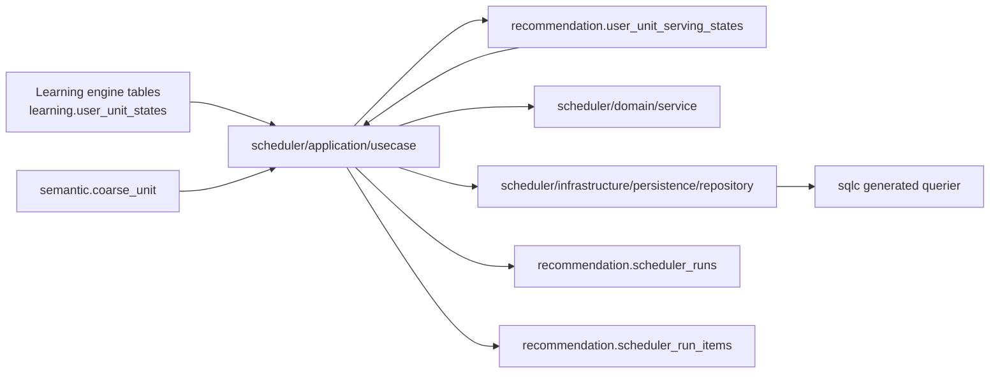
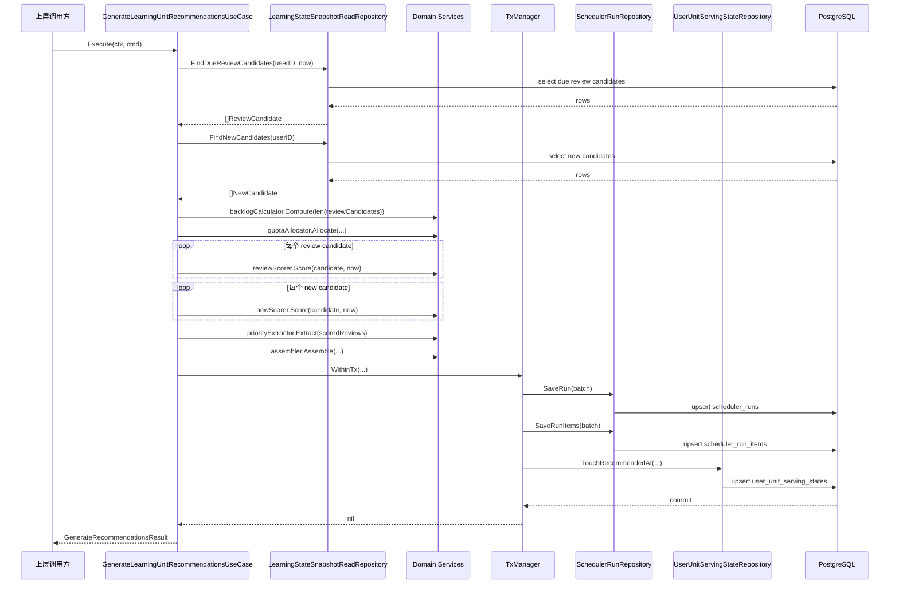
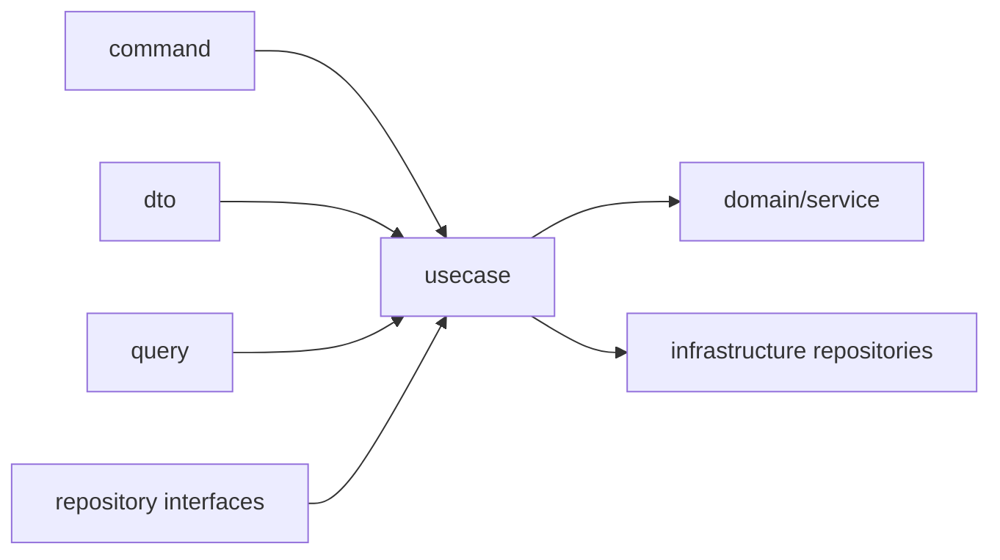
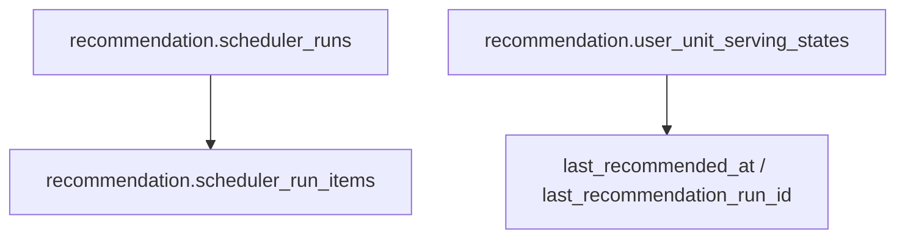
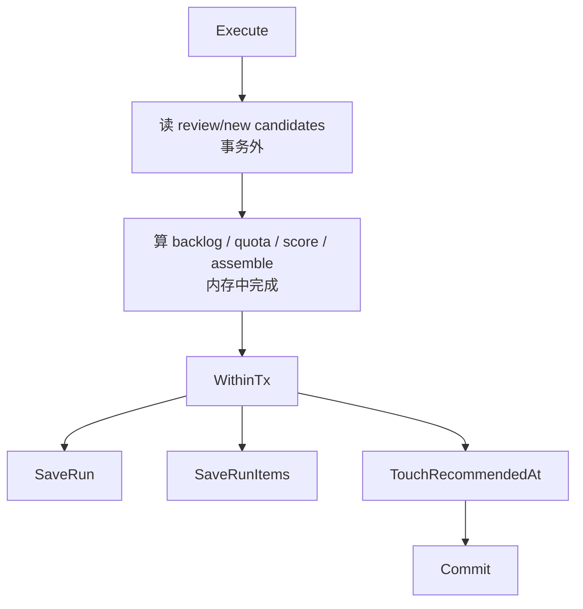

# Recommendation 模块代码实现详解

## 1. 文档目标

本文档面向第一次接手 `internal/recommendation` 的开发者，目标不是重复设计文档，而是回答下面这些更贴近代码维护的问题：

- 当前 `Recommendation` 模块到底已经实现了什么，没实现什么
- 目录为什么这么分层
- 每个文件在实现链路里承担什么职责
- 一次推荐请求从入口到落库到底怎么走
- 读哪些表、写哪些表、事务边界在哪里
- 想改规则、改 SQL、改持久化、补测试时应该从哪里下手

这是一份“按当前真实代码组织方式解释实现”的文档。  
截至当前仓库状态，`Recommendation` 模块真正落地的只有一个子模块：

- `scheduler`

因此本文档虽然标题写的是“Recommendation 模块”，但实现分析会重点覆盖：

- `internal/recommendation/scheduler`

后续如果 `recall`、`task` 落地，这份文档也应该继续扩展，而不是另起一套解释口径。

---

## 2. 先记住 5 个核心判断

### 2.1 当前 Recommendation 模块根不承载具体推荐逻辑

`internal/recommendation` 当前是模块根和子模块容器。  
真正的业务实现都下沉在：

- `internal/recommendation/scheduler`

### 2.2 当前唯一对外主能力是“生成学习单元推荐批次”

当前唯一主用例是：

- `GenerateLearningUnitRecommendationsUseCase.Execute`

它输出的是一批学习单元推荐，不是视频结果，也不是学习任务结果。

### 2.3 模块边界非常硬

当前 Recommendation：

- 只读 `learning.*`
- 只写 `recommendation.*`
- 不写 `learning.unit_learning_events`
- 不写 `learning.user_unit_states`

### 2.4 业务规则集中在 `domain/service`

当前 scheduler 的核心规则都做成了独立服务：

- backlog 计算
- quota 分配
- review 打分
- new 打分
- priority-0 提取
- batch 组装

所以你要改推荐行为，优先看 `domain/service`，不是先改 SQL。

### 2.5 当前没有“生产级组装入口”

模块内部提供了构建块，但仓库里没有单独的 recommendation app bootstrap 包。  
当前最完整的组装示例在测试夹具里：

- `internal/recommendation/scheduler/test/integration/fixture/helpers.go`

这点对新人很重要，因为它决定了“如何把 usecase 真正跑起来”。

---

## 3. 当前实现范围

### 已实现

- 读取 Learning engine 的学习状态候选
- 读取 `semantic.coarse_unit`
- 读取 Recommendation 自己的 serving state
- 计算 review backlog
- 分配 review/new quota
- 对 review 候选打分
- 对 new 候选打分
- 提取 priority-0 review
- 组装 `RecommendationBatch`
- 写 `recommendation.scheduler_runs`
- 写 `recommendation.scheduler_run_items`
- 更新 `recommendation.user_unit_serving_states.last_recommended_at`
- 单元测试、集成测试、场景测试

### 未实现

- `recall`
- `task`
- 视频级推荐结果
- 学习任务级结果
- 用户级调度配置
- 独立的 recommendation 对外 service/handler 层

---

## 4. 目录总览

当前 `internal/recommendation` 的真实目录结构如下：

```text
internal/recommendation/
  README.md
  doc.go
  docs/
    推荐-学习调度模块工程实现.md
    推荐-视频召回高频 coarse_id 问题.md
    推荐-模块代码实现详解.md
  scheduler/
    README.md
    doc.go
    application/
      command/
      dto/
      query/
      repository/
      usecase/
    domain/
      enum/
      model/
      service/
    infrastructure/
      config.go
      db.go
      migration/
      persistence/
        mapper/
        query/
        queryctx/
        repository/
        schema/
        sqlcgen/
        tx/
    test/
      unit/
      integration/
      scenario/
```

可以把它理解成两层：

第一层是模块层：

- `internal/recommendation`

第二层是当前唯一落地子模块：

- `internal/recommendation/scheduler`

这符合仓库统一规范里的“模块根负责边界，子模块负责实现”。

---

## 5. 模块级依赖关系



几点要注意：

- `application/usecase` 同时依赖读仓储、写仓储和领域服务
- `domain/service` 不依赖数据库实现
- `infrastructure/persistence/repository` 只做数据访问和对象映射，不做评分逻辑
- `sqlcgen` 是 repository 的底层执行面，不直接暴露给上层业务

---

## 6. 一次推荐请求的完整调用链

### 6.1 顺序图



### 6.2 用自然语言重述一遍

1. 调用方把 `UserID`、请求条数和时间传给 usecase。
2. usecase 先读 review 候选，再读 new 候选。
3. usecase 调领域服务算 backlog、quota、score、priority-zero。
4. usecase 调 assembler 组出最终 `RecommendationBatch`。
5. usecase 在一个 Recommendation 自己的事务里写 run、run items、serving state。
6. 事务提交后，把 batch 返回给调用方。

这条链路的重点不是“复杂”，而是“职责非常明确”。

---

## 7. 模块根文件说明

### `internal/recommendation/README.md`

作用：

- 解释 Recommendation 作为顶层模块的边界
- 说明当前只有 `scheduler` 子模块已经落地
- 告诉新人不要把新能力直接堆回模块根

什么时候看：

- 第一次接手 Recommendation 时先看
- 判断一个改动该不该落到 Recommendation 根目录时再看

### `internal/recommendation/doc.go`

作用：

- 提供根包说明
- 给 Go 包级语义留一个稳定入口

### `internal/recommendation/docs/`

作用：

- 放模块级补充文档
- 当前既有工程稿，也有未来问题备忘

当前文件：

- `推荐-学习调度模块工程实现.md`：偏工程方案稿
- `推荐-视频召回高频 coarse_id 问题.md`：偏未来风险备忘
- `推荐-模块代码实现详解.md`：偏真实代码导读

---

## 8. `scheduler` 子模块总览

### `internal/recommendation/scheduler/README.md`

作用：

- 解释 scheduler 的边界
- 说明当前 owner 的 3 张 `recommendation.*` 表
- 给出 scheduler 的目录结构和建议阅读顺序

### `internal/recommendation/scheduler/doc.go`

作用：

- 提供 scheduler 包说明

---

## 9. `application/` 层详解

`application/` 只做一件事：

- 编排

它不负责：

- 领域评分公式
- SQL 细节
- 事务实现细节

### 9.1 目录职责图



### 9.2 `application/command/doc.go`

作用：

- 目录说明文件

### 9.3 `application/command/generate_recommendations.go`

定义：

- `GenerateRecommendationsCommand`

字段：

- `UserID`
- `RequestedLimit`
- `Now`

它的特点：

- 很薄，只表达输入，不做逻辑
- `Now` 可由调用方传入，便于测试和时序控制
- `RequestedLimit <= 0` 时，真正的默认值逻辑在 usecase 里处理

### 9.4 `application/dto/doc.go`

作用：

- 目录说明文件

### 9.5 `application/dto/generate_recommendations_result.go`

定义：

- `GenerateRecommendationsResult`

它只包一层：

- `Batch model.RecommendationBatch`

这说明当前 usecase 输出几乎就是领域批次本身，没有再额外包装视图层结构。

### 9.6 `application/query/doc.go`

作用：

- 目录说明文件

### 9.7 `application/query/candidate.go`

这个文件很关键，因为它定义了“查询层拿回来的候选结构”。

定义：

- `ReviewCandidate`
- `NewCandidate`
- `ScoredReviewCandidate`
- `ScoredNewCandidate`

结构特点：

- 每个候选都由三部分组成：
  - `State model.LearningStateSnapshot`
  - `Unit model.CoarseUnitRef`
  - `Serving model.UserUnitServingState`
- 评分后的候选会附带：
  - `Score`
  - `ReasonCodes`

为什么要单独有 `application/query`：

- 这些结构本质上是“应用层读取视图”
- 它们不是 Recommendation 自己 owner 的持久化模型
- 也不等同于单纯的领域实体

### 9.8 `application/repository/doc.go`

作用：

- 目录说明文件

### 9.9 `application/repository/learning_state_snapshot_read_repository.go`

定义只读接口：

- `FindDueReviewCandidates`
- `FindNewCandidates`

这是 Recommendation 读取 Learning engine 的唯一应用层入口。  
接口命名已经明确表达：

- 它读的是 snapshot
- 它只负责 candidate read

### 9.10 `application/repository/user_unit_serving_state_repository.go`

定义写接口：

- `TouchRecommendedAt`

这个接口只负责更新 Recommendation 自己的投放状态。  
它不暴露“任意读写 serving state”的泛化接口，说明当前需求非常收敛。

### 9.11 `application/repository/scheduler_run_repository.go`

定义写接口：

- `SaveRun`
- `SaveRunItems`

这里把 run 头和 run item 明确拆成两个操作，对应两张不同表。

### 9.12 `application/repository/tx_manager.go`

定义事务边界接口：

- `WithinTx`

作用：

- 把 usecase 和具体事务实现解耦
- 让测试或未来替换事务机制时不需要改 usecase

### 9.13 `application/usecase/doc.go`

作用：

- 目录说明文件

### 9.14 `application/usecase/generate_recommendations.go`

这是 scheduler 当前最核心的实现文件。

主要内容：

- `GenerateLearningUnitRecommendationsUseCase` 结构体
- `NewGenerateLearningUnitRecommendationsUseCase` 构造函数
- `Execute` 主流程
- `coarseUnitIDs` 辅助函数

#### 结构体字段说明

- `txManager`
  Recommendation 自己的事务入口
- `stateRepo`
  读取 Learning engine 候选
- `servingStateRepo`
  更新 `recommendation.user_unit_serving_states`
- `runRepo`
  更新 run 和 run items
- `backlogCalculator`
  计算 backlog
- `quotaAllocator`
  分配 quota
- `reviewScorer`
  review 打分
- `newScorer`
  new 打分
- `priorityExtractor`
  提取 priority-zero
- `assembler`
  组装 batch
- `defaults`
  当前固定默认值

#### `Execute` 的逐步行为

1. 处理时间：
   `cmd.Now` 为空时用 `time.Now()`
2. 处理请求条数：
   `cmd.RequestedLimit <= 0` 时回退到默认 `SessionDefaultLimit`
3. 读取 due review 候选
4. 读取 new 候选
5. 把 review 候选数交给 `backlogCalculator`
6. 把 backlog、requestedLimit、defaults 交给 `quotaAllocator`
7. 对所有 review 候选逐个打分
8. 对所有 new 候选逐个打分
9. 从 scored reviews 里提取 priority-zero
10. 调 assembler 组出 `RecommendationBatch`
11. 手工补上 `batch.DueReviewCount`
12. 开事务写：
    - run
    - run items
    - serving states
13. 返回 `dto.GenerateRecommendationsResult`

#### `coarseUnitIDs`

这个函数只做一件事：

- 从 `batch.Items` 抽出所有 `coarse_unit_id`

它服务于 `TouchRecommendedAt`。  
去重逻辑不在这里，而是在 repository 内部做。

#### 这个文件体现出的一个重要风格

usecase 里没有任何评分公式、SQL 语句或 pgx 调用。  
这说明它真的只承担“应用编排层”的职责。

---

## 10. `domain/` 层详解

`domain/` 负责 Recommendation 的纯规则部分。  
这里最重要的不是模型，而是服务。

### 10.1 `domain/doc.go`

作用：

- 目录说明文件

### 10.2 `domain/enum/doc.go`

作用：

- 目录说明文件

### 10.3 `domain/enum/recommend_type.go`

定义：

- `RecommendTypeReview`
- `RecommendTypeNew`

用途：

- 标记推荐项是 review 还是 new
- assembler 和持久化映射都会用到

### 10.4 `domain/enum/unit_kind.go`

定义：

- `word`
- `phrase`
- `grammar`

用途：

- 表达 `semantic.coarse_unit.kind`

### 10.5 `domain/enum/unit_status.go`

定义：

- `new`
- `learning`
- `reviewing`
- `mastered`
- `suspended`

用途：

- 表达 Learning engine 的状态枚举
- priority-zero 和 assembler 都依赖它

### 10.6 `domain/model/doc.go`

作用：

- 目录说明文件

### 10.7 `domain/model/coarse_unit_ref.go`

定义：

- `CoarseUnitRef`

字段：

- `CoarseUnitID`
- `Kind`
- `Label`
- `Pos`
- `EnglishDef`
- `ChineseDef`

定位：

- 这是 Recommendation 读取到的轻量内容单元引用
- 它不是 `semantic.coarse_unit` 全量映射

### 10.8 `domain/model/learning_state_snapshot.go`

定义：

- `LearningStateSnapshot`

定位：

- Recommendation 读到的 Learning engine 快照
- 它不是 Recommendation owner 的状态表
- 它是跨模块输入模型

这个结构几乎完整承接了 `learning.user_unit_states` 的关键信息，包括：

- 目标属性
- 学习状态
- 计数器
- 最近质量窗口
- SM-2 相关字段

为什么保留这么全：

- 当前 scheduler 的打分只用到其中一部分
- 但查询层一次性读齐，有利于后续扩展评分而不必马上改接口

### 10.9 `domain/model/user_unit_serving_state.go`

定义：

- `UserUnitServingState`

定位：

- Recommendation 自己 owner 的投放状态模型

当前主要使用字段：

- `LastRecommendedAt`
- `LastRecommendationRunID`

### 10.10 `domain/model/recommendation_defaults.go`

定义：

- `RecommendationDefaults`
- `DefaultRecommendationDefaults()`

当前默认值：

- `SessionDefaultLimit = 20`
- `DailyNewUnitQuota = 8`
- `DailyReviewSoftLimit = 30`
- `DailyReviewHardLimit = 60`
- `Timezone` 字段存在，但默认函数未赋值

这个文件的重要性在于：

- 当前 MVP 不支持用户级调度配置
- 所有 quota 决策都从这里拿默认配置

### 10.11 `domain/model/recommendation.go`

定义：

- `RecommendationItem`
- `RecommendationBatch`

`RecommendationItem` 表达单条推荐项。  
`RecommendationBatch` 表达整轮 scheduler 结果。

`RecommendationBatch` 里除了 `Items`，还保存了很多运行时元信息：

- `RunID`
- `GeneratedAt`
- `SessionLimit`
- `DueReviewCount`
- `ReviewQuota`
- `NewQuota`
- `BacklogProtection`

这些字段直接进入 run 审计写入。

### 10.12 `domain/service/doc.go`

作用：

- 目录说明文件

### 10.13 `domain/service/backlog_calculator.go`

定义：

- `BacklogCalculator`
- `Compute(reviewBacklog int) int`

当前实现非常简单：

- 负数归零
- 正常值原样返回

这说明“backlog”目前只是一个语义封装点，还没有复杂公式。  
但它仍然值得保留为独立服务，因为这给了后续扩展空间。

### 10.14 `domain/service/quota_allocator.go`

定义：

- `QuotaAllocation`
- `QuotaAllocator`
- `Allocate(reviewBacklog, requestedLimit, defaults)`

这是 scheduler 里最值得新人仔细看的规则文件之一。

当前规则分段：

- `reviewBacklog == 0`
- `reviewBacklog > hard limit`
- `reviewBacklog > soft limit`
- `1..5`
- `6..20`
- `21..soft`
- 兜底

几个实现细节非常重要：

- `requestedLimit < 0` 会被钳成 `0`
- `reviewBacklog < 0` 也会被钳成 `0`
- 没有 backlog 时，`new quota` 仍然受 `DailyNewUnitQuota` 限制
- 超过 hard limit 时会显式打开 `BacklogProtection`
- `ceilFraction` 用 `math.Ceil` 做比例上取整

### 10.15 `domain/service/review_scorer.go`

定义：

- `ReviewScorer`
- `Score(candidate, now)`

评分公式：

```text
0.45 * overdueScore
+ 0.25 * targetPriority
+ 0.20 * weakMemoryScore
+ 0.10 * recencyAdjustment
```

内部辅助函数：

- `reviewOverdueScore`
- `reviewWeakMemoryScore`
- `reviewRecencyAdjustment`

实现要点：

- `NextReviewAt` 为空或没 overdue 时，`overdueScore = 0`
- overdue 72 小时及以上直接封顶为 `1`
- `weakMemoryScore` 结合：
  - `1 - mastery_score`
  - `consecutive_wrong`
  - `last_quality <= 2`
- `recencyAdjustment` 看的是 Recommendation 自己的 `LastRecommendedAt`
- reason codes 会附加：
  - `review_due`
  - `overdue`
  - `weak_memory`
  - `recent_failure`
  - `not_recently_recommended` / `recently_recommended`

### 10.16 `domain/service/new_scorer.go`

定义：

- `NewScorer`
- `Score(candidate, now)`

评分公式：

```text
0.75 * targetPriority
+ 0.15 * freshnessScore
+ 0.10 * notRecentlyRecommended
```

内部辅助函数：

- `newFreshnessScore`
- `newNotRecentlyRecommended`

实现要点：

- `SeenCount == 0 && StrongEventCount == 0` 时 freshness 最高
- 看过但没 strong event 的候选 freshness 为 `0.5`
- 已有 strong event 的 new 候选 freshness 为 `0`
- `LastRecommendedAt` 超过 24 小时才算不近期推荐
- reason codes 会附加：
  - `new_candidate`
  - `fresh_candidate`
  - `recommended_unconsumed`
  - `not_recently_recommended` / `recently_recommended`

### 10.17 `domain/service/priority_zero_extractor.go`

定义：

- `PriorityZeroExtractor`
- `Extract(scoredReviews)`

priority-zero 条件：

- `status == learning`
- 或 `last_quality <= 2`

实现要点：

- 它只从 review 候选里提取，不看 new
- 提取后会补充原因码：
  - `priority_zero_learning_due`
  - `priority_zero_recent_failure`
- 排序优先级不是只看 score，还会先看 `priorityZeroWeight`
- `priorityZeroWeight` 规则：
  - `learning` 加 2
  - `recent_failure` 加 1

也就是说：

- `learning + recent_failure`
- 会比
- `仅 learning`
- 或
- `仅 recent_failure`
- 更靠前

### 10.18 `domain/service/recommendation_assembler.go`

定义：

- `RecommendationAssembler`
- `Assemble(...)`

这是把“候选”变成“最终批次”的最后一步。

内部步骤：

1. 复制输入切片，避免外部共享切片被排序时污染
2. 分别排序 review/new 候选
3. 先消费 priority-zero review
4. 再消费普通 review
5. 最后用 new 填充剩余槽位
6. 给最终 items 重新赋 rank
7. 生成新的 `RunID`

几个实现细节要特别注意：

- 去重是按 `coarse_unit_id`
- priority-zero 和普通 review 共用 `reviewBudget`
- 最终 new 的填充上限不是单纯 `NewQuota`
- 它是按 `remainingSlots := sessionLimit - len(items)` 继续填

这意味着：

- 如果 review 没把 `ReviewQuota` 用满
- new 可以吃掉剩余 session 容量

这个行为不是文档猜测，而是被测试显式验证的。

辅助函数：

- `sortScoredReviewCandidates`
- `sortScoredNewCandidates`
- `reviewRecommendationItem`
- `newRecommendationItem`

`reviewRecommendationItem` 和 `newRecommendationItem` 的职责很纯粹：

- 把 scored candidate 映射成最终输出 item

---

## 11. `infrastructure/` 层详解

`infrastructure/` 做的是“怎么连库、怎么跑 SQL、怎么映射对象、怎么开事务”。

### 11.1 `infrastructure/doc.go`

作用：

- 目录说明文件

### 11.2 `infrastructure/config.go`

定义：

- `Config`
- `LoadConfig()`
- `Validate()`

当前只看两个环境变量：

- `DATABASE_URL`
- `SUPABASE_URL`

关键行为：

- `DATABASE_URL` 必须存在
- `SUPABASE_URL` 不能作为回退方案

这个文件明确表达了一个架构选择：

- Recommendation 走 PostgreSQL 直连
- 不走 Supabase HTTP 风格 fallback

### 11.3 `infrastructure/db.go`

定义：

- `NewDBPool`
- `PingDB`

作用：

- 从 `DATABASE_URL` 建 pgx 连接池
- 用 `select 1` 做最小化探活

这是模块和数据库建立真实连接的最外层入口。

### 11.4 `infrastructure/migration/README.md`

作用：

- 说明这是 Recommendation 唯一合法 migration 根
- 强调这里只能定义 Recommendation 自己 owner 的对象

### 11.5 `infrastructure/migration/*.up.sql`

文件和职责：

- `000001_create_recommendation_schema.up.sql`
  创建 `recommendation` schema
- `000002_create_user_unit_serving_states.up.sql`
  创建 serving state 表
- `000003_create_scheduler_runs.up.sql`
  创建 run 头表
- `000004_create_scheduler_run_items.up.sql`
  创建 run item 表
- `000005_create_recommendation_indexes.up.sql`
  创建 serving state 索引

当前 migration 映射出 3 张核心表：

- `recommendation.user_unit_serving_states`
- `recommendation.scheduler_runs`
- `recommendation.scheduler_run_items`

### 11.6 当前 Recommendation 持久化表关系



说明：

- `scheduler_runs` 记录一轮调度
- `scheduler_run_items` 记录这一轮的每个输出单元
- `user_unit_serving_states` 记录用户-单元级的最近推荐状态

### 11.7 `infrastructure/persistence/query/*.sql`

这些文件是 Recommendation 当前所有手写 SQL 的源头。

#### `query/candidates.sql`

定义：

- `FindDueReviewCandidates`
- `FindNewCandidates`

这两个 SQL 有几个关键点：

- 主表都是 `learning.user_unit_states`
- 都会 join `semantic.coarse_unit`
- 都会 left join `recommendation.user_unit_serving_states`
- review 候选条件：
  - `is_target = true`
  - `status in ('learning', 'reviewing', 'mastered')`
  - `next_review_at <= now`
- new 候选条件：
  - `is_target = true`
  - `status = 'new'`

这正是 Recommendation “只读 learning.*，只写 recommendation.*” 的 SQL 层体现。

#### `query/scheduler_runs.sql`

定义：

- `CountSchedulerRuns`
- `UpsertSchedulerRun`
- `UpsertSchedulerRunItem`

作用：

- 为 run 和 run items 提供 upsert 能力
- `CountSchedulerRuns` 主要用于测试验证

#### `query/serving_states.sql`

定义：

- `UpsertUserUnitServingState`

作用：

- 插入或更新最近推荐时间和最近 run ID

### 11.8 `infrastructure/persistence/schema/external.sql`

作用：

- 给 `sqlc` 提供本模块自身 migration 之外的外部 schema 补充定义

当前补充了：

- `auth.users`
- `semantic.coarse_unit`

为什么需要它：

- Recommendation 的 SQL 要 join 这些表
- 但这些表不是 Recommendation 自己 owner 的 migration
- `sqlc` 编译时仍然需要知道表结构

### 11.9 `sqlc.yaml` 中 Recommendation 的 schema 组合

Recommendation 的 `sqlc` 生成不是只看自己 migration，而是组合了：

- `internal/recommendation/scheduler/infrastructure/persistence/schema/*.sql`
- `internal/learningengine/infrastructure/migration/*.up.sql`
- `internal/recommendation/scheduler/infrastructure/migration/*.up.sql`

这意味着：

- Recommendation 的查询编译时知道 `learning.user_unit_states`
- 也知道 Recommendation 自己的表
- 再通过 `external.sql` 补足 `auth` 和 `semantic`

### 11.10 `infrastructure/persistence/sqlcgen/`

这是 `sqlc` 生成层，只生成，不手改。

文件说明：

- `db.go`
  定义 `DBTX`、`Queries`、`WithTx`
- `querier.go`
  定义 repository 依赖的稳定查询接口 `Querier`
- `models.go`
  生成数据库行模型
- `candidates.sql.go`
  生成 candidates 查询方法和 row 结构
- `scheduler_runs.sql.go`
  生成 run / run item 相关方法
- `serving_states.sql.go`
  生成 serving state upsert 方法

要点：

- repository 不直接写 SQL 字符串
- repository 依赖 `sqlcgen.Querier`
- 事务里通过 `Queries.WithTx` 或 `sqlcgen.New(tx)` 切到事务 querier

### 11.11 `infrastructure/persistence/queryctx/context.go`

作用：

- 把事务内 querier 放进 `context.Context`
- 让 repository 在事务内自动改用 tx 版本 querier

这是当前 transaction propagation 的关键连接点。

### 11.12 `infrastructure/persistence/repository/querier_resolver.go`

作用：

- 优先从 context 里取 tx querier
- 没有时退回构造时注入的普通 querier

这让同一个 repository：

- 在事务外也能工作
- 在事务内也能自动切换到底层 tx

### 11.13 `infrastructure/persistence/repository/learning_state_snapshot_read_repo.go`

实现接口：

- `LearningStateSnapshotReadRepository`

核心步骤：

1. `resolveQuerier`
2. 调 `q.FindDueReviewCandidates` 或 `q.FindNewCandidates`
3. 把生成 row 交给 mapper 转成 `application/query` 结构

这个 repository 的定位非常明确：

- 只是读取
- 不缓存
- 不做业务判断

### 11.14 `infrastructure/persistence/repository/scheduler_run_repo.go`

实现接口：

- `SchedulerRunRepository`

核心步骤：

1. `resolveQuerier`
2. 用 mapper 把 `RecommendationBatch` 转成 SQL 参数
3. 写 run
4. 逐条写 run items

这里当前是逐条 upsert run item，不是批量 SQL。

### 11.15 `infrastructure/persistence/repository/user_unit_serving_state_repo.go`

实现接口：

- `UserUnitServingStateRepository`

核心步骤：

1. `resolveQuerier`
2. 对传入的 `coarseUnitIDs` 去重
3. 逐条 upsert serving state

这里也不是批量 upsert，而是循环逐条写。

### 11.16 `infrastructure/persistence/mapper/candidate_mapper.go`

这是持久化层里最值得仔细看的文件之一。

作用：

- 把 `sqlc` 生成 row 转成 application/query 候选结构

主要函数：

- `parseUnitKind`
- `parseUnitStatus`
- `reviewCandidateFromRow`
- `newCandidateFromRow`
- `ReviewCandidatesFromRows`
- `NewCandidatesFromRows`
- `zeroTimeIfInvalid`

这个文件承担的责任非常重：

- 枚举解析
- pgtype 数值转换
- nullable 字段转换
- Learning snapshot / Serving state / Coarse unit 三块对象拼装

这也说明仓库坚持了一个很明确的原则：

- `sqlcgen` 生成类型不上浮到应用层和领域层

### 11.17 `infrastructure/persistence/mapper/scheduler_run_mapper.go`

作用：

- 把 `RecommendationBatch` 转成写库参数

主要函数：

- `SchedulerRunParamsFromBatch`
- `SchedulerRunItemParamsFromBatch`

关键实现点：

- 统计 selected review / new 数
- 把 `BacklogProtection` 包进 `context` JSON
- 把 item score 转成 pg numeric

### 11.18 `infrastructure/persistence/mapper/user_unit_serving_state_mapper.go`

作用：

- 把 `(userID, coarseUnitID, runID, recommendedAt)` 转成 upsert 参数

关键点：

- `created_at` 和 `updated_at` 在首次写入时都等于 `recommendedAt`
- 发生冲突时 SQL 只更新推荐时间、runID、`updated_at`

### 11.19 `infrastructure/persistence/mapper/pgtype_helpers.go`

作用：

- 封装 pgx `pgtype` 和 Go 基础类型之间的转换

类型覆盖：

- UUID
- Time
- Numeric
- nullable int
- text
- `[]int16`
- `[]bool`

这个文件虽然是工具型，但并不是“随便放的 helper”。  
它的作用是把所有 pgtype 细节统一收口到 mapper 层，不污染上层。

### 11.20 `infrastructure/persistence/tx/pgx_tx_manager.go`

作用：

- 用 pgx pool 提供 `WithinTx`

事务逻辑：

1. `BeginTx`
2. defer rollback
3. `sqlcgen.New(tx)` 生成 tx querier
4. 用 `queryctx.WithQuerier` 塞进 context
5. 执行业务回调
6. 成功则 commit

这个文件把事务边界和 repository 的 tx 感知串成了一条完整链。

---

## 12. 事务边界与数据一致性

### 12.1 当前事务只覆盖 Recommendation 自己的写入



当前实现里：

- 读候选在事务外
- 算分在内存里
- 只有三类写入在事务内

### 12.2 为什么这样做

因为 Recommendation 的 owner 只有：

- `recommendation.scheduler_runs`
- `recommendation.scheduler_run_items`
- `recommendation.user_unit_serving_states`

Learning engine 的事件和状态更新不属于这个事务。

### 12.3 这带来的结果

如果 run 写入失败：

- serving state 不会单独成功

如果 serving state 更新失败：

- 前面的 run / run items 也会回滚

这保证了 Recommendation 自己内部的审计和投放状态是一致的。

---

## 13. 测试层详解

`test/` 目录是新人最快理解实现意图的地方之一。  
当前测试分成三层：

- `unit`
- `integration`
- `scenario`

### 13.1 `test/doc.go`

作用：

- 测试根目录说明文件

### 13.2 `test/unit/doc.go`

作用：

- 单元测试目录说明文件

### 13.3 `test/unit/domain/service/quota_allocator_test.go`

覆盖：

- `BacklogCalculator`
- `QuotaAllocator`

重点验证：

- backlog 负值被归零
- quota 在各区间的输出是否符合预期

### 13.4 `test/unit/domain/service/scoring_test.go`

覆盖：

- `ReviewScorer`
- `NewScorer`
- `PriorityZeroExtractor`

重点验证：

- 高优先级、过期更久、弱记忆更明显的 review 得分更高
- freshness 和 recent recommendation 会影响 new 排序
- priority-zero 会优先抽出 `learning` 或近期失败内容

### 13.5 `test/unit/domain/service/recommendation_assembler_test.go`

覆盖：

- `RecommendationAssembler`

重点验证：

- 最终 rank 顺序
- priority-zero 优先级
- 去重行为
- new 可以填补没用完的 review 容量

这是理解 assembler 真实行为最重要的测试文件之一。

### 13.6 `test/unit/infrastructure/config_test.go`

覆盖：

- `Config.Validate`

重点验证：

- 没有 `DATABASE_URL` 时会报错
- `SUPABASE_URL` 不能替代 `DATABASE_URL`

### 13.7 `test/integration/doc.go`

作用：

- 集成测试目录说明文件

### 13.8 `test/integration/fixture/helpers.go`

这是集成测试最关键的支撑文件。

它提供：

- `NewTestPool`
- `CreateTestUser`
- `CreateTestCoarseUnits`
- `CleanupTestData`
- `InsertState`
- `InsertServingState`
- `NewGenerateUseCase`
- `GenerateCmd`

这个文件的重要性有两层：

第一层，它是测试夹具。  
第二层，它其实也是当前仓库里最完整的“依赖组装示例”。

新人如果想知道如何把 scheduler usecase 组起来，先看这里。

### 13.9 `test/integration/infrastructure/db_integration_test.go`

覆盖：

- `LoadConfig`
- `NewDBPool`
- `PingDB`

作用：

- 验证 recommendation 模块的数据库直连基础能力

### 13.10 `test/integration/infrastructure/candidate_queries_test.go`

覆盖：

- `LearningStateSnapshotReadRepository`

作用：

- 验证 due review / new candidate 查询是否按预期筛选
- 验证 serving state join 是否生效
- 验证 `semantic.coarse_unit` 字段是否正确映射

### 13.11 `test/integration/usecase/generate_recommendations_usecase_test.go`

这是当前最重要的端到端模块级集成测试。

它验证了：

- usecase 能成功生成 batch
- `learning.*` 读完后不会被修改
- `scheduler_runs` 会写入
- `scheduler_run_items` 会写入
- `user_unit_serving_states` 会更新
- 未被选中的已有 serving state 不会被误改

如果你要排查：

- “为什么落库不对”
- “为什么 learning 表被污染”
- “为什么 serving state 更新异常”

先看这份测试。

### 13.12 `test/scenario/scenarios_test.go`

当前有两个业务场景测试：

- `TestGenerateRecommendationsPrefersDueReviewWhenQuotaIsTight`
- `TestGenerateRecommendationsSuppressesRecentlyRecommendedNew`

它们更接近“业务行为验证”，不是单个函数验证。

场景层的意义在于：

- 它用更少的结构细节，验证更完整的推荐策略意图

---

## 14. 新人建议阅读顺序

如果你要尽快建立对当前实现的整体感知，建议按下面顺序读：

1. `internal/recommendation/README.md`
2. `internal/recommendation/docs/推荐-模块代码实现详解.md`
3. `internal/recommendation/scheduler/README.md`
4. `internal/recommendation/scheduler/application/usecase/generate_recommendations.go`
5. `internal/recommendation/scheduler/domain/service/*.go`
6. `internal/recommendation/scheduler/application/query/candidate.go`
7. `internal/recommendation/scheduler/domain/model/*.go`
8. `internal/recommendation/scheduler/infrastructure/persistence/query/*.sql`
9. `internal/recommendation/scheduler/infrastructure/persistence/repository/*.go`
10. `internal/recommendation/scheduler/infrastructure/persistence/mapper/*.go`
11. `internal/recommendation/scheduler/test/unit/*`
12. `internal/recommendation/scheduler/test/integration/*`
13. `internal/recommendation/scheduler/test/scenario/*`

这样读的好处是：

- 先知道边界
- 再知道主流程
- 再知道规则
- 最后再深入 SQL、持久化和测试

---

## 15. 常见改动应该去哪里

### 改评分逻辑

去：

- `domain/service/review_scorer.go`
- `domain/service/new_scorer.go`
- 以及对应单测 `test/unit/domain/service/scoring_test.go`

### 改 quota 规则

去：

- `domain/service/quota_allocator.go`
- `test/unit/domain/service/quota_allocator_test.go`

### 改 priority-zero 规则

去：

- `domain/service/priority_zero_extractor.go`
- `test/unit/domain/service/scoring_test.go`

### 改最终组装顺序

去：

- `domain/service/recommendation_assembler.go`
- `test/unit/domain/service/recommendation_assembler_test.go`

### 改 candidate SQL

去：

- `infrastructure/persistence/query/candidates.sql`
- 然后重新生成 `sqlc`
- 再看：
  - `infrastructure/persistence/sqlcgen/candidates.sql.go`
  - `infrastructure/persistence/mapper/candidate_mapper.go`
  - `test/integration/infrastructure/candidate_queries_test.go`

### 改 Recommendation 自己的表结构

去：

- `infrastructure/migration/*.sql`
- `infrastructure/persistence/query/*.sql`
- `sqlc.yaml`
- 重新生成 `sqlc`
- 补或改集成测试

### 改事务策略

去：

- `infrastructure/persistence/tx/pgx_tx_manager.go`
- `infrastructure/persistence/queryctx/context.go`
- `infrastructure/persistence/repository/querier_resolver.go`

### 想知道怎么实例化 usecase

先看：

- `test/integration/fixture/helpers.go`

---

## 16. 当前实现的几个重要非直观点

### 16.1 当前 defaults 里 `Timezone` 字段存在，但没有默认值

这说明：

- 结构上为未来扩展留了口子
- 但当前实现没有真正启用时区逻辑

### 16.2 `RecommendationAssembler` 允许 new 填补没用完的 review 容量

不要只看字段名 `NewQuota` 就想当然地认为 new 永远最多只能占 `NewQuota`。  
当前实现会按剩余 session 容量继续补 new，这一点要以代码和测试为准。

### 16.3 当前 repository 写入大多是逐条 upsert

包括：

- run items
- serving states

这在 MVP 规模下是完全能接受的，但以后如果单次批次变大，这里会是明确的优化点。

### 16.4 `sqlcgen/models.go` 会出现本模块不直接使用的表类型

例如：

- `LearningUnitLearningEvent`

这不是 owner 混乱，而是因为 Recommendation 的 `sqlc` schema 编译面包含了跨模块依赖表定义。

### 16.5 当前仓库里没有独立的 recommendation service adapter

如果后续需要 HTTP、RPC 或 job 入口，应该在 Recommendation 之外加适配层，不要把 handler 直接塞进当前分层里。

---

## 17. 当前实现可以概括成一句话

当前 `internal/recommendation` 的真实实现，是一个已经按模块边界拆清 owner 的 scheduler 子模块：它通过 `application/usecase` 编排读取 Learning engine 学习状态、调用 `domain/service` 计算 backlog/quota/score/priority-zero、用 `RecommendationAssembler` 组装批次，再通过 `infrastructure/persistence` 在单个 Recommendation 事务内写入 run 审计与 serving state，从而形成一个只读 `learning.*`、只写 `recommendation.*` 的可测试推荐闭环。

这句话基本就是新人理解当前代码实现时最应该带着走的 mental model。
