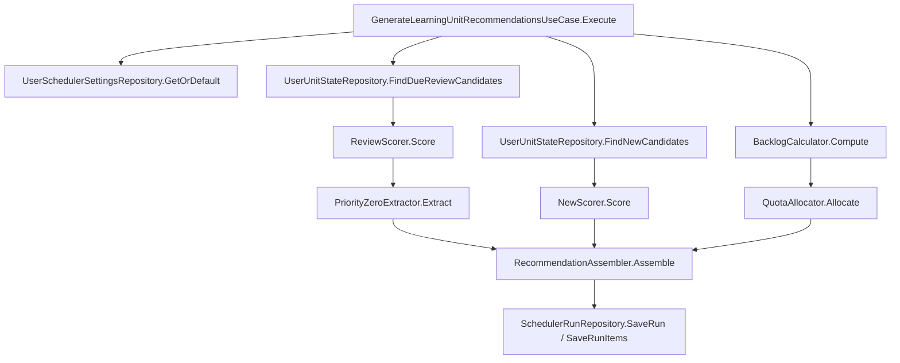
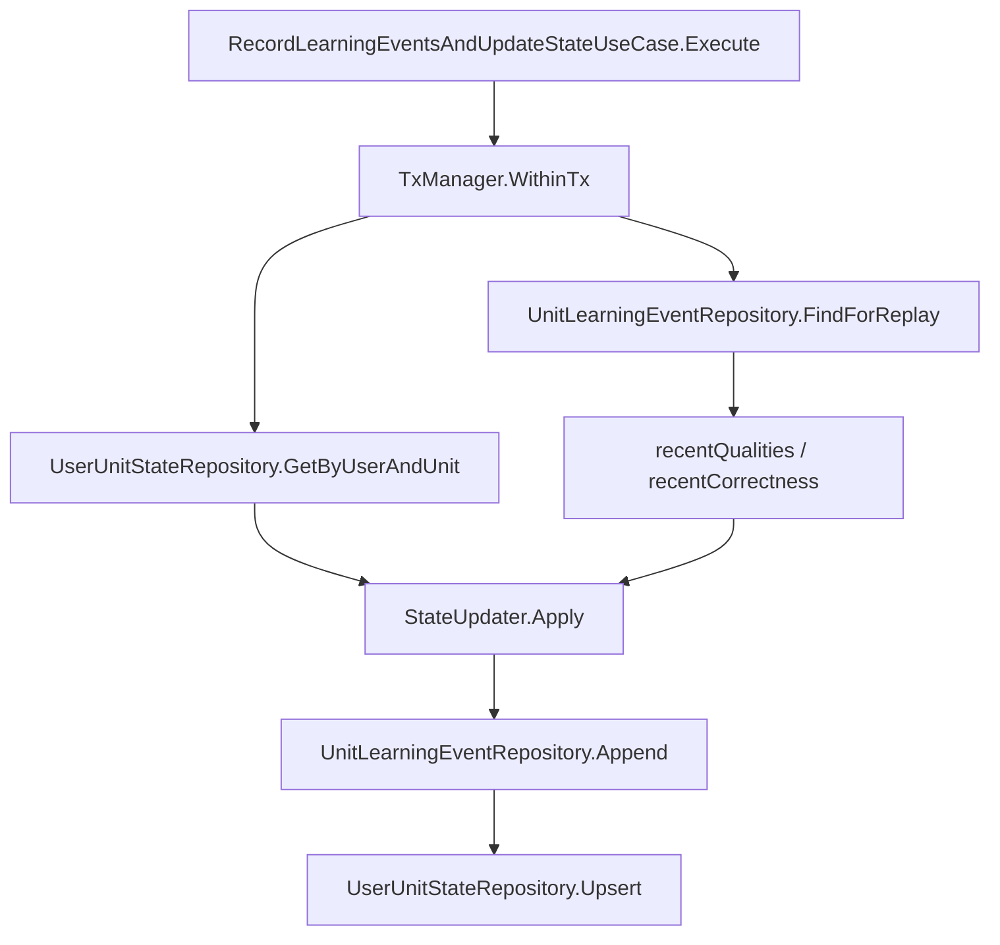
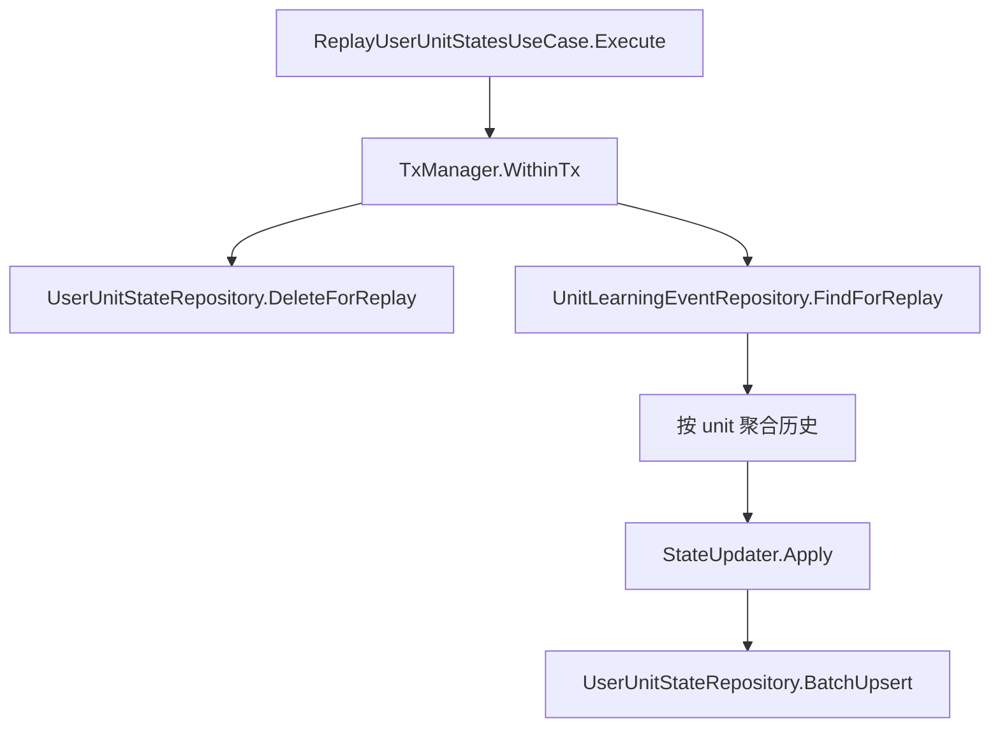

# Learning Scheduler Module

`internal/recommendation/scheduler` 是推荐系统模块内部的学习内容调度子系统。

它的职责不是直接给前端返回页面数据，而是先回答推荐系统内部最核心的问题：

1. 这个用户现在该学哪些 `semantic.coarse_unit`
2. 这些学习对象里哪些应该优先复习，哪些可以引入为新内容
3. 用户刚刚产生的学习事件应该如何推动状态快照更新
4. 当规则调整后，如何通过事件回放重建状态

如果你是第一次接手这个模块，建议按下面顺序阅读：

1. 先读本文档，建立模块边界、目录和调用关系的整体理解
2. 再读 [工程实现稿](/Users/evan/Downloads/learning-video-recommendation-system/docs/学习调度系统工程实现稿.md)，理解为什么采用当前分层
3. 再读 `application/usecase` 下的三个用例入口
4. 最后结合 `test/integration` 跑一遍真实链路

## 1. 模块边界

### 1.1 这个模块负责什么

- 维护 `user × coarse_unit` 的状态快照
- 接收标准化学习事件并更新状态
- 基于状态生成一轮学习推荐批次
- 落审计快照到 `scheduler_runs / scheduler_run_items`
- 支持根据事件表 replay 重建状态

### 1.2 这个模块不负责什么

- 它不是前端 API
- 它不定义 HTTP handler、controller、transport DTO
- 它不直接实现视频召回层
- 它不直接实现最终用户可见的学习任务组装
- 它不通过 Supabase HTTP SDK / REST API 处理核心调度流

### 1.3 核心设计约束

- 学习对象统一使用 `semantic.coarse_unit`
- 当前支持的 `kind` 至少包括 `word / phrase / grammar`
- 业务规则必须放在 `domain / application`
- repository 只做持久化，不做状态机、配额、排序决策
- SQL 只做数据查询和写入，不做业务策略判断
- 事件写入和状态更新必须在同一事务中完成
- replay 必须复用在线更新同一套 `StateUpdater`

## 2. 技术方案

当前唯一落地方案是：

- Go
- `pgx/v5`
- PostgreSQL 直连 Supabase
- `sqlc`
- 纯领域规则
- application 层编排
- infrastructure 层持久化封装

这套方案的目标不是“最少代码”，而是“最容易验证、最不容易写乱”。

## 3. 目录结构

当前模块目录如下：

```text
internal/recommendation/scheduler/
  README.md
  application/
    command/
    dto/
    query/
    repository/
    usecase/
  domain/
    enum/
    model/
    policy/
    rule/
    service/
  infrastructure/
    config.go
    db.go
    migration/
    persistence/
      mapper/
      query/
      queryctx/
      repository/
      schema/
      sqlcgen/
      tx/
  integration/
    contract/
    mapper/
  test/
    fixture/
    integration/
    replay/
```

### 3.1 `domain/`

这里放纯领域规则，不依赖数据库和 HTTP。

- `enum/`
  统一枚举定义：`UnitKind`、`UnitStatus`、`EventType`、`RecommendType`
- `model/`
  核心领域对象：`LearningUnitRef`、`UserUnitState`、`LearningEvent`、`UserSchedulerSettings`、`RecommendationBatch`
- `policy/`
  调度常量和默认策略，例如 `21 天 mastered 阈值`、`[1,3,6]` 初始间隔、`EF 下限 1.3`
- `rule/`
  弱事件与强事件的基础字段更新
- `service/`
  SM-2、状态迁移、progress/mastery、backlog/quota、scorer、assembler、统一 `StateUpdater`

### 3.2 `application/`

这里放用例编排，是新人理解调用关系时最值得优先读的一层。

- `command/`
  输入命令模型
- `dto/`
  输出结果模型
- `query/`
  应用层候选结构，例如 `ReviewCandidate`、`NewCandidate`
- `repository/`
  application 依赖的 port interface，包括 `TxManager`
- `usecase/`
  三个核心入口：
  - `GenerateLearningUnitRecommendationsUseCase`
  - `RecordLearningEventsAndUpdateStateUseCase`
  - `ReplayUserUnitStatesUseCase`

### 3.3 `infrastructure/`

这里放所有和 PostgreSQL、`sqlc`、migration、事务适配有关的实现。

- `config.go`
  读取并校验 `DATABASE_URL`
- `db.go`
  创建 `pgxpool.Pool`，并提供 `select 1` 探针
- `migration/`
  scheduler 模块自己的 schema/table/index migration
- `persistence/query/`
  `sqlc` 的 SQL 输入文件
- `persistence/sqlcgen/`
  `sqlc generate` 产物，不手改
- `persistence/mapper/`
  DB row/param 和 domain model 之间的转换
- `persistence/repository/`
  application repository port 的 PostgreSQL 实现
- `persistence/queryctx/`
  在事务中把 transaction-scoped querier 放进 `context`
- `persistence/tx/`
  `pgx` 事务管理器实现

### 3.4 `integration/`

这里是给推荐系统其他子层预留的契约层。

当前目录存在，但实现还很轻，目的是保留未来调度层和视频召回层之间的稳定边界，而不是让 application 直接被别的子系统随意引用内部细节。

### 3.5 `test/`

- `test/integration/`
  真实数据库集成测试入口
- `test/replay/`
  replay 相关测试占位
- `test/fixture/`
  测试夹具占位

重要约束：

- 领域单测不能依赖真实数据库
- 集成测试不允许依赖已有用户数据
- 集成测试统一自己创建临时用户，结束后回滚或清理

## 4. 关键数据模型

### 4.1 `UserUnitState`

这是调度系统最核心的状态快照。

关键字段可以按四组理解：

- 目标属性
  - `IsTarget`
  - `TargetSource`
  - `TargetSourceRefID`
  - `TargetPriority`
- 学习状态
  - `Status`
  - `ProgressPercent`
  - `MasteryScore`
- 行为统计
  - `SeenCount`
  - `StrongEventCount`
  - `ReviewCount`
  - `CorrectCount`
  - `WrongCount`
  - `ConsecutiveCorrect`
  - `ConsecutiveWrong`
  - `LastQuality`
- SM-2 相关
  - `Repetition`
  - `IntervalDays`
  - `EaseFactor`
  - `NextReviewAt`

### 4.2 `LearningEvent`

事件是 replay 的事实源。

系统不会只依赖快照；快照是当前态，事件表是可回放的行为历史。后续规则有变化时，真正可修复靠的是事件表。

### 4.3 `RecommendationBatch`

调度系统对外的内部产物不是“视频列表”，而是一个学习推荐批次：

- `RunID`
- `UserID`
- `GeneratedAt`
- `DueReviewCount`
- `ReviewQuota`
- `NewQuota`
- `BacklogProtection`
- `Items`

下游子层应该消费这个批次，再去做视频召回和任务组装。

## 5. 数据库对象

本模块自己的核心表有 5 张：

- `learning.user_unit_states`
- `learning.unit_learning_events`
- `learning.user_scheduler_settings`
- `learning.scheduler_runs`
- `learning.scheduler_run_items`

对应 migration 在：

- `internal/recommendation/scheduler/infrastructure/migration/`

生成 SQL 和 `sqlc` 代码的来源在：

- `internal/recommendation/scheduler/infrastructure/persistence/query/`
- `internal/recommendation/scheduler/infrastructure/persistence/schema/external.sql`
- `sqlc.yaml`

## 6. 配置要求

### 6.1 必需配置

必须提供：

```bash
DATABASE_URL=postgres://...
```

这是 scheduler 模块唯一认可的核心数据库连接方式。

### 6.2 `SUPABASE_URL` 的定位

项目里可以保留：

```bash
SUPABASE_URL=https://...
```

但它不是这个模块的数据库主连接方式，不能作为 `DATABASE_URL` 缺失时的降级替代。

也就是说：

- `SUPABASE_URL` 可以存在
- 但 scheduler 不会用它代替 PostgreSQL 直连
- 如果只有 `SUPABASE_URL` 没有 `DATABASE_URL`，初始化应直接报错

对应代码入口：

- `internal/recommendation/scheduler/infrastructure/config.go`
- `internal/recommendation/scheduler/infrastructure/db.go`

## 7. 本地启动与开发命令

### 7.1 安装依赖工具

本模块开发默认依赖这些工具已安装到本机：

- Go
- `sqlc`
- `staticcheck`

migration 命令通过 `go run` 拉起 `golang-migrate`，不要求额外单独安装二进制。

### 7.2 生成 `sqlc` 代码

```bash
make sqlc-generate
```

### 7.3 执行 migration

```bash
export DATABASE_URL='postgres://...'
make scheduler-migrate-up
make scheduler-migrate-version
```

如果需要回滚当前模块 migration：

```bash
make scheduler-migrate-down
```

如果 migration 版本脏了，需要人工修复：

```bash
make scheduler-migrate-force VERSION=<target-version>
```

### 7.4 标准验收命令

仓库级标准检查命令：

```bash
make fmt
make fmt-check
make vet
make staticcheck
make lint
make accept
make test
make check
```

语义如下：

- `make lint`
  跑 `fmt-check + vet + staticcheck`
- `make accept`
  跑 `sqlc-generate + lint`
- `make check`
  跑 `accept + test`

### 7.5 跑 scheduler 集成测试

集成测试需要真实 `DATABASE_URL`。

```bash
set -a
source .env
set +a
go test ./internal/recommendation/scheduler/test/integration -v
```

说明：

- 测试会创建自己的临时用户
- 不依赖现有 `auth.users` 数据
- 需要写入的场景会在测试结束后清理
- 事务场景依赖回滚自动清理

## 8. 关键调用关系

对新人来说，最重要的是先理解“入口在哪，规则在哪，持久化在哪”。

### 8.1 推荐批次生成链路



代码入口：

- `application/usecase/generate_recommendations.go`

这条链路的职责是：

1. 读取用户调度设置
2. 取 due review 候选和 new 候选
3. 计算 backlog
4. 分配 review/new quota
5. 给 review 和 new 分别打分
6. 提取 priority-0
7. 组装 `RecommendationBatch`
8. 在需要时写审计快照

### 8.2 事件写入与状态更新链路



代码入口：

- `application/usecase/record_events_and_update_state.go`

关键点：

- 对每条事件先查历史，再算新状态
- 同一个事务里先写事件，再写状态
- 一旦状态写入失败，整个事务回滚

### 8.3 replay 链路



代码入口：

- `application/usecase/replay_user_unit_states.go`

关键点：

- replay 不允许另写一套状态规则
- 在线更新和 replay 都必须调用同一个 `StateUpdater`
- 当指定 `FromTime` 时，只重建该时间窗口内真正受影响的 unit
- 这些受影响的 unit 会从各自完整事件历史重建，而不是“删全量快照后只播放半段历史”

## 9. `StateUpdater` 的内部结构

`StateUpdater` 是整个模块最关键的领域入口。

它的处理顺序如下：

1. 先识别事件类型
2. 弱事件走 `WeakEventHandler`
3. 强事件走 `StrongEventHandler`
4. 如果强事件带 `quality`，再走 `SM2Updater`
5. 然后走 `StatusTransitioner`
6. 最后重算 `ProgressPercent` 和 `MasteryScore`

实际实现位置：

- `domain/service/state_updater.go`

它组合的组件有：

- `domain/rule/weak_event_handler.go`
- `domain/rule/strong_event_handler.go`
- `domain/service/sm2_updater.go`
- `domain/service/status_transitioner.go`
- `domain/service/progress_calculator.go`
- `domain/service/mastery_calculator.go`

理解这个组合关系之后，排查“为什么状态变了”会快很多。

## 10. application 和 infrastructure 的协作方式

这是本模块最容易被改坏的地方。

### 10.1 当前边界

- application 只依赖 repository interface
- infrastructure 去实现这些 interface
- application 不直接 import `sqlcgen`
- application 不直接依赖 `pgx.Tx`

### 10.2 事务是怎么传进去的

当前做法不是把 `tx` 作为参数传给每个 repository，而是：

1. `TxManager.WithinTx` 开启 `pgx` 事务
2. 用 `sqlcgen.New(tx)` 创建 transaction-scoped querier
3. 通过 `queryctx.WithQuerier` 放入 `context`
4. repository 在执行时通过 `resolveQuerier` 优先取上下文里的 querier
5. 如果上下文里没有事务 querier，就退回到构造 repository 时的 pool querier

这套方式保证：

- application 层只知道“这里有事务边界”
- repository 既能在事务内工作，也能在只读场景直接用 pool

## 11. 从零实例化模块

仓库当前没有单独的 composition root，所以上层模块接入时需要自己组装依赖。

最小示例如下：

```go
package main

import (
	"context"

	appcommand "learning-video-recommendation-system/internal/recommendation/scheduler/application/command"
	"learning-video-recommendation-system/internal/recommendation/scheduler/application/usecase"
	domainservice "learning-video-recommendation-system/internal/recommendation/scheduler/domain/service"
	"learning-video-recommendation-system/internal/recommendation/scheduler/infrastructure"
	infrarepo "learning-video-recommendation-system/internal/recommendation/scheduler/infrastructure/persistence/repository"
	"learning-video-recommendation-system/internal/recommendation/scheduler/infrastructure/persistence/sqlcgen"
	infratx "learning-video-recommendation-system/internal/recommendation/scheduler/infrastructure/persistence/tx"

	"github.com/google/uuid"
)

func main() {
	ctx := context.Background()

	cfg := infrastructure.LoadConfig()
	pool, err := infrastructure.NewDBPool(ctx, cfg)
	if err != nil {
		panic(err)
	}
	defer pool.Close()

	querier := sqlcgen.New(pool)

	stateRepo := infrarepo.NewUserUnitStateRepository(querier)
	eventRepo := infrarepo.NewUnitLearningEventRepository(querier)
	settingsRepo := infrarepo.NewUserSchedulerSettingsRepository(querier)
	runRepo := infrarepo.NewSchedulerRunRepository(querier)
	txManager := infratx.NewPGXTxManager(pool)

	stateUpdater := domainservice.NewStateUpdater()

	recordUC := usecase.NewRecordLearningEventsAndUpdateStateUseCase(
		txManager,
		stateRepo,
		eventRepo,
		stateUpdater,
	)

	generateUC := usecase.NewGenerateLearningUnitRecommendationsUseCase(
		stateRepo,
		settingsRepo,
		runRepo,
		domainservice.NewBacklogCalculator(),
		domainservice.NewQuotaAllocator(),
		domainservice.NewReviewScorer(),
		domainservice.NewNewScorer(),
		domainservice.NewPriorityZeroExtractor(),
		domainservice.NewRecommendationAssembler(),
	)

	_, err = generateUC.Execute(ctx, appcommand.GenerateRecommendationsCommand{
		UserID: uuid.New(),
	})
	if err != nil {
		panic(err)
	}

	_ = recordUC
}
```

注意：

- 这是接线示例，不是当前仓库已有 main 程序
- 真正接入时应由上层推荐模块负责组装

## 12. 新人建议阅读顺序

如果你要快速进入开发状态，建议按下面顺序读代码：

1. `application/usecase/generate_recommendations.go`
2. `application/usecase/record_events_and_update_state.go`
3. `application/usecase/replay_user_unit_states.go`
4. `domain/service/state_updater.go`
5. `domain/service/recommendation_assembler.go`
6. `infrastructure/persistence/repository/*.go`
7. `test/integration/*.go`

如果你要排查调度结果不对，建议顺序改成：

1. 先看 `test/integration/scenarios_test.go`
2. 再看对应 usecase
3. 再看 scorer / quota / state updater
4. 最后看 SQL query 和 mapper

## 13. 常见修改入口

### 13.1 想改状态推进规则

优先看：

- `domain/rule/`
- `domain/service/sm2_updater.go`
- `domain/service/status_transitioner.go`
- `domain/service/state_updater.go`

### 13.2 想改推荐配额或排序

优先看：

- `domain/service/backlog_calculator.go`
- `domain/service/quota_allocator.go`
- `domain/service/review_scorer.go`
- `domain/service/new_scorer.go`
- `domain/service/priority_zero_extractor.go`
- `domain/service/recommendation_assembler.go`

### 13.3 想新增数据库字段

顺序应是：

1. 改 migration
2. 改 `persistence/schema/external.sql` 或 query SQL
3. 跑 `make sqlc-generate`
4. 改 mapper
5. 改 domain model / application query
6. 补测试

不要直接手改 `sqlcgen/`。

## 14. 不该做什么

下面这些改法会直接破坏当前设计边界：

- 不要在 repository 里写状态迁移
- 不要在 SQL 里写评分公式和复杂业务排序策略
- 不要在 mapper 里偷偷修正领域语义
- 不要让 application 直接 import `sqlcgen`
- 不要让 domain 依赖数据库类型
- 不要把 scheduler 伪装成前端 API 模块
- 不要用 `SUPABASE_URL` 替代 `DATABASE_URL`
- 不要给集成测试偷用已有用户数据

## 15. 相关文档

- [MVP 推荐系统整体设计文档](/Users/evan/Downloads/learning-video-recommendation-system/docs/MVP%20推荐系统整体设计文档.md)
- [学习调度系统设计](/Users/evan/Downloads/learning-video-recommendation-system/docs/学习调度系统设计.md)
- [学习调度系统工程实现稿](/Users/evan/Downloads/learning-video-recommendation-system/docs/学习调度系统工程实现稿.md)
- [学习调度系统模块实施说明](/Users/evan/Downloads/learning-video-recommendation-system/docs/学习调度系统模块实施说明.md)

如果 README 解决的是“模块是什么、怎么跑、怎么接”，那实施说明解决的是“具体每层为什么这样写、调用关系如何一步步落地”。
